# 2023 年主导网络发展趋势💥[已更新]

> 原文：<https://medium.com/quick-code/dominating-web-development-trends-2021-94a8e86ba416?source=collection_archive---------0----------------------->

Credit: [Freepik](www.freepik.com) by [upklyak](https://www.freepik.com/free-vector/undefined)

> 弄清下一个大趋势是什么，告诉我们应该关注什么—马克·扎克伯格

多年来，Web 开发已经证明了自己是任何组织/企业成功不可或缺的因素。它是您业务的窗口，帮助您在全球范围内发展业务。

现在，Web 开发世界在不断变化，趋势也是如此。有时候这些趋势变化的速度比它们被利用的速度要快得多。为了保持领先，有必要关注最新的趋势、更新、技术和正在流行的方法。除此之外，了解趋势并了解周围正在发生的事情对于 web 开发来说是非常重要的。

在分析了 2023 年**网络发展趋势列表中各行业的趋势后，我们收集了一些趋势。在接下来的一年里，你将会了解到值得你关注的顶级网络技术。**

我们列出了这个清单，以便您可以节省时间，并帮助您在即将到来的时代发展您的业务。那么，我们开始吧。

## 1.单页应用程序

都在一个地方。不需要切换。不需要等待..！！

嗯，当一次点击导致又一个从服务器下载的**网页**时，这有点令人恼火。它还会消耗你的时间，给用户留下不好的影响。这种情况导致了 SPA 的趋势。

SPA 是近年来的趋势之一，它有助于避免与服务器进行冗长的通信。它提供了更好的页面性能，并提供了高级别的数据保护。

因此，单页应用程序是一种在浏览器中工作的应用程序，在使用过程中不需要重新加载页面。您每天都在使用这类应用程序。例如，Gmail、谷歌地图、脸书或 GitHub。

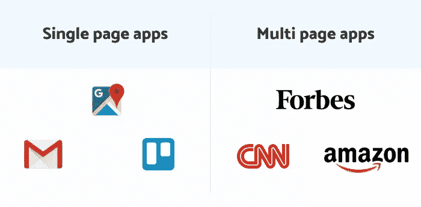

图片来源: [Pinterest](https://in.pinterest.com/)

随着 JavaScript 框架在 2023 年的积极崛起，SPA 使用这种语言进行内容加载，这种趋势不会很快消失。此外，这些应用程序不需要额外的等待时间来为用户提供即时反馈。此外，它还提供了一些惊人的优势。

优势:

*   原生浏览器环境中出色的 UX/用户界面
*   节省的带宽
*   使用 Chrome 工具更容易设置和调试
*   对 API 的关注
*   缓存过程的效率

单页应用示例:

*   谷歌网络服务:[驱动](https://www.google.com/intl/en_gh/drive/download/)、[电子表格](https://www.google.com/sheets/about/)、[地图](https://maps.google.com/)
*   [特雷罗](https://trello.com/en)
*   [推特](https://twitter.com/)
*   [Github](https://github.com/)

你可以查看一下 [**Sneat Bootstrap 5 HTML 管理模板**](https://themeselection.com/products/sneat-bootstrap-html-admin-template/) 比如。它是最新的对开发者最友好的🤘🏻&基于 [Bootstrap 5](https://getbootstrap.com/) 的高度 customizable✨管理仪表板模板。

此外，最高的行业标准被认为是带给你最好的 [**引导管理模板**](https://themeselection.com/item/category/bootstrap-admin-templates/) 那不仅仅是快🚀易于使用，但高度可扩展。

[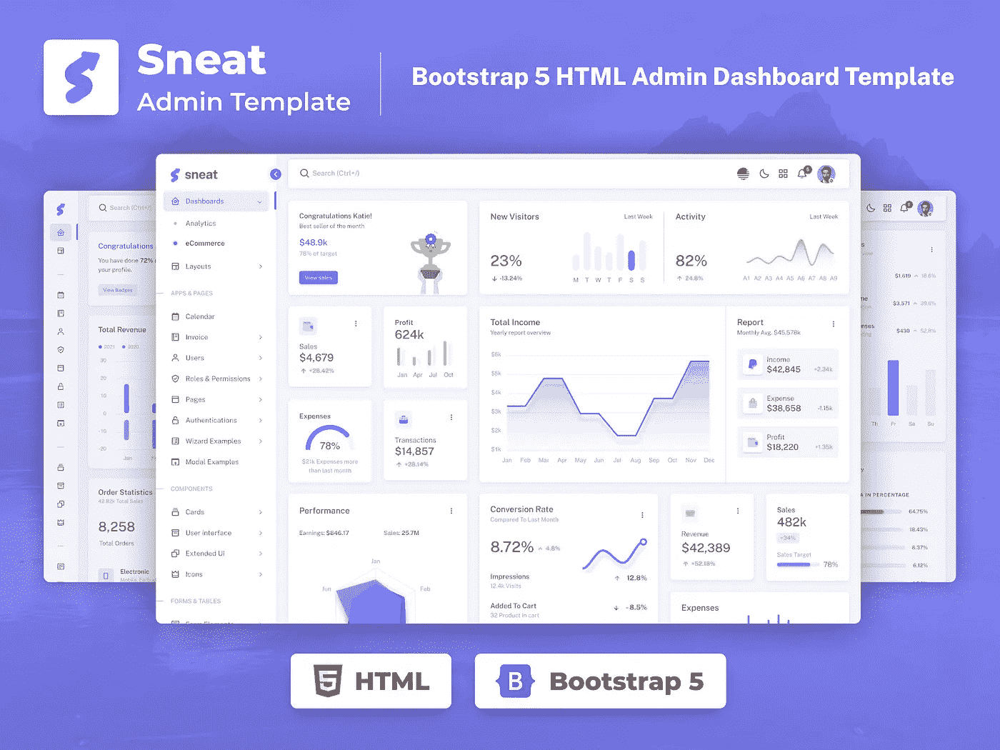](https://themeselection.com/products/sneat-bootstrap-html-admin-template/)

此外，Sneat Bootstrap 5 管理模板非常灵活，还允许您构建任何类型的 web 应用程序。例如，您可以创建:

*   SaaS 平台
*   项目管理应用程序
*   电子商务后端
*   CRM 系统
*   分析应用
*   银行应用
*   教育应用
*   健身应用程序和更多…

此外，您可以使用这个最具创新性的 [Bootstrap admin](https://themeselection.com/products/category/bootstrap-admin-templates/) 来创建引人注目的、高质量的、高性能的 Web 应用程序。此外，您的应用将完全响应，确保它们在桌面、平板电脑和移动设备上看起来令人惊叹，功能完美。

**功能:**

*   基于**引导程序 5**
*   **垂直&水平**布局
*   默认、边框和半暗主题
*   **亮&暗**模式支持
*   国际化/国际化和 RTL 就绪
*   [布局生成器](https://themeselection.com/tools/generator/sneat/html)
*   主题配置:轻松定制我们的模板。
*   SASS 供电
*   完全响应的布局
*   清理和注释代码
*   [有据可查](https://themeselection.com/demo/sneat-bootstrap-html-admin-template/documentation/index.html)
*   享受无忧支持

[下载](https://themeselection.com/products/sneat-bootstrap-html-admin-template/) [演示](https://themeselection.com/demo/sneat-bootstrap-html-admin-template/landing/)

也有 [**React 仪表盘**](https://themeselection.com/item/category/react-admin-templates/) 版本。

This [**Admin Panel**](https://themeselection.com/item/category/admin-templates/) provides **6 different applications** which enable you to build your applications faster.

## 2.渐进式网络应用(PWA)

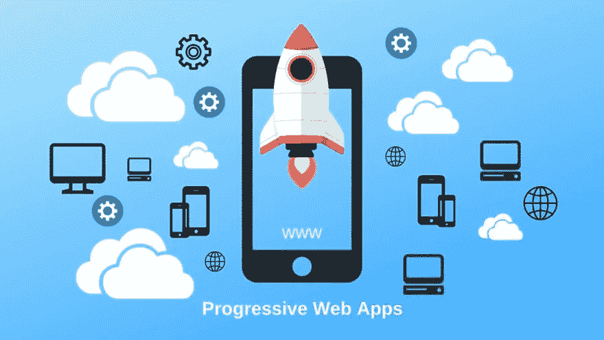

图片来源: [Pinterest](https://in.pinterest.com/)

一切尽在掌握！！我们知道这个概念吧？导航容易，工作平稳，负载少，速度快。是的，这就是 PWA，即渐进式网络应用的意义..！！快速、可靠、流畅的用户友好体验。

毫无疑问，PWA 并不新鲜。虽然，自从它到来以来，它一直是镇上的话题，而且它也将主宰 2023 年。现代开发人员和投资者瞄准了它，因为它能够提供高质量的用户体验。由于它们是高度移动友好的，毫无疑问对 PWA 的需求将会增加。

当然，渐进式 Web 应用程序(PWA)是使用现代 API 构建和增强的，以提供增强的功能、可靠性和可安装性，同时使用单一代码库在任何设备上随时随地访问任何人。这使得它适合于跨设备兼容性。

它们不仅速度快、加载快，而且还允许用户离线使用服务，同时执行本地应用程序的所有功能。

**优点**

*   PWA 有助于提供流畅且用户友好的网络体验。
*   有助于降低跳出率
*   离线工作，因为它是独立的连接
*   让您的应用程序可靠、强大且可安装

使用 PWA 的一些服务示例:

*   [优步](https://www.uber.com/)
*   [推特](https://twitter.com/)
*   [砸弹匣](https://www.smashingmagazine.com/)
*   [Pinterest](https://in.pinterest.com/)
*   [Instagram](https://www.instagram.com/)
*   [福布斯](https://www.forbes.com/?sh=51703552254c)

> 如果你想创建一个渐进式网络应用程序，那么我们建议使用[引导仪表板模板](https://themeselection.com/item/category/bootstrap-admin-templates/)

## 3.人工智能发展

[根据](https://www.grandviewresearch.com/industry-analysis/artificial-intelligence-ai-market) **报告，“人工智能市场**在 2019 年的价值为 399 亿美元，到 2025 年可能达到 1906.1 亿美元，在预测期内的 CAGR 为 42.2%。”这是一个相当大的数字…！！不是吗？😮

现在，大约有 38%的人会跳过内容或布局不吸引人的网站。**超过 75%的顾客根据网站设计来决定一个企业的可信度。用户只需 0.5 秒**就能对一个网站形成看法**。从今以后，技术参与到 web 开发的世界中是必不可少的。在这里，人工智能进入了 2023 年网络发展趋势的画面。**

在网站开发中应用人工智能有助于你预测客户的选择，从而塑造网站的整体外观。人工智能让你知道，

*   您的客户下一步计划购买什么？
*   顾客决定购买产品的理想时间范围。
*   什么样的产品对顾客最有吸引力？
*   客户不欣赏的产品有哪些？
*   谁有兴趣购买你们的产品？

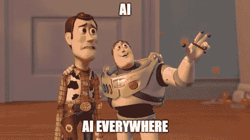

我们生活在一个数字时代，众所周知，即将到来的时代将是一个在每个领域都更加智能的时代。这意味着更少的手动操作。例如聊天机器人、增强现实/虚拟现实。说到这一点，许多初创公司、中小企业和大型组织已经在期待 [**雇佣人工智能开发人员**](https://www.bacancytechnology.com/hire-ai-developer) 为他们的业务提供人工智能支持的应用程序、软件和工具，以满足最终用户的未来需求。

> [*sketch 2 code*](https://sketch2code.azurewebsites.net/)*，一个基于 web 的解决方案，最近刚刚推出。它依靠人工智能将手写的 UI 设计从图像转换成有效的 HTML 标记代码。*

许多用户甚至对大多数网站在某种程度上涉及人工智能并不感到惊讶。它在 web 开发领域创造了一个新的维度。

## 4.web 程序集

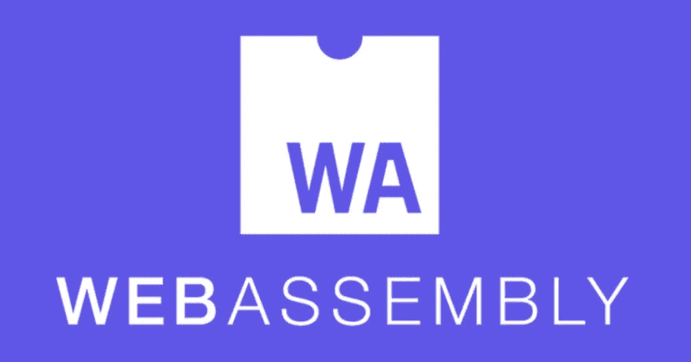

在开发一个 web 应用程序时，首先不能忽视的是性能。现在，JavaScript 的限制使得繁重的计算变得缓慢。这大大恶化了用户体验。

这也是 WebAssembly 日渐流行的主要原因之一。有了这项技术，任何编程语言中的代码都可以被编译成字节码，在浏览器中运行。

WebAssembly 是一种开放标准，它定义了可执行程序的可移植二进制代码格式、相应的文本汇编语言以及用于促进此类程序与其宿主环境之间的交互的接口。

优势:

*   它独立于编程语言和平台
*   独立于硬件
*   快速执行代码
*   提供高级别的安全性。

这一切都归结为一个三角——占用空间小、跨平台脚本和速度。这三个组件都是现代 web 开发中的关键组件。这就是为什么今天大部分 web 开发案例都离不开 WebAssembly。

> *欲了解更多信息，请查看* [*网络组装概念*](https://developer.mozilla.org/en-US/docs/WebAssembly/Concepts)

## 5.语音搜索和导航

信用[信用](https://giphy.com/)

嘿 Siri…今天的趋势是什么？

我们人类，一天比一天懒了…不是吗..！！？😂首先，我们制造了手机，然后开发了智能手机来减少手工劳动，现在我们正朝着“语音免提”的方向发展。面向命令的服务是当今的热门话题。

嗯，语音搜索和导航将成为 2023 年最主要的网络发展趋势之一。它们已经是我们日常生活的一部分。它们超级棒，因为它们让我们搜索信息、记笔记等等变得很容易。

苹果、安卓和谷歌等品牌在他们的 UI/UX 设计过程中实现了这一趋势。所以，这种迅速出现的趋势是你不能忽视的…!！

> [***谷歌报告称***](https://www.thinkwithgoogle.com/data/voice-search-mobile-use-statistics/) *全球 27%的在线人口正在使用手机语音搜索。*
> 
> [***voice bot . ai***](https://voicebot.ai/2019/07/09/new-data-on-voice-assistant-seo-is-a-wake-up-call-for-brands/)*报道称，超过一半的成年人使用过语音搜索，2019 年初有 33%的人每月使用语音搜索，高于 2018 年的 25%。*

通过在 web 开发中实现语音搜索和导航，您可以确保您的服务提供令人惊叹的用户体验。

语音用户界面根据以下算法工作:

*   语音识别软件将输入的模拟波转换成数字格式
*   音频输入被分解成独立的声音、音素
*   该软件分析每一个单词，并将其与字典中的单词进行比较
*   语音被转换成屏幕上的文本或计算机命令

优势:

*   易用性
*   允许徒手交互
*   任务执行速度高
*   出色的用户体验
*   直观和方便

人们喜欢花更少的时间输入命令。这就是为什么他们越来越多地使用语音搜索。因此，web 开发将与此类功能的实现密切相关。

## 6.本地应用将主导市场

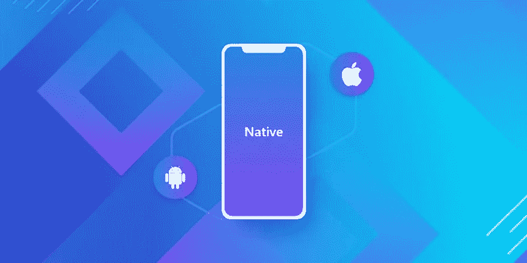

如果您正在工作，突然出现网络问题，该怎么办..！！总是依赖互联网有点令人恼火。这就是本机应用的用武之地。它也允许你离线工作。

本地移动应用是一种直接安装在智能手机上的应用，在大多数情况下，根据应用的性质，它可以在没有互联网连接的情况下工作。

嗯，本地应用程序开发已经有了需求，随着时间的推移，软件开发人员可以预计这种趋势将主导 2023 年的 web 开发趋势。

由于它们是专为特定平台设计的，与混合应用相比，它们通常能提供更好的用户体验和更强大的性能。正因如此，越来越多的企业投资于 iOS 和 Android 的多种原生应用，以使他们能够为用户提供更好的体验。

优势:

*   由于使用了底层设备的功能，因此功能广泛
*   更符合操作系统用户体验的用户界面
*   快速响应的性能
*   推送通知
*   通过应用商店中的评级来保证质量。

随着智能手机在市场上越来越受欢迎，以及 iOS 和 Android 操作系统在市场上的主导地位不断上升，对原生应用开发的投资似乎不会很快减少，事实上，在 2023 年或可预见的未来都不会。

## 7.运动设计用户界面

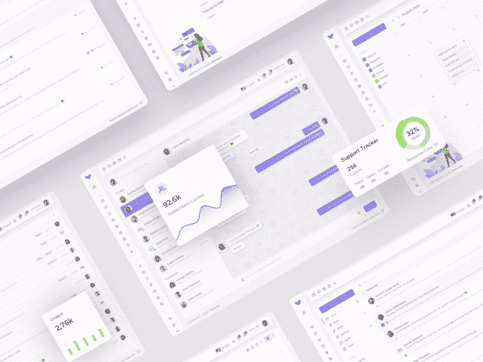

鸣谢:由[阿南德·帕特尔](https://dribbble.com/imananddesigner)在[钻台](https://dribbble.com/)拍摄

动作设计是 2023 年主要的网页设计和网页发展趋势之一。简约的设计加上复杂的交互给人一种吸引用户注意力的吸引人的交互外观。

顾名思义，动作设计就是设计动作。然而，它不仅仅是在构思好屏幕元素后给它制作动画。

动作设计**必须在 UI/UX 设计阶段**就已经考虑好了。这背后的原因是，仅仅拥有一个包含动画的屏幕并没有达到它的预期目标:添加的动作必须有意义和目的。

由于运动设计，这些元素将被实现:

*   页眉转换；
*   图表
*   弹出窗口
*   下拉菜单
*   卷动

所有这些都将有助于你展示你独特的风格和娱乐用户，改善行为因素，并帮助你的网络应用在搜索结果中排名更高。

在 AMP 的帮助下，可以在不损失下载速度的情况下实现动作设计。因此，如果你想让用户停留在你的页面上，那就不要忽略这个！！

优势:

*   定义你的结构和互动
*   简化导航
*   掩饰缓慢的加载时间
*   增加会话长度，从而降低跳出率

要提高参与度并为您的 web 应用程序的用户提供更好的 UI/UX，请尝试使用 motion UI 技术对其进行升级。

*   通过演示下一步该做什么的动画来引导用户使用你的应用程序；
*   用朗朗上口的动画对用户的手势做出反应；
*   演示应用程序不同组件之间的关系等。

## 8.无服务器架构

信用: [Runcloud](https://blog.runcloud.io/)

无服务器架构是一种独立构建和运行应用程序和服务来管理基础设施的方式。您的应用程序仍然在服务器上运行，但是所有的服务器管理都由 AWS 完成。您不再需要调配、扩展和维护服务器来运行您的应用程序、数据库和存储系统。

因此，基本上，无服务器应用程序是事件驱动的基于云的系统，其中应用程序开发完全依赖于一组第三方服务、客户端逻辑和云托管的远程过程调用。(作为服务运行)。

毫无疑问，无服务器在其破坏服务器基础设施的道路上达到了新的高度。无服务器已经被网飞、路透社、美国在线和 Telenor 等公司用于生产。

因为无服务器架构有助于减少系统过载、数据丢失和昂贵的开发。因此，解决方案之一成为云计算，它可以取代常规服务器。

优势:

*   易于部署
*   更好的可扩展性
*   它减少了开发和持续支持预算
*   强化应用架构
*   增加灵活性

由于无服务器技术，最常见的可以快速执行的任务是下载文件备份、通知传递和对象导出。换句话说，无服务器架构是另一种趋势，它将极大地改变 web 开发的方法。

## 9.持续集成和部署

信用:由[故事](https://www.freepik.com/stories)上[免费版](https://www.freepik.com/)

我们生活在数字时代，速度和连续性在任何部门和业务中都扮演着残酷的角色，web 开发世界也不例外。事实上，在 web 开发的世界中，提供快速、流畅和最新的服务是最重要的。

定期修复错误、更新、改进用户界面/UX 等的频率使你的 web 服务变得可靠并受到用户的喜爱。此外，大多数现代应用程序需要在不同的平台和工具上开发代码，团队需要一种机制来集成和验证其更改。它会影响你的整体业务。因此，持续集成和部署在网络世界中至关重要。🧐

嗯，持续集成是自动地、尽可能早地测试对代码库所做的每个更改的过程。持续部署遵循持续集成期间发生的测试，并将更改推送到阶段化或生产系统。持续交付意味着应用进入生产环境进行全面测试，而持续部署会自动更新它们。

优势:

*   较小的代码更改更简单(更原子化)
*   故障隔离更加简单快捷。
*   通过快速的特性引入，产品得到了快速的改进
*   由于代码更改更少，故障隔离更快，平均解决时间(MTTR)更短。
*   由于更小的、特定的变化，可测试性提高了。这些较小的变化允许更准确的阳性和阴性测试。
*   检测和纠正生产泄漏所用的时间更短，释放速度更快。

有了这样的优势，难怪会有更多的软件开发公司在工作中实施这种方式。因为这是 web 开发世界中最重要的方面。

## 10.云技术将会继续存在

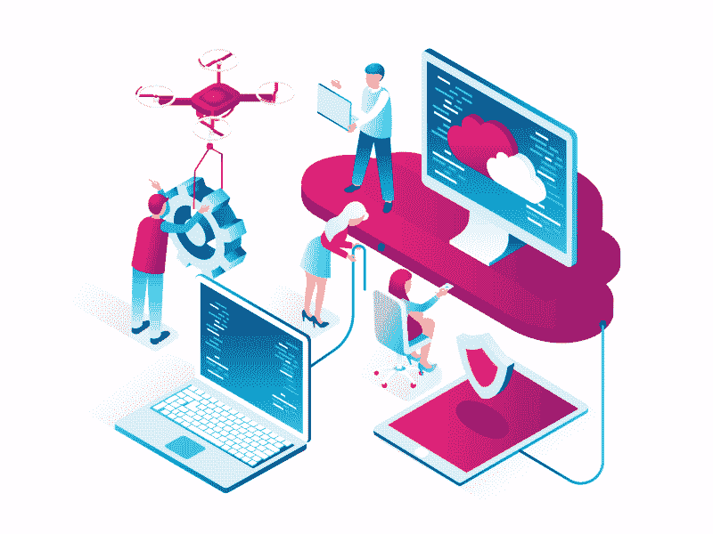

由 [dribbble](https://dribbble.com/) 上的 [Taras Ivanytskyi](https://dribbble.com/shots/6129020-Cloud-Computing) 创作

你知道吗，在 2020 年，云服务行业创造了近**400 亿美元**的收入，使其市值从 2019 年的**2278 亿美元**上升到总计**2664 亿美元**，仅一年就实现了 **17%的增长**？

有了这些数字，有一点是肯定的；在 web 开发服务中，云技术是王道。2023 年，由于云技术，预计谷歌、微软和亚马逊等云供应商将继续获得大量现金。

这一热门趋势背后的原因是，云上有几家公司，预计会有更多的公司迁移到那里。各种规模的企业，从小型创业公司或跨国公司，到跨多个行业的企业，从医疗保健到情报机构，甚至政府组织，都在转向云提供商进行数据存储。

信用: [Cloudopedia](https://www.cloudopedia.in/top-industrial-applications-of-cloud-computing/)

以下是一些云服务。

*   [AWS Lambda](https://aws.amazon.com/lambda/)
*   [谷歌云功能](https://cloud.google.com/functions/)
*   [Azure 功能](https://azure.microsoft.com/en-us/services/functions/)
*   [IBM OpenWhisk](https://www.ibm.com/cloud-computing/bluemix/openwhisk)
*   [阿里函数计算](https://www.alibabacloud.com/product/function-compute)
*   [熨斗功能](http://open.iron.io/)
*   [Auth0 Webtask](https://webtask.io/)
*   [甲骨文 Fn 项目](https://fnproject.io/)
*   [无底洞](https://kubeless.io/)

在数据存储方面，云技术提供了出色的安全性、可扩展性和灵活性，并且考虑到随时可能导致安全漏洞的黑客威胁，组织将希望确保他们正在采取可衡量的措施来保护他们的敏感数据，并避免数据漏洞和其他可能危及数据隐私的活动。

## 11.5G 技术将无与伦比

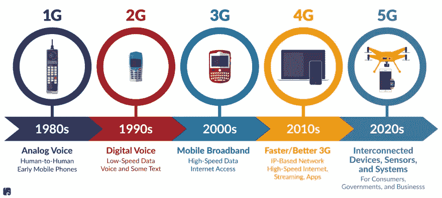

信用: [Rpc 参议院](https://www.rpc.senate.gov/)

5G 是第五代蜂窝网络，它带来的新功能将为个人、企业和社会创造机遇。即使在网络开发领域，5G 也占据主导地位。由于需要增强的服务，更快的连接是必须的。

2023 年，软件开发人员可以期待 5G 技术作为一种趋势回归，但这一次是出于所有正确的原因。随着新无线电频率的使用和速度达到 100 Gbps，5G 技术比 4G 网络快 100 倍左右，软件开发行业的专家预测，未来五年，它将引领全球 14 亿设备的标准数据传输。

优势:

*   更快的传输速度
*   更低的延迟
*   更多的连接设备
*   网络切片
*   增强的容量
*   可用性和覆盖范围

信用:由 [Kate mangostar](https://www.freepik.com/katemangostar) 在 [Freepik](https://www.freepik.com/)

5G 技术是为增强现实、虚拟现实和 4K 视频流等计算密集型应用而设计的。对创建增强业务性能的设计和功能感兴趣的软件开发人员会发现这项技术特别有用。

凭借更好的数据传输和更快的网络，5G 技术无疑是 2023 年最佳网络发展趋势之一的有力竞争者。

## 12.混合现实

[根据报告](https://www.industryarc.com/Report/15029/mixed-reality-market.html)，AR/VR 即混合现实的市场将从 2017 年的 10.54 亿美元增长到 2024 年的 99.82 亿美元，在 2018-2023 年期间，其 CAGR 将达到 73.2%。

混合现实(MR)，是增强现实(AR)和虚拟现实(VR)的结合。它在企业应用程序中有着举足轻重的作用。AR 将数字内容与用户的物理环境相结合，而 VR 则为用户创造了身临其境的体验。

许多行业的组织，如 Web 应用程序开发、国防、旅游、建筑、施工、游戏、医疗保健等。正在这项技术的帮助下实现关键的商业价值。

先生是如何扭转局面的:

*   企业，政府机构，甚至非营利组织都可以使用 AR 和 VR 来培训员工从事复杂的工作。
*   实时将数字信息叠加在物理环境上的能力为商业中的增强现实创造了许多可能性。
*   媒体和娱乐企业正在以一种重要的方式使用 AR 和 VR，为消费者提供引人入胜的内容。
*   企业可以使用 AR 和 VR 让他们的潜在客户虚拟地“试用”他们的产品，这增加了他们的销售努力。

未来几年，网站上的 MR 体验将会持续增加。想想像宜家这样的家具网站，展示你房间里的家具是什么样子..！！

## 13.区块链:增加企业解决方案的透明度、效率和安全性

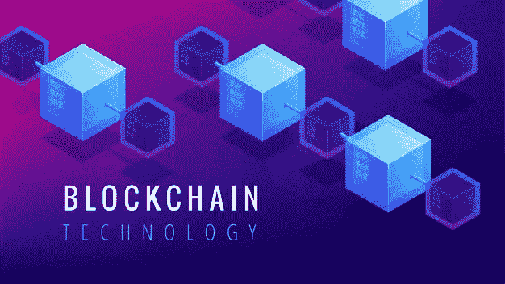

比特币的出现带来了革命性的变化！！它震撼了市场，也为 web 开发世界打开了一扇新的大门。[一份 Cision 美通社的报告](https://www.prnewswire.com/news-releases/the-global-blockchain-technology-market-size-is-expected-to-reach-usd-57-641-3-million-by-2025--registering-a-cagr-of-69-4-from-2019-to-2025--300902333.html)估计，2025 年区块链技术市场将达到 576.41 亿美元，2019 年至 2025 年间 CAGR 将达到令人印象深刻的 69.4%。

比特币和以太网等加密货币让我们注意到区块链，这项技术对企业系统有着广泛的影响。基本上，区块链是一个点对点(P2P)网络，它提供了去中心化、分布式账本、透明性和安全特性。

在区块链网络上运行的智能合约是防篡改和透明的，因此，它们是安全和可信的。此外，它们的执行是不可逆的，这使得合同管理更容易。

优势:

*   分散
*   不变
*   安全性
*   透明度。
*   保护物联网(IoT)

查看“[区块链身份管理的优势](https://www.devteam.space/blog/benefits-of-blockchain-for-identity-management/)”了解更多信息

一些区块链使用案例的示例:

*   改善供应链管理
*   身份管理:区块链可以通过其防篡改数据和分布式账本来改善“身份和访问管理”(IAM)流程。
*   更好的分析:区块链提供了不变性和审计跟踪，从而确保数据的正确质量。这可以帮助所有行业的企业，因为他们可以根据可靠的数据运行分析工具。
*   通过去中心化进行破坏:以太坊和 NEO 等区块链平台使企业家能够构建“去中心化应用”(DApps)，因此，他们可以破坏现有的中心化商业模式。
*   保护物联网(IoT):物联网(IoT)具有巨大的潜力，因为它可以从数十亿个传感器和设备中获得洞察力。然而，物联网面临着风险，因为设备之间的整个通信都是通过互联网进行的。区块链可以通过其强大的安全功能保护这种通信。

## 14.IoT:物联网

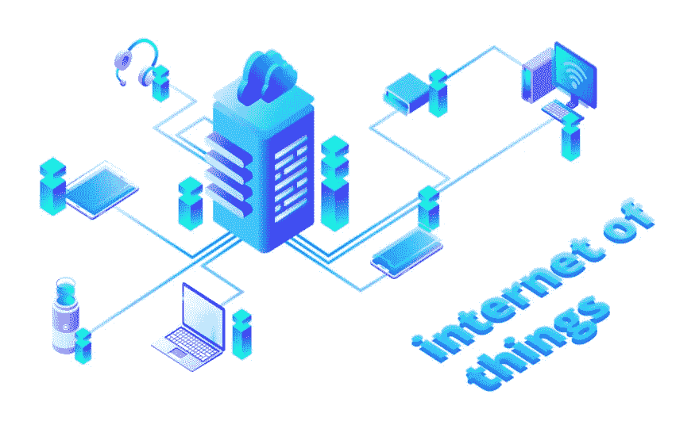

贷记:由 [Freepik](https://www.freepik.com/) 上的 [vectorpouch](https://www.freepik.com/vectorpouch)

根据研究，“到 2020 年， [**将有超过 200 亿台物联网设备**](https://www.vxchnge.com/blog/iot-statistics) 处于活跃状态并连接到互联网”。真是令人印象深刻…！！😎

我们希望一切都更智能。无论是智能手机还是灯泡..！！你看，对智能设备的需求与日俱增，而且不会停止。而且，多亏了互联网，智能生活正在成为现实。你所要做的就是，命令…！！是的，那是我们喜欢的东西。😁

很难想象没有互联网的生活，因为现在世界的每一个方面都被连接起来，使一切变得方便、简单和智能。因此，为了让世界更加互联，物联网的出现是一件好事。

**物联网**是指能够与其他设备和网络通信的各种互联网连接设备。它们可以执行各种功能，但最常用于收集信息和执行特定操作。你会惊讶地发现，每秒钟，[又有 127 台设备连接到互联网](https://www.vxchnge.com/blog/iot-statistics)。

优势:

*   改善监控
*   预测和行动的新能力
*   增加客户对话
*   微调服务和产品
*   改善操作流程的控制

如今，互联网使生活变得非常容易，但也使世界变得很小。由于不断增强，互联网现在是我们系统和日常生活的一部分，丰富了我们的生活。

物联网肯定会统治 web 开发世界很长一段时间…！！

## 15.平均反应速度颤振

没有一定的技术基础，上面列出的大多数趋势都无法实现。但是现在有数百个框架和库。他们中的哪一个会最常用？

[的意思是](http://meanjs.org/)是一个免费开源的 JavaScript 软件栈，用于构建动态网站和 web 应用程序。因为 MEAN 栈支持程序的所有组件都是用 JavaScript 编写的，所以可以用一种语言为服务器端和客户端执行环境编写 MEAN 应用程序

MEAN stack 是最受欢迎的游戏之一。它包括:

*   MongoDB —一个数据库
*   React.js —一个 web 框架
*   Vue.js —前端框架
*   Angular —前端框架
*   腹板颤振

**反应过来**库起了主要作用。它经常被用来代替平均堆栈中的 Angular。它能够更快更容易地实现变更，所以越来越多的开发人员选择它而不是 Angular。

*   React 是一个开源的前端 JavaScript 库，用于构建用户界面或 UI 组件。它由脸书和一个由个人开发者和公司组成的社区维护。

可以查看 [**Sneat MUI React NextJS 管理模板**](https://themeselection.com/item/sneat-mui-react-nextjs-admin-template/)**&[**Vuexy React 管理模板**](https://pixinvent.com/demo/vuexy-react-admin-dashboard-template/landing/) **。**这些是最好的 [**React 管理模板**](https://themeselection.com/item/category/react-admin-templates/) 用于构建强大的&令人敬畏的 web 应用。**

> ***你可以查看* [ReactJS 开发者路线图](https://dev.to/theme_selection/reactjs-roadmap-for-developers-2824) 了解如何开始使用 ReactJS 的详细概述。除此之外，还有一篇关于最好的[ReactJS UI 框架](https://themeselection.com/best-reactjs-ui-frameworks/) 和组件库的文章会很有帮助。**

**在小米和阿里巴巴这样的巨头转向 Vue 之后，Vue 已经在全球市场占据了一席之地。这是一个非常紧凑的前端解决方案。**

**您可以查看使用 VueJS 制作的[**Materio vue fy vue js 管理模板**](https://themeselection.com/products/materio-vuetify-vuejs-admin-template/) 。**

*   **Vue.js 是一个开源的 model–view–ViewModel 前端 JavaScript 框架，用于构建用户界面和单页面应用程序。**

> ***此外，还有一篇关于* [*趋势 VueJS UI 组件库和框架*](https://themeselection.com/trending-vuejs-ui-component-libraries-frameworks/) *的详细文章，你会发现很有用。***

****Angular** 是一个基于类型脚本的开源 web 应用框架，由 Google 的 Angular 团队和一个由个人和公司组成的社区领导。**

**为获得更好的外观，请检查使用 Angular 制作的[顶点角度管理模板](https://pixinvent.com/apex-angular-4-bootstrap-admin-template/)**

**最后一个流行的解决方案是**Web 的颤振**。Flutter 是 Google 创建的开源 UI 软件开发工具包。它用于从单一代码库为 Android、iOS、Linux、Mac、Windows、Google Fuchsia 和 web 开发应用程序。它有助于在任何设备上提供高质量的网络应用，因此在网络开发者中排名很高。**

## **16.API 优先开发**

****

**信用:[免费券](https://www.freepik.com/free-photo/application-programming-interface-hologram_18098422.htm#query=api&position=9&from_view=search)**

**API 优先的方法意味着对于任何给定的开发项目，您的 API 都被视为“一等公民”它满足了用户的需求。使用这种方法，当用户访问网站时，开发人员可以同时完成他们的任务和推送代码。**

**它还降低了开发费用，提高了交付速度。此外，这种方法还允许新网站成为内容传递源。这种互连性允许开发人员将外部产品添加到他们的应用程序中，帮助增强他们的功能和性能。**

**新的物联网设备、软件工具和网络界面都包含 API，允许它们相互连接，并为用户提供无缝的数字体验。**

**以前，许多开发人员可能首先关注产品，然后将它需要连接到其他设备的事实作为事后的想法。现在，随着公司寻找增加与用户的互连性的方法，API 成为焦点和中心。**

****优势:****

*   **开发团队可以并行工作**
*   **更快上市**
*   **降低开发应用程序的成本**
*   **良好的客户体验**
*   **降低失败的风险**

## **17.加速移动页面(AMP)**

****

**AMP 类似于 PWA，是 web 开发中的新兴技术之一。随着互联网越来越以用户为中心，这是一种新的网络发展趋势。因此，许多品牌选择创建本地应用程序来改善用户体验。此外，AMP 插件还可以帮助企业节省 UX 费用，并接触目标用户。**

**AMP 的目标是为用户提供无缝的页面体验，让他们与网站保持联系。不同的功能是谷歌和 Twitter 最近开发的开源插件。**

**AMPs 是经过优化的页面，可以快速加载和运行。此外，他们有一个方便而基本的设计，不像全方位的网络产品。页面变得移动友好，并增加了内容的可读性。像 AMP 这样的插件允许不同网速的用户访问网页，使互联网更加用户友好。**

**它让公司节省了 UX 的成本，也增加了他们的可达性。此外，以下是 AMP 带来的一些优势。**

****优点:****

*   **提高网站参与度**
*   **提高排名和流量**
*   **跳出率更低**
*   **广告浏览量增加**
*   **更高的点击率**

## **18.黑暗模式:**

**[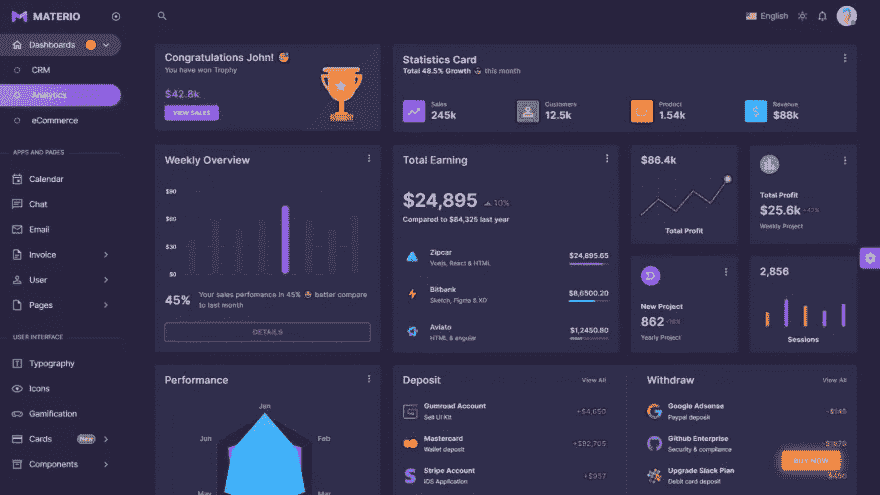](https://themeselection.com/products/materio-vuetify-vuejs-admin-template/)**

**信用: [Materio Vuetify VueJS 管理模板](https://themeselection.com/products/materio-vuetify-vuejs-admin-template/)**

**嗯，黑暗模式、夜班和其他弱光用户界面选项之所以成为趋势，主要是因为它们为用户提供了一个低对比度的网站或应用程序，在弱光环境下更容易查看。**

**此外，黑色是一种特别强烈的颜色，可以激发人们强烈的情绪，如果过度，很容易征服一个人。当您想要突出显示特定类型的内容时，暗模式特别有用。**

**另外， [Spotify](https://www.spotify.com/) 、[网飞](https://www.netflix.com/)、 [Steam](https://store.steampowered.com/) 都是黑暗模式设计。与此同时，[谷歌](https://www.google.com/)开始提供黑暗模式，而 [Instagram](https://www.instagram.com/) 、 [Twitter](https://twitter.com/) 、[苹果](https://www.apple.com/in/)和[安卓](https://www.android.com/intl/en_in/)是一些最受欢迎的提供黑暗模式的应用和服务。**

**根据 Android 权威机构的评估，81.9%的受访者接受在他们的设备上使用黑暗模式，9.9%的受访者在光明和黑暗模式之间转换。 [Polar](https://getpolarized.io/2019/11/19/Dark-Mode-Should-Be-The-Default-With-95-Percent-Preferring-it-Over-Light-Mode.html) 的另一项调查表明，95%的用户喜欢使用黑暗模式，而不是光明模式。**

**这一趋势的主要原因如下:**

*   **它给人一种超现代和酷的感觉**
*   **它可以节省设备电池电量(在有机发光二极管/AMOLED 屏幕的情况下)**
*   **它允许弹出和突出显示其他设计元素**
*   **它可以减少弱光条件下的眼睛疲劳。**

**尽管如此，人们不应该忽视这样一个事实，任何过量的东西都是有害的。所以，小心使用…！！**

## **19.网络安全**

****

**这是 2023 年以及未来最重要的趋势之一。随着新兴技术和对技术的依赖，网络安全威胁的风险正在增加。2020 年 10 月，黑客用一次[恶意软件攻击](https://www.computerweekly.com/news/252490395/Software-AG-caught-in-double-extortion-ransomware-hit)袭击了德国第二大软件供应商[软件公司](https://www.softwareag.com/en_corporate.html)，索要近 2000 万美元。**

**[根据 Cloudflare](https://blog.cloudflare.com/network-layer-ddos-attack-trends-for-q3-2020/) 的数据，2020 年分布式拒绝服务(DDoS)攻击的数量每个季度都翻了一番。在 DDoS 攻击中，黑客用大量恶意互联网流量淹没目标服务器。这可能导致数小时的停机时间，还可能导致收入损失。**

**客户已经认识到这种新出现的威胁，并希望公司采取强有力的安全措施来确保个人信息的安全。这就是为什么，保护你的公司和客户信息将是 2023 年的优先事项，尤其是在网络攻击持续增加的时候。**

**以下是你可以采取的一些步骤:**

*   **进行脆弱性评估**
*   **保护您的远程访问**
*   **介绍角色、权限和多因素身份认证**

# **20.推送通知**

****

**Credit: [FreePik](https://www.freepik.com/free-vector/alert-concept-illustration_5202795.htm#query=Push%20Notification&position=5&from_view=search&track=sph)**

**推送通知是由移动应用程序发送到用户设备的小型弹出消息，即使该应用程序没有打开，这些消息也会出现。这些通知旨在吸引注意力，可以传达提醒、更新、促销等信息。**

**它们可以提供实时更新，或通过必要的细节和推送通知吸引用户的注意力，例如提醒用户重新访问最近查看的项目或新的博客帖子。**

**推送通知是一种与受众交流的好方法。根据 Localytics 的一项研究， [52%的智能手机用户](https://blog.e-goi.com/infographic-push-notification/)在他们的设备上启用了推送功能，这些通知可以通过以下方式使企业受益:**

*   **将用户引向你的社交媒体渠道**
*   **推销产品和服务(尤其是特价)**
*   **通过提供有价值的内容来建立信任和品牌声誉**
*   **吸引目前不在你网站上的用户**
*   **为电子商务应用程序恢复废弃的购物车**

**以下应用程序使用这种技术来提高销售额:**

*   **[迈恩特拉](https://www.myntra.com/)**
*   **[亚马逊](http://amazon.com)**
*   **[那个凸起](https://www.thebump.com/)**
*   **[La Redoute](http://www.laredoute.com/)**
*   **[Ticketmaster](http://www.ticketmaster.com/)**

# **21.无代码/低代码应用**

**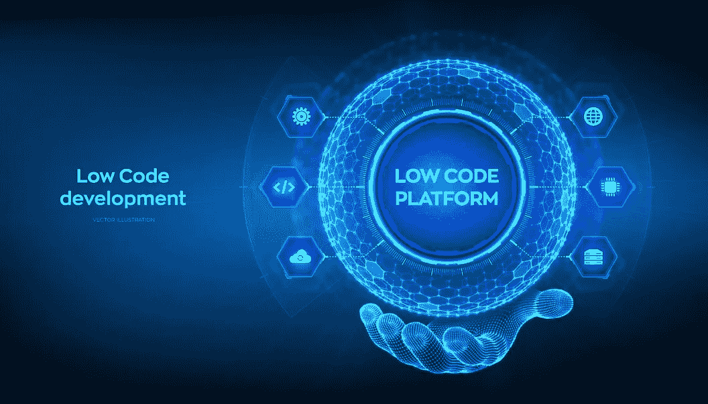**

**Credit: By [iuriimotov](https://www.freepik.com/author/iuriimotov) on [Freepik](https://www.freepik.com/premium-vector/low-code-platform-low-code-development-technology-concept-lcdp-easy-coding-hexagonal-grid-sphere-wireframe-hand-blue-background-vector-illustration_27529306.htm#query=no%20code%20development&position=3&from_view=search&track=sph)**

**无/低代码平台使 web 开发更容易。这些工具使用户能够利用预制的代码块和管理模板来创建软件解决方案。**

**简而言之，它们是可视化软件开发环境，使开发人员能够拖放软件组件，连接它们，并创建移动或 web 应用程序。这些平台经常与它们所代表的开发方法互换使用。**

**因此，它减少了编码所需的时间和精力。再者，不考虑技术经验，任何人都可以开发软件和高需求的 app。这些工具也使得公民开发者更容易构建有用的应用程序，而无需编写复杂的代码。**

**下面是一些你可以使用的无代码开发工具。**

*   **[网络流量](https://webflow.com/)**
*   **[Bubble.io](http://bubble.io/)**
*   **[预览](https://previewed.app/)**
*   **[购物化](https://www.shopify.in/)**
*   **诺科德皮**

> **更多此类，无代码工具参考合集:[最佳无代码开发工具](https://devdojo.com/saanvisen01/the-best-no-code-development-tools)**

# **22.个性化**

****

**Credit: [FreePik](https://www.freepik.com/free-vector/mobile-testing-concept-illustration_7230644.htm#query=Personalization&position=0&from_view=search&track=sph)**

**不同版本的网页会根据不同的访问者的需求和特点显示给他们。个性化登陆页面是可能的，它将分享一个为特定访问者量身定做的信息。顾客渴望个性化是事实。这是让他们保持参与和忠诚的原因！！**

**因此，在 2023 年，个性化将成为 web 开发领域的标杆。您可以通过多种交互方式向站点访问者提供个性化授权。例如，您可以允许您的用户手动或通过他们的反馈来设置他们的偏好。除此之外，你也可以授权他们按照他们的意愿改变你的网站外观，这样他们会感觉联系更紧密。**

**机器学习的内容个性化，也称为预测性内容个性化，是一种先进的人工智能驱动的方法，可以向每个用户动态显示最相关的内容。**

# **23.CRM 集成**

****

**Credit: [Adobe Stock Images](https://stock.adobe.com/)**

**客户关系管理(CRM)系统帮助企业管理与当前和潜在客户的关系和互动。在它的潜力中，许多企业没有将它整合到他们的 web 解决方案中，因此错过了好处。**

**通过连接您的网站和 CRM，您将能够增强客户体验。你将能够以这种方式在消费者旅程的每个阶段帮助你的顾客。此外，通过消除手动复制粘贴或导出导入的需要，您将节省管理费用。这提高了你的工作效率，让你的时间表可以专注于其他目标。**

**以下是一些提供 CRM 集成的服务和应用程序:**

*   **[Zoho CRM](https://www.zoho.com/crm)**
*   **[Sneat MUI React 管理模板](https://demos.themeselection.com/sneat-mui-react-nextjs-admin-template/demo-1/dashboards/crm/)**
*   **[Freshsales](https://www.freshworks.com/freshsales-crm/)**
*   **[管道驱动](https://www.pipedrive.com/)**

# **24.人工智能和机器学习**

****

**Credit: [Adobe Stock Photos](https://stock.adobe.com/ca/images/artificial-intelligence-machine-learning-business-internet-technology-concept/213593664)**

**人工智能已经渗透我们的数字生活几年了，但随着更多公司投资于技术，我们可以期待在可能的方面取得重大进展。特别是自然语言处理(NLP)和机器学习(ML)已经从理论概念发展到成熟的应用。**

**例如，“YouTube 使用 NLP 从视频的音频中自动创建字幕，或者 Google Analytics 使用 ML 来更好地了解网站用户的行为，或者 Alexa 使用 VR 和 ML，以便我们可以与机器进行完整的对话。”**

**机器学习(ML)用于 web 开发，为用户提供更好的体验。开发人员使用 ML 使软件能够分析输入数据、检测模式和个性化内容。许多领先的公司使用这项技术来增强用户体验。例如，Airbnb 和网飞使用 ML 为他们的用户定制搜索结果。**

# **结论**

**嗯，就像这里谈到的 2023 年的网络发展趋势一样，因为它们变化如此之快，所以很难去追逐它们。但是，我们必须对它们进行检查和试验..！！**

**通过跟随 web 开发的最新趋势，您可以用世界级的用户体验来安抚您的用户，提高您的 web 应用排名，并为您的服务打开新的市场…！！**

**通过利用这些趋势，你将能够为你的网络应用程序的用户提供一个惊人的体验。还有，你会增加成为他们首选的机会！**

**一般来说，每一个 web 发展趋势都值得你关注。其中一些可能会在未来十年继续存在，例如，**物联网、语音机器人、MR、**等。而其中一些将在几个月后成为常态。**

**所以，不要犹豫，尽快在你的下一个项目中实施它们。**

**请告诉我们你最喜欢的一个，如果我们在这里错过了什么，我们很想听听。快乐成长。🤩**

****关于我们:****

**我们在 ThemeSelection 提供精选的高质量、现代设计、专业且易于使用的高级和[免费管理模板](https://themeselection.com/item/category/free-admin-templates/)、 [VueJS 管理模板](https://themeselection.com/products/category/vuejs-admin-templates/)和 UI 套件。**

**可以查看[**Sneat Free****Bootstrap 管理模板**](https://themeselection.com/item/sneat-free-bootstrap-html-admin-template/) 和 **Materio Vuetify Vuejs Laravel 管理模板** **。****

***原载于 2020 年 12 月 7 日*[*https://dev . to*](https://dev.to/theme_selection/dominating-web-development-trends-2021-2ihp)*。***