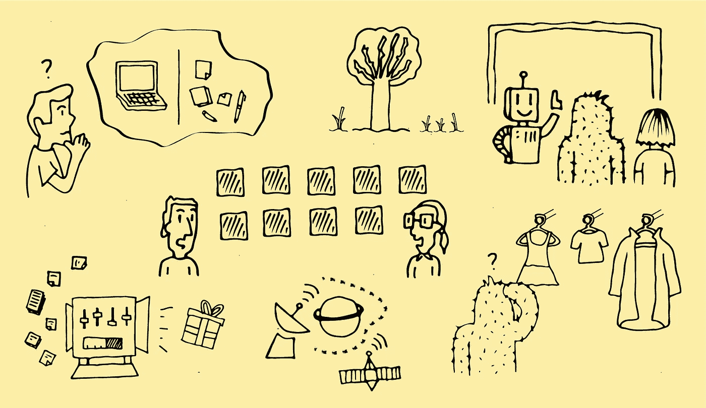
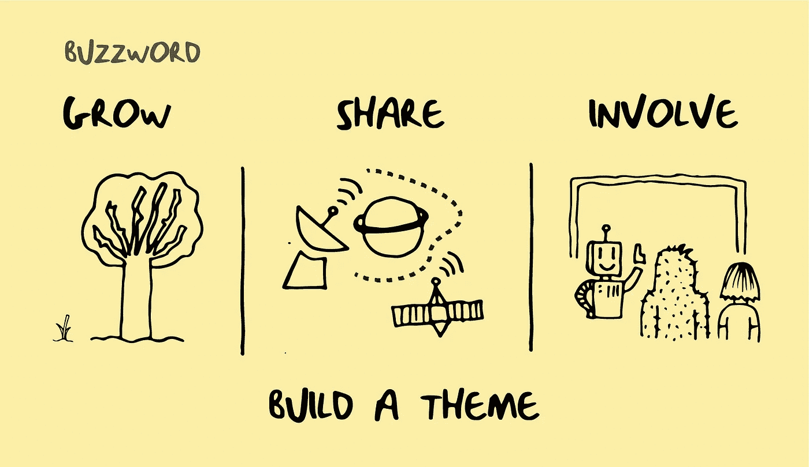
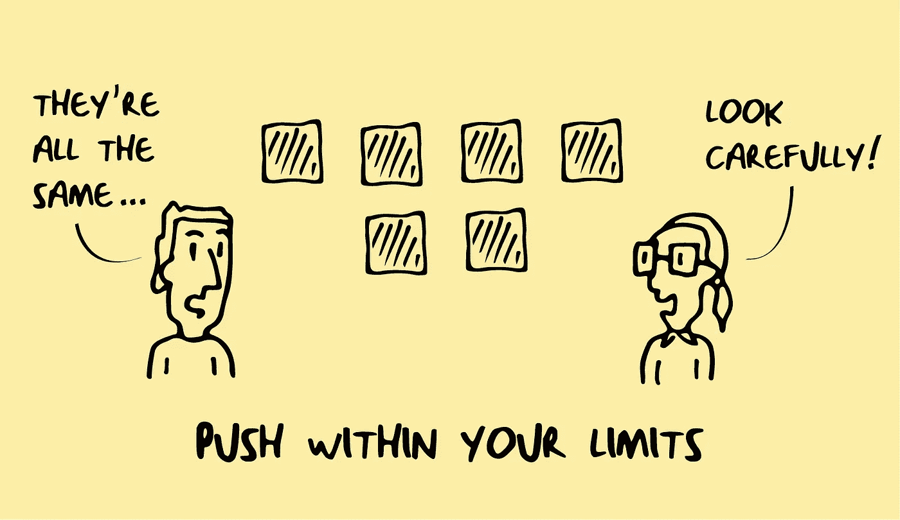
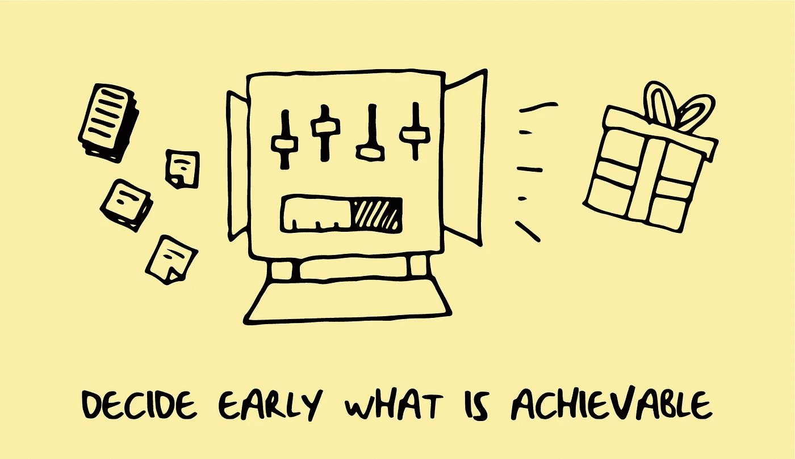
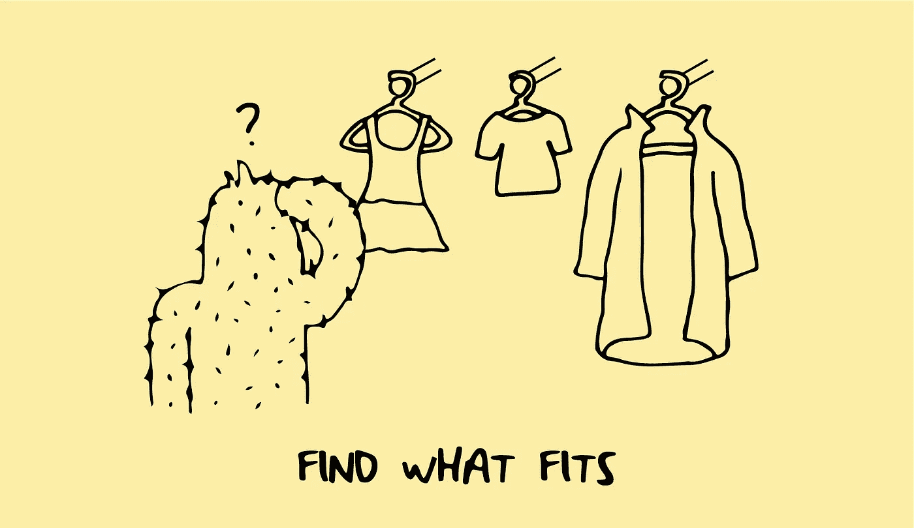

# 不要纠结于此。画出来！

> 原文：<https://medium.com/globant/dont-dwell-on-it-draw-it-ebe00f94e3ec?source=collection_archive---------0----------------------->

当人们想到简约时，他们会立刻联想到设计。好的设计是简单、清晰、漂亮的，尤其是在产品和工业设计中。同样的道理也可以适用于战略。战略是为实现长期或总体目标而设计的行动计划。我相信所有的战略家和设计师都有一个共同的目标，那就是让事物易于理解、清晰美观。我们将我们的技能组合在一起，讲述正确的故事，这时一件作品才能真正产生强大的影响。这是视觉故事。

在过去的几年里，我有幸与拥有各种技能的优秀人才一起工作，在这里我开始意识到设计和策略是一体的。想象一个故事是每个人都自然而然会做的事情，我们在日常生活中在脑海中播放场景，我们甚至在开始之前就想象一件作品的输出，因为我们希望它尽可能接近完美。作为设计师，我们能够通过我们的工作来表达这一点，特别是在为客户设计愿景或路线图以帮助他们发展业务/产品时。我使用这类简报的经历教会了我一些东西，我希望这些东西能帮助那些渴望创作一个视觉上吸引人的故事的人。

**笔、纸、帖其**

必不可少。在一个对数字痴迷越来越深入的世界里，退一步思考是很好的。将想法写在纸笔上，涂鸦来创建单词之间的联系，并创建有助于交流想法的隐喻。这不仅仅意味着画草图，海报也是建造一个建筑的好方法。我的方法是用几句话写下你想要讲述的故事，并把它写在纸上，这样当你开始产生想法时，你可以随时查阅。一旦你有了一个简短的叙述，你可以在继续下去的时候补充细节。

**比喻**

具有挑战性的部分是将人性的一面添加到通常是公司的、复杂的业务结构中，以讲述你的客户的客户想要什么。通常，当我开始一个新项目时，有大量工作需要做，以跟上业务运作的速度。做好这件事的最好方法是当你能把一个业务流程和一个日常任务联系起来，这样它就可以被理解了。这方面的一个例子是，当我和一个银行客户一起做一份不寻常的简报时。在项目的最后一周，他们没有创造通常的发现、策略等，而是想要别的东西。一些让他们在业务中脱颖而出的东西吸引了那些狡猾的利益相关者:一个概括整个事情的高级页面。这是一个难得的令人兴奋的机会，最终成为一个大型插图，不同的业务部分相互联系和沟通，研究简明扼要地放在上面。当观想是关于创造性思维。我们从这篇文章的主题开始。连通性和动量是我们所追求的，我们决定了空间，太阳系和行星。从那时起，事情开始变得有条不紊。BAU 装置变成了空间站，工作人员变成了宇航员，卫星代表了数据、过程和思想的共享。这是大胆的，大胆的，最重要的是易于理解和分享。

但这不仅仅是去流氓，并开始画代表商人的海洋生物，而是涉及到增加现有做法的特点。例如，如果你正在做一个故事板来展示未来的旅程，考虑一下风格。让一个人坐在电脑前很容易，但让这个人看起来全神贯注或充满感情却不容易。尝试改变风格，一种素描的方法，添加色彩来突出特色。当你冒险推动创造力时，你能做的事情令人惊讶。

**颜色**

在我加入 Globant 的团队之前，我做了大量的品牌识别设计。我学到的第一件事就是总是用黑白来设计。如果它能在没有颜色的情况下工作，那么它肯定能在有颜色的情况下工作。这同样适用于创造任何视觉效果。从骨架、基础、简单流程开始。正是这种结构使你能够传达你的故事。颜色是你最后添加的东西，给它应得的完成。这绝非易事，根据我的经验，你经常会受限于客户枯燥刻板的品牌指导方针，其中可能包含一堆蓝色和灰色，但没关系！重要的是你要有效地利用这一点。如果你有一个介绍，设置你的作品的场景，考虑开始加粗。例如，我为一家银行设计了一个很长的“未来”客户旅程，并将其打印在墙上，指南包含两种颜色:绿色和黑色。这里的挑战是有效地显示读者从左到右的进展:从开始到结束。起初这被证明是困难的，因为我感觉被困在公司的安全网里，但我后退一步，从总体上思考“进步”。交通灯、情感色彩和 UI 中的进度条，最终是探索引导我探索这个调色板中的色彩。从较暗的绿色开始，到最亮的颜色结束。这一主题贯穿始终，当用户阅读整个旅程时，图标的颜色会发生变化，以隔离每个时刻，但随着时间的推移，故事的发展会向客户显示改进。

**开始输出并格式化**

这是我在职业生涯早期艰难学到的东西。我当时正在为一个网页设计一个信息图，我非常关注细节，意识到除非点击后图像被放大，否则字迹难以辨认。不幸的是，我不得不重新格式化布局，并调整文本大小，使其工作，这需要一些时间。正是从这一点上，我意识到输出和格式是一开始就需要回答的关键问题。这不仅仅是印刷和网络，还有观众。是面向 powerpoint 中的利益相关者、内部团队还是潜在客户？观众可以改变它的传播和分享方式。我最近接触到的一些东西也是文档格式。如果你要为客户设计一些东西，确保他们在你离开后不需要编辑。他们可能没有最新的 creative cloud 订阅来打开、编辑和使用您专业选择的字体。他们可能希望将信息的某些方面转换为 jpeg 格式，并将其放入 powerpoint 中(相信我，人们仍然会这样做)，即使它是墙上的巨幅海报，也可能有人希望将其改编为面向大众的数字电子邮件格式。你不想成为这样的人，给别人留下 200mb 的 Indesign 文件，却没有人用 mac 打开它来更改一些免责声明文本。

**失败，迭代，分享**

快速失败是一种哲学，包括广泛的测试和增量开发，以确定一个想法是否有价值。这可以应用到任何实践中，但是在设计中，它是达到你的目标的基本垫脚石。作为设计师，我们不断批评自己的作品，这让我们不断重复和改进周围的一切。我已经记不清有多少次我不得不去思考一个我认为是答案的想法或概念，它从来不是第一个想法，但也不总是最后一个。当你接受改变和改变的反馈时，你可以清楚地看到你应该瞄准哪里，这导致了你从一开始就想要的那种很好的叙事。你可以认为想法不好或不起作用，但最好尝试一下，然后很快忽略它，然后让客户告诉你“你应该试试这个或这个。”

我发现分享你的工作可以增加动力、灵感和注意力。当在团队中工作时，思考和讨论事情是很自然的，但是当你有一个迫在眉睫的最后期限，而你是一个人的时候怎么办？这种情况发生时，很容易有这种狭隘的看法。如果有什么不行，就去寻求认可。仅仅因为一个同事或朋友不在同一个项目上，并不意味着他们的意见没有价值。与他人交谈，从想办法让他们快速跟上进度开始，这样他们就能明白你在努力做什么。他们不仅可能做过类似的事情，而且这是一个全新的视角。他们明白了吗？请记住，不要通过询问每个人来绕圈子，并以委员会设计解决方案结束。一个有效的视觉故事，应该是不用想太多就能看懂的。