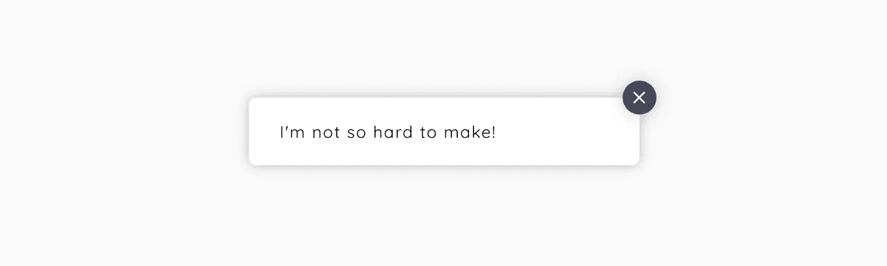

# 不要害怕 CDK

> 原文：<https://medium.com/compendium/dont-fear-the-cdk-7e40b7d27d8b?source=collection_archive---------0----------------------->

## 创建自定义 UI 并不难

开发人员使用 [Angular Material](https://material.angular.io/) 的一个常见模式是在每一个 UI 上使用框架，甚至是他们创建的应用程序定制的 UI，因此超出了 Angular Material 的预期工作范围。有时这仅仅是为一个组件稍微调整一下 CSS 的问题，而其他时候则需要进行功能上的改变。这可能很麻烦，结果可能包含难以维护和保持无 bug 的难看的黑客攻击。我希望引起大家对 [Angular CDK](https://material.angular.io/cdk/categories) 的关注，这是一个组件开发工具包，可能正是你创建特定应用组件所需要的。我们将研究`OverlayModule`，以及它如何帮助我们创建一个定制的小吃店。

完成的小吃店示例可以在 [StackBlitz](https://stackblitz.com/github/eTallang/angular-feedback-service/) 上查看，而代码托管在 [GitHub](https://github.com/eTallang/angular-feedback-service) 上。

# 意见的艺术

虽然从头创建一个定制组件比使用现有组件更难，但是创建一个试图在各个方面都可以配置的组件会极大地增加复杂性。所以，帮你自己一个忙，尽可能让组件保持固执己见。这自然取决于您的组件的用途，因为特定于应用程序的组件可能非常固执己见，而例如一个用于共享 NPM 包的组件可能在如何使用方面有更大的灵活性。为特定应用程序创建的组件实际上可能具有固执己见的优势，因为这强调了它的预期用途，限制了团队中的开发人员使用您的组件的不同方式。这是在整个应用程序中保持用户体验一致性的许多方法之一。

# 认识一下 CDK

当 [Angular](https://angular.io/) 团队在 Angular 材料上工作时，他们遇到了不同组件之间相似的 UI 行为。这一发现成为了创建 Angular CDK 的动机，这是一个包含用于创建组件的低级构建块的库。在撰写本文时，该库提供了三个组件，即步进器、表格和树。这些组件对样式没有意见，这使得这些组件非常完美，如果你想自己设计它们的话。该库还包含几个方便的实用模块。其中之一是`A11yModule`，它提供了一个`FocusKeyManager`来控制标签焦点。这在创建弹出窗口时非常有用，因为您希望在弹出窗口关闭之前捕获焦点。CDK 的另一个公用事业是`OverlayModule`。这个模块是创建菜单、对话框、工具提示和任何一种应该放在 DOM 中其他元素之上的 UI 的基础(因此得名)。我们将使用这个模块创建一个小吃栏，这是一个通常用于向用户显示反馈的组件。

# 创建项目并设置我们的模块

如果还没有全局安装 [Angular CLI](https://cli.angular.io/) ，并生成一个新项目。我们还将为我们的小吃店创建一个新的模块(从现在开始作为反馈引用),并提供相应的组件和服务。

为了使用角 CDK 的功能，我们必须将它添加到我们的项目中。使用 NPM 或[纱线](https://yarnpkg.com/en/)添加。

因为我们将使用来自 Angular CDK 的 OverlayModule，所以我们必须在我们的`FeedbackModule`中导入它。我们的`FeedbackComponent`也必须添加到我们模块的`entryComponents`-数组中，因为它将被动态添加到 DOM 中。我们的`FeedbackModule`现在应该是这样的:

# 为我们的反馈组件提供覆盖样式

为了保持这篇文章合理的简短，我将不讨论反馈组件的样式，也不讨论如何在我们的 out 中动画化它。关于样式，唯一要记住的是从有角度的 CDK 项目中导入叠加样式。

这可以在项目中的任何地方进行，但必须是全球可用的。如果你从你的`FeedbackComponent`开始，你必须记住通过设置`ViewEncapsulation.None`来禁用视图封装。反馈组件可以根据您的需要变得简单或复杂。一个好的技巧是将文本作为变量显示在组件中，然后将其绑定到 HTML，这样开发人员就可以提供他们想要的任何消息。

您还可以添加其他属性，例如显示/隐藏关闭按钮，更改反馈的严重性，或者您想要添加的任何其他内容。如果你想从我的演示中抓取剩余的 SCSS 和动画，可以在 [GitHub 项目](https://github.com/eTallang/angular-feedback-service)中找到。

# 使用叠加服务

这个例子中真正的魔法发生在`feedback.service.ts`。我将完整地展示该服务，然后逐一解释:

服务的奇妙之处在于服务的构造者。该服务有一个`create`-函数，它接受一个配置对象，您可以在其中指定您的覆盖图应该如何运行。请特别注意`positionStrategy`房产的漂亮设计。每种方法都是可链接的，为你的覆盖图创建一个可读性很强的位置定义。如果你想让开发人员有机会在他/她想的地方调整反馈，这个位置也很容易修改。

唯一从服务中暴露出来的是`openFeedback`-方法，它接受一条消息和一个可选的 options-object，开发者可以在其中设置一些我们已经实现的选项。注意选项使用了`Partial`，因为这使得`FeedbackOptions`接口上的每个属性都是可选的。

我们检查的第一件事是是否有一个现有的覆盖处于活动状态。如果是这样，我们分离它，这实际上意味着从 DOM 中移除它。然后，我们为我们的`FeedbackComponent`创建一个`ComponentPortal`，并将其附加到我们在构造函数中创建的`overlayRef`。我还擅自在组件实例中设置了 message 和 options 对象。基本就是这样。当调用`openFeedback`-方法时，`FeedbackComponent`将被插入到 DOM 中我们在构造函数中指定的位置，并设置消息和选项。GitHub 演示中的反馈也有一个超时时间，这样在 4 秒后，或者开发者提供的任何自定义时间后，反馈就会被删除。

# 这并不难

我们创建的用于显示反馈的服务总共包含 39 行代码。就是这样。这包括进口。考虑到我们现在已经完全控制了反馈的特性和视觉效果，这是一个非常实惠的定制实现，我会随时选择它来破解一个预制的 NPM 包，以便让它按照我想要的方式工作。CDK 也在积极开发中，新的功能会定期添加到库中。我希望这个小例子能让一些开发人员放下架子，敢于走进 CDK，看看它能提供什么工具。