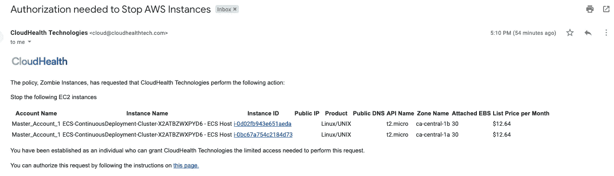

# 不要让僵尸 EC2 实例横行！

> 原文：<https://medium.com/quick-code/dont-let-zombie-ec2-instances-run-wild-852364479df7?source=collection_archive---------3----------------------->

当我试图向我的亲戚解释我这些天在做什么的时候，我试着做了一个关联，并说了类似于“*你知道你看《网飞》？这是由云“*”驱动的，所以显而易见的回答总是*“那么他们是如何设法存储所有这些电影的呢？他们一定有无限的能力？”*。是也不是，对吧？虽然公共云确实提供了在您需要时轻松、廉价地构建新实例的能力，但强大的能力也意味着巨大的责任。几乎我们接触过的每个客户都在利用 Terraform/ansi ble/cloud formation 或某种自动化来协调配置和部署流程，这意味着他们可以轻松地创建可重复的部署，并且不会有太多雪花四处飘散。

我们还发现，在大多数组织中，开发人员擅长旋转资源和将应用程序上线。然而，大多数开发/测试环境以及“僵尸”资源的扩散似乎都发生在及时地将它们关闭的地方。你会惊讶地发现，我们最终发现有多少实例、弹性 IP、EBS 卷很好地存在于 AWS 帐户中，并增加了账单。没有一个监控、可观测系统选择或报告它们。

在这篇博客中，我们将探索几个项目:

1.  识别 AWS 中的僵尸实例
2.  设置策略以正确报告这些实例
3.  使用批准工作流的自动化方法创建补救步骤

**识别 AWS 中的僵尸实例**

让我们从一些超级简单直接的东西开始，我们只想得到一个被停止的实例的列表。你可能想知道为什么我描述一个停止的实例，而 AWS 却说我们没有为这个实例付费。虽然这是准确的，但我们仍然为 EBS 卷付费，我们还为保持实例运行的每秒钟计费，最少一分钟，即使实例保持空闲并且我们没有连接到它。参考 [AWS 实例生命周期](https://docs.aws.amazon.com/AWSEC2/latest/UserGuide/ec2-instance-lifecycle.html)获得更多信息。

那么，当 AWS EC2 实例控制台没有显示所有地区的所有实例时，我们如何获得这个列表呢？我们可以使用 [AWS CLI](https://docs.aws.amazon.com/cli/latest/reference/ec2/describe-instances.html) 编写脚本，也可以使用 VMware 的 CloudHealth 来完成这一任务，等等。根据您希望完成这项工作的速度和运营团队的技能，编写脚本可能可行，也可能不可行。在我们即将开始的僵尸大战中，像 VMware 的 CloudHealth 这样的多云平台可能是你的朋友。

要识别所有地区和所有客户的所有已停止实例，只需浏览至“资产”>“AWS ”,然后通过几个选项进行筛选，如下所示。


如果您愿意，我们可以通过按时间段进一步筛选，识别有无标签的资源，从而细化我们的搜索。

通过几个简单的步骤，我们可以看到我们的朋友 Sean 在测试 Cloud9 时将几个实例留在了停止状态。通过 CloudHealth 平台，我还能够启动/停止 EC2 实例或运行 Lambda 函数。如果我让他放松，我可能会问他这些东西该怎么办！


因此，让我们进入稍微复杂一点的东西，看看自动触发器。

**设置策略以正确报告这些实例**

我在 CloudHealth 中探索的一个领域是治理策略。在“设置”下浏览到“治理”,然后单击“策略”。所需策略的最终状态如下所示。该策略设置为每小时运行一次，在其中一个地区(在本例中为加拿大)的所有 AZ 之一中，查找最大 CPU 使用率至少 14 天低于 5%的 EC2 实例。


让我们深入研究一下组件，尤其是规则和操作部分，看看我们到底是如何做到这一点的。


要设置此策略块，我们有几个选项可供选择，如上所示。我们对性能指标感兴趣，所以我们选择了性能。在“测量”选项卡下，我们有几个选项可供选择。为了简单起见，我们将使用 CPU %。

“条件”选项卡允许我们以惊人的方式分割匹配条件。匹配条件可以基于 AWS 帐户、实例类型、操作系统、视角(我们之前已经讨论过)或者基于可用性区域。


一旦我们定义了块和匹配条件，我们需要定义我们想要实现什么动作。我们可以选择实施基于批准的工作流，如针对[RDS 实例的主动策略管理](/@bahubalishetti/reactive-policy-management-of-rds-usage-in-dev-test-environments-c1e97374a54c)所述的 [Bahubali Shetti](https://medium.com/u/91f04d3c8a41?source=post_page-----852364479df7--------------------------------) 。


对我个人来说，删除 EC2 实例，即使得到批准，似乎也是一个极端的步骤。为了确保万无一失，我想拍摄快照，然后删除该实例。这是我们可以用 Lambda 函数实现的。我们也可以简单地给自己发电子邮件，或者更好地给所有者发电子邮件，让他去采取行动。


不要忘记点击测试规则，使规则实际上是生效和寻找资源！我们再次看到两个没有清理的实例。预计费用约为每月 10 美元，即每年约 120 美元。将其扩展到大型团队和整个 AWS 环境，现在我们可以节省大量成本。

最后，这在警报中看起来如何？我们会收到一封精美的电子邮件，其中包含一个 CSV 文件，其中包含所有已确定的资源。


**补救步骤，使用批准工作流程的自动化方法**

现在，我们已经确定了这些僵尸资源，让我们看看如何通过批准工作流创建一个简单的开箱即用的自动化补救。


如上所述，我们利用 Stop EC2 实例操作，将我自己作为该操作的批准者。我们也可以选择利用我们的朋友*透视组*选项来限制这一行动的范围。如果你还没有使用过 Perspective，我强烈建议你开始研究它！

一旦行动被评估，我们会收到一封类似于上面看到的电子邮件，只是这次，我们可以选择“授权”行动，如下所示。



一旦我们点击指令，我们会得到一个选项来授权并提供我们希望对其执行操作的帐户的访问密钥/秘密密钥。如果您担心访问密钥/秘密密钥的共享，它们永远不会被传递给 CloudHealth 服务。我们利用亚马逊 AWS 对跨对象资源共享(CORS)的支持，从 AWS 安全令牌服务请求一组临时安全凭证，该令牌进而用于代表您执行操作。


**利用λ函数进行修复**

然而，上面我们给出的回答是一个非常简单的问题。实际上，我们希望在关闭实例之前对 EBS 卷进行快照，如果没有任何迹象表明实例正在被使用，那么最终会终止。我们将在接下来的几个步骤中描述如何着手构建多步骤动作工作流。我们希望调用的高级步骤是:

1.  一个 lambda 函数，用于对与定义的标准相匹配的实例进行快照。如果我们愿意，我们可以选择利用授权，但是因为我们在上面展示了它，我们将跳过这一个。
2.  等待 5 分钟，确保功能完成
3.  停止 EC2 实例，最后，
4.  向#aws-cost 通道发送一个时差通知，以便捕获事件。

我们使用的 lambda 函数如下所示:

```
import sys
import botocore
import boto3
from botocore.exceptions import ClientError
from arnparse import arnparsedef lambda_handler(event, context):
    ec2 = boto3.resource('ec2', region_name='<***insert region*** >')
    ec2_client= boto3.client('ec2')
    lambdaFunc = boto3.client('lambda')
    print('Trying to get Environment variable')
    if event['resource_arns']:
        for item in event['resource_arns']:
            citem=arnparse(item)
            if citem.resource_type=='instance':
                ec2instance=str(citem.resource)
                try:
                    volumes=ec2_client.describe_instance_attribute(InstanceId=ec2instance, Attribute='blockDeviceMapping')
                    VolumeId=volumes['BlockDeviceMappings'][0]['Ebs']['VolumeId']
                    response = ec2.create_snapshot(VolumeId=VolumeId)
                    print('Success :: snapshotting', ec2instance)
                except ClientError as e:
                    print(e)
    else:
        print("No resources found")return { 'message' : "Script execution completed. See Cloudwatch logs for complete output" }
```

CloudHealth 的输出如下所示:

```
{
  "resource_arns": [
    "arn:aws:ec2:*region*:*account-id*:instance:*instance-id*",
  ],
  "function_name": "ec2-testing-lambda",
  "region": "*region*"
}
```

一旦在 AWS 控制台中创建了 Lambda 函数，大约需要 15 分钟该函数才能在 CloudHealth 中作为一个操作使用。一旦它可用，我们就可以构建一个如下所示的操作:


总之，我们利用 Cloudhealth 平台的一些现成功能，通过自动化审批工作流来帮助识别和终止僵尸 EC2 实例。此工作流将继续在后台运行，并且肯定有助于以自动方式收回未使用的资源。你还有其他想讨论的用例吗？请随意在下面写一行。

~ [巴胡巴利·谢蒂](https://medium.com/u/91f04d3c8a41?source=post_page-----852364479df7--------------------------------)和[帕布·巴拉蒂](https://medium.com/u/30809b351432?source=post_page-----852364479df7--------------------------------)(云宣传@ VMware)