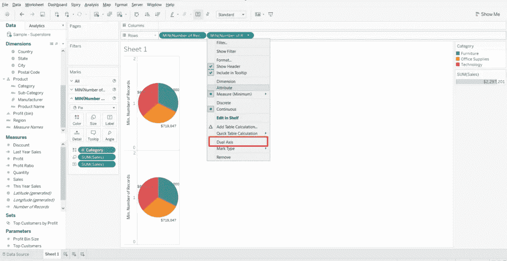

# 如何在 Tableau 中使用圆环图

> 原文：<https://medium.com/edureka/donut-chart-in-tableau-a2e6fadf6534?source=collection_archive---------1----------------------->

当我们让我们的观众以最少的努力获得最大的洞察力时，伟大的可视化就实现了。这正是我们想要通过这篇关于 Tableau 中的 ***圆环图的文章达到的目的。这里的主要目的是帮助你利用甜甜圈图作为 Tableau 中的工具，不仅用于参与，而且用于理解效率。***

让我们从回答下列问题开始:

*   **什么是圆环图？**
*   **饼状图&甜甜圈图有什么区别？**
*   **甜甜圈图有什么好处？**
*   **如何在 Tableau 中构建圆环图？**
*   **圆环图有哪些陷阱？**

# 什么是圆环图？

为了理解什么是圆环图，我们首先需要了解它的前身 ***饼图*** 。

## 那么，什么是饼图呢？

饼图是一个圆形的统计图表或可视化，它被分成多个切片来说明数字比例。在饼图中，每个切片的弧长与其代表的数量成比例。

## 但是饼状图有一个问题。

现在，饼图经常受到批评，因为它将观众的注意力吸引到切片面积的比例上，并煽动他们相互比较以及与整个图表进行比较。这使得很难看出切片之间的差异，尤其是当您试图一起比较多个饼图时。

圆环图通过减少对该区域的使用在一定程度上解决了这个问题。

***圆环图本质上是一个中心区域被切掉的饼图。***

在圆环图中，读者通常会关注弧线的长度，而不是比较各部分之间的比例。此外，圆环图比饼图更节省空间，因为里面的空白空间可以用来显示数据。

但是我们需要了解的是，关于环形图，或者说这两个图，是什么导致了差异。答案在于我们对它们的看法有多么不同。

# 饼图和圆环图的区别是什么？

你可能以前见过饼状图——大圆，切块，不能错过。圆环图本质上是一样的，除了它在中间有一个稍微小一点的圆形切口，将填满的饼图变成一个空心的圆环。让我们让你们都轻松一点。这是他们两个并排的照片。

这似乎是一个相当小的区别，但是移除 Timbit 后会发生一些重要的事情，这揭示了人类大脑和视觉感知的复杂性。

让我们明白这一点。

继续看上面的饼状图。注意你是如何看它的——很有可能，你的眼睛会一直盯着中心，并且(至少一开始)你会完整地看到饼状图。

因为饼状图是填充的，你把它们看成一个整体；你看到圆，根据它们的面积来判断。

然后是这个环形图。因为甜甜圈图是镂空的，没有中心点吸引你的注意力。你的眼睛转到哪里去了？

如果你像大多数人一样，你的眼睛会在圆周上移动，并根据长度来判断每一块。因此，您也可以将圆环图想象成一个自身卷曲的堆叠条形图。

***那么，这有什么关系呢？***

为什么看东西是看面积还是看长度很重要？嗯，我们的大脑处理这两种属性的方式不同——*，我们只擅长其中一种*。

人类特别擅长判断直线距离。你可以很容易地分辨出某物是更高、更宽、更长、更短；一维比较非常简单。

除非差异非常明显，否则区域划分并不容易。你可能需要一点时间来比较不同大小的物体。

我的观点是，当读者看到一个圆被分成几个部分时，他们会想要比较这些部分的大小，即使这不是你的目标。

当你看到饼状图时，比较大小是一种自动行为。

那么，圆环图提供了什么呢？

# **甜甜圈图有什么好处？**

两件事——***清晰度&空间效率*** 。

## **透明度**

饼图实际上提供了三个独立的选项。你比较角度的比率，每个楔形或切片的面积比率，或者最后你可以使用外圆周的长度。圆环图只提供了后者，尽管它给了你一个内外边缘。

前面提到的饼状图的复杂性很少是一个好处。一个典型的观众将包含个人谁喜欢这三种方法中的每一种。这使得饼状图的失真比人们意识到的要普遍得多。

甜甜圈也会变形。只是更容易避免。只要边长保持一个固定的比率(没有倾斜的视图)，图表应该保持真实的数据。

## **空间效率**

答案才是重点。正如上一节提到的，两个图表的中心吸引了观众的目光。所以用吧！圆环图中的空白区域非常适合用于总计、提升比较或趋势箭头。老实说，你应该能够完全符合这三个条件！

# 如何在 Tableau 中构建一个圆环图？

本博客将详细介绍如何使用样本超市数据在 ***表格*** 中制作一个圆环图。
要在 Tableau 中创建一个环形图，我们首先需要知道我们想要分离和测量的维度，以定义比例。

因此，在这种情况下，可以使用“类别”作为维度，使用“销售额”作为度量。
以下是在 Tableau 中创建圆环图的步骤:

> 1.连接到 Sample-Superstore 数据集:打开 Tableau 桌面并选择“Sample-Superstore”数据集
> 
> 2.转到**工作表 1** :
> 
> 3.在**标记**卡片中，选择图表类型为饼图
> 
> 4.将“**类别**”字段拖至“颜色”，将“销售”度量拖至“尺寸”&“标签”标记卡
> 
> 5.现在，把"**号记录**拖到"行"架上

> 6.选择“行”架中的“**记录数”**字段，并将默认汇总从“总和”更改为“最小值”
> 
> 7.同样，从 measures 中拖动“Number of Records ”(记录数),并将其放在第一个“Number of Records ”(记录数)之后的“Rows ”(行)架上
> 
> 8.对于“记录数”的第二个副本，也将默认聚合从“总和”更改为“最小值”
> 
> 9.右键单击“**记录数量**”字段的第二个副本，并选择“双轴”选项

> 10.在下一步中，选择“标记”卡中的“**最小(记录数)(2)** ”，并删除以下内容:
> a .“颜色”中的“类别”
> b .“尺寸”和“标签”中的“销售”
> 
> 11.再次选择“标记”卡中的“最小(记录数)(2)”，缩小饼图的大小，然后选择与背景颜色相同的饼图颜色(本例中为“白色”)

> 12.在最后一步中，右键单击每个轴，并取消选择“**显示标题**
> 
> 13.这就是环形图在 Tableau 中的样子。

# 圆环图有哪些陷阱？

当然，Tableau 中的环形图仍然有其缺点——虽然更容易阅读，但对于同一图表内的比较来说，它的 ***仍然不是最棒的*** ，对于两个不同图表之间的比较来说，它更糟糕。

为了 ***弥补*** 的这一不足，我更喜欢在一个完整的仪表盘或一组图表中使用这些图表。但是那张单独的图表无法传达出具有可操作性或令人满意的深度信息。

这些都是 Tableau 中的基本功能，可以让你更好地了解 Tableau 以及与之相关的各种概念。如果你想查看更多关于人工智能、DevOps、道德黑客等市场最热门技术的文章，你可以参考 [Edureka 的官方网站。](https://www.edureka.co/blog/?utm_source=medium&utm_medium=content-link&utm_campaign=donut-chart-in-tableau)

请留意这个系列中的其他文章和视频，它们会帮助你理解 Tableau 的各种概念。

> 1. [Tableau 教程](/edureka/tableau-tutorial-37d2d6a9684b)
> 
> 2.[什么是 Tableau？](/edureka/what-is-tableau-1d9f4c641601)
> 
> 3. [Tableau 功能](/edureka/tableau-functions-ce794b10e588)
> 
> 4. [Tableau 仪表盘](/edureka/tableau-dashboards-3e19dd713bc7)
> 
> 5.[Tableau 中的 LOD 表达式](/edureka/tableau-lod-2f650ca1503d)
> 
> 6. [Tableau 提示和技巧](/edureka/tableau-tips-and-tricks-a18bf8991afc)
> 
> 7.[循序渐进指导学习 Tableau 公共](/edureka/tableau-public-942228327953)
> 
> 8. [Tableau 桌面 vs Tableau 公共 vs Tableau 阅读器](/edureka/tableau-desktop-vs-tableau-public-vs-tableau-reader-fbb2a3aa0bac)
> 
> 9.[如何在 Tableau 中创建和使用参数？](/edureka/parameters-in-tableau-ac552e6b0cde-ac552e6b0cde)
> 
> 10.[Tableau 中的集合是什么，如何创建它们](/edureka/sets-in-tableau-39befe9b7fa1)
> 
> 11.[数据混合](/edureka/tableau-lod-2f650ca1503d)
> 
> 12 . [Tableau 图表](/edureka/tableau-charts-111758e2ea97)
> 
> 13.[2020 年你必须准备的 50 大 Tableau 面试问题](/edureka/tableau-interview-questions-and-answers-4f80523527d)
> 
> 14.[如何以及何时使用不同的 Tableau 图表](/edureka/tableau-charts-111758e2ea97)

*原载于 2019 年 12 月 16 日*[*https://www.edureka.co*](https://www.edureka.co/blog/donut-chart-in-tableau/)*。*