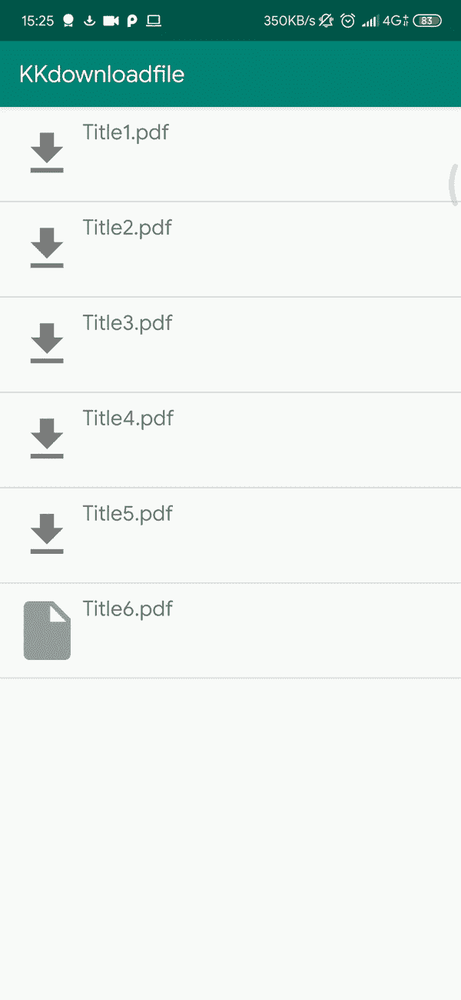

# 使用 Ktor 客户端、Koin 和协同程序下载文件

> 原文：<https://blog.kotlin-academy.com/download-files-with-ktor-and-coroutines-e96b1cc8b657?source=collection_archive---------4----------------------->

## 使用 Ktor 和 Koin 在 RecyclerView 中下载文件的简单指南

## 给我看看代码:Koin

Koin 是一个实用的轻量级依赖注入框架，面向 Kotlin 开发者(我们❤ Kotlin！)

因此，让我们从在项目 build.gradle 中插入依赖项开始:

那么我们应该在我们的应用程序类中初始化它:

就是这样！这样，我们可以在应用程序中拥有一个安全的静态上下文。因此创建一个类`Extensions.kt`并插入这个扩展 val:

当你需要一个上下文(例如，访问一个数据类中的资源)而你又不能拥有它的时候,`glocalContext`是有用的。一般来说，当 Android 使**可用**时，你不需要**也不应该**使用它(例如，活动、片段等)。Koin 帮助我们避免任何**内存泄漏**,因为上下文对象除了存储在 Koin 本身之外不存储在任何地方，但是它可以通过这个扩展在几乎任何地方被访问

# ktor-客户端

[Ktor](https://ktor.io/) 是一个用来实现服务器端应用的框架。此外，它还包括 Ktor-client，这是一个多平台 HTTP 客户端，可以在手机或浏览器等前端应用程序上使用。所以 Ktor-client 和 Kotlin 协同程序一起提供了很棒的工具，以简单直接的方式处理**异步网络请求**

要使用 Ktor-client，我们首先需要在我们的项目 build.gradle 中添加这些依赖项

也不要忘记添加这个:(否则，项目不会编译)

创建 Ktor 的一个**实例**就像一个星期天的早晨一样简单…

…让它出现在我们的代码中也一样简单。将它作为**单模块**添加到 **Koin 初始化方法**中即可:

现在我们可以用`by inject<HttpClient>()`注入实例

## 主要活动和适配器

最后，我们有了开始的一切，所以我们可以创建一个带有`RecyclerView`和一个列表`DummyData`的`Activity`。

您可以看到，在`manageClickAdapte`中，我们使用一个协程来启动下载，并使用我们的适配器的自定义方法来设置`isDownloading`属性的状态。

这个方法的核心是`downloadFile`扩展函数。它是一个挂起函数，接收**文件**，其中写入从 **URL** 下载的字节，并带有操作结果的回调:

这是我的“AttachementAdapter”实现，用于显示列表中的所有元素。它膨胀 item_list 布局，决定每个元素的外观，然后用数据填充每个元素。构造函数接收一个回调函数来管理对项目的点击

这是用于呈现单个项目的布局:

如果一切顺利，我们应该看到一个非常简单的项目列表，我们可以下载文件或显示下载的内容。现在你可以下载任何有 phew 行代码的文件了！

这里是 Github 项目的例子

 [## 弗朗切斯科加托/Ktor-Koin-文件-下载

### 此时您不能执行该操作。您已使用另一个标签页或窗口登录。您已在另一个选项卡中注销，或者…

github.com](https://github.com/francescogatto/Ktor-Koin-Files-Downlaod) 

如果你喜欢这个故事，不要忘记鼓掌:)在下一部分，我们将看到如何下载文件与工作管理器和 Ktor 显示一个确定的进度条！**敬请期待！**

# 单击👏说“谢谢！”并帮助他人找到这篇文章。

了解卡帕头最新的重大新闻。学院、[订阅时事通讯](https://kotlin-academy.us17.list-manage.com/subscribe?u=5d3a48e1893758cb5be5c2919&id=d2ba84960a)、[观察 Twitter](https://twitter.com/ktdotacademy) 并在 medium 上关注我们。

如果您需要 Kotlin 工作室，请查看我们如何帮助您: [kt.academy](https://www.kt.academy/) 。

