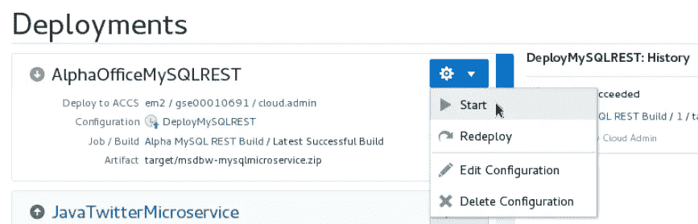

# 使用 DevOps(和 MySQL)开发微服务

> 原文：<https://medium.com/oracledevs/draft-developing-microservices-using-devops-and-mysql-b14e02128e5b?source=collection_archive---------0----------------------->

*注意:本文提供了微服务的介绍，更多深入信息请参见底部的链接*

当前从单片应用程序和数据库转向微服务和智能开发运维的趋势是一个快速的转变，让许多人晕头转向。在本文中，我们将解决其中的一些问题，并向您介绍 Oracle 提供的宝贵资源，这些资源可以帮助您完成这一过程的每一步。

# **什么是 Devops？**

DevOps 是一种应用程序开发和交付策略，旨在提高开发和运营团队之间的协同作用。许多创新型公司正在采用这种方法来利用云环境中不断加快的变化速度。敏捷开发团队与运营专业人员协同工作，利用迭代过程来提高整个开发、部署、升级和添加周期中的服务水平。

# **什么是微服务？**

微服务背后的核心思想是，当某些类型的应用程序被分解成更小的、可组合的、协同工作的部分时，它们变得更容易构建和维护。每个组件都是不断开发和单独维护的，因此应用程序只是其组成组件的总和。这与传统的“单片”应用程序形成对比，后者是在一个部件中开发的。

作为一组模块化组件构建的应用程序更容易理解、更容易测试，最重要的是在应用程序的生命周期中更容易维护。它使组织能够实现更高的敏捷性，并能够大大缩短将工作改进用于生产的时间。这种方法已经被证明是优越的，特别是对于由地理上和文化上不同的开发人员团队开发的大型企业应用程序。

# **甲骨文能帮上什么忙？**

Oracle 为开发人员精心策划了一个循序渐进的指南，帮助您实现以下目标:

*   在 Oracle Cloud 中获得您自己的免费试用帐户
*   将各种开源工具与 Oracle 云结合使用
*   利用 Oracle Developer Cloud Services，使用敏捷方法端到端地跟踪项目，包括创建问题、冲刺、合并请求等。
*   创建和部署各种基于 Java 和 Node.js 的微服务，这些微服务可以呈现后端数据
*   将这些微服务集成到 Oracle 云中托管的现代用户界面中

# **立即开始您的免费试用和指导教程！**

Oracle 准备了两种不同风格的演练，请选择最适合您需求的一种，并单击下面相应的链接立即开始:

[DevOps 和云原生微服务研讨会](https://go.oracle.com/microservices-devops) —该研讨会将引导您完成云原生项目的软件开发生命周期(SDLC ),在此期间，您将创建和使用多个微服务。在研讨会期间，您将接触到 Oracle 开发者云服务和 Oracle 应用容器云服务。

[DevOps 和云原生微服务 MySQL 研讨会](https://go.oracle.com/microservices-mysql) —该研讨会包含第一个研讨会包含的所有内容，此外，它将引导您在云中设置 MySQL 数据库，并使用微服务从中提取数据。

**附加信息:**
[微服务入门第 1 部分](https://blogs.oracle.com/developers/getting-started-with-microservices-part-one)，[第 2 部分](https://blogs.oracle.com/developers/getting-started-with-microservices-part-two)，[第 3 部分](https://blogs.oracle.com/developers/getting-started-with-microservices-part-three)，[第 4 部分](https://blogs.oracle.com/developers/getting-started-with-microservices-part-four)

如果你觉得这很有帮助，请[在 LinkedIn](https://www.linkedin.com/shareArticle?mini=true&url=https://medium.com/oracledevs/developing-microservices-using-devops-and-mysql-b14e02128e5b) 上分享

Create and track DevOps Tasks

Create and deploy Microservices into Oracle Application Cloud Service

Integrate microservices into a sample front end

Manage your entire project using Agile methodology