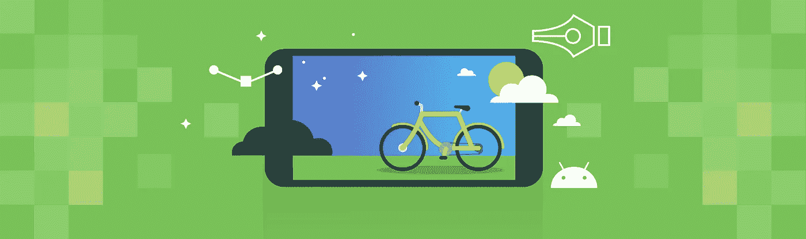
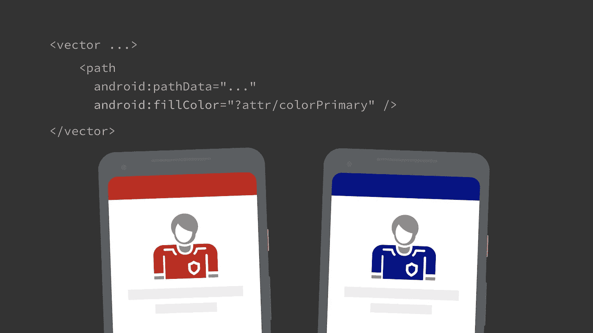
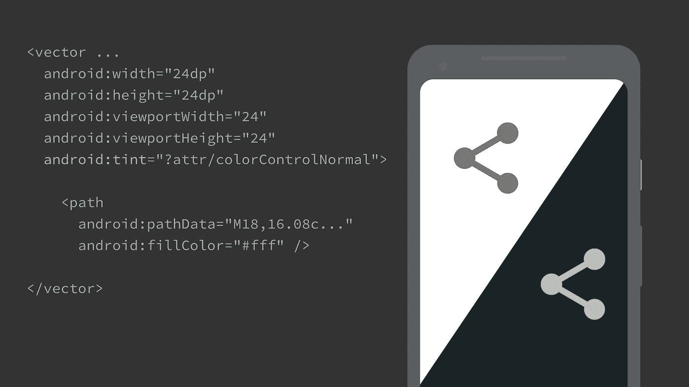
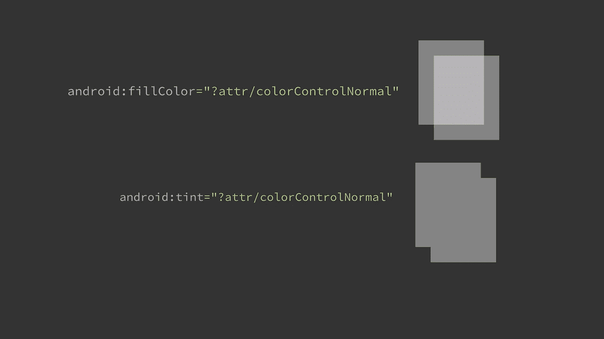
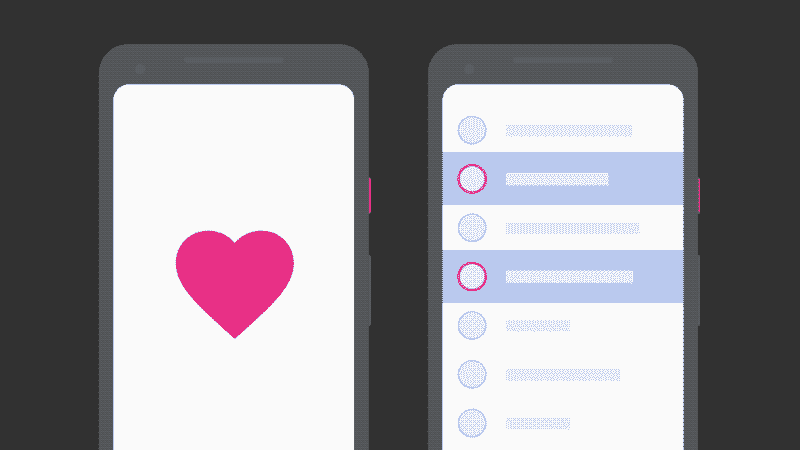
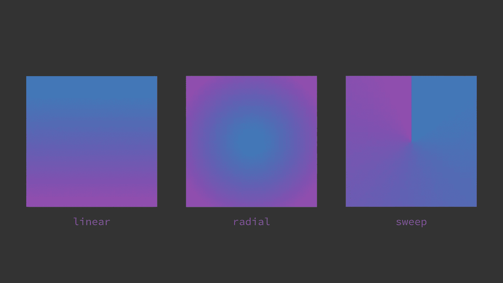
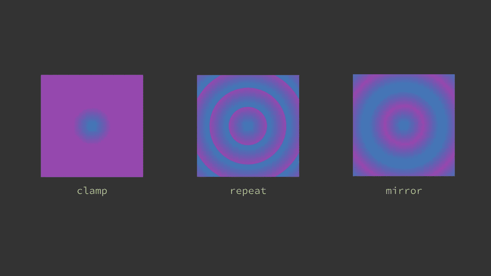
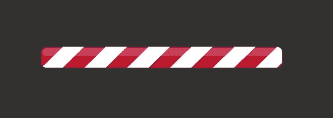
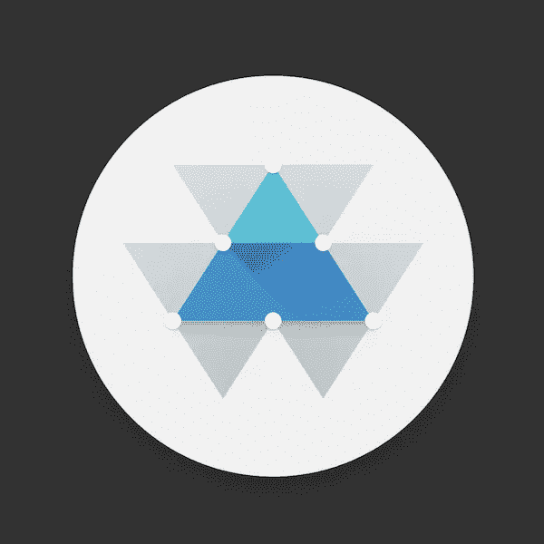

# 绘制路径:渲染 Android VectorDrawables

> 原文：<https://medium.com/androiddevelopers/draw-a-path-rendering-android-vectordrawables-89a33b5e5ebf?source=collection_archive---------1----------------------->

Illustration by [Virginia Poltrack](https://twitter.com/VPoltrack)

在上一篇文章中，我们研究了 Android 的`VectorDrawable`格式，探讨了它的优势和功能。

 [## 理解 Android 的矢量图像格式:VectorDrawable

### Android 设备有各种尺寸、形状和屏幕密度。这就是为什么我非常喜欢使用分辨率…

medium.com](/androiddevelopers/understanding-androids-vector-image-format-vectordrawable-ab09e41d5c68) 

我们讨论了如何定义组成资源中形状的路径。`VectorDrawable`支持许多实际绘制这些形状的方法，我们可以用它们来创建丰富、灵活、可主题化和*交互式的*资产。在这篇文章中，我将深入探讨这些技术:使用颜色资源、主题颜色、颜色状态列表和渐变。

# 简单的颜色

绘制路径最简单的方法是指定硬编码的填充/描边颜色。

您可以定义这些属性中的一个或两个，并且每个路径只能应用一个填充/描边(与某些图形包不同)。首先绘制填充，然后应用任何描边。描边总是居中(也不像某些图形应用程序允许内部或外部描边)，需要指定一个`strokeWidth`，并可以选择定义`strokeLineCap`、`strokeLineJoin`属性，这些属性控制描边线条的结束/连接的形状(对于`miter`线条连接也是`strokeMiterLimit`)。不支持虚线。

填充和描边都提供了单独的 alpha 属性:`fillAlpha`和`strokeAlpha`[0–1]，它们都默认为 1，即完全不透明。如果你指定了一个带有 alpha 成分的`fillColor`或`strokeColor`，那么这两个值就是*的组合*。例如，如果您指定 50%透明红色`fillColor` ( `#80ff0000`)和`0.5` `fillAlpha`，那么结果将是 25%透明红色。单独的 alpha 属性使设置路径不透明度的动画变得更加容易。

# 色彩资源

向量支持填充和描边颜色的`@color`资源语法:

这使你可以更容易地维护颜色，并帮助你限制你的应用程序使用一致的调色板。

它*也*使你能够使用 Android 的[资源限定符](https://developer.android.com/guide/topics/resources/providing-resources#AlternativeResources)在不同的配置中提供不同的颜色值。例如，您可以在夜间模式(`res/colors-night/colors.xml`)或[设备支持宽色域](/google-design/android-color-management-what-developers-and-designers-need-to-know-4fdd8054557e) ( `res/colors-widecg/colors.xml`)时提供替代颜色值。

# 主题颜色

所有版本的 vectors(从 API14 到 AndroidX)都支持使用主题属性(例如`?attr/colorPrimary`)来指定颜色。这些是由主题提供的颜色，对于创建您可以在应用程序的不同位置使用的灵活资源非常有用。

使用主题颜色有两种主要方式。

## 主题填充/描边

您可以直接引用主题颜色来填充或描边路径:

如果您想要基于主题区分资产中的元素，这将非常有用。例如，一个体育应用程序可能会为一个占位符图像设置主题，以显示球队的颜色；使用单一可拉伸:

Filling a path with a theme color

## 染色

根`<vector>`元素提供了`tint` & `tintMode`属性:

虽然您可以使用它来应用静态色调，但它在与主题属性结合使用时更有用。这允许你根据膨胀的主题改变整个资源的颜色。例如，你可以使用`?attr/colorControlNormal`来给图标上色，它定义了图标的标准颜色，并且随着主题的深浅而变化。这样，您可以在不同主题的屏幕上使用同一个图标:

Tinting an icon so that it is appropriately colored on light/dark screens

使用淡色的一个好处是，您不需要依赖源作品来获得正确的颜色。对图标应用像`?attr/colorControlNormal`这样的标准色调既能让你主题化，又能保证资产是完全相同的、正确的颜色。

`tintMode`属性可以让您改变用于给绘图着色的混合模式，它支持:`add`、`multiply`、`screen`、`src_atop`、`src_over`或`src_in`；对应等效的 [PorterDuff。模式](https://developer.android.com/reference/android/graphics/PorterDuff.Mode)。默认的`src_in`通常是您想要的，它将图像视为 alpha 蒙版，将单一色调应用于整个图标，忽略各个路径中的任何颜色信息(尽管 alpha 通道保持不变)。因此，如果你打算给图标上色，那么最好使用完全不透明的填充/描边颜色(惯例是使用`#fff`)。

您可能想知道什么时候给资源着色，什么时候在单独的路径上使用主题颜色，因为两者可以获得相似的结果。如果你想在一些路径上使用主题颜色，那么你必须直接使用它们。另一个需要考虑的问题是，您的资源是否有任何重叠的渲染。如果是这样的话，那么用半透明的主题颜色填充可能不会产生你想要的效果，但是用浅色填充可能会。

Assets with overlapping paths & semi-opaque theme colors: comparing tint vs fills

请注意，您可以在`Activity` / `View`级别通过设置`android:theme`属性来改变用于膨胀 drawable 的主题，或者在代码中使用具有特定主题的`[ContextThemeWrapper](https://developer.android.com/reference/android/view/ContextThemeWrapper.html)`来[膨胀](https://developer.android.com/reference/android/support/v7/content/res/AppCompatResources.html#getDrawable(android.content.Context,%20int))向量。

Overlaying the theme `baz`

# 有色人种学者

`VectorDrawable`支持参照`[ColorStateLists](https://developer.android.com/reference/android/content/res/ColorStateList.html)`进行填充/描边。这样，你可以创建一个单一的 drawable，其中路径根据视图/drawable 的状态(如按下、选择、激活等)改变颜色。

Examples of vectors responding to pressed and selected states

这是在 API24 中引入的，但最近添加到了 AndroidX 中，从版本 1.0.0 将支持带回 API14。这也使用了[AndroidX ColorStateList inflater](https://developer.android.com/reference/android/support/v7/content/res/AppCompatResources.html#getColorStateList(android.content.Context,%20int))，这意味着你也可以在`ColorStateList`本身中使用主题属性和 alpha(它们本身只是在 API23 中添加到平台中的)。

虽然在一个`StateListDrawable`中使用多个 drawables 可以获得相似的结果，但是如果不同状态之间的渲染差别很小，这可以减少重复，并且更容易维护。

我也非常喜欢为自定义视图创建自己的状态，这可以与这种支持相结合，以控制资产中的元素，例如，除非设置了特定的状态，否则使路径透明。

# 梯度

The 3 types of gradients supported

`VectorDrawable`支持填充和描边的线性、径向和扫描(也称为角度)渐变。这也通过 AndroidX 支持回到 API14。在`res/colors/`中，渐变是在它们自己的文件中声明的，但是我们可以使用[内联资源技术](https://developer.android.com/guide/topics/resources/complex-xml-resources)来代替在一个矢量中声明渐变——这样会更方便:

在构建时，渐变被提取到它自己的资源中，并且对它的引用被插入到*父*元素中。如果你要多次使用同一个渐变，最好声明一次并引用它，因为内联版本每次都会创建一个新的资源。

指定渐变时，任何坐标都在根矢量元素的视口空间中。让我们来看看每种类型的梯度，以及如何使用它们。

## 线性的

线性渐变必须指定开始/结束 X/Y 坐标和`type="linear"`。

## 放射状的；辐射状的

径向渐变必须指定中心 X/Y 和半径(同样在视口坐标中)以及`type="radial"`。

## **扫一扫**

扫描梯度必须指定一个中心 X/Y 和`type="sweep"`。

## 颜色停止

为了方便起见，渐变让你直接在渐变中指定一个`startColor`、`centerColor`和`endColor`。如果你需要更精细的控制或者更多的颜色停止，你也可以通过添加指定一个`color`和一个【0–1】`offset`的子`item`元素来实现(把它想象成渐变过程中的一个百分比)。

## 平铺模式

线性和径向(但不是扫描)渐变提供了平铺的概念，即如果渐变没有覆盖它填充/描边的整个路径，该怎么办。默认为`clamp`，只是延续开始/结束颜色。或者，您可以指定`repeat`或`mirror`平铺模式……顾名思义！在下面的例子中，径向渐变被定义在中间的蓝色→紫色圆圈上，但是填充了较大的正方形路径。

Gradient tile modes

## 模式

我们可以结合使用颜色停止和平铺模式来实现矢量中的基本模式支持。例如，如果您指定一致的颜色停止，您可以实现突然的颜色变化。结合这种重复平铺模式，我们可以创建条纹图案。[例如](https://gist.github.com/nickbutcher/1e6c2309ee075ac62d2f8a6c285f0ce8)这是一个由单一图案填充形状制成的装载指示器。通过在持有该模式的组上设置`translateX`属性的动画，我们可以实现这样的效果:

注意，这种技术离完全的 [SVG 模式](https://www.w3.org/TR/SVG/pservers.html#Patterns)支持还差得很远，但是它是有用的。

## 插图

Another lovely illustration by the very talented [Virginia Poltrack](https://twitter.com/VPoltrack)

渐变在较大的矢量作品中非常常见，如插图。向量可以很好地适合插图，但是在放大时要注意内存的权衡。我们将在后面的系列文章中再次讨论这个问题。

## 阴影

`VectorDrawable` s 不支持投影效果；然而，简单的阴影可以使用梯度*近似*。例如，该应用程序图标使用径向渐变来近似白色圆圈的投影，并使用线性渐变来近似三角形下方的阴影:

Approximating shadows using gradients

同样，这离完全阴影支持还有很长的路要走，因为只能绘制线性/径向/扫描梯度，而不是沿着任意路径。可以近似一些形状；特别是通过将变换应用到渐变元素，例如[示例](https://gist.github.com/nickbutcher/b9c726e956d25b354ee1d19dcb105a88)使用`scaleY`属性将一个具有径向渐变的圆变换为椭圆形以创建阴影:

Transforming a path containing a gradient

# 用数字着色

希望这篇文章已经展示了`VectorDrawable`支持许多高级特性，你可以使用这些特性在你的应用中渲染更复杂的资源，甚至用一个文件替换多个资源，帮助你构建更精简的应用。

我建议所有的应用程序都应该为图标使用主题颜色。并且梯度支持更适合，但是如果你需要，知道向量支持那些用例是很好的。

vectors 的兼容性很好，所以这些特性现在可以在大多数应用程序中使用(下一期将详细介绍)。

加入我们在向量世界的下一段冒险:

 [## 在 Android 应用中使用矢量资源

### 在之前的帖子中，我们已经了解了 Android 的 VectorDrawable 图像格式及其功能:

medium.com](/androiddevelopers/using-vector-assets-in-android-apps-4318fd662eb9) 

*即将推出:为 Android 创建矢量资产
即将推出:剖析 Android* `*VectorDrawable*` *s*