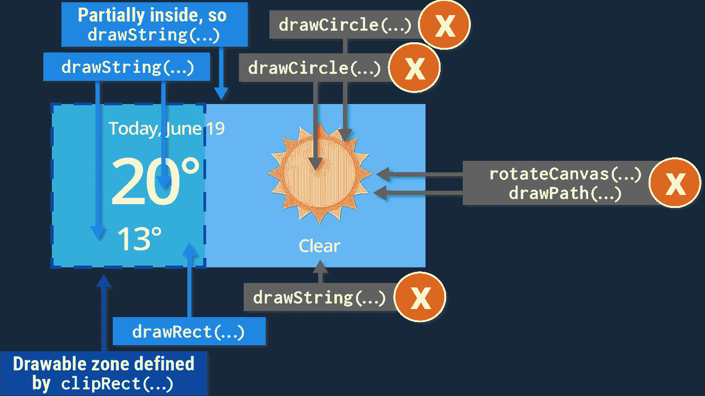

# 把你看到的画下来！…并将#e11 从其余部分中剪下。

> 原文：<https://medium.com/androiddevelopers/draw-what-you-see-and-clip-the-e11-out-of-the-rest-6df58c47873e?source=collection_archive---------5----------------------->


你的应用程序每在屏幕上画一个像素，都需要时间。每次你的应用程序绘制一个不透明的像素来替换已经绘制的东西，都是在浪费时间。在每次屏幕刷新时多次绘制一个像素被称为 *overdraw* ，这是影响现代应用程序性能的常见问题。为了提高效率，每次你的应用程序刷新屏幕时，它应该努力把每个改变的像素只画一次。

例如，一个应用程序可能会绘制一叠 52 张重叠的卡片，只有最后一张卡片完全可见。完全抽取下面的 51 张牌，并且部分覆盖，就是一个透支的例子。


Overdraw happens, if you fully draw overlapping cards.

在过度绘制的应用程序中，最有可能出现的症状是渲染缓慢和动画断断续续。这是最常见的症状。因此，由于透支很常见，也很容易测试，我们建议你养成习惯，每次改变应用程序的视图时都检查一下。

# 测试透支。

您可以使用[调试 GPU 透支工具](https://developer.android.com/tools/performance/debug-gpu-overdraw/index.html)在您的设备上使用颜色着色来可视化透支。

要在移动设备上打开调试 GPU 透支:

1.  打开**设置。**
2.  点击**开发者选项**。
3.  在*硬件加速渲染*部分，选择**调试 GPU Overdraw** 。
4.  在调试 GPU 透支弹出窗口中，选择**显示透支区域**。
5.  观看您的设备变成彩虹般的颜色。这些颜色暗示了屏幕上每个像素的过度绘制量。本色没有透支。紫色透支一次。绿色透支两次。粉色透支三次。红色透支四次以上。


Left: Tint colors indicating overdraw. Center: Red warns of too much overdraw. Right: Blue and white indicate no or little overdraw.

# 遵守唯一的规则。

> 如果你的程序在任何时候画了用户看不到的东西，那就不要画。

特别是:

*   消除不必要的背景。
*   大量剪辑，只重画屏幕上发生变化的区域。
*   简化和重新组织你的视图层次结构，首先最大限度地减少重叠。(这是一个很大的话题，所以会在下一篇文章中涉及。)

# 消除不必要的背景。

这个修复非常简单。在你的代码中搜索“android:background”，对于每个背景，确定它是否需要，是否在屏幕上可见。如果视图的背景被其他东西覆盖，例如一幅图像或孩子们的背景，从视图中删除 **android:background** 代码行。

**之前:**

```
<ImageView
    android:layout_width=”match_parent”
    android:layout_height=”match_parent”
    android:src=”@drawable/beach”
    **android:background=”@android:color/white”** />
```

**之后:**

```
<ImageView
    android:layout_width=”match_parent”
    android:layout_height=”match_parent”
    android:src=”@drawable/beach” />
```

# 大方夹。

对于标准视图，Android 系统会尽可能减少 overdraw，避免绘制完全隐藏的视图。例如，打开的导航抽屉下面的所有内容都不会被绘制。

## clipRect()

对于覆盖 onDraw 方法的复杂自定义视图，底层系统无法洞察如何绘制内容，这使得它很难知道应该避免什么。你可以通过使用 **Canvas.clipRect API** 来帮助系统。这个函数允许你为一个视图定义一个矩形，并且只画矩形里面的东西。


When you clip, only the portion inside the clipping rectangle gets drawn.

因此，对于那组堆叠的重叠卡片，您可以确定当前卡片的哪一部分是可见的，并相应地设置您的裁剪矩形。


When you apply clipping to a stack of cards, only the visible portions are drawn.

裁剪可以节省 CPU 和 GPU 的性能。

在 CPU 方面，一旦提交给 [OpenGLES](http://developer.android.com/guide/topics/graphics/opengl.html) 进行绘制，每个画布绘制命令都会有一点开销。任何完全位于指定裁剪矩形之外的绘制命令都不会提交给硬件，因此不会产生开销。(参见 [Android UI 和 GPU](https://www.youtube.com/watch?v=WH9AFhgwmDw&list=PLWz5rJ2EKKc9CBxr3BVjPTPoDPLdPIFCE&index=53) 或者等待下一篇文章来了解细节。),

现在，仍然会绘制与裁剪矩形部分相交的任何内容，但在 GPU 端，clipRect 将定义一个排除矩形，允许 GPU 在每像素级别上避免对任何被裁剪的内容进行着色。



Everything partially or fully inside the clipping rectangle is drawn.

## 快速拒绝()

现在，即使您只在自定义视图的一角画了一个小圆，整个视图也会重建。不用重新计算和重绘整个屏幕，您可以计算改变区域的裁剪矩形，然后使用 **quickReject() API** 在 onDraw 函数中测试裁剪矩形的交点。如果占用大量处理时间的视图的某个部分在裁剪矩形之外，quickReject 可以提示您，以便您可以完全跳过该处理。

## 复杂剪裁

除了 clipRect 和 quickReject 之外， [Canvas 类](http://developer.android.com/reference/android/graphics/Canvas.html)还提供了复杂剪辑的功能(clipPath、clipRegion 或旋转时应用 clipRect)。这种剪辑可能非常昂贵，而且没有抗锯齿功能。一般的建议是始终组成正确形状和大小的绘图元素，而不是剪裁，例如 drawCircle 或 drawPath 比带有 drawColor 的 clipPath 便宜得多。

# 当然啦！有取舍。

与消除背景不同，剪辑不是免费的，尤其是在较旧和较低端的设备上。所以，不需要的时候不要夹！然而，比大量裁剪好得多的是，只在必要时使用自定义视图，并安排用户界面和视图层次结构，以避免视图部分重叠。(我们将在下一期讨论这个问题。)

# 透支仍然重要。

像许多其他性能挑战一样，一点点，甚至很多的透支和额外重绘在你时髦的新手机上可能无关紧要。但世界上大多数人的设备功能都没那么强大。减少对它们的过度绘制可以节省大量资源，并大大减少绘制一帧所需的时间。

更一般地说，减少透支可能会对应用程序的性能产生重大影响，如果这是你的应用程序的最大性能问题，但如果你是在一个快速的设备上，它可能不会产生明显的影响。最后，如果你的应用程序有其他更大的性能问题，比如……这可能没有什么可衡量的影响，但这很说明问题。

为了获得本节更有趣的版本，观看[理解透支](https://www.youtube.com/watch?v=T52v50r-JfE)和 [ClipRect 和 ClipReject](https://www.youtube.com/watch?v=vkTn3Ule4Ps) ，它们是 YouTube 上 [Android 性能模式的一部分，在那里你也可以找到更多关于剪辑的内容。用](https://www.youtube.com/playlist?list=PLOU2XLYxmsIKEOXh5TwZEv89aofHzNCiu) [Debug GPU Overdraw Codelab](https://io2015codelabs.appspot.com/codelabs/android-performance-debug-gpu-overdraw#1) 弄脏你的手。如果你想提前一步，可以查看 Udacity 上的 [Android 性能课程。但最重要的是，加入我们的](https://www.udacity.com/course/android-performance--ud825) [Android Performance G+社区](https://plus.sandbox.google.com/communities/116342551728637785407)，获得关于构建高性能 Android 应用的伟大技巧，你猜对了。