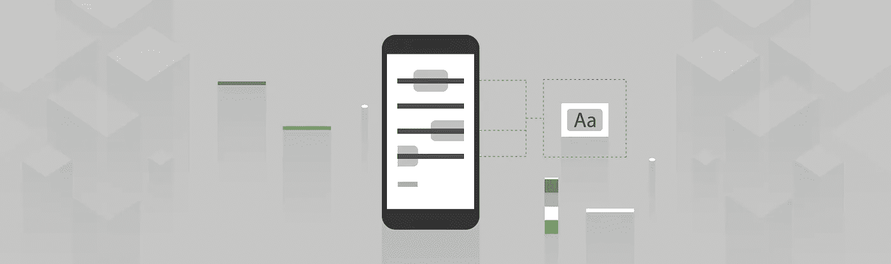
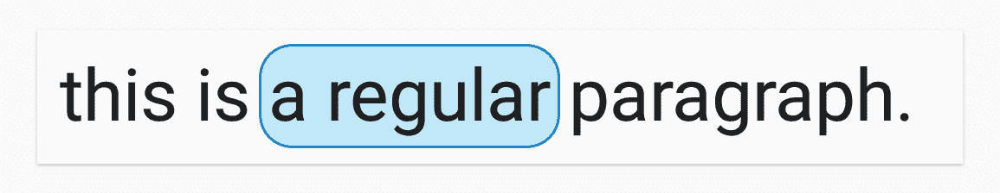
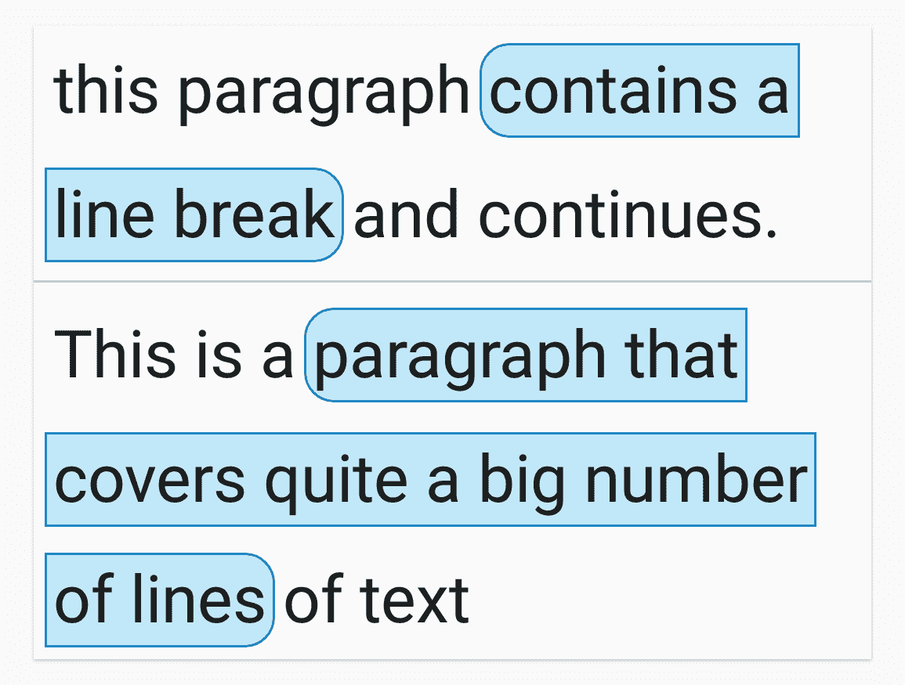
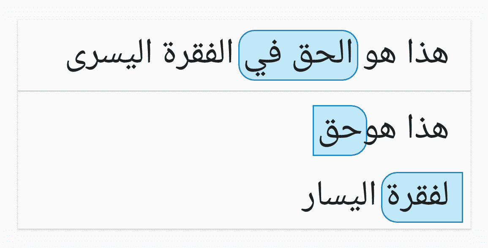
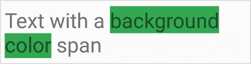
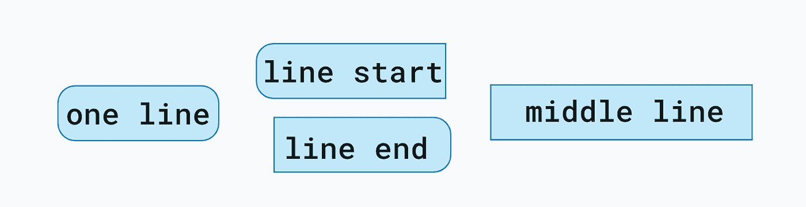
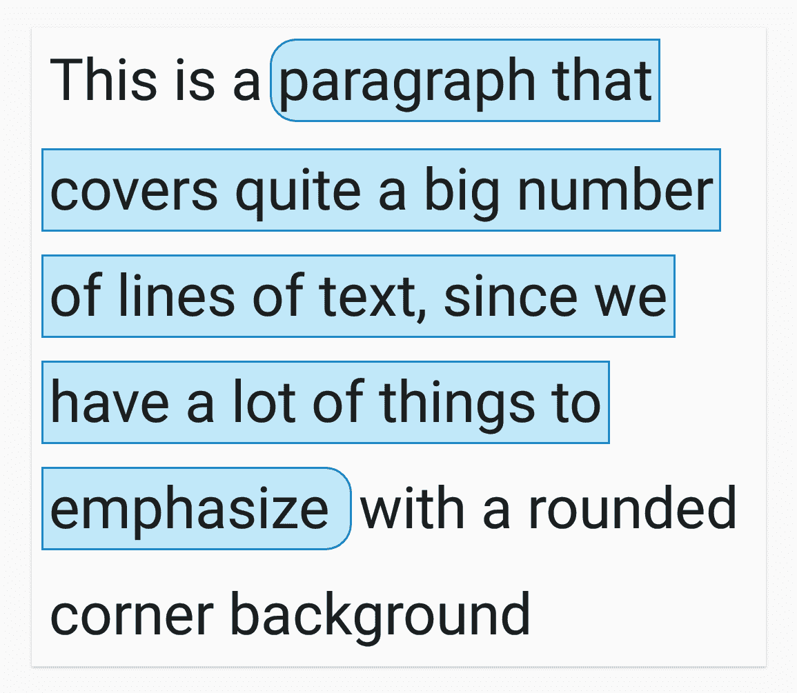

# 在文本上绘制圆角背景

> 原文：<https://medium.com/androiddevelopers/drawing-a-rounded-corner-background-on-text-5a610a95af5?source=collection_archive---------5----------------------->



Illustration by [Virginia Poltrack](https://twitter.com/VPoltrack)

假设我们需要在文本上绘制一个**圆角**背景，支持以下情况:

*   在**上设置一行**文本的背景



*Text on one line with a rounded corner background*

*   设置两行或多行上文本的背景



*Text on multiple lines with a rounded corner background*

*   在**从右向左文本**上设置背景



*Right to left text with rounded corner background*

我们如何实现这一点？请继续阅读，或者直接跳到[样本代码](https://github.com/googlesamples/android-text/tree/master/RoundedBackground-Kotlin)。

# 跨越还是不跨越？这才是问题！

在[之前的](/google-developers/spantastic-text-styling-with-spans-17b0c16b4568) [文章](/google-developers/underspanding-spans-1b91008b97e4)中，我们已经讨论了文本的样式部分(甚至是[国际化文本](/google-developers/styling-internationalized-text-in-android-f99759fb7b8f))。该解决方案涉及使用框架或自定义跨度。虽然 spans 在很多情况下是一个很好的解决方案，但是它们也有一些限制，不适合我们的问题。外观跨度，像`[BackgroundColorSpan](https://developer.android.com/reference/android/text/style/BackgroundColorSpan)`，给我们访问`TextPaint`，允许我们改变元素，像文本的背景颜色，但是只能画纯色，不能控制元素，像圆角半径。



*Text using a BackgroundColorSpan*

我们需要和正文一起画一张图。我们可以实现一个自定义的`[ReplacementSpan](https://developer.android.com/reference/android/text/style/ReplacementSpan.html)`来自己绘制背景和文本。然而`ReplacementSpans`无法流入下一行，因此我们将无法支持多行背景。他们宁愿看起来像[芯片](https://material.io/design/components/chips.html)，材料设计组件，其中每个元素必须适合在一条线上。

跨越工作在`TextPaint`级别，而不是布局级别。因此，他们不知道文本开始和结束的行号，也不知道段落方向(从左到右或从右到左)

# 解决方案:自定义文本视图

根据文本的位置，我们需要绘制四种不同的 drawables 作为文本背景:

*   文本适合一行:我们只需要一个 drawable
*   文本适合两行:我们需要为文本的开始和结束绘制
*   文本跨越多行:我们需要为文本的开始，中间和结尾绘制。



*The four drawables that need to be drawn depending on the position of the text*

要定位背景，我们需要:

*   确定文本是否跨越多行
*   找到起点和终点
*   根据段落方向找到开始和结束偏移量

所有这些都可以根据文本[布局](https://developer.android.com/reference/android/text/Layout)进行计算。为了渲染文本背后的背景，我们需要访问`Canvas`。一个定制的`TextView`可以访问所有必要的信息来定位和呈现可绘制内容。

我们的解决方案包括将问题分成 4 个部分，并创建单独处理它们的类:

*   **用`[Annotation](https://developer.android.com/reference/android/text/Annotation)`跨度在 XML 资源中标记背景**的位置，然后在代码中，我们计算`[TextRoundedBgHelper](https://github.com/googlesamples/android-text/blob/2831d91984f3e66104212be96aa9b1aba1c718ca/RoundedBackground-Kotlin/lib/src/main/java/com/android/example/text/styling/roundedbg/TextRoundedBgHelper.kt)`中的位置
*   提供背景 **drawables** 作为 TextView 的**属性**—在`[TextRoundedBgAttributeReader](https://github.com/googlesamples/android-text/blob/2831d91984f3e66104212be96aa9b1aba1c718ca/RoundedBackground-Kotlin/lib/src/main/java/com/android/example/text/styling/roundedbg/TextRoundedBgAttributeReader.kt)`实现
*   **根据文本是跨**一行还是多行** — `[TextRoundedBgRenderer](https://github.com/googlesamples/android-text/blob/master/RoundedBackground-Kotlin/lib/src/main/java/com/android/example/text/styling/roundedbg/TextRoundedBgRenderer.kt)`界面绘制**及其实现:`[SingleLineRenderer](https://github.com/googlesamples/android-text/blob/master/RoundedBackground-Kotlin/lib/src/main/java/com/android/example/text/styling/roundedbg/TextRoundedBgRenderer.kt#L84)`和`[MultiLineRenderer](http://MultiLineRenderer)`
*   在`TextView` — `[RoundedBgTextView](https://github.com/googlesamples/android-text/blob/master/RoundedBackground-Kotlin/lib/src/main/java/com/android/example/text/styling/roundedbg/RoundedBgTextView.kt)`上支持**自定义绘制**，一个扩展了`AppCompatTextView`的类，在`TextRoundedBgAttributeReader`的帮助下读取属性，覆盖`onDraw`，在那里它使用`TextRoundedBgHelper`绘制背景。

# 找出应该在哪里绘制背景

我们在字符串资源中使用`[Annotation](https://developer.android.com/reference/java/text/Annotation)` spans 来指定应该有背景的文本部分。从本文的[中找到更多关于使用注释范围的信息。](/google-developers/styling-internationalized-text-in-android-f99759fb7b8f)

我们创建了一个`[TextRoundedBgHelper](https://github.com/googlesamples/android-text/blob/master/RoundedBackground-Kotlin/lib/src/main/java/com/android/example/text/styling/roundedbg/TextRoundedBgHelper.kt)`类:

*   使我们能够根据文本方向定位背景:从左到右或从右到左
*   根据可绘制内容以及水平和垂直填充呈现背景

在`[TextRoundedBgHelper.draw](https://github.com/googlesamples/android-text/blob/master/RoundedBackground-Kotlin/lib/src/main/java/com/android/example/text/styling/roundedbg/TextRoundedBgHelper.kt#L79)`方法中，对于文本中找到的每个`Annotation`跨度，我们获取跨度的开始和结束索引，找到每个跨度的行号，然后计算开始和结束字符偏移量(在行内)。然后，我们使用`TextRoundedBgRenderer`实现来渲染背景。

```
fun draw(canvas: Canvas, text: Spanned, layout: Layout) {
    // ideally the calculations here should be cached since 
    // they are not cheap. However, proper
    // invalidation of the cache is required whenever 
    // anything related to text has changed.
    val spans = text.getSpans(0, text.*length*, Annotation::class.*java*)
    spans.forEach **{** span **->** if (span.*value*.equals("rounded")) {
            val spanStart = text.getSpanStart(span)
            val spanEnd = text.getSpanEnd(span)
            val startLine = layout.getLineForOffset(spanStart)
            val endLine = layout.getLineForOffset(spanEnd)

            // start can be on the left or on the right depending 
            // on the language direction.
            val startOffset = (layout.getPrimaryHorizontal(spanStart)
                + -1 * layout.getParagraphDirection(startLine) * horizontalPadding).toInt()
            // end can be on the left or on the right depending 
            // on the language direction.
            val endOffset = (layout.getPrimaryHorizontal(spanEnd)
                + layout.getParagraphDirection(endLine) * horizontalPadding).toInt()

            val renderer = if (startLine == endLine) singleLineRenderer else multiLineRenderer
            renderer.draw(canvas, layout, startLine, endLine, startOffset, endOffset)
        }
    **}** }
```

# 提供可绘制的属性

为了在我们的应用程序中方便地为不同的`TextViews`提供 drawables，我们[定义了](https://developer.android.com/training/custom-views/create-view#customattr) 4 个对应于 drawables 的自定义属性和 2 个用于水平和垂直填充的属性。我们创建了一个从 xml 布局中读取这些属性的`[TextRoundedBgAttributeReader](https://github.com/googlesamples/android-text/blob/master/RoundedBackground-Kotlin/lib/src/main/java/com/android/example/text/styling/roundedbg/TextRoundedBgAttributeReader.kt)`类。

# 使背景可绘制

一旦我们有了可画的东西，我们就需要画它们。为此，我们需要知道:

*   背景的开始线和结束线
*   背景应该开始和结束的字符偏移量。

我们创建了一个抽象类`[TextRoundedBgRenderer](https://github.com/googlesamples/android-text/blob/master/RoundedBackground-Kotlin/lib/src/main/java/com/android/example/text/styling/roundedbg/TextRoundedBgRenderer.kt)`，它知道如何计算线条的顶部和底部偏移量，但是公开了一个抽象的`[draw](https://github.com/googlesamples/android-text/blob/master/RoundedBackground-Kotlin/lib/src/main/java/com/android/example/text/styling/roundedbg/TextRoundedBgRenderer.kt#L45)`函数:

```
abstract fun draw(
    canvas: Canvas,
    layout: Layout,
    startLine: Int,
    endLine: Int,
    startOffset: Int,
    endOffset: Int
)
```

根据文本是单行还是多行，`draw`函数将有不同的实现。这两个实现都基于相同的原理:基于顶部和底部的线条，设置可绘制对象的边界，并将其呈现在画布上。

单线实现只需要画一个 drawable。


*Single line text*

多行实现需要在第一行和最后一行分别绘制可绘制的行的开始和结束，然后对于中间的每一行，绘制可绘制的中间行。



*Multi-line text*

# 支持在 TextView 上自定义绘图

在让`TextView`绘制文本之前，我们扩展`AppCompatTextView`并覆盖`onDraw`来调用`[TextRoundedBgHelper.draw](https://github.com/googlesamples/android-text/blob/master/RoundedBackground-Kotlin/lib/src/main/java/com/android/example/text/styling/roundedbg/TextRoundedBgHelper.kt#L79)`。

**警告**:我们的示例为每个`TextView.onDraw`方法调用进行所有的计算。如果你计划在你的应用中集成这个实现，我们强烈建议修改它并缓存在`[TextRoundedBgHelper](https://github.com/googlesamples/android-text/blob/master/RoundedBackground-Kotlin/lib/src/main/java/com/android/example/text/styling/roundedbg/RoundedBgTextView.kt#L52)`中完成的计算。然后，确保每当与文本相关的任何内容(如文本颜色、大小或其他属性)发生变化时，都使缓存失效。

Android 文本 API 允许您非常自由地进行样式化。文本属性、样式、主题和跨度的简单样式化是可能的。通过控制`onDraw`方法并决定在`Canvas`上绘制什么以及如何绘制，可以实现复杂的定制样式。查看我们的示例，了解所有实现细节。

你需要定制什么样的文本样式`TextView`实现？你遇到了什么样的问题？在评论里告诉我们吧！