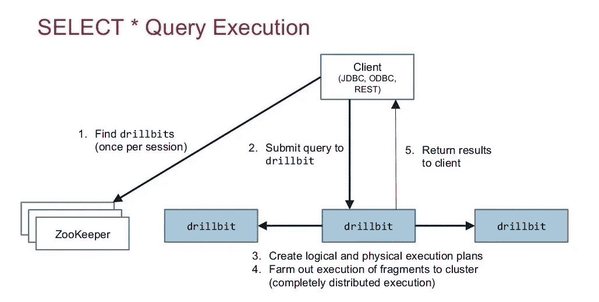
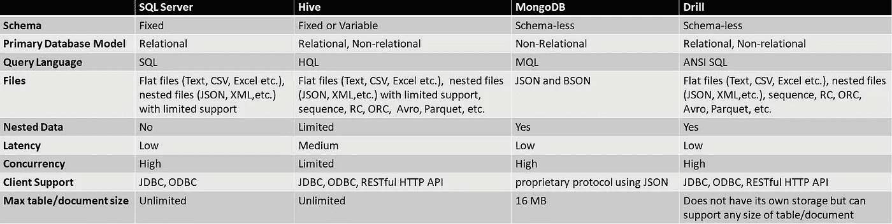

# 用阿帕奇钻孔机往下钻

> 原文：<https://medium.com/globant/drilling-it-down-with-apache-drill-e40be8336fd6?source=collection_archive---------1----------------------->

## 第一部分:结识

我必须承认，Apache Drill 并不是该行业有史以来最受欢迎的工具，但问题是，如果它足够有价值，那么为什么它还不为人所知呢？还和学习有关系吗？如果让我来回答这些，我会说绝对值得一试。并不是每个人都知道它，因为到目前为止它专注于服务于有限数量的用例，但是一直在发展。因此，这个博客的目标是让更多的人了解它。

在本文结束时，你应该熟悉什么，什么时候，为什么，为什么不钻；如何将在后续部分中涉及。这里唯一的先决条件是基本的 SQL 知识。本文面向数据分析师、工程师和其他数据爱好者。

# **前言**

随着每秒钟产生大量的数据，管理、存储、分析和建模数据的挑战越来越紧迫。在任何 IT 项目中，数据分析对于推动有效决策是绝对必要的。数据分析是一个繁琐的过程，当您的数据分布在不同的来源时，它会大大增加整个工作的复杂性。钻头来救援了。


Source: [Twitter](https://twitter.com/microsoftteams/status/1288547380065959939)

# **什么是阿帕奇演习？**

Apache Drill 是一个开源、分布式、交互式查询引擎，灵感来自 Google 的 Dremel 系统(由 Google 开发，用于交互式查询大型数据集，现在称为 [BigQuery](https://cloud.google.com/bigquery/docs/introduction) )。与 [Impala](https://impala.apache.org/overview.html) 不同，它不仅仅是一个基于 Hadoop 平台的 SQL，而是一个基于一切的 SQL。它可以集成各种数据源，如本地文件、RDBMS、HDFS、Hive、HBase、Kafka、MongoDB、Cassandra、亚马逊 S3、Azure blob 存储、谷歌云存储等。Drill 也是世界上第一个也是唯一一个不需要模式的分布式 SQL 引擎。

# **引擎盖下**

在 Drill 的核心， [Drillbit](https://drill.apache.org/architecture/) 服务负责接受来自客户端的请求，处理查询，并将结果返回给客户端。钻头在群集中的每个数据节点上运行，在查询执行期间最大化数据局部性。Drill 使用 [ZooKeeper](https://zookeeper.apache.org/) 来维护集群成员和健康检查信息。



# **Wow 因素**

在本节中，我们将了解使 Drill 独一无二的最佳特性。

## **标准 SQL 支持**

Drill 支持标准的 ANSI SQL:2003。这保留了人们熟悉的、无处不在的 SQL 行为。当部分 SQL 支持不够时，Drill 就派上了用场。

例如， [Hive](https://hive.apache.org/) 不能计算[相关子查询](https://www.geeksforgeeks.org/sql-correlated-subqueries/)，但是 Drill 可以:

```
SELECT column_name(s) FROM table_name WHERE EXISTS (SELECT column_name FROM table_name WHERE condition);
```

我们可以简单地使用点符号，通过 drill 来向下钻取一列。在 [HBase](https://hbase.apache.org/) 的情况下，以表格格式读取和表示多级数据并不容易:

```
SELECT table_name.columnfamilyname.column_1, table_name.columnfamilyname.column_2 FROM hbase.table_name;
```

## **无模式**

模式在这里是可选的。如果没有明确提到，它们可以自动检测。尽管支持标准的 SQL 结构，Drill 还是遵循一种读模式机制。这使得动态引入新数据源变得更加容易，并允许模式快速发展。在当今世界，没有一个严格的模式是非常实际的，事实上，每条记录都有不同的模式，Drill 很好地支持这一点。

## **嵌套数据支持**

在任何其他结构化查询引擎如 Hive、 [Presto](https://prestodb.io/docs/current/overview.html) 等。，数据需要扁平化和模式化。展平具有分层或多级结构的嵌套数据容易出错，而且通常是不可能的。Drill 支持 JSON 和 XML 等复杂的嵌套数据集进行直接分析。

## 敏捷

Drill 并不要求每个数据集都本地存在于其中，而是就地检索数据并即时计算。它可以很快上手，因为它不需要数据库管理员。这样也节省了很多细致的资料准备时间。

## **临时合并**

筒仓使得数据分析变得困难，并且整合多个模式也不容易。通过 Drill，用户可以在单个查询中将多个不同的数据源作为不同的表进行联接，而不必事先定义相关的模式。

SQL 无法立即计算以下连接不同来源数据的查询，但 Drill 可以:

```
SELECT a.column_1, b.column_1 FROM hive.table_name as a JOIN dfs.`file_name.json` b on a.column_1=b.column_2
```

## **灵活可扩展的架构**

Drill 支持一套全面的存储系统和文件格式，从关系到非关系，即插即用。它提供了内置的类路径扫描和插件概念，以最小的配置添加额外的[存储插件](https://drill.apache.org/docs/connect-a-data-source/)和[海关功能](https://drill.apache.org/docs/develop-custom-functions/)。有记录良好的 API 和接口可用于演练。此外，它还可以部署在 Hadoop 集群上，具有很强的可扩展性。Drill 可以灵活地集成所有主要的 BI 工具，如 Tableau、MicroStrategy、QlikView、Excel 等。

## **高性能**

Drill 提供了一个分布式计算引擎。它不仅利用了像 [Spark](https://spark.apache.org) 这样的内存处理，还对列存储和执行进行了优化。类似于 [Hive](https://hive.apache.org/index.html) 、 [Arrow](https://arrow.apache.org/docs/) 和极少数其他平台，Drill too 支持[矢量化](https://docs.cloudera.com/HDPDocuments/HDP2/HDP-2.6.3/bk_data-access/content/query-vectorization.html)，这是一种成批执行记录而不是一次执行一条记录的属性。钻取查询在运行时编译。它遵循乐观的流水线查询执行，节省了通常投资在预先规划恢复上的时间，并且在节点级故障时表现良好。

## **性价比高**

为了规划查询，Drill 结合使用了优化器和并行化器。优化器读取逻辑计划，然后通过应用各种规则重新排列运算符和函数来优化 SQL 运算符在语句中的顺序，最终创建物理计划。并行化器将物理计划转换成多个片段，这些片段重写查询并并行执行它。这个过程确保了基于成本的优化查询计划和并行处理。因此，对于大数据问题，Drill 是一种经济的解决方案。

## **安全**

Drill 通过不维护数据的任何物理副本来确保第一级[安全性](https://drill.apache.org/docs/securing-drill/)。它提供细粒度的行和列级安全控制，支持 [PAM](https://www.redhat.com/sysadmin/pluggable-authentication-modules-pam) 、 [Kerberos](https://en.wikipedia.org/wiki/Kerberos_(protocol)) 、 [Digest](https://en.wikipedia.org/wiki/Digest_access_authentication) 等。用于用户验证。Drill 还可以配置 Kerberos 来维护数据的机密性和完整性。要记住的另一个关键事实是，它具有用户模拟属性，允许钻取代表客户端执行客户端请求的操作，以防止未经授权的访问。

# **一个值得注意的对比**

每种工具都有自己的优点和局限性，这是为任何应用选择合适工具时要考虑的一个重要方面。让我们看看下表中 Drill 与几个流行的查询平台的比较:



通过查看上表，很明显，与 SQL Server 和 MongoDB 不同，Drill 可以处理关系和非关系数据。与 Hive 相比，它具有更快的响应时间，并支持高并发性。它几乎可以处理任何大小的数据。此外，与其他三个主题相比，Drill 可以支持更多的文件格式。

# **我的判决**

Drill 无疑是我见过的最灵活、最易用的查询平台之一，但最有说服力的论点是它是否名副其实。

根据我的说法，它因其易用性和灵活的即席探索而赢得了好感，但由于其可疑的读取模式方法和在嵌套数据集情况下对层次差异的错误处理，未能在生产环境中留下深刻印象。

然而，随着每一个新版本的发布，Drill 都在努力使其产品更加强大。也就是说，通过选择正确的文件格式、分配适当的内存、理解查询计划和执行配置文件、处理数据偏斜以及实现一组正确的优化(如分区修剪和元数据缓存),它仍然可以用于生产系统。

我希望我能够清晰地描绘出阿帕奇演习的画面。如果这激发你进一步学习，那么在我的下一篇博客中加入我，我将谈论它的实际实现。