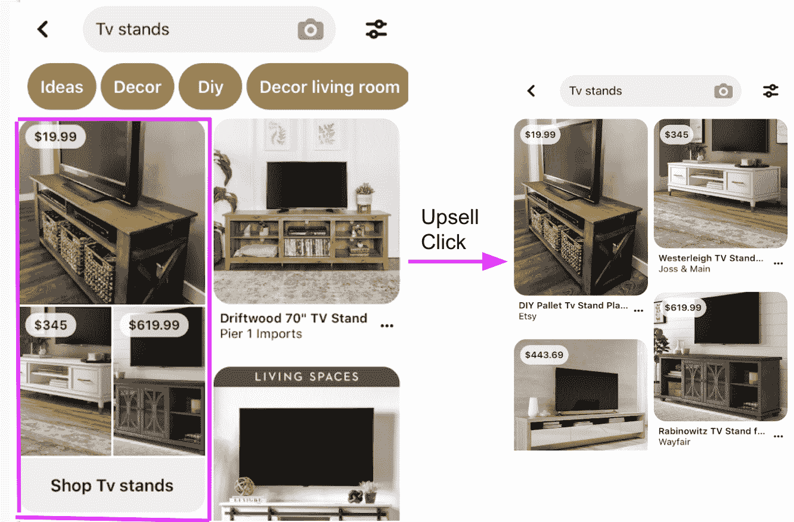
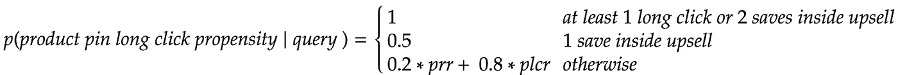
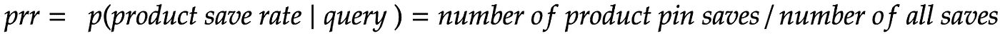
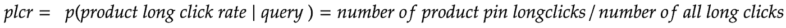
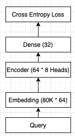
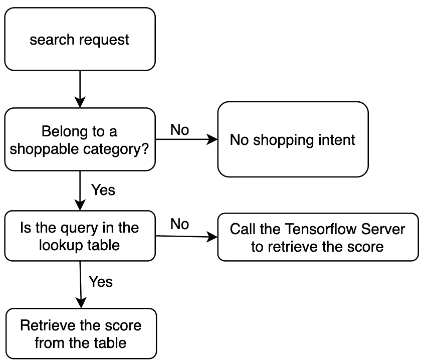

# 通过 Pinterest 搜索推动购物销量增长

> 原文：<https://medium.com/pinterest-engineering/driving-shopping-upsells-from-pinterest-search-d06329255402?source=collection_archive---------1----------------------->

Felix Zhou |购物，李蔚然|购物，Somnath Banerjee |购物

Pinterest 的使命是带给每个人创造自己热爱的生活的灵感。购物是 Pinterest 的核心使命，帮助 Pinners 找到并购买他们喜欢的产品。通常，当 Pinners 想要买东西时，他们不知道他们可以去一个产品专用的 feed，在那里每个 Pin 都是来自一个值得信赖的商家的产品。为了提高认知度，我们在主搜索结果中提供了一个指向该产品页面的明确门户，我们称之为“购物追加销售”(图 1，在粉色框中突出显示)。向“如何制作面具”这样的非购物查询展示促销是一种糟糕的体验；该购物促销仅在搜索查询显示高购物意向时出现，例如“白色连衣裙”。

Fig 1 Shopping upsell (left) and the corresponding search page after clicking

由于在个案基础上决定购物促销是否适合每个搜索查询可能相当简单，因此将其扩展到 Pinterest 上的数亿次每日搜索是一项不简单的任务。为了解决这种规模的搜索，我们训练了一个高精度的机器学习模型来确定查询购物意图，即，当 Pinners 搜索该查询时，他们是否愿意购物。我们还通过在线推理和离线推理相结合的方式优化了模型服务，降低了延迟和基础设施成本。

# 购物意向模型

查询购物意图是什么？不同的解释导致不同的模式。我们首先将其解释为追加销售点击率(V1 模型)。然后，我们建议将其解释为产品长点击倾向(V2 模型)，这缓解了 V1 模型的问题。

# V1 模型

V1 模型将查询购物意图描述为给定查询的促销点击率。促销点击率越高，查询就越有可能具有购物意图。一开始，我们没有任何培训数据，因为没有展示购物促销。为了收集培训数据，我们在一小部分生产流量中随机显示了查询的追加销售。

对于收集的训练数据，我们将特征定义为原始查询，将标签定义为追加销售点击率。为了训练模型，我们使用 100 维预训练嵌入来表征查询，并建立三层香草深度神经网络来训练二进制交叉熵模型。模型输出是预测的追加销售点击率。

基于点击率的追加销售模式有两个缺点:

1.  假阳性信号:我们观察到，很多时候，用户在购物搜索页面上点击追加销售时，并没有使用 pin。这表明，要么用户没有购物意图，他们不小心点击了促销，要么购物页面上的搜索质量不好。在这两种情况下，我们都不应该触发追加销售，因为它没有达到预期的项目成果。
2.  正向信号的有偏反馈回路:所有的正向信号都来自于过去模型预测的点击追加销售。一个新版本的模型试图适应过去的信号。

为了解决这两个问题，我们转向了改进的 V2 模型。

# V2 模型

Pinterest 在购物促销和有机搜索页面上都显示了产品标签，但我们没有在有机搜索页面上显示产品标签的价格。根据用户对产品 Pin 的参与度，强烈的信号表明用户是否对购物感兴趣:用户可能会将 Pin 保存到一个板上，或点击 Pin 访问相关网站，并在场外停留一段时间(在 Pinterest 中称为“长时间点击”)。在 V2 模型中，我们将查询购物意图描述为对某个查询产品的长时间点击倾向。

对于搜索查询，我们将长点击倾向定义为

在哪里

和

我们使用保存信号来计算长点击倾向，因为(1)保存就像在购物网站上添加到购物车，用户可以保存 pin 以供将来购买,( 2)它可以生成更多的训练样本，并进一步打破反馈循环。我们训练了图 2 中定义的模型。

Fig. 2 V2 Model Architecture

# 模型服务

为了降低服务深度学习模型的基础设施成本，我们不对以下查询调用该模型:

1.  标题查询占我们每年搜索流量的三分之一:标题查询的错误预测比非标题查询的影响更大。虽然我们不能确保 100%的预测准确性，但我们预计算了头部查询的购物意向分数，并将分数保留在键值存储中，其中查找延迟为毫秒级。
2.  属于不可购物类别的查询，例如“recipe”或“finance”:我们利用现有的产品类别模型查询来过滤这些查询。

过滤后，我们减少了 70%的流量到深度学习模型。图 3 显示了整个工作流程。

Fig.3 workflow to retrieve the shopping intent score

# 影响

在启动实验后，该模型将购物搜索页面的流量增加了 2 倍以上，而在长时间点击或保存方面没有损害整体搜索指标。通过追加销售，该模式还增加了超过 2 倍的产品展示和产品长时间点击。

为高购物意向查询显示购物促销只是让用户熟悉 Pinterest 购物的策略之一。未来，我们将融入更多信号来改善模型性能，帮助更多用户享受在 Pinterest 上购物的乐趣。

鸣谢:作者要感谢以下人员的贡献——谢觐虞、Karthik Anantha Padmanabhan 和 Tien Nguyen。