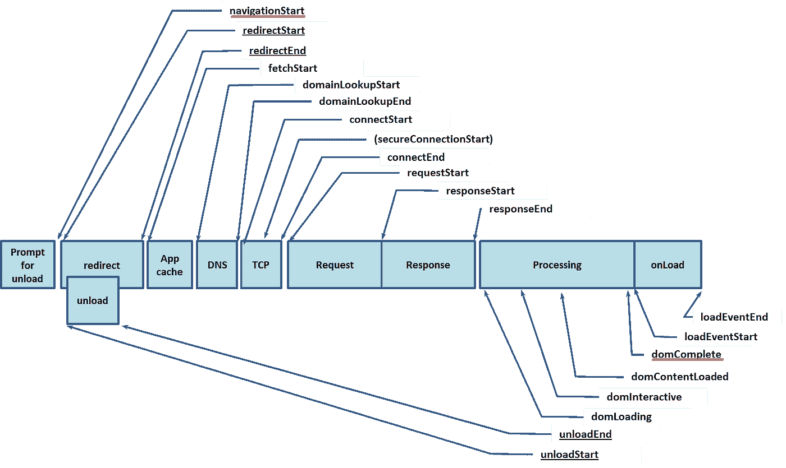
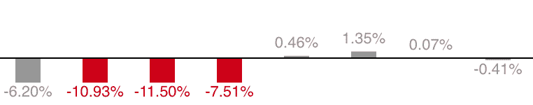

# 通过性能改进推动用户增长

> 原文：<https://medium.com/pinterest-engineering/driving-user-growth-with-performance-improvements-cfc50dafadd7?source=collection_archive---------0----------------------->

萨姆·梅德、瓦迪姆·安东诺夫和张信哲| Pinterest 工程师，成长

2015 年初，Pinterest 的工程师进行了一项实验，将移动网站主页的登录页面性能提高了 60%，移动注册转化率提高了 40%。然而，这个实验是一个不成熟的解决方案，它使用了很多快捷方式，比如提供预先呈现的 HTML 页面，而没有使用任何内部模板呈现引擎或公共资源(JS、CSS)。为了从这个实验中学习生产，整个前端引擎，所有的页面模板和公共元素都必须重写。这是一项巨大的工作，为了实现它，我们需要从构建健壮的度量标准开始，来跟踪我们在服务系统的所有部分的进展。在本帖中，我们将介绍我们如何提高 Pinterest 页面的性能，以及它如何导致 2016 年用户获取量的最大增长。

# 尺寸

作为第一步，我们需要清楚地定义和实现我们想要改进的指标。2015 年实验使用的原始指标是总页面加载时间(PLT)，它被定义为从用户键入 URL 或点击 URL 到整个页面被呈现的时间。就[浏览器导航计时 API 而言，【navigationStart 和 domComplete 事件有所不同:](https://www.w3.org/TR/navigation-timing/)

*   navigationStart 事件由用户在浏览器导航栏中键入 URL 后单击链接或按 enter 键来启动。
*   当页面上的所有处理完成并且所有资源(例如，图像、CSS、JS)下载完成时，将触发 domComplete 事件。用户将停止看到浏览器选项卡微调器旋转，并且页面上的附加逻辑(例如，onLoad javascript)将在之后执行。

Copyright © 17 December 2012 [World Wide Web Consortium](https://www.w3.org/TR/navigation-timing/), (MIT, ERCIM, Keio, Beihang)

这个指标是一个好的开始，但是有一个主要的缺点:它不能反映性能。这对用户来说很重要，因为页面的可见部分的加载速度要比整个页面快得多。

## **用户感知等待时间**

为了解决这个问题，我们引入了另一个指标——用户感知等待时间(UPWT)——它被定义为从用户键入 URL 或点击 URL 到用户可见的页面部分被呈现的时间。这是基于图像加载事件的自定义指标。我们跟踪哪些图像在屏幕上，以及它们何时完成加载。UPWT 将从 navigationStart 事件开始，在 domLoading 和 domComplete 事件之间的某个位置结束:

*   当浏览器接收到整个文档并开始呈现它时，触发 domLoading 事件。

Copyright © 17 December 2012 [World Wide Web Consortium](https://www.w3.org/TR/navigation-timing/), (MIT, ERCIM, Keio, Beihang)

另一个好处是，可以将类似的指标引入到移动应用程序中，并以相同的方式进行测量。

我们已经将这两个指标(总体 PLT 和 UPWT)以及一些额外的性能指标(例如服务器端性能和更详细的浏览器端性能)集成到关键的公司仪表板和我们的实验框架中。这使我们能够跟踪进展，并快速了解哪些改进会带来更大的收益。

学习:建立正确的衡量标准来跟踪你的进步，并首先关注有重大影响的变化。

# 最佳化

优化机会可以分为三大类:前端、网络和后端。

# 前端

## **页面权重(CSS/JS/Images/HTML)**

通过查看综合测试结果，我们很快意识到我们的页面需要大量的带宽来加载。这在一些网络基础设施较旧的国际市场中尤其成问题。为了解决这个问题，我们开始对我们加载的*和*内容进行更加细化。在过去，我们经常获取整个网站的 CSS 和 JS。现在，我们只获取渲染文件夹上方内容所需的 CSS 和 JS，然后在初始渲染完成后延迟加载其他资源。我们还查看了哪些图像被请求，着眼于它们是否真的需要，以及我们是否获取了最佳大小。这两项优化共同使显示页面所需的字节数减少了 60%。

## 渲染(反应)

我们对性能的关注与从一个自主开发的框架[到](/@Pinterest_Engineering/how-we-switched-our-template-rendering-engine-to-react-a799a3d540b0#.fvsp43ajw) [React](/@Pinterest_Engineering/migrating-pinterest-profiles-to-react-479f4f7306aa#.r4ylsm3uc) 的站点范围迁移相一致。我们的团队是 Pinterest 中 React 的早期采用者之一，我们从其渲染模型中实现了显著的性能提升。有了 React 框架，我们看到了巨大的收益，因为我们从一个不受控制的、任何东西都可以修改的 DOM 模型，转变为 React 的影子 DOM，批量更新模型。

## 早期刷新/分块传输编码

我们通过检查页面如何在服务器端呈现来优化客户端和服务器之间的路径。这消除了不必要的缓冲，确保浏览器尽早接收页面的部分，并可以在获取数据和服务器端呈现的同时开始获取框架级的 JS 和 CSS 资源。我们已经在利用分块传输编码在页面完成呈现时发送页面片段，但是对呈现页面的服务和最终用户之间的基础设施的审查发现，我们在几个步骤中缓冲响应，而不是传输响应。消除缓冲加快了浏览器获取字节的速度，并改善了页面加载时间。

# 运输

**CDN/DSA** 我们在交通基础设施方面取得了重大进展。我们在 CDN 设置中引入了多层缓存，支持 IPv6，切换到更高的服务层(CDN ),并在全球范围内引入了 SSL 边缘终端(DSA)。

# 后端

## 尽可能并行化

呈现一个页面通常需要来自不同来源的多条不同的数据。对我们来说，这目前转化为多个 API 调用。这些调用之间有一个自然的数据依赖关系图，它规定了哪些调用可以并行进行，哪些调用由于这些数据依赖关系而需要按顺序进行。我们正在努力采用 GraphQL，它将自动优化数据获取的并行化。与此同时，我们正在审查我们当前的调用图，以确保我们将不必要的顺序调用并行化。

## 只归还需要的东西

我们将我们请求的数据裁剪成 UI 所需要的。这既节省了网络开销，又消除了服务器端不必要的获取，因为额外的字段通常需要额外调用后端服务。

## 尽可能缓存

我们花了一些时间来扩展低基数页面类型的数据“边缘”缓存(即页面数量在几十万而不是几十亿的数量级)。缓存是我们将要进一步探索的一个领域，从在给定类型的页面太多而无法有效缓存的情况下只缓存“头”页面数据，到在后台触发缓存刷新。

# 通过性能改进实现增长收益最大化

当为了性能而重写网页时，重要的是不要尝试新的设计。如果将一个更快、不同的设计页面与原始页面进行比较，就不可能知道转换变化是由于性能改进还是设计改进。构建完全相同的页面。此外，为了全面了解性能对 web 应用程序的影响，实验应该能够根据页面类型以及 web 与移动 web 来划分指标。不同的页面从性能提升中获得不同的转换和流量收益。对我们来说，汇总所有页面显示，整体转化率略有上升，但观察细分市场显示，桌面网络转化率上升了很多，而移动网络转化率实际上下降了，降低了平均转化率。我们调查了移动网站转化率下降的原因，发现了一些功能对等方面的问题。

为了最大限度地提高页面的整体性能，即使是很小的转换功能也要重新实现，这一点非常重要。我们的原始页面有很多这样的功能，随着我们不断发现差异并修复它们，我们的转化率不断上升。这里的重要学习是根据页面类型和 web/移动 web 对页面进行细分，以更好地了解收益来自哪里，并检测任何特定细分的问题。这些问题可能会被掩盖，当看整体合计转换率的变化。

## **转换功能清单**

*   相同的追加销售机制
*   导航力学(弹出？新标签页？)
*   注册和表单机制(字段验证消息，相同的字段和步骤)
*   自动认证功能
*   移动网络和平板电脑应用程序应用程序追加销售
*   移动网页深度链接

关于性能重写的另一件重要事情是对每种页面类型进行 SEO 实验。关于 SEO 实验基础的更多信息，请查看我们之前的帖子，[用实验揭开 SEO 的神秘面纱](/@Pinterest_Engineering/demystifying-seo-with-experiments-a183b325cf4c#.90jqj3q8x)。SEO 实验表明，页面加载时间的改善是否真的会带来更多的搜索引擎流量，在我们的例子中，结果确实如此。如果你的页面是一个高流量的页面，那么很有可能你已经实现了一系列提高搜索引擎排名的功能。一个搜索引擎优化实验也将显示一些功能是否没有正确地重新实现。即使是像图像大小或使用的 HTML 标签这样的小细节也很重要，因此对所有页面类型进行监控非常重要。对我们来说，花了几个星期的时间来识别和修复差异，让我们的搜索引擎优化流量持平。

## **SEO 功能清单**

*   主要标签(如

    # ，hreflang，rel=canonical)

*   相同的图像尺寸
*   描述性文本
*   第一页加载的内容量

## **主要学习内容**

*   构建一个几乎相同的页面，不要重新设计页面
*   将实验划分为不同的页面类型，并划分 web 和移动 web
*   运行一个搜索引擎优化实验
*   查看每个细分市场，看看是否有任何功能缺失，可能会降低转化率或 SEO

*Fixing a small conversion feature brought one conversion metric to par*

# 结果和未来

为提高性能而重建页面的结果是 Pinner 等待时间减少了 40 %, SEO 流量增加了 15 %,注册转化率增加了 15%。因为流量和转换率的增长是成倍的，这是我们在网络和应用注册方面的巨大胜利。2016 年，这是我们团队最大的用户获取胜利。此外，网速慢的 Pinners 获得了明显更好的体验。由于这个项目，该团队现在将性能作为新用户增长的最大机会之一。

## 参考

其他 Pinterest 成长工程博客帖子:

[我们如何将 Pin 登录页面的注册人数翻倍](https://engineering.pinterest.com/blog/lessons-growth-engineering-how-we-doubled-sign-ups-pin-landing-pages)

[我们如何用一个简单的技巧增加活跃 Pinners】](https://engineering.pinterest.com/blog/how-we-increased-active-pinners-one-simple-trick)

[如何通过增长工程获取移动用户](https://engineering.pinterest.com/blog/how-acquire-mobile-users-through-growth-engineering)

[抵制集团如何推动可持续增长](https://engineering.pinterest.com/blog/how-holdout-groups-drive-sustainable-growth)

[用实验揭开 SEO 的神秘面纱](https://engineering.pinterest.com/blog/demystifying-seo-experiments)