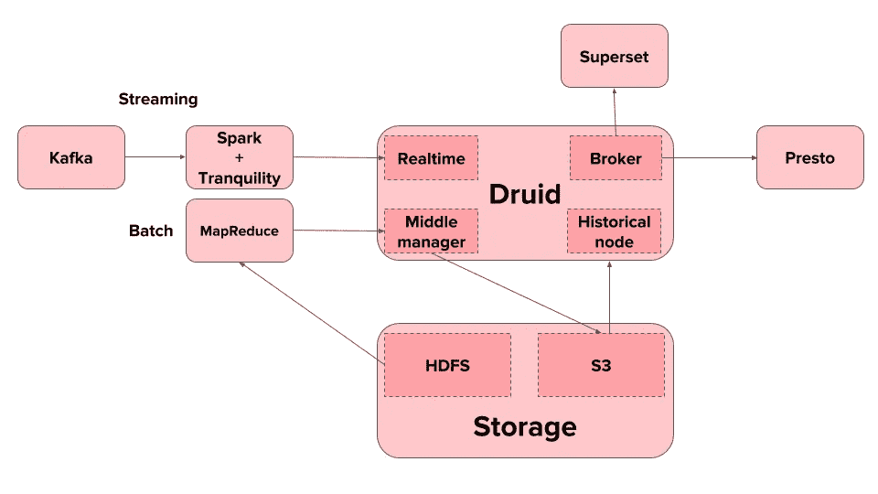
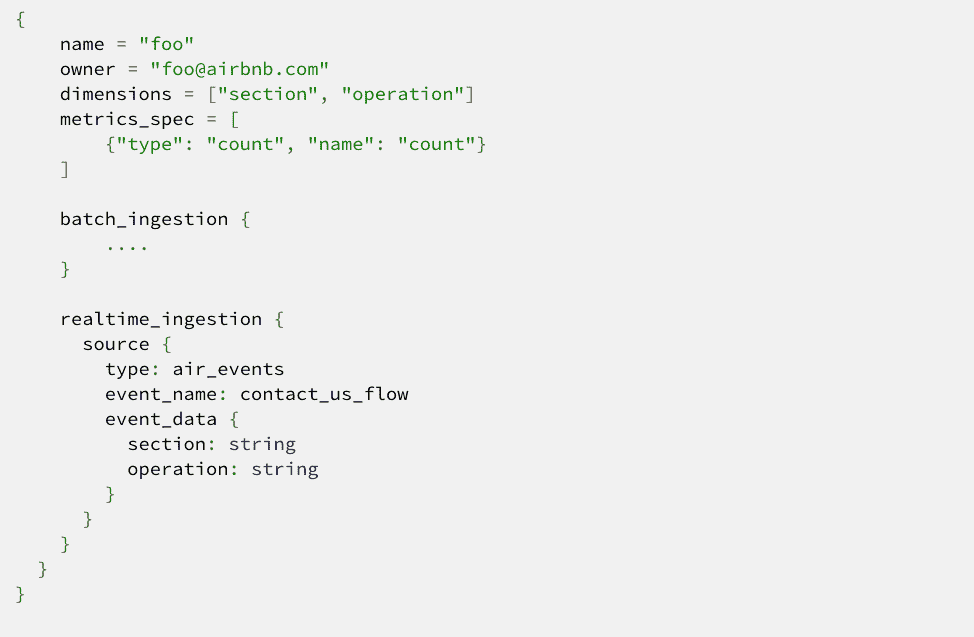

# 德鲁伊如何在 Airbnb 实现分析

> 原文：<https://medium.com/airbnb-engineering/druid-airbnb-data-platform-601c312f2a4c?source=collection_archive---------0----------------------->

## Airbnb 的实时和批量分析以及德鲁伊在我们的分析系统架构中扮演的角色

由*和 [*李金阳*](/@jinyangli34) 组成*

**

*Wikipedia: A druid was a member of the high-ranking professional class in ancient Celtic cultures. It is believed that druids perform secret rituals in forests, not unlike [this unique Experience on Airbnb](https://www.airbnb.com/experiences/229973)!*

*Airbnb 为我们社区的数百万客人和主人提供服务。每一秒钟，他们在 Airbnb.com 上的活动，如搜索、预订和发消息，都会产生大量数据，我们会对这些数据进行匿名处理，并用来改善社区在我们平台上的体验。*

*Airbnb 的数据平台团队努力利用这些数据来改善我们客户的体验，优化 Airbnb 的业务。我们的使命是提供基础设施来收集、组织和处理这些海量数据(所有这些都以隐私安全的方式进行)，并使 Airbnb 的各个组织能够从中获得必要的分析并做出基于数据的决策。*

*在公司内部公开和共享高级分析的主要方式是通过各种仪表板。很多人每天都使用这些仪表盘来做各种决定。仪表板还允许实时跟踪和监控我们业务和系统的各个方面。因此，这些仪表盘的及时性对 Airbnb 的日常运营至关重要。然而，我们面临三个挑战:*

***首先，在查询时使用 Hive 和 Presto 等系统在仓库中聚集数据并为这些仪表板生成必要的数据将花费*很长时间*。** Hive/Presto 必须读取所有数据并按需聚合它们，导致所有必要的计算在查询时被调用。即使这些引擎用于预计算聚合并存储它们，存储格式也没有针对分析查询所需的数据的重复切片和切块进行优化。*

***其次，系统需要可靠且可扩展。**它为 Airbnb 的核心分析用例提供支持，因此任何宕机都会对业务及其员工产生严重影响。此外，数据、查询和用户的数量持续增长，我们的分析系统应该能够应对不断增长的需求。*

***第三，我们需要一个能够与我们基于开源框架的数据基础设施良好集成的系统。**例如，我们的大部分数据集都存储在 Hadoop 中，我们使用 Kafka 和 Spark Streaming 来处理我们的数据流。*

*这就是德鲁伊的用武之地。*

# *德鲁伊的优势*

**

## *快速查询时间*

*通过预定义的数据源和预先计算的聚合，Druid 提供了亚秒级的查询延迟。构建在 Druid 之上的仪表盘比构建在其他系统之上的仪表盘要快得多。相比 Hive 和 Presto，德鲁伊可以快一个数量级。*

## *提供可靠性和可扩展性的体系结构*

*Druid 架构被很好地分为不同的组件，用于接收、服务和整体协调。我们发现这种组件化的架构对于我们的工作负载来说是可靠和稳定的，它允许我们根据需要轻松地扩展系统。*

*Druid 的架构将数据存储分为长期数据存储的深层存储，同时将数据临时缓存在历史节点中，这种架构对我们很有效。将分析数据永久保存在 S3 为我们提供了免费的灾难恢复，并允许我们轻松管理集群硬件的升级和维护(例如，轻松切换节点类型以利用最新的硬件)。*

## *与开源框架的集成*

*Druid 还可以与主要基于 Hadoop 和 Kafka 的开源数据基础设施顺利集成:*

1.  ***Druid 的 API 让我们可以轻松地从 Hadoop 中获取数据进行批量分析***
2.  ***德鲁伊通过流处理引擎实现实时分析。** Druid 提供了一个流媒体客户端 API，宁静，它与 Samza 或 Storm 等流媒体引擎集成，并且可以与任何其他基于 JVM 的流媒体引擎集成。在 Airbnb，通过采用宁静客户端的 Spark 流作业，将数据流式摄取到 Druid 以进行实时分析。*
3.  ***德鲁伊与** [**阿帕奇超集**](https://superset.incubator.apache.org/) 很好的集成，这是一个由 Airbnb 开发并开源的开源数据可视化系统。超集充当用户在 Druid 上编写和执行分析查询并可视化结果的界面。*

# *Airbnb 如何使用德鲁伊:双集群配置*

*在 Airbnb，两个德鲁伊集群正在生产中运行。两个独立的集群允许对不同用途的专用支持，即使单个 Druid 集群可以处理比我们需要的更多的数据源。我们总共有 4 个经纪人，2 个领主，2 个协调员，8 个中层经理，和 40 个历史节点。此外，我们的集群由一个 MySQL 服务器和一个具有 5 个节点的 ZooKeeper 集群支持。与 HDFS 和普雷斯托等其他服务集群相比，德鲁伊集群相对较小且成本较低。*

*在两个 Druid 集群中，一个专用于**集中式关键度量服务**。为了服务于 Airbnb 的所有仪表板，用户可以通过简单的 YAML 文件轻松定义他们的指标。用户可以在超集上查看他们的仪表板和指标，而无需了解任何关于 Druid 的信息。*

*所有的批处理作业都使用[气流](https://airflow.apache.org/)进行调度，从我们的 Hadoop 集群获取数据。*

***自助服务用户的所有实时和其他数据源**由另一个 Druid 集群处理。通过 Spark Streaming +宁静客户端设置摄取实时数据。*

# *提高德鲁伊在 Airbnb 的使用率*

*虽然 Druid 提供了许多强大的、广泛适用的特性，满足了大多数企业的需求，但我们确实在 Druid 内部或之上实现了一些特性，以更好地服务于我们的特殊用例。*

## ***一个即时回答即席分析查询的框架***

*Airbnb 在不同的业务团队中嵌入了大量的数据科学家。他们中的每一个人都可能有关于业务的特殊问题，需要从数据中获得洞察力，这通常需要任意的方法来聚合数据。*

*为了满足这一需求，我们在 Druid 上构建了一个自助服务系统，允许各个团队轻松定义他们的应用程序或服务产生的数据应该如何聚合并作为 Druid 数据源公开。然后，数据科学家和分析师可以查询 Druid 来回答特定的问题。*

*用户通过如下简单的配置定义他们的数据源。来自 Kafka 的实时数据和来自 HDFS/S3 的批量数据将根据配置文件被摄取。*

**

*Druid 在 5 分钟的窗口内聚合其实时数据，加上来自管道的 1 分钟延迟。*

*来自 Druid 的实时流使我们能够为用户实现许多复杂的功能。实时摄取的一个有趣用例是异常检测。通过在 Druid 中快速接收和聚合实时数据，我们可以很快检测出生产中任何不符合预期模式的情况。*

## *与 Presto 集成*

*除了最近版本的 SQL 查询支持之外，Druid 还有一个成熟的基于 JSON over HTTP RESTful API 的查询机制。然而，Druid 的一个限制是它还不允许跨数据源查询(简单地说，一个连接查询)。所有的聚集查询都被限制在单个数据源中。然而，在 Airbnb 中，我们确实有这样的场景，对于某些查询，需要将维度重叠的多个数据源结合在一起。另一种方法是将所有数据保存在一个单一的数据源中，这在我们的场景中并不是最优的，原因有很多，包括数据生成的节奏、数据源的不同(例如，不同的服务生成数据)等等。然而，跨数据源查询的需求是真实的，并且最近已经成为一种硬性需求。*

*为了迎合这些情况，我们开发了一个基于 Presto 的内部解决方案。具体来说，我们为 Druid 引入了一个 Presto 连接器，它可以通过单个数据源将查询下推到 Druid，并且可以检索和连接数据以完成跨数据源查询的执行。实现的细节仍在发展中，超出了本文的范围。我们将在以后的单独文章中提供更多的细节。*

## *提高回填性能*

*为什么 Druid 查询比其他系统快得多的秘密在于摄取是有代价的。每个数据段都需要先从 MapReduce 作业中获取，然后才能用于查询。这在*写一次读多次*的模型中非常有效，框架只需要每天接收新数据。*

*然而，当数据源的所有者想要重新设计它并重新生成历史数据时，问题就出现了。这意味着过去几年的数据需要重新输入德鲁伊来替换旧的。这需要一个非常大的摄取作业，需要长时间运行 MapReduce 任务，因此成本很高，尤其是在重新摄取过程中出现错误时。*

*一个潜在的解决方案是将大量的接收分成几个请求，以获得更好的可靠性。但是，查询结果将是不一致的，因为它是根据现有的旧数据和新获取的数据混合计算的。随着用户需求和摄取框架功能的发展，回填作业实际上比我们预期的更频繁，这使得它的性能成为一个需要改进的痛点。*

*为了解决这个问题，我们设计了**一个解决方案，基本上保持所有新摄取的片段不活动，直到显式激活**。这使得摄取框架能够将数据源分割成具有可接受大小的较小间隔。然后，框架并行接收这些间隔(在纱线簇资源允许的情况下尽可能并行)。由于新接收的数据仍处于非活动状态，因此数据段隐藏在后台，并且在回填接收仍在进行的情况下，在计算正在执行的查询的结果时，不会混合不同版本的数据。当我们为数据源激活最新版本的段时，它将在不停机的情况下用新版本刷新。拆分和刷新大大提高了回填性能，使得过去运行*超过一天*的回填现在在*一小时*内完成。*

# *监控和操作*

*我们持续监控德鲁伊的可靠服务和最佳表现。德鲁伊是健壮的，对节点故障有弹性。大多数节点故障是透明的，用户不会注意到。即使是单点故障的角色(如协调者、霸主甚至动物园管理员)发生故障，Druid cluster 仍然能够为用户提供查询服务。然而，为了履行我们对用户的 SLA，任何服务中断都应该及时发现，甚至在故障发生之前就发现。*

*像其他集群一样，我们通过收集机器统计信息来监控 Druid 集群中的每台机器，如果任何实例达到其容量或进入不良状态，就会发出警报。为了监控整个集群的可用性，我们每 30 分钟将一个 canary 数据接收到 Druid 中，并每 5 分钟检查来自每个代理节点的查询结果是否与最新接收的数据相匹配。任何服务降级，包括查询、摄取或下游 HDFS 不稳定性，都可以在 SLA 内检测到。*

*德鲁伊已经在 Airbnb 运行多年，是维护成本最低的系统之一。德鲁伊的多角色设计使得操作简单可靠。集群管理员可以根据监控指标调整集群配置和添加/删除节点。随着 Druid 集群中数据的增长，我们可以继续增加历史节点容量来缓存和服务更大量的数据。如果实时摄取工作负载显示上升，我们可以相应地轻松添加中间管理器节点。类似地，如果需要更多的容量来处理查询，我们可以增加代理节点数。多亏了 Druid 的分离架构，我们能够执行大型操作，通过新重建的集群将深层存储中的所有数据从 HDFS 迁移到 S3，并且只需要几分钟的停机时间。*

# *挑战和未来的改进*

*虽然 Druid 在我们的数据平台架构中为我们提供了很好的服务，但随着我们在公司内部使用 Druid 的增长，也出现了新的挑战。*

*我们要处理的一个问题是每天产生的需要加载到集群中的段文件数量的增长。段文件是 Druid 数据的基本存储单元，它包含准备好提供服务的预聚合数据。在 Airbnb，我们遇到了一些情况，大量的数据源有时需要完全重新计算，导致大量的段文件需要一次加载到集群上。目前，协调器在单个线程中集中顺序加载摄取的数据段。随着产生越来越多的数据段，协调器已经跟不上了，我们看到从接收作业完成到数据可供查询(在协调器加载之后)之间的延迟越来越长。有时延误可能长达数小时。*

*通常的解决方案是尝试增加目标数据段的大小，从而减少数据段数量。然而，在我们的使用中，产生更大数据段的数据输入量(由运行摄取任务的 Hadoop 工作人员执行)是如此之高，以致 Hadoop 作业会运行太长时间来处理这些数据，并且很多时候会由于各种原因而失败。*

*我们目前正在探索各种解决方案，包括在接收后和移交给协调员之前压缩数据段，以及在可能的情况下增加数据段大小而不损害接收作业稳定性的不同配置。*

# *结论*

*Druid 是一个大数据分析引擎，专为可伸缩性、可维护性和性能而设计。其良好的架构允许轻松管理和扩展 Druid 部署，其优化的存储格式支持低延迟分析查询。我们已经成功地在 Airbnb 为我们的用例部署了 Druid，并看到随着我们的用户群和用例的增长，它的足迹将继续增长。*

***Airbnb 的数据平台团队**一直在寻找具备相关技能的优秀工程师！如果您对构建这样的数据基础设施充满热情，并有兴趣加入该团队，请查看[我们的空缺职位](https://www.airbnb.com/careers/departments/engineering)并发送您的申请！*