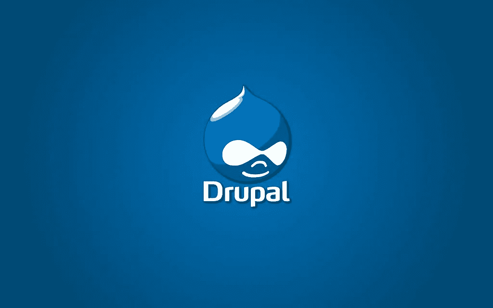
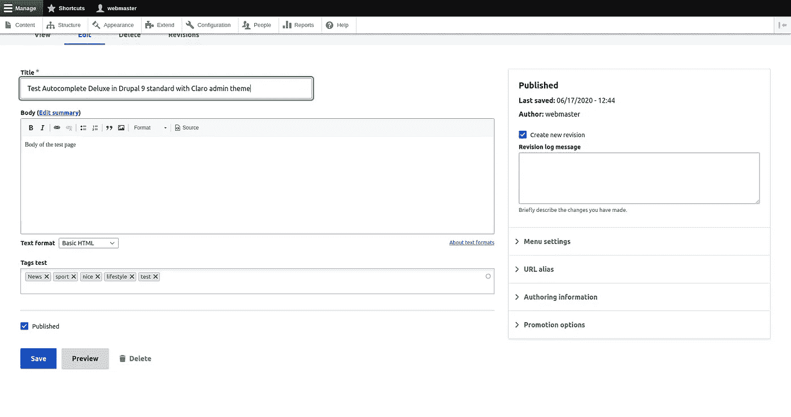
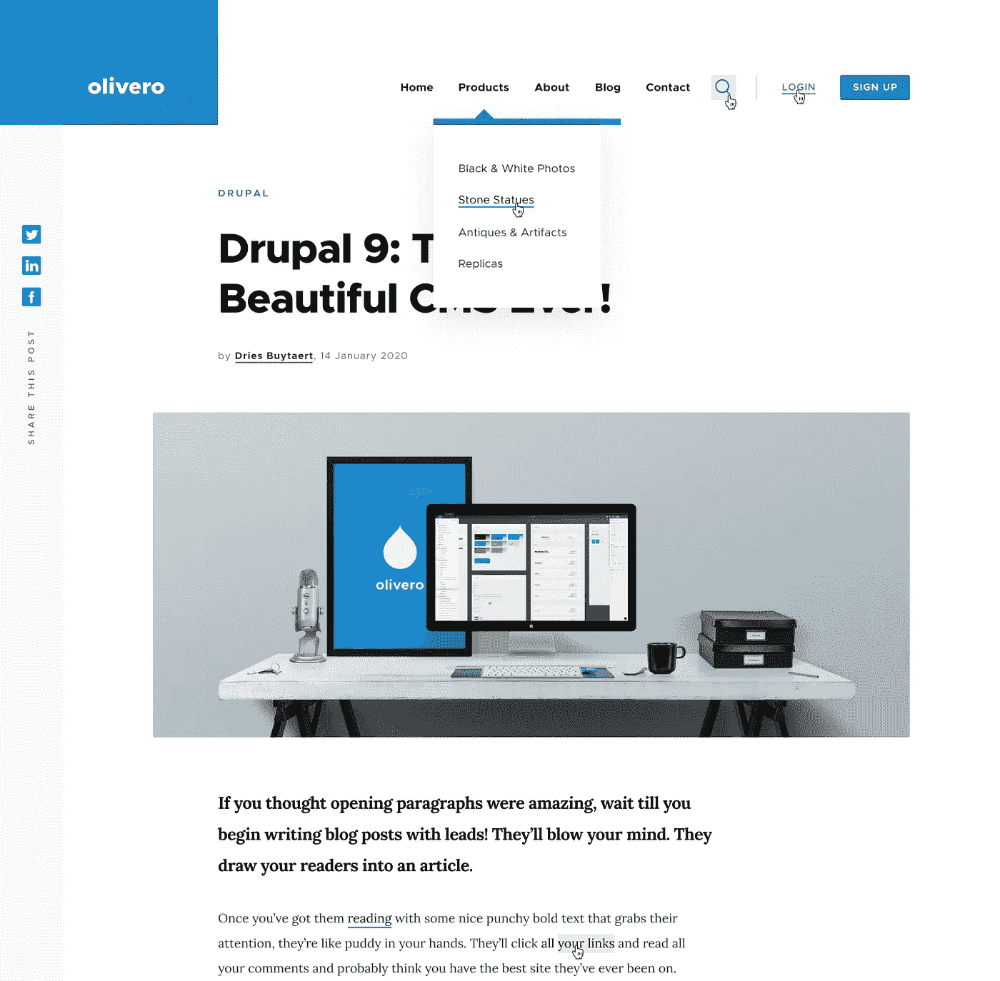

# Drupal 10 计划于 2022 年 12 月发布

> 原文：<https://medium.com/globant/drupal-10-is-planned-for-december-2022-eb7a26afc7d8?source=collection_archive---------3----------------------->

Drupal Logo from [Drupal.org](https://www.drupal.org/)

从 Drupal 8 到 Drupal 9 的迁移是过去十年中 Drupal 的主要更新。下一个版本计划采取类似的步骤。计划于 2022 年 12 月发布的 Drupal 10 将是 Drupal 9 的改进版。用于准备的工具和流程与之前的更新相同。Drupal 10 有什么新功能？

以下是 Drupal 10 将包含的主要特性列表:

*   新的克拉罗管理主题(取代七)。
*   新的 Olivero 默认主题(替换 Bartik)。
*   引入了具有更好的创作和更现代的编辑体验的 CKEditor 5(取代 CKEditor 4)。
*   用于创建自定义主题的工具。
*   在引擎盖下需要 Symfony 6(取代 Symfony 4)，PHP 8.1 将是强制性的，以保持系统安全。

New Claro admin theme

New Olivero theme

# 我该如何准备 Drupal 10？

根据您当前使用的 Drupal 版本，迁移到 Drupal 10 或多或少会比较容易。在这两种情况下，都不会没有痛苦。我能给出的最好的建议是，你要尽量跟上核心更新，并尽量使用主动维护的贡献模块。

**从 Drupal 9 迁移:**如果您使用的是 Drupal 9，此时最好帮助自动化迁移到 Drupal 10 的过程。贡献给 drupal-rector 帮助。您已经可以使用 Drupal 9 站点上的更新状态来获得所需工作的估计，但是在 Drupal 9.4.0 之前，仍然会添加新的不推荐使用的 API。

**从 Drupal 8 迁移:** Drupal 8 在 2021 年 11 月达到了它的寿命终点。必须先升级到 Drupal 9，以后才能升级到 Drupal 10。使用更新状态来分析您的站点。有将近 6000 个贡献的项目为 Drupal 9 做好准备。与贡献的项目维护人员一起更新任何尚未准备好的必需项目。大多数代码更新可以使用 drupal-rector 自动完成。此外，将它用于您的自定义代码。

**从 Drupal 7 迁移:** Drupal 7 将于 2023 年 11 月结束(尽管我们很多人希望它现在就结束)。是的，这是在 Drupal 10 计划发布之后。虽然 Drupal 10 将包含来自 Drupal 7 的迁移工具，但是您所使用的贡献项目更有可能已经适用于 Drupal 9，并且可能不会很快准备好。Drupal 10 版本。所以，你不要等着直接迁移到 Drupal 10，要尽快开始升级到 Drupal 9。切换到 Drupal 10 会比 Drupal 9 容易很多。