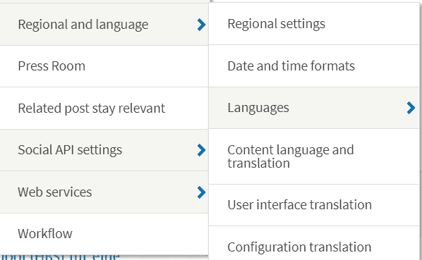
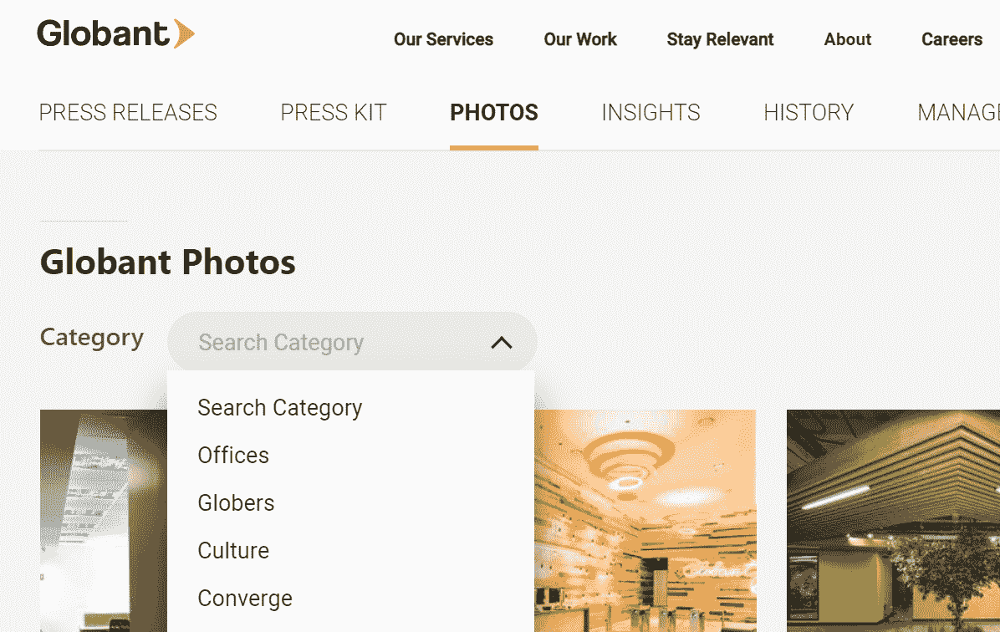

# Drupal 8:授权内容发布

> 原文：<https://medium.com/globant/drupal-8-empowering-content-publishing-533807fae68?source=collection_archive---------2----------------------->

作者:Shraddha Dubey，Globant 数字营销专家

# 介绍

当我们听到**内容发布**或**内容管理系统** (CMS)时，我们脑海中首先蹦出的名字之一就是 Drupal。自从 Drupal 问世以来，人们一直在谈论它的可定制特性和易用性。无论您是否来自技术背景，一旦您了解了 Drupal 的基础知识，使用 Drupal 就是小菜一碟。在本文中，我们将重点关注 Drupal 8 的一些突出的内容发布特性。

您可能会想，当有了 WordPress 和 AEM 这样的内容发布工具时，是什么让 Drupal 成为这样一个开箱即用的内容发布工具呢？是什么让它从我们可用的其他工具中脱颖而出？

这里有一些创新的特性，可以帮助你理解是什么让 Drupal 8 脱颖而出。让我们开始吧。

**最简单的内容编写和管理**:发布之前通常会编辑手头的内容。除了臭名昭著的所见即所得(WYSIWYG)的 CKEditor 捆绑到其核心，并通过 Drupal 的 [spark distribution](https://dri.es/spark-update-in-line-editing-in-drupal) 改进了内联编辑，Drupal 8 还允许微调内容访问和权限。这使得 Drupal 8 在安全性和内容创建方面优于其早期版本。

**API 网络服务**:能够同时高效地将你的内容推送到所有类型的平台，需要强大的 web 服务 API。Drupal 8 有一组包含各种模块的增强的 RESTful 和宽松的 web 服务。JSON API 和 GraphQL(脸书为 API 开发的开源数据查询和操作语言)支持这些，创建了 Drupal 节点与 JavaScript 或 TypeScript 框架之间强大而稳定的通信。

除了通过 web 服务将 Drupal 连接到 API，Drupal 8 还增加了对第三方集成的支持。您可以轻松地从 Google Analytics 切换到 Google Tag Manager 和其他分析平台、ERP 系统、营销系统或您希望您的发布网站或内容与之集成的任何其他垂直行业。

**媒体管理**:内容管理不仅仅是在文本方面，Drupal 还擅长处理媒体，比如图像、视频和其他重要文件。此外，您还可以创建一些其他资产，如推文或社交帖子。有一些自定义库可以限制为特定的媒体文件。Drupal 8 中的 Media Module 是上传域的替代物，具有统一的用户界面，编辑和管理员可以无缝地上传、管理和重用各种文件和多媒体资产。了解更多关于媒体和资产管理模块[在这里](https://www.drupal.org/node/206708)。

**多语言设施** : Drupal 8 无缝地允许你处理网站上的多语言内容。管理界面可以有内置的翻译。您也可以根据您正在寻找的语言过滤区块。

此外，如下面的截图所示，内容语言和翻译、用户界面翻译、配置翻译、语言等模块是将 Drupal 从早期版本升级到 8 的额外补贴。下面我们来了解一下每个模块的用法:

*   **区域设置**:您可以使用这些设置来配置当地时区。
*   **日期和时间格式**:这将帮助您设置日期和时间的显示方式。
*   **语言**:为内容、界面和配置配置不同的语言。
*   **内容语言和翻译**:这有助于定制内容的语言和翻译支持。
*   **用户界面翻译**:最有用的功能之一，可以配置翻译文件的导入，添加和自定义界面翻译。
*   **配置翻译**:使用此功能，您可以翻译配置。

**分类法**:分类法是发布网站的救星。分类管理器组织、分类和关联您站点的内容。它用于将相似的内容归类到一个集合中。您可以根据需要添加任意多的分类法，还可以轻松地批量添加、编辑和删除术语和分类。让我们看一个例子来清楚地理解这一点。

假设您的公司在全球有 100 个办事处，而有人只想查看某个特定国家的信息，那么分类法就派上了用场。通过使用 Taxonomy Manager，您可以添加不同国家的下拉菜单，用户可以根据需要从这些下拉菜单中过滤内容(基于他想要的地址所在的国家)。

让我们看一个来自[globant.com](https://www.globant.com/news-room)网站的真实例子。在这里，我们将 Globant 照片按照办公室、地球仪、文化和聚合等不同类别进行了分类，用户可以根据自己的偏好轻松过滤结果。这在分类法管理器的帮助下成为可能。

# Thunder:用于专业出版的 Drupal 8 发行版

Drupal 8 于 2015 年 11 月首次发布后，DrupalCon 于次年推出，由 Thunder 赞助，易于安装、部署和使用，特别是以出版商为中心设计的模块作为开源软件发布，使用 GNU 通用公共许可证。迅雷背后的想法是 ***让出版商基于品牌和内容竞争，而不是技术*** 。
在这里阅读更多关于雷霆社区[的内容。](https://www.drupal.org/blog/thunder-the-drupal-8-distribution-for-professional-publishing)

如果你是 Drupal 和内容发布的新手，你可能会在最初几天发现它有点疏远，但是它的大量特性和更新带来的无限可能会让你着迷。这里说的功能只是冰山一角。了解 Drupal 8 实践将向您展示内容发布是多么简单和容易理解。

用 Drupal 8 快乐发布内容！😊