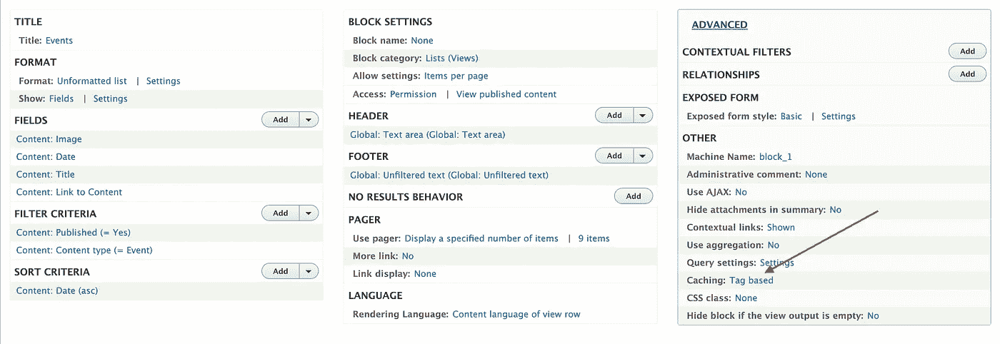
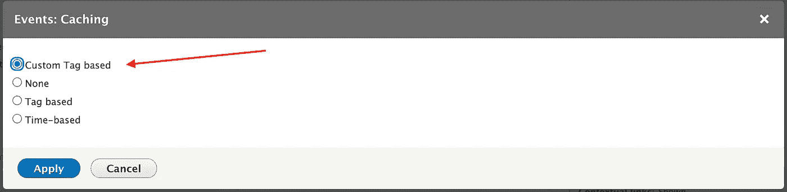
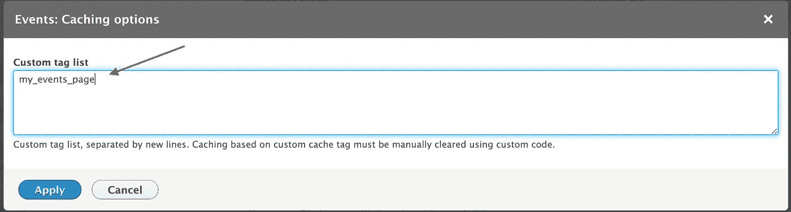

# Drupal 8:无效视图缓存(自定义缓存标签)

> 原文：<https://medium.com/globant/drupal-8-invalidate-views-cache-custom-cache-tags-38ccdaee90d7?source=collection_archive---------0----------------------->

# 问题

我们的网站有一个活动列表页面，显示即将举行的活动。该页面是使用 Drupal 视图创建的。

该视图有一个筛选器，显示开始日期大于或等于当前日期的所有事件。

在某些情况下，过去的事件会出现在当前事件列表页面上。

发生这种情况是因为输出由于一些模块如动态页面缓存、内部页面缓存等而被缓存。

# 解决办法

我们在 [*视图自定义缓存标签*](https://www.drupal.org/project/views_custom_cache_tag) 模块的帮助下，通过在服务器上设置一个 cron 作业，解决了这个问题。

# 步伐

**安装模块**

下载并安装[https://www.drupal.org/project/views_custom_cache_tag](https://www.drupal.org/project/views_custom_cache_tag)模块。

**配置视图**

*   编辑有问题的视图
*   转到视图的“高级”部分，它位于最右侧
*   从缓存部分选择“基于自定义标记”选项



*   在下一步(缓存选项)中，添加将在 cron 运行时失效的缓存标记



*   保存视图

**写钩 cron**

编写一个如下所示的钩子 cron:

```
/**
  * Implements hook_cron().
*/
function MODULENAME_cron() {
  \Drupal\Core\Cache\Cache::invalidateTags(['my_events_page']);
}
```

“my_events_page”是我们在视图中声明的缓存标记。

根据项目需求，让 cron 作业每天或每隔几小时运行一次。

在每次 cron 运行时，带有提到的自定义缓存标记的视图的缓存将被清除。

# 结论

为了网站更好的性能，我们通常会在各种 Drupal 模块的帮助下缓存大部分页面。但是对于一些页面，如事件，我们希望在每个特定时间后清除页面缓存，以便在页面上显示最相关的数据/节点。