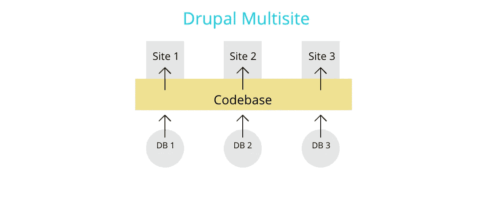
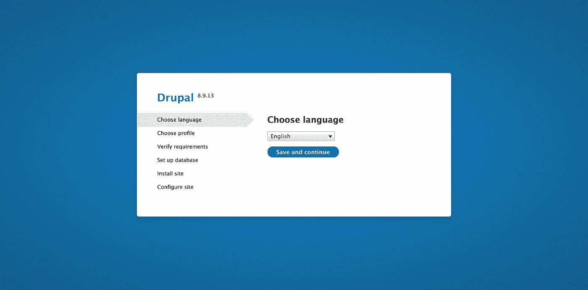
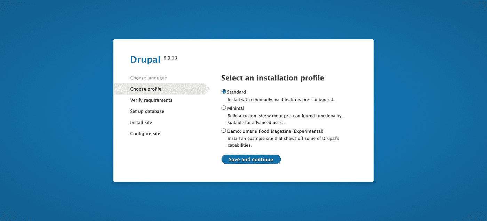
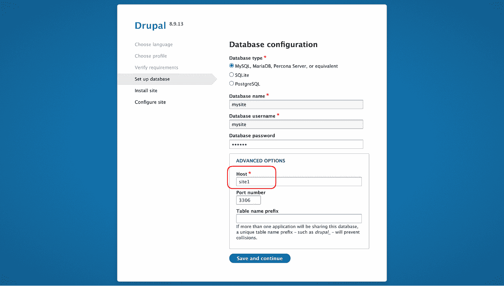
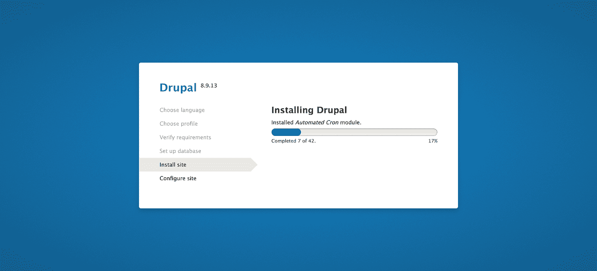
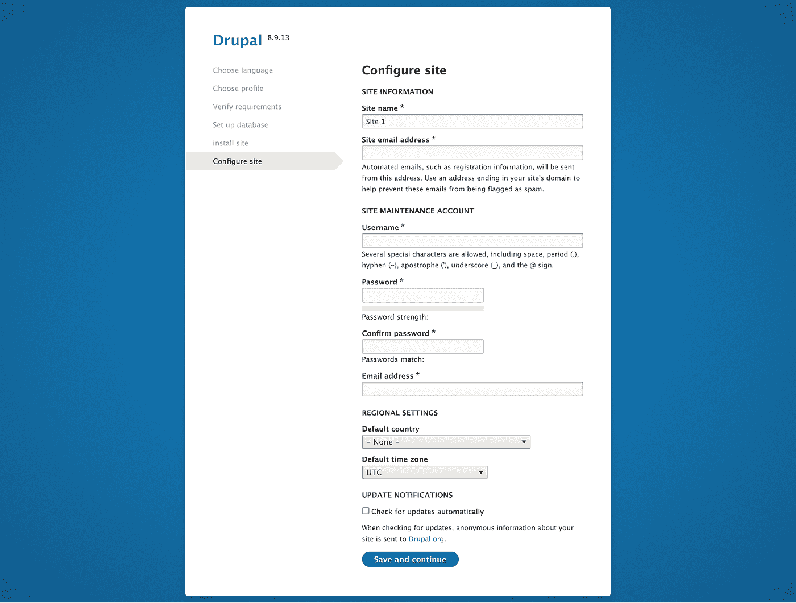
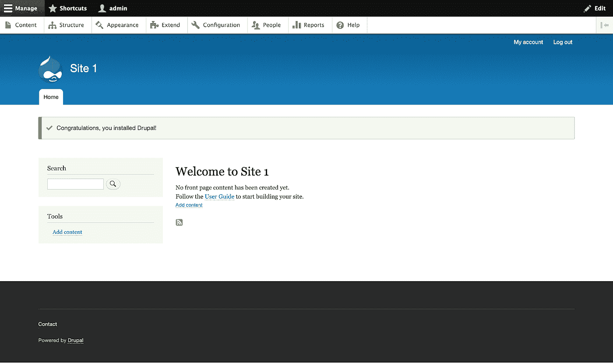

# 使用 Lando 的 Drupal 8 多站点设置

> 原文：<https://medium.com/globant/drupal-8-multi-site-setup-using-lando-27f3e14ccce2?source=collection_archive---------0----------------------->



在本文中，我们将学习一步一步地使用 lando 来设置 drupal 8 多站点，每个站点有一个共享的(单个)代码库和单独的数据库。

我们将以两种方式创建多站点:

1.  **子域**

和

2.**子目录**

# 何时考虑多站点？

在我们深入了解关于设置多站点的技术细节之前，让我们首先了解何时考虑多站点设置。

下面提到的优点和缺点以及给出的理由将帮助您决定 multisite 是否适合您的站点。

**优点:**

*   易于维护:

```
Having a single codebase is easy to maintain
```

*   降低开发成本:

```
It will be cost effective to create a sub-site than creating a new site from scratch
```

*   每个网站都有独立的主题和功能:

```
We can have a separate theme and module(s) for each site. Having a shared codebase does not restrict us from doing so
```

**缺点:**

*   单点故障:

```
A coding error in a single module can bring all the sites down
```

*   现场交通管理:

```
All the other sites may face performance issues even if a single site experiences heavy web traffic
```

在以下情况下考虑多站点设置:

*   你有 2 个或更多的网站，在设计上差别很小。

```
 *- A base theme can be created and do the site specific changes in the sub-theme.*
```

*   你有 2 个或更多的网站具有类似的功能，有些需要一些独特的功能。

```
 *- Create module(s) and reuse in all sites.* *- Create a separate module for the unique functionality and keep it in a site-specific folder.*
```

现在你知道你是否真的需要多站点，让我们了解什么是 Lando，以及有其他选择时选择 Lando 的原因。

# 兰多是什么，为什么要用？

Lando 是一个基于 Docker 容器技术的开源、跨平台、本地开发环境和 DevOps 工具。

Lando 帮助开发商:

1.  在本地模拟生产环境
2.  在所有主要操作系统(如 OSX、windows 和 linux)上标准化开发环境和工具
3.  对所有项目使用单一的本地开发环境

> 不建议在生产环境中运行 Lando。

请注意，我们不会涉及安装 lando 的说明。详情请遵循 lando 的[公文。](https://docs.lando.dev/basics/installation.html)

# 下载 drupal

下载 drupal 有多种方式。我们将使用 composer 下载。Drupal 核心及其所有依赖项，如模块、主题和库，都可以使用 composer 进行管理。

请确保您的本地计算机上安装了 composer。

或者，也可以手动下载 drupal。但是建议使用 composer，我们将使用 composer 下载。

下载 drupal 的最新版本

```
$ composer create-project drupal/recommended-project my_site
```

上面的命令将下载 Drupal 的最新版本。如果你想要一个特定的版本，使用下面的命令

```
$ composer create-project drupal/recommended-project:8.9.13 my_site
```

该项目将被下载到`my_site`目录中。

# 初始化并启动 Lando

下载完 Drupal 后，是时候初始化 lando 了。

接下来的 2 个步骤将创建一个最小的 lando 配置文件。

转到`my_site`目录

```
$ cd my_site
```

初始化 lando

```
$ lando init — recipe drupal8 — webroot=web — name=”my_site”
```

这将问你几个与你的项目相关的问题。正确回答它们。

. lando.yml 文件已准备好进行基本配置。

编辑. lando.yml，如下图所示:

```
name: my_siterecipe: drupal8config: webroot: webproxy: appserver: - site1.lndo.site - sub.site1.lndo.site - site2.lndo.siteservices: site1: type: mysql:5.7 creds: user: mysite password: mysite database: mysite subsite1: type: mysql:5.7 creds: user: mysite password: mysite database: mysite site2: type: mysql:5.7 creds: user: mysite password: mysite database: mysite site2child: type: mysql:5.7 creds: user: mysite password: mysite database: mysite
```

上面. lando.yml 文件中`proxy -> appserver`下面提到的`site1.lndo.site`、`sub.site1.lndo.site`和`site2.indo.site`是将要生成的 URL。

上面`services`中提到的`site1`、`subsite1`、`site2`和`site2child`是我们将在接下来的几个步骤中使用的数据库的主机名。

你可以猜到`http://sub.site1.lndo.site`将会是`http://site1.lndo.site`的子站点。这将是一个基于子域的网站。

虽然现在还看不到，但是我们将会有第四个站点`http://site2.indo.site/child/`。这将是`http://site2.lndo.site`的子站点。这将是一个基于子目录的网站。

使用以下命令启动您的应用程序

```
$ lando start
```

您应该得到如下所示的输出。

```
Here are some vitals:NAME         my_siteLOCATION     /Users/<username>/sites/my_siteSERVICES     appserver, database, site1, subsite1, site2, site2childAPPSERVER URLS   https://localhost:<PORT #> http://localhost:<PORT #> http://site1.lndo.site/ https://site1.lndo.site/ http://sub.site1.lndo.site/ https://sub.site1.lndo.site/ http://site2.lndo.site/ https://site2.lndo.site/
```

# 安装站点

我们现在已经为安装 drupal 站点做好了一切准备。让我们先做一些准备/设置，然后一个一个地安装网站。

**主站点和子域**

1.  转到“ <site root="">/web/sites”文件夹</site>
2.  为每个网站创建一个文件夹。在我们的例子中，它将是`site1`、`subsite1`、`site2`和`site2child`。请注意，文件夹名称可以是任何其他名称。与站点 url 同名并不是强制性的。
3.  将`default.settings.php`从默认文件夹复制到每个站点的目录中，并将其重命名为`settings.php`。
4.  向 settings.php 提供写入权限— `chmod a+w settings.php`
5.  将`example.sites.php`复制到同一个文件夹(即 sites 文件夹)中，并重命名为`sites.php`。在文件底部添加以下条目:

```
$sites['site1.lndo.site'] = 'site1';$sites['sub.site1.lndo.site'] = 'subsite1';$sites['site2.lndo.site'] = 'site2';
```

在上面的代码片段中，在=(等号)后面提到的值是我们在上面的步骤 2 中创建的文件夹名称。如果您的文件夹名称不同，则相应地更改这些值。

当访问该网站时，它将使用上述文件夹中的 settings.php。例如:`http://site1.lndo.site`将使用“`site1`文件夹中的 settings.php。

6.现在让我们开始逐个安装站点:

在浏览器中打开生成的 URL，按照说明安装 drupal，就像平常一样。

a.选择网站的语言



b.选择安装配置文件



c.输入数据库详细信息

使用我们之前在. lando.yml 文件中输入的详细信息。

确保您输入了正确的主机名。理想情况下，每个站点都应该有一个我们在. lando.yml 文件中输入的单独的主机名。



d.安装将开始



e.通过提供信息来配置站点



f.网站已安装



以类似的方式安装其他两个站点。

如果您已经安装了所有 3 个站点— `http://site1.lndo.site`、`http://sub.site1.lndo.site`和`http://site2.indo.site`，我们就完成了子域设置。

现在我们将看到如何设置和安装一个基于子目录的 drupal 站点。

**子目录**

> 请仔细阅读并执行以下步骤，因为缺少一个步骤都可能导致基于子目录的多站点无法正常工作。

我们将在`http://site2.indo.site`下创建一个基于子目录的站点。可以通过网址`http://site2.indo.site/child/`访问。

1.  我们在. lando.yml 文件中已经有了一个名为`site2child`的条目。
2.  我们也已经在 sites 文件夹下创建了一个名为`site2child`的文件夹。
3.  打开 sites.php，为这个新站点再添加一个条目。我们最终的`sites.php`将会有如下代码。

```
$sites['site1.lndo.site'] = 'site1';$sites['sub.site1.lndo.site'] = 'subsite1';$sites['site2.lndo.site'] = 'site2';$sites['site2.lndo.site.child'] = 'site2child';
```

请注意 sites.php 新增加的`$sites`变量。它的值是'`site2.lndo.site.child`'。

在子目录多站点结构中。当我们实际从浏览器访问站点时，主站点域名后面的(点)和文件夹名称将被替换为/(斜线)和文件夹名称。

在我们的例子中，主站点域是'【T10'和其后的文件夹名。(点)是‘子’。我们将以`http://site2.indo.site/child/`的身份访问站点 url。

4.转到网站根文件夹中的 web 文件夹，然后运行下面的命令

```
$ ln -s . child
```

上述命令将把`child`文件夹符号链接到公共代码库。

5.从浏览器访问 URL `http://site2.lndo.site/child/`并按照步骤安装 drupal。

类似的步骤在上面的“**主站点和子域”**部分中有所提及。

确保您输入了正确的数据库信息和主机名。

> 请注意，在文件夹名称后有一个/(斜线)是很重要的，以便使基于子目录的网站工作。如果没有斜线，网站将给出“无法找到请求的页面。”错误。
> 
> 错误的网址-http://site2.lndo.site/child
> 正确的网址-http://site2.lndo.site/child/

***如果使用 nginx 服务器***

如果您使用 nginx 服务器，请将以下位置重定向添加到 nginx 配置文件中:

```
location /child { try_files $uri /child/index.php?$args;}
```

因为我们只有一个基于子目录的站点，所以我们在上面添加了一个位置重定向条目。您应该为每个站点添加一个位置重定向条目。例如，如果您还有一个 URL 为`http://site2.lndo.site/child1/`的站点，您将添加如下 2 个条目。

```
location /child { try_files $uri /child/index.php?$args;}location /child1 { try_files $uri /child1/index.php?$args;}
```

2.当我们使用 nginx 并拥有站点的子目录结构时，图片不是用 image_style 生成的。即，图像不是在“/sites/site 2 child/files/style/*”文件夹下创建的。

要解决这个问题，如果 nginx conf 中不存在@rewrite 块，则创建一个@ rewrite 块，或者编辑现有的@ rewrite 块，使其如下所示:

```
location @rewrite { rewrite ^/child/(.*)$  /child/index.php?q=$1 last; rewrite ^/(.*)$ /index.php?q=$1;}
```

# 结论

在本文中，我们学习了什么是 Drupal 多站点，它的优缺点以及何时考虑多站点。我们还看到了使用 Lando 在本地机器上建立 Drupal 站点的好处，以及这样做是多么容易。如果我们的网站在 nginx web 服务器上，有几个说明需要遵循。对于多站点子目录方法，在正确的文件夹中用正确的名称创建符号链接非常重要。