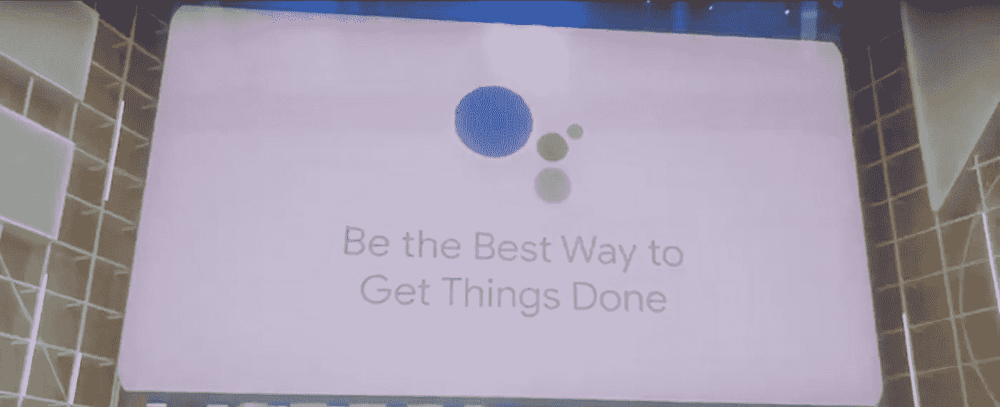
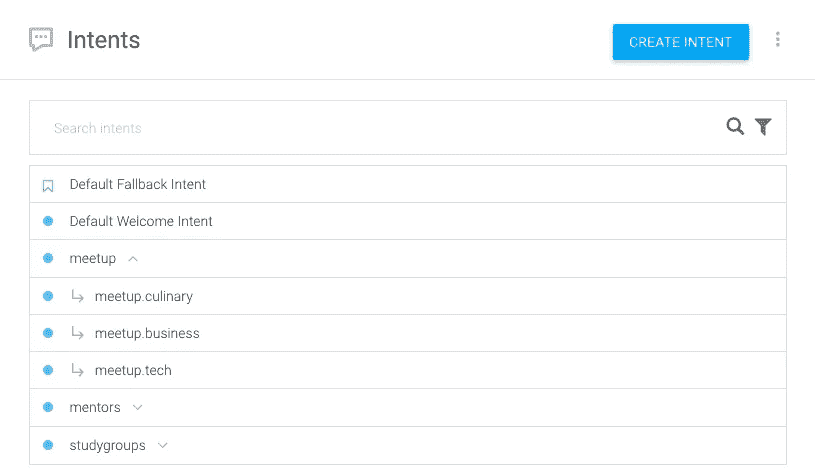
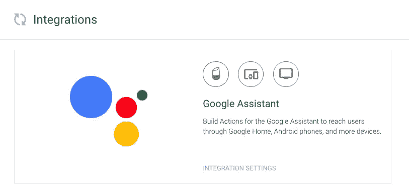
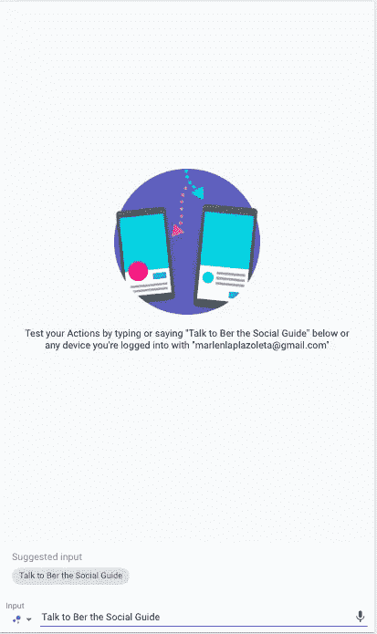
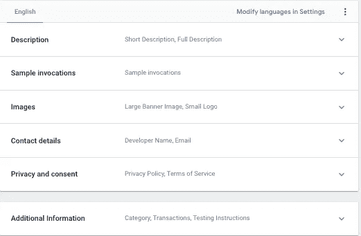
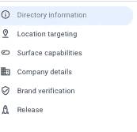
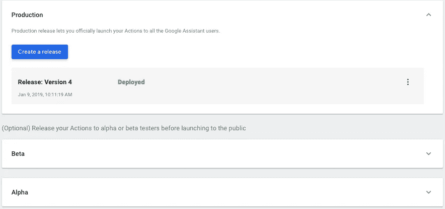
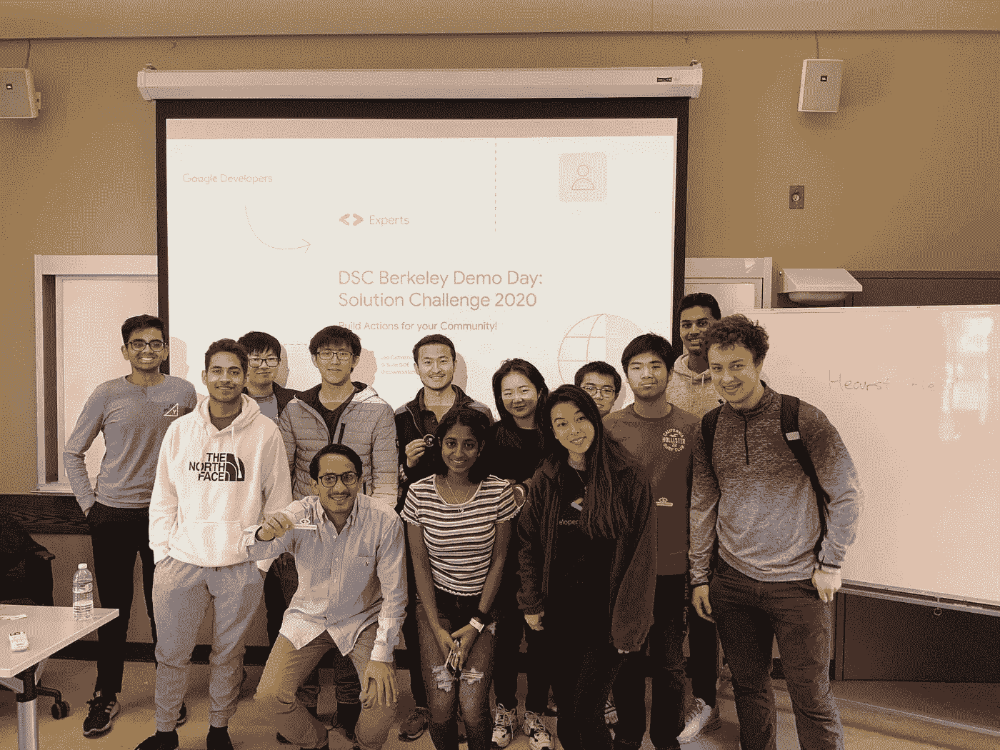
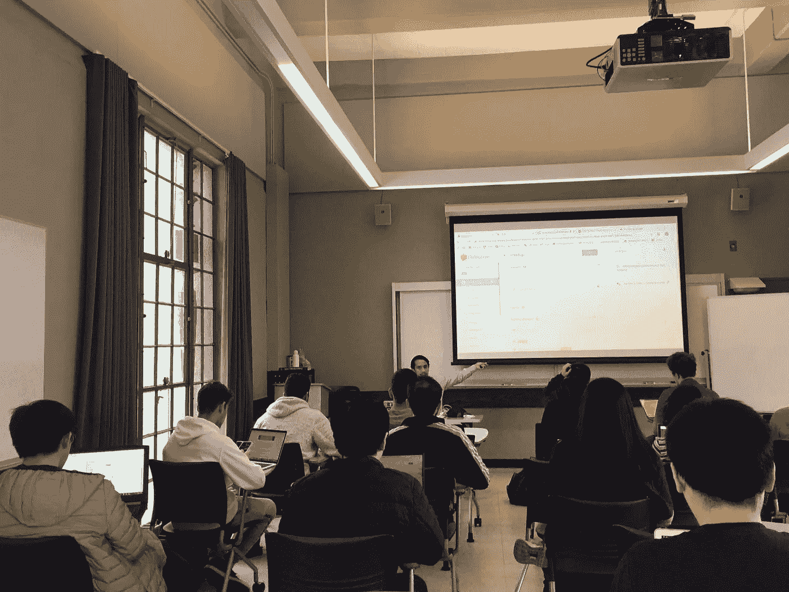

# DSC 伯克利演示日—2020 年解决方案挑战💡🌎

> 原文：<https://medium.com/google-developer-experts/dsc-berkeley-demo-day-solution-challenge-2020-ce630f0ddf48?source=collection_archive---------5----------------------->

在 DSC Berkeley 的**演示日**的特别版中，我将分享 2020 年解决方案挑战的参与者如何为谷歌助手创建和发布操作。

一旦你确定并完全理解了你试图为你的社区(用户)解决的问题，现在是时候开始考虑解决方案，设计你的界面并选择你的技术栈了。

在本次研讨会中，我们将重点讨论如何通过语音技术帮助解决当地社区面临的一些挑战。使用谷歌助手的一些主要好处是全球用户对该服务的采用呈指数级增长，在多种设备上达到 10 亿用户，如智能扬声器、汽车、智能电视、可穿戴设备、智能显示器、智能手机甚至传统手机。此外，通过允许用户通过语音界面进行交互，这是人类最自然的交流方式，语音技术正在成为该行业的游戏规则改变者。

Google I/O 2019

在这篇文章中，我们将讨论加州大学生在如何与分享他们激情或爱好的社会团体联系方面面临的挑战，所以我们建立了一个行动，帮助学生在技术，商业，锻炼，烹饪等主题中找到聚会，学习小组和导师，我们称之为“Ber 社会指南”所以，嘿谷歌，让我们开始吧！🏁

1.  到 Github repo:[https://github.com/leoaiassistant/DSCBerkeley](https://github.com/leoaiassistant/DSCBerkeley)下载**DSCBerkeley _ demoday . zip**文件。

2.现在转到您在 Dialogflow 控制台中的项目:[http://console.dialogflow.com/](http://console.dialogflow.com/)

3.在您的控制台上，使用 zip 文件恢复项目。

4.项目包括意向；`'meetups';``'mentors';`

5.<add>= '[> 20 & & < = 2000]'；按照意图训练短语，例如`'meetups';` `'When is the next tech meetup in San Francisco'` `'How many Startup meetups are going to be next week in Silicon Valley', 'When there is a workout meetup near me'`和`'studygroups';` `'I'm looking for a Tech Study Groups’` `'Tell me more about Neuroscience groups'` `'Set an alert for Data Science workshops'`</add>

6.项目有实体(文本分类器)；社交指南和主题，允许我们根据用户感兴趣的主题创建决策树。

7.定义训练短语和动作调用类型: [1)显式调用:](https://developers.google.com/assistant/discovery/explicit)当用户告诉助手他们明确想要使用你的动作时发生。 [2)隐式调用:](https://developers.google.com/assistant/discovery/implicit)当助手选择调用您的动作而用户没有通过名称调用它时发生。

在这个动作上，指定包含训练短语的意图，如`'Hey Google, ask Ber The Social Guide when is the next Hackathon in San Francisco'`它将触发应用程序中的“深层链接”动作，允许用户通过特定功能调用。

8.现在让我们来试试这个动作，进入 Dialogflow 控制台的 integrations 部分，点击 Google Assistant integration settings<add>当用户通过名称请求应用程序时触发的特定意图；`'meetups';` `'mentors';` `'studygroups';`</add>

[https://console.actions.google.com/u/0/project/**your_project_ID**/simulator](https://console.actions.google.com/u/0/project/sheets2-1f924/simulator)

9.在 Google Assistant 目录中发布您的操作；对于这一步，你需要添加:简短和完整的描述你的行动，样本调用，小标志，开发人员姓名和电子邮件，使用条款和隐私政策，为你的行动，选择一个类别和其他可选设置。

此外，你需要提供定位，表面功能，公司详情，品牌验证(如网站，Android 应用程序)，以实现跨平台的功能，

11.Beta & Alpha 测试人员、发布和应用程序审查:一旦您的操作经过测试，您就可以准备 por 生产，并可以提交审查:然后您将收到一封电子邮件，其中包含完整的审查。

12.政策和指导方针:您阅读了[发布清单](https://developers.google.com/assistant/console/publish#prepare)，其中概述了关键的政策和指导方针。

现在，您可以继续训练您的动作，并与外部 API(如 Google Calendar、Sheets 等)集成，您还可以向您的代理添加新的渠道，如消息应用程序。

**DSC 伯克利演示日—2020 年解决方案挑战幻灯片:**

车间📍[加州大学伯克利分校](https://medium.com/u/255942f15b34?source=post_page-----ce630f0ddf48--------------------------------)，赫斯特纪念馆。
DSC 伯克利演示日—2020 年解决方案挑战

演示时间:加州大学伯克利分校的数据科学学生 Kavya Marrapu 向我们介绍了她的行动 Moody，它可以在心情不好的时候为你订购冰淇淋，分享专业联系人或向你发送可爱的内容。

Kavya Marrapu, Student at University of California, Berkeley

[UC Berkeley](https://medium.com/u/255942f15b34?source=post_page-----ce630f0ddf48--------------------------------), Hearst Memorial.

*//免责声明:观点是我个人的，与公司或他们的节目无关。每位 Google 开发者专家对他们的服务完全负责，不隶属于 Google，也不代表 Google 提供服务。客户对其使用的服务(如果有)负全责。//*