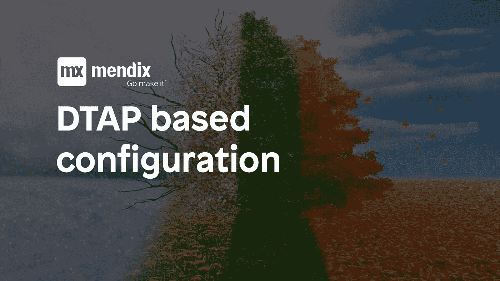
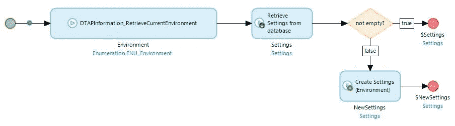

# 基于 DTAP 的配置— Mendix 和我

> 原文：<https://medium.com/mendix/dtap-based-configuration-mendix-and-me-303730fbabaa?source=collection_archive---------6----------------------->

与将配置存储在常量中相比，将配置存储在数据库中具有某些优势。您可以允许选定的用户自定义配置，而无需让他们直接访问应用程序常数，您可以更改配置，而无需重启应用程序，…

除了所有这些优点之外，还有一个显著的缺点。这些优点源于配置存储在数据库中这一事实。缺点是配置存储在数据库中。

# 为什么这是一个问题？

对于很多配置来说，这可能根本不是问题。但对一些人来说，这有时是一场灾难。如果数据库从一个环境恢复到另一个环境(本地使用生产数据库进行调试，ACCP 在测试中恢复以获得更新的数据等等)，原始环境的配置仍然有效。这可能导致测试系统访问生产界面，电子邮件被发送到错误的地址……这可能会产生致命的后果，避免这种情况应该是每个开发人员的目标。

# 解决方案—基于 DTAP 的配置

DTAP 是一个缩写，代表:

*   发展
*   美国东部时间
*   **一个**的接受
*   生产

所以对于通常可用的应用程序环境来说。在 Mendix AppStore 中，有一个模块告诉系统它当前运行在这些环境中的哪一个环境中。如果您想要允许某些过程只在某些系统上执行(例如，在测试系统中自动创建假的测试数据)，这可能非常方便，但是对于解决我们的配置问题也非常有用。

该模块可在以下位置找到:

[Aelion — DTAP 环境信息](https://appstore.home.mendix.com/link/app/110921/)

它通过一个微流提供一个枚举，告诉你你在哪个系统上。

在之前的博文中，我已经谈到了 [CreateOrRetrieveIfExisting 微流](https://mendixandme.de/index.php/2020/02/24/das-createorretrieveifexisting-pattern/)(德语版)微流。如果您使用 DTAP 模块扩展此功能，则可以使配置仅在最初创建它的系统上可用。这个微流看起来像这样:

名为“环境”的附加枚举属性(对应于 DTAP 模块中的环境枚举)已添加到设置对象中。检索操作现在包含以下 XPath 约束:

[环境= $环境]

创建操作将环境属性设置为环境值。

此模式可用于确保在另一个环境中恢复数据库时不会意外使用生产性配置，而不会失去基于数据库的配置的便利性。

*原文于 2020 年 2 月 24 日在* [*用德语发表 https://mendixamme . de*](https://mendixandme.de/index.php/2020/02/24/dtap-basierte-konfiguration/)*。*