# 在 Tableau 中使用双轴图表的 3 种方法

> 原文：<https://medium.com/edureka/dual-axes-charts-in-tableau-19caf37b456f?source=collection_archive---------4----------------------->

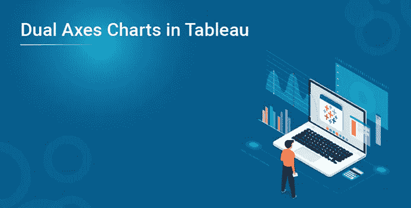

**Tableau**中的双轴图表之所以如此命名，是因为它们有两个相互层叠的独立轴。通常情况下，它们会显示不同标记类型的组合。例如，在这里您可以创建一个可视化效果，在一个轴上显示一个度量，在另一个轴上显示线条。

这是 Tableau 中我最喜欢的图表之一，因为它可以添加一个新的轴，并且可以单独控制这些轴。这释放了一些额外的灵活性，创建了几个可用于改进您的分析、用户体验和设计的实际应用程序。

这篇文章将向你展示如何在 Tableau 中构建双轴图表，以及使用它们的三种不同方式:

*   **繁体使用**
*   **让你的最终用户成为故事一部分的方法**
*   **一个改善仪表板美观的选项**

# 如何在 Tableau 中创建传统用途的双轴图表

因此，我将使用 Tableau 提供的 ***样本—超级商店数据集*** 。现在，让我们从制作一个传统的双轴组合图开始。

你可能对此很熟悉，但我也将分享第二种方法，你可能不知道，这可能会节省你一两次点击。

第一个图表在一个轴上描绘了每年的销售额，在另一个轴上描绘了每年的利润率；这两项措施也应按照类别维度进行细分。

*   首先，让我们创建一个图表，我将从*按年份*按类别的销售开始。

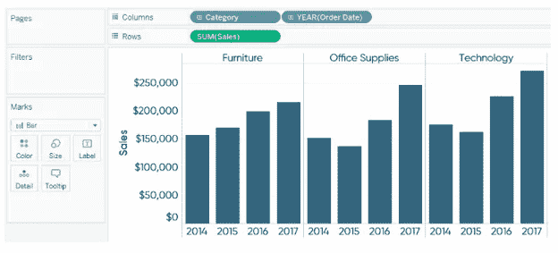

*   接下来，让我们将第二个指标，即*利润率*放在 Rows 货架上。

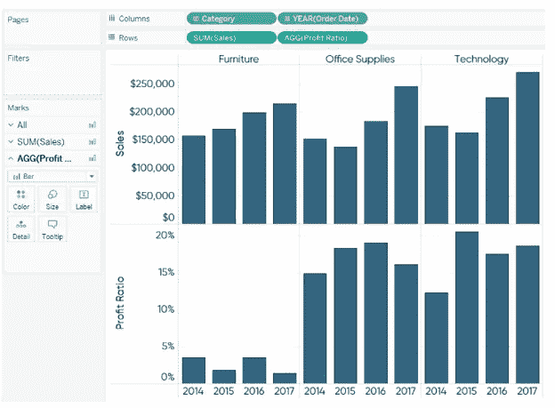

此时，您在两行上有两个单独的条形图。有两种方法可以将这两个独立的条形图转换为双轴条形图。

*   首先，也是大多数人学习的方式，是右键单击成排货架上的第二个测量药丸，然后选择*双轴*。

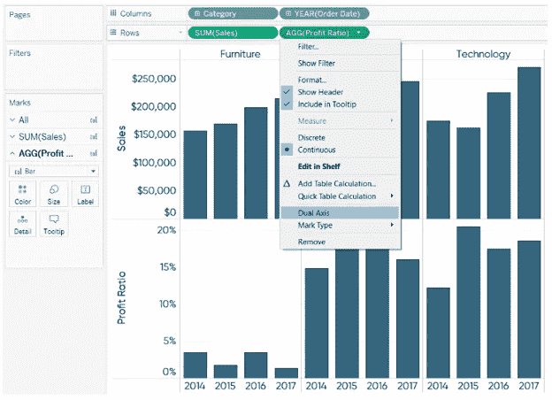

第二种也是稍微更有效的方法是悬停在第二行的轴上。

*   悬停时，轴的左上角会出现一个绿色的小三角形。
*   您可以在三角形上单击鼠标左键，并将其拖动到第一行左轴的对面。
*   当您将鼠标悬停在图表的右侧时，您会看到一条虚线，该虚线是在您松开鼠标左键时轴将要显示的位置。

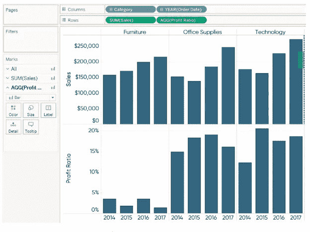

在这两种情况下，最终都会得到一个双轴条形图。

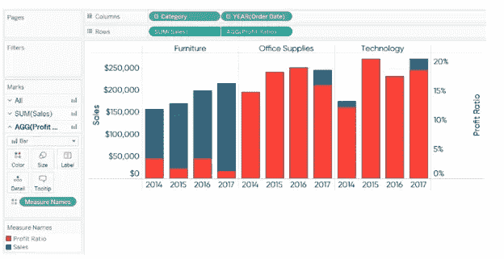

传统上，双轴组合图会更好。所以，这就是我们要做的。

现在，对于双轴*组合*图表，我们需要标记类型的组合。当在行架和/或列架上有多个度量时，每个度量最终都有自己的标记架。这意味着您可以独立编辑测量的标记类型。

下面是我将*利润率*的标记类型从条形改为线条后的最终视图。

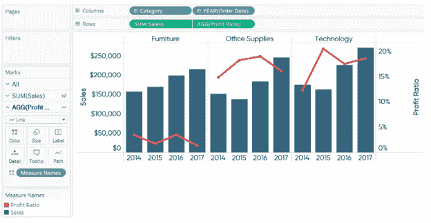

当数据点之间随着时间的推移而存在关系时，或者如果它们由连续的维度/度量连接时，应严格使用线条。在 Tableau 的行架或列架上，离散字段按特定顺序处理。

因此，对于这个示例，*销售额*和*利润率*首先由*类别*维度分解，然后由*年(订单日期)*维度分解。

这是可行的，但是如果我们想先将这两个指标分解为*年(订单日期)*然后是*类别*呢？它看起来是这样的:

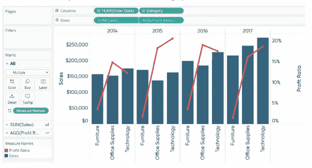

# 使用双轴图表让你的用户成为故事的一部分

下图是从***【money.cnn.com***翻拍的 *CNN 金钱计算器*。

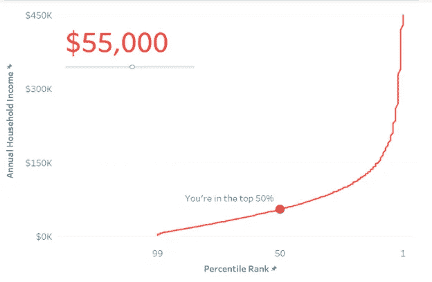

给定的 viz 以一条曲线为特色，显示了每个家庭的收入是如何按百分位数排列的。这是一个非常常见的“描述性”视图，用于描述高级统计数据。通过使用第二个轴来显示使用仪表板的个人在该曲线上的排名，可以获得真实值。这使得用户成为故事的一部分，是一种更吸引人的用户体验。

为了达到这个效果，我在 Tableau 中使用了一个内置的参数，它允许最终用户选择 2000 美元到 45 万美元之间的任何家庭收入选项。

做出此选择后，圆会根据用户的选择移动到适当的位置。此外，标签会更新，并带有一个标题，告诉最终用户他们的家庭收入处于哪个百分比等级。

这是一个双轴组合图。

左轴的曲线使用折线图的标记类型，圆是仅在右轴上显示圆供最终用户选择的第二个度量。只显示一个圆圈的诀窍是这个简单的公式，它计算用户的参数选择是否与 Y 轴上的家庭收入值相匹配。

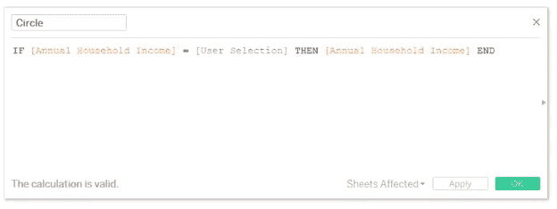

一旦你有了这样的计算，你就可以在左边的轴上画出曲线，在右边画出圆的尺寸。

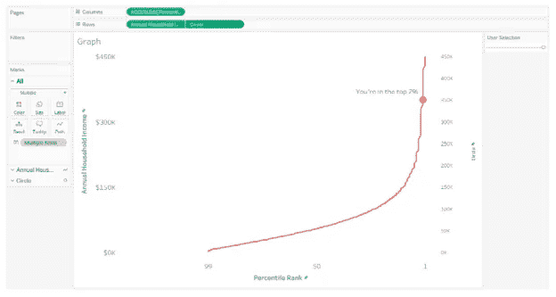

要完成此视图，您可以通过右键单击*圆*的轴并选择*同步轴*选项来同步轴。

这确保了圆与相对轴上的直线完全对齐。最后，通过右键单击隐藏右边的轴，并取消选中选项*显示标题*。

# 使用双轴来改进线图的设计

假设您有一个按月趋势显示销售额的折线图。

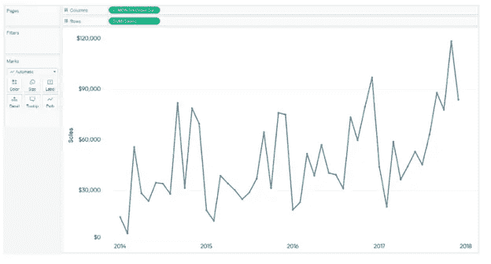

现在，我将把*销售*度量放在右轴上，同步这两个轴，并将第二个轴的标记类型更改为*区域*。

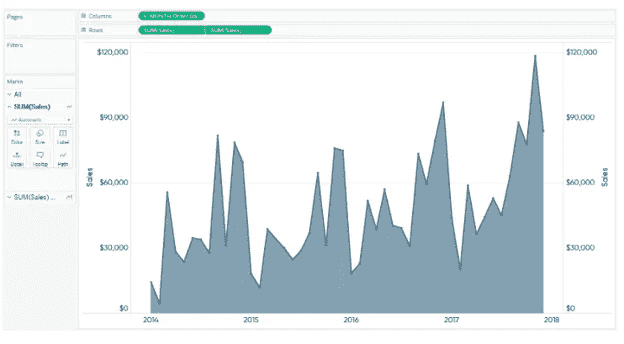

在这一点上，我们有一个双轴组合图，其中*按月销售*作为折线图和面积图。要最终确定视图，请隐藏右轴并将该区域的不透明度降低到 10%。

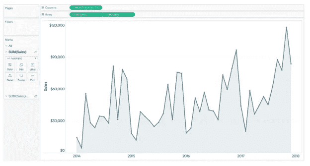

一次只能将第二个轴用于一个目的。但是如果你不是因为前面两个原因中的一个而使用它，这是第三个应用程序，可以用来增强你的传统线图。

我希望你已经发现 Tableau 中双轴图表上的这件作品很有趣，并且理解它们是什么，以及如何使用它们来揭示 Tableau 中的潜力。

如果你想查看更多关于人工智能、DevOps、道德黑客等市场最热门技术的文章，你可以参考 Edureka 的官方网站。

请留意这个系列中的其他文章和视频，它们会帮助你理解 Tableau 的各种概念。

> *1。* [*Tableau 教程*](/edureka/tableau-tutorial-37d2d6a9684b)
> 
> *2。* [*什么是 Tableau？*](/edureka/what-is-tableau-1d9f4c641601)
> 
> *3。* [*画面功能*](/edureka/tableau-functions-ce794b10e588)
> 
> *4。* [*画面仪表盘*](/edureka/tableau-dashboards-3e19dd713bc7)
> 
> *5。*[*Tableau 中的 LOD 表达式*](/edureka/tableau-lod-2f650ca1503d)
> 
> *6。* [*画面技巧*](/edureka/tableau-tips-and-tricks-a18bf8991afc)
> 
> *7。* [*循序渐进指导学习 Tableau 公共*](/edureka/tableau-public-942228327953)
> 
> *8。* [*Tableau 桌面 vs Tableau 公共 vs Tableau 阅读器*](/edureka/tableau-desktop-vs-tableau-public-vs-tableau-reader-fbb2a3aa0bac)
> 
> *9。* [*如何在 Tableau 中创建和使用参数？*](/edureka/parameters-in-tableau-ac552e6b0cde-ac552e6b0cde)
> 
> *10。* [*Tableau 图表*](/edureka/tableau-charts-111758e2ea97)
> 
> *11。*
> 
> *12。 [*圆环图中的 Tableau*](/edureka/donut-chart-in-tableau-a2e6fadf6534)*
> 
> **13。*[*2020 年你必须准备的 50 大 Tableau 面试题*](/edureka/tableau-interview-questions-and-answers-4f80523527d)*
> 
> **14。* [*如何以及何时使用不同的 Tableau 图表*](/edureka/tableau-charts-111758e2ea97)*

**原载于 2019 年 9 月 9 日*[*https://www.edureka.co*](https://www.edureka.co/blog/dual-axes-charts-in-tableau/)*。**