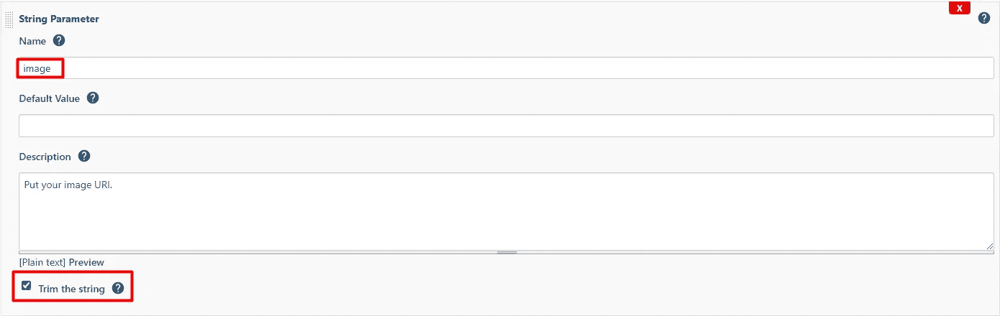
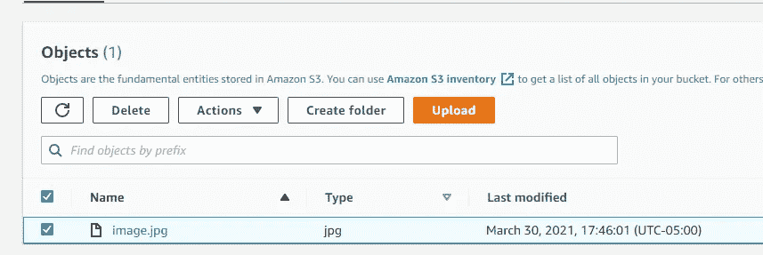

# Jenkins 管道中使用 HTML、Groovy 和 Bash 的动态和反应式参数化。

> 原文：<https://medium.com/globant/dynamic-and-reactive-parameterization-in-jenkins-pipelines-using-html-groovy-and-bash-27b031fcd69b?source=collection_archive---------0----------------------->

几年前，DevOps 文化蓬勃发展，并开始成为大多数微服务架构中的必备元素，这要归功于同时为数百个服务自动化应用生命周期的便利性。这种需求的增长也带来了新的挑战和开发 CI/CD 工作流和多种技术的可能方法。

在我们的具体案例中，我们将讨论 Jenkins，以及如何使用一个名为“主动选择”的插件来扩展管道参数化的可能性


**Source**: [Jenkins + Gitlab](https://ichi.pro/es/canalizacion-de-jenkins-con-gitlab-para-proyectos-java-231864011383381)

# **内容:**

*   这个叫做“主动选择”的插件是什么？为什么它如此有用
*   2-插件“主动选择”是如何工作的？
*   AWS 中主动选择插件的一个实际例子:预览和上传一张图片到一个现有的 S3 桶。
*   4-创建管线参数
*   5-结论

# **1-这个叫做“主动选择”的插件是什么，为什么它如此有用？**

如其文档所述:“主动选择插件用于参数化自由式 Jenkins 作业，以创建脚本化、动态和交互式作业参数。主动选择参数可以动态更新，并可以呈现为组合框、复选框、单选按钮或丰富的 HTML UI 小部件。”

通常，当有数百个服务要部署时，管道被参数化，以允许您仅从一个管道中选择多种部署，(即，应该部署哪个环境、使用什么名称、是否应该执行测试……)Jenkins 当前允许您使用一些预定义的参数，如选择、复选框或字符串参数。当你不得不管理不同的管道时，你会发现在某些情况下 Jenkins 提供的参数由于其静态性质是不够的，在这些情况下，插件“Active Choices”来丰富你的参数化选项，允许你在参数之间传递反应引用，并在你的参数化选项中呈现自定义 HTML。

# **2-插件“主动选择”是如何工作的？**

在配置管道时，它提供了 3 种新的参数:

*   **Active Choices 参数**:允许您使用 Groovy 或 Scriplet 脚本来确定您的输入是被计算还是被预定义，并根据计算结果返回结果。
*   **主动选择反应参数**:与主动选择相同，允许您使用 Groovy 或 Scriplet 脚本，此外，当引用的参数改变时，这些参数将被重新计算(即，当 ENV 是 DEV 时，ENV 是被引用的参数，参数将反应并禁用“执行测试”选择参数)
*   **主动选择反应参考参数**:包含主动选择参数和主动选择反应参数选项，另外启用新的参数选项，如 HTML 小工具、项目符号或编号列表、输入框等。


**Source:** [Active Choices Plugin Github Repository](https://github.com/jenkinsci/active-choices-plugin)

# **3-AWS 中主动选择插件的一个实际例子:预览并上传一张图片到现有的 S3 桶中。**

假设您现在希望您的团队能够直接访问 AWS 管理控制台，将您的资产上传到 S3，因为这将导致运营过热(用户创建、权限、策略……)，相反，您更希望将您资产的映像上传集中在 Jenkins 中，避免向用户提供具有 S3 特定权限的个人凭据。您还希望能够列出 S3 目录，并确定将资产上传到哪个目录。

要做到这一点，你需要以下东西:

*   图像 URL 的输入字符串参数，带有用于预览图像的 HTML 反应引用参数。
*   用于输入图像名称的文本框。(用 HTML 调整)
*   一个脚本化的活动选择参数，用于提取所有 S3 存储桶以选择将映像上传到何处。

作为先决条件，你需要以下东西:

*   Jenkins 插件:主动选择
*   您的 Jenkins 代理中已经配置了 AWS 凭据。
*   AWS S3 读取和上传权限。

# **4-创建管道参数:**

要创建参数，我们将进入管道中的“配置”选项卡，单击“该项目已参数化”，启用后，单击“添加参数”并选择“字符串参数”以创建我们的图像输入框。


一旦我们的常规字符串参数被创建，我们将为这个参数定义一个名称并选中“Trim”框，以修剪它的值并避免任何可能在我们的 HTML 中产生错误的空白。



如果您想查看添加第一个参数后的效果，请单击“保存”，关闭配置窗口，然后单击“使用参数构建”


如你所见，这非常简单，但一旦我们为图像预览添加新的反应参考参数，这将会改变。

让我们回到“参数”设置并添加新参数，为此，我们将点击“添加参数”并选择“主动选择无功参考参数”。在配置脚本之前，导航到参数的底部，选择“选项类型”作为“格式化的 HTML ”,以在我们的参数中启用 HTML 呈现，并添加之前创建的字符串参数作为“引用的参数”,在那里添加字符串参数，基本上启用了反应行为，并且当字符串参数中有更新时，这将被重新计算。


要配置我们的脚本，首先，我们将选中参数顶部的“Groovy Script”框，我们将添加我们的 Groovy 文本框，返回我们想要呈现的 HTML。

```
return """"""
```


这是一个非常简单的 HTML 标记，但它是我们预览图像所需的全部内容，正如您所看到的，该脚本基本上将“img”HTML 标记与引用的参数“image”连接起来，将其设置为我们的参数的源图像。

**注意:**回退脚本是一个备用脚本，如果主脚本返回异常，将执行该脚本。我们还使用三重引号来启用多行字符串插值，当您想要用另一个参数替换任何标签时，可以使用这种方法。(使用${parameter}语法)

一旦完成，保存并测试它如何工作。为了测试它，我们需要做的就是在我们的“image”参数中复制一个图像 URL，引用的参数将以普通的 HTML 呈现这个图像(或者如果失败，返回一个错误消息)


尝试替换图像 URL，并查看 reactive 参数如何重新呈现 HTML 图像。


好了，现在我们已经有了图像，可以预览它了，现在我们要选择资产将被上传到哪个 S3，为此，我们将再次进入设置并添加一个新参数，因为该参数不会对任何其他变量做出反应，我们将使用“活动选择参数”。因为我们要从列表 1 中选择，所以“选择类型”将是“单选”，我们还将启用复选框“启用过滤器”。这基本上将呈现一个输入框，我们可以在其中键入字符串进行搜索，并仅列出匹配项。


现在，对于脚本，由于我们希望使用 AWS CLI 列出所有 S3 并对它们进行适当的格式化，因此我们将使用 Groovy 函数“execute”和管道操作符将 std 输出移动到下一个命令输入。指令“Execute”基本上将在我们的 Groovy 脚本中运行 bash 代码，一旦它完成，我们将标记输出(使用换行符作为拆分字符进行拆分)。

一旦您保存了新参数，现在您可以看到它将如何使用您键入的字符串呈现桶和过滤器


现在，我们只需要添加一个输入框来设置图像名称，并配置管道来使用我们的参数上传图像，我们就完成了，为此，要使用保存 HTML 的参数“preview ”,我们将使用它来附加一个输入标签，并在管道中稍后提取它的值。

```
return """<h5>Image name</h5><input type="text" class="setting-input" style="width:auto" name="value" value="image.jpg" ><br>"""
```

现在，只需在前面的 HTML 中为参数“Preview”添加一个新的 h5 标签和一个 input 标签，并添加一个默认值(在我的例子中是 image.jpg)，需要注意的重要一点是，要让 Jenkins 正确使用参数值，HTML 中的类必须是“setting-input”。


最后，我们将配置管道以使用我们的参数，并使用以下代码将用户选择的图像上传到 S3:

```
pipeline {
    agent anystages {
        stage('Upload image to s3') {
            environment{
                name = sh(script:"echo ${params.preview} | cut -d',' -f1",  returnStdout: true).trim()
            }
            steps {

                sh """#!/usr/bin/env bash
                curl ${params.image} > ${name}
                aws s3 cp ./${name} s3://${params.bucket}
                rm ./${name}
                """
            }
        }
    }
}
```

正如你所看到的，它非常简单，只使用之前创建的参数来下载和上传图像，你应该注意到的唯一一件事是，我们从环境“名称”中的“预览”参数中删除了一个逗号，这是因为当你使用格式化的 HTML 参数时，它会将它们导出为逗号分隔的列表(即 1，2，3)。现在一切都准备好了，我们可以测试最终的管道。


一旦完成，我们将看到一个成功的执行，如果我们去我们的 S3 桶，图像文件被创建。



现在，为了验证一切是否正常，下载图像并打开它。


很好，现在您知道如何使用 Groovy、bash 和 HTML 动态参数化您的管道了。

# **5-结论**

这个例子展示了使用反应式引用和 HTML 参数化管道的多种新方法，使 Jenkins 管道更加健壮和灵活，当然，您需要创建或修改管道来运行特定情况的情况会更少！

感谢您的宝贵时间！