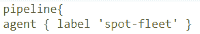
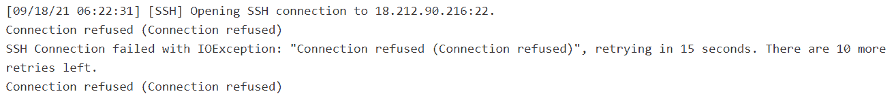

# Jenkins 中使用 AWS 的动态构建代理

> 原文：<https://medium.com/globant/dynamic-build-agents-in-jenkins-using-aws-f71b797910ef?source=collection_archive---------0----------------------->

# **简介**

你有没有经历过你的詹金斯建筑在排队等待下一个有空的遗嘱执行人？结果是，项目中的其他合作者会同时对代码进行更改，导致所有可用的执行器都被他们的更改所触发的构建占用。如果你的是一个紧急的 bug 修复或者一些接近完成期限的事情，这可能会变得非常令人沮丧。除此之外，执行中的延迟也可能导致问题被发现得太晚，修复变得更加昂贵。

在本文中，我们将讨论以下几点:
1-解决方案
2-先决条件
3-AWS 中的配置
4-在 Jenkins 中安装插件
5-在 Jenkins 中配置 EC2-fleet 插件
6-正在运行的插件
7-故障排除
8-摘要
9-参考资料

# **1-解决方案**

Jenkins 提供了在奴隶上运行的作业，使我们能够扩大我们可以运行的同时作业的数量，超过了主人的能力。传统上，我们会考虑通过添加额外的服务器并将其配置为我们集群的一部分来进行纵向扩展。但这将涉及安装和定期维护的前期成本。我们还必须考虑到，在高需求阶段，我们将利用大部分资源，反之，在低需求阶段，我们的资源将处于闲置状态。因此，能够根据我们的工作负载动态扩展的解决方案应该是最佳选择。

我们可以利用云的“随用随付”模式，在这种模式下，我们不必提前配置基础架构，而是根据我们的使用情况进行计费。它还提供自动扩展等功能，有助于根据工作负载扩展/缩小容错基础架构容量。

Jenkins 提供了一个“EC2-Fleet”插件来提供 AWS 中的构建代理，并利用自动伸缩特性根据队列中的作业进行伸缩。它还替换由于特定 Spot 实例池中的需求高峰而终止的实例。(假设我们已经配置了使用 Spot 实例的能力)

# **2-先决条件**

1.拥有 EC2 和自动缩放操作权限的 AWS IAM 帐户。

2.Jenkins 中拥有安装和配置插件权限的用户。

# **3-AWS 中的配置**

1.转到 EC2 控制台>密钥对。点击“创建密钥对”按钮。当我们配置 Jenkins 插件以通过 ssh 启动代理时，将使用这个密钥。

a)提供密钥对的名称。

b)选择 RSA 作为密钥对类型。pem 格式

这将生成密钥，请确保下载并保存它。稍后在设置中会用到它。

2.转到 EC2 控制台>启动模板。单击“创建启动模板”按钮。

自动缩放提供了启动模板和启动配置来定义用于启动实例的配置信息。但是，启动配置是传统版本，建议使用启动模板，因为它能够拥有多个版本，支持按需提供实例和现场实例，还有许多其他优于启动配置的优点。因此，我们将利用发布模板来实施。

我们可以配置

a) AMI 用于启动实例。我们也可以使用我们自己定制的 ami。

b)实例类型取决于我们希望在这些实例上运行的并发构建和工作负载的数量。

c)启动实例后登录实例的 ssh 密钥对。

d)安全组设置。

e) Spot 实例详细信息，如果我们计划利用 Spot 实例来节省成本。

f)将在实例启动时执行的用户数据。

创建模板后，它将出现在“启动模板”部分，反映其名称、默认版本、最新版本以及其他详细信息:

3.现在启动模板可用，我们可以创建自动缩放组。转到 EC2 控制台>自动缩放组，然后单击“创建自动缩放组”按钮。

我们需要根据我们的要求配置自动扩展组:

a)从“启动模板”部分的下拉列表中选择启动模板和在之前步骤中创建的版本:

b)为我们的自动扩展组定义网络设置，例如它将使用的 VPC 和子网。建议在选定的 VPC 内使用多个子网，以确保高可用性和容错能力。

c)我们可能还希望将一个负载平衡器附加到此配置，这是可选的。

d)配置组大小，其中我们可以提及我们的自动扩展组的最小、最大和所需容量。EC2 舰队插件中的设置将覆盖此处指定的数字。

e)发送电子邮件等任何扩大/缩小活动的通知设置都是可选的。

创建后，自动缩放组将显示在自动缩放组部分下:

# **4-在 Jenkins 中安装插件**

在 Jenkins 中安装最新版本的 EC2-Fleet 插件。

进入管理 Jenkins >插件管理器，然后安装 EC2 Fleet Jenkins 插件

# 5-在 Jenkins 中配置 EC2-fleet 插件

1.  进入管理 Jenkins >管理节点和云>配置云>选择“Amazon EC2 Fleet”

2.我们需要使用 IAM 用户的访问密钥 ID 和秘密访问密钥来配置我们的 AWS 凭证。只有在指定了 AWS 区域和凭据后，车队列表才可用。作为一项安全最佳实践，我们应该将凭据的范围定为“系统”而不是“全局”。

3.选择我们已经在其中创建了自动缩放组的 AWS 区域。

4.可用的自动缩放组列表将被填充，我们选择我们创建的组。单击“测试连接”以验证其是否正常工作:

5.我们现在必须配置如何通过“Launcher”配置来启动代理。

a)从下拉列表中选择“通过 SSH 启动代理”。

b)从“凭据”部分下的下拉列表中选择“ec2-用户”。

c)通过从下拉列表中选择“带私钥的 ssh 用户名”选项，添加 ec2 用户要使用的 SSH 密钥。我们将使用之前从 AWS EC2 控制台下载的密钥，并将其内容粘贴到密钥的文本区域。

d)从“主机密钥验证策略”下拉列表中选择“非验证验证策略”。这个选项在我们使用 Spot 实例时很有用，因为它们有一个随机的 SSH 主机指纹。

6.如果 Jenkins master 和代理在同一个网络或对等网络中，我们可以选中“Private IP ”(私有 IP)框，以便使用私有 IP 地址在它们之间进行通信。如果未选择此选项，Jenkins master 将利用代理的公共 IP 地址进行通信。因此，必须根据您的网络配置来选择选项。

7.为我们的车队指定标签，稍后将在我们的管道或自由式作业中使用该标签，以便在我们的云代理上运行构建。

8.将“缩减前最大空闲分钟数”配置为您选择的非零值。该值将决定代理在被缩减之前可以保持空闲多长时间。将其值设置为 0 意味着它永远不会缩小。

9.通过定义“最小集群大小”和“最大集群大小”来确定集群的大小。此处提到的值将覆盖我们原始自动扩展组配置中定义的容量。

10.根据基于自动缩放组中 AWS 实例的物理容量运行的并发构建的数量来配置执行器的数量。我们必须小心不要在一台机器上定义太多的执行器，这会导致构建执行时间的增加。

# 6-运行中的插件

*   一旦配置了插件，车队的状态将显示在 Jenkins 仪表板下:

由于我们已经将车队的最小容量设置为 0，并且没有构建运行，因此节点和目标的值也是 0。

*   我们可以使用 pipeline 块中的 agent 指令来配置我们的管道，以使用云代理。

还可以在各个阶段中设置代理指令，以便只限制管道中的那些阶段使用云代理。为了使自由作业能够利用云代理，我们可以在“标签表达式”中提到该代理，该“标签表达式”与“作业配置”页面的“常规”选项卡中的“限制该项目的运行位置”选项一起提供。

*   一旦配置为利用云代理的管道或自由作业运行，我们可以在 Jenkins 中看到以下变化:

机群状态显示正在启动(附加到机群名称的 id 是 AWS 中正在启动的 EC2 实例的 id)

代理现在将反映在仪表板>节点下

**指向注释**:

我们在舰队设置中将“最小集群大小”设置为 0，因此构建代理必须等待实例可用。这可以从管道日志和构建代理日志中看出:

代理日志显示 Jenkins 正在尝试连接到构建代理，但是实例还不可用，因此在开始构建时会有一些延迟。如果您的构建对时间敏感，不能等待，请确保您有一定数量的实例已经在运行并且可用。

代理可用并连接后，我们可以在代理日志中看到状态:

我们可以在自动扩展组中看到容量更新:

构建完成后，如果没有其他构建要运行，代理将被允许按照我们的设备群设置中“缩减规模前的最大空闲分钟数”内配置的值空闲运行，在我们的示例中为 5 分钟。我们必须小心地选择这个值，否则代理将很快缩减，然后必须重新启动以运行新的构建。

一旦代理终止，我们可以在我们的自动扩展组的活动历史中验证它

“自动缩放”组中的容量也将反映相同的情况:

# 7-故障排除

*   如果代理日志中出现 java 异常，说明“找不到 java ”,您可以配置使用用户数据在构建代理上安装 Java:

#!/bin/bash

最新消息

yum install-y Java-1 . 8 . 0-open JDK . x86 _ 64

*   如果存在连接问题，请检查与自动扩展组关联的安全组中的规则是否允许流量。如果 Jenkins 和 EC2 位于不同的网络中，请验证该实例是否有要连接的公共 IP 地址。

# 8-摘要

我们的主要目标是在 Jenkins 中建立一个动态容量，它可以使用 Jenkins 插件和 AWS 功能根据我们的工作负载自动扩展。上述设置非常灵活，但我们仍然需要仔细计算以下方面，以优化适合我们工作负载的效率:

1.  我们车队的集群规模，因为这将决定可用的最小和最大容量。
2.  我们希望在每台机器上运行的执行器数量。
3.  为我们的舰队配置空闲时间断开。
4.  在我们的车队中包含 Spot 实例，以最大限度地节约成本。

如果等待代理的构建数量更频繁地增加，我们可能还需要重新考虑容量。

# 9-参考文献

[https://plugins.jenkins.io/ec2-fleet/](https://plugins.jenkins.io/ec2-fleet/)

[https://www . Jenkins . io/doc/book/scaling/architecting-for-scale/](https://www.jenkins.io/doc/book/scaling/architecting-for-scale/)

[https://docs . AWS . Amazon . com/autoscaling/ec2/user guide/autoscaling group . html](https://docs.aws.amazon.com/autoscaling/ec2/userguide/AutoScalingGroup.html)

[AWS Globant (T1)](https://www.globant.com/stay-relevant/partnerships/aws)