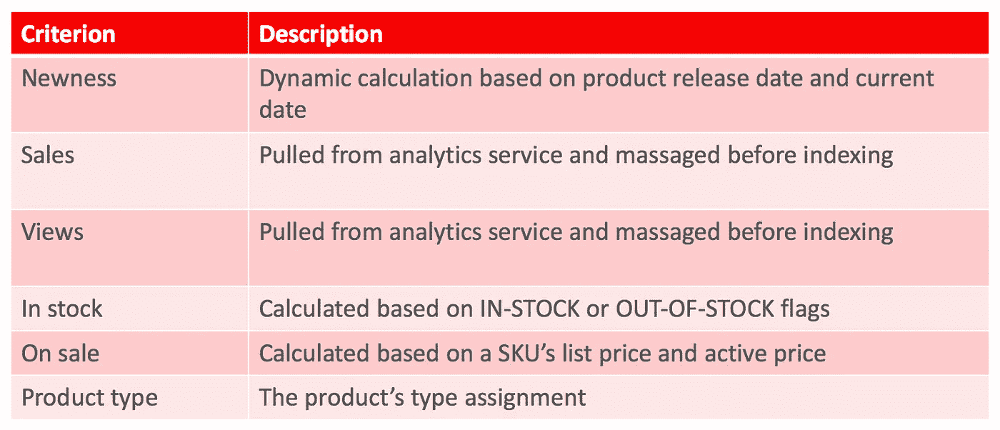
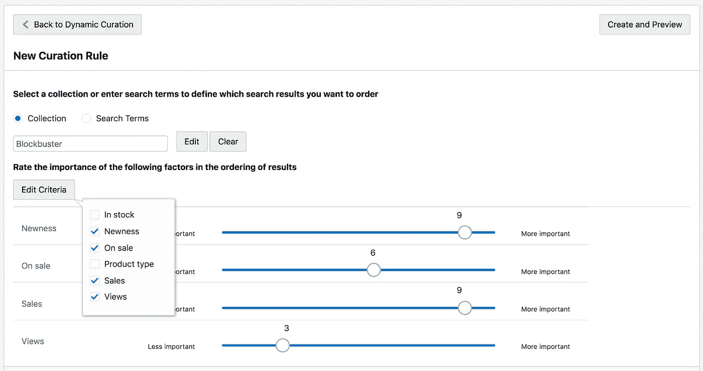
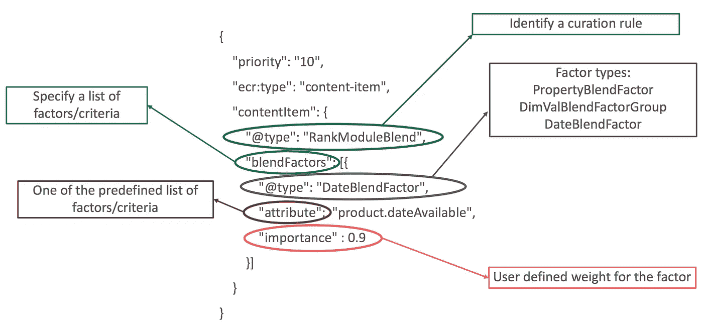

# 使用 Oracle 商务云对产品列表页面进行动态监管

> 原文：<https://medium.com/oracledevs/dynamic-curation-of-product-listings-with-oracle-commerce-cloud-3a6de6f01450?source=collection_archive---------0----------------------->

在 Oracle 商务云，我们努力为客户构建和配备强大的 API 和工具来管理他们的商务网站。我们最近发布了一组新的 API 和工具，允许我们的客户创建可以影响向购物者展示的产品列表顺序的规则。我们称之为“动态策展”。让我们来看一些使用案例，看看您何时会想要使用此功能:

1.  对于搜索“iPhone”的购物者来说，最热门的搜索结果应该包括以下几个方面:(a)浏览次数最多的产品，比如最新款的 iPhone；(b)最畅销的产品，比如 lightning cables
2.  在女装系列中，优先考虑最新、最畅销和有货的产品
3.  默认情况下，将库存和打折产品推至列表顶部

如您所知，支持 Oracle Commerce storefronts 的导向搜索引擎提供了各种排名模块，可用于影响导航和搜索结果的顺序。当然，当购物者在网站上导航和浏览产品时，他们可以从提供给他们的选择列表中明确指定排序顺序(如“最高评级”或“价格从低到高”)，这是一种标准的在线购物体验。为了提升购物者的体验并支持我上面提到的用例，guided search 在 OCC 版本 18C-MP 中发布了一个名为**混合排名器**的新排名器模块。排名器接受一组标准(也称为因素)，如“新”和“销售”，根据每个标准的重要性以及一些可调参数计算即时得分，并使用这个动态得分来影响导航和搜索结果的排序顺序。每个记录的混合分数在“DGraph”下的结果列表有效负载中传回。RankLabel.blend "属性。此外，在预览店面中，出于调试目的，打开了“Why Rank”。因此，preview 中的搜索响应有效载荷将包含一个解释，说明为什么某个特定记录会以这种方式排序。

# 标准

在动态监管的初始版本中，我们支持以下标准:



# 监管规则

购物者通常通过品牌登录页面、活动页面或简单的导航和搜索来浏览商业网站。因此，我们让商家能够根据购物者在网站中的位置来设置不同的动态监管标准，这才有意义。输入监管规则。可以指定基于购物者的搜索词或购物者当前正在查看的集合来触发规则。然后，我们的快速规则引擎将触发最具体的监管规则，它可以根据购物者的状态进行匹配。

# UI 工具

我们还发布了一个新的直观的 UI 工具，可以用来创建和管理这些动态监管规则。下面是截图:



# REST API

我们提供一个 REST API 来创建和管理监管规则。端点的基础路径是“https://<occ-admin-host>:<occ-admin-port>/GS admin/v1/cloud/content/ranking rules”。这个端点支持常见的可疑操作，GET、POST、PUT 和 DELETE。</occ-admin-port></occ-admin-host>

这里有一个示例 JSON 有效负载，可以发送到端点来创建监管规则:

```
{
    "priority": 10,
    "ecr:type": "content-item",
    "contentItem": {
        "[@type](http://twitter.com/type)": "RankModuleBlend",
        "blendFactors": [
            {
                "importance": 0.9,
                "[@type](http://twitter.com/type)": "DateBlendFactor",
                "attribute": "product.dateAvailable"
            },
            {
                "importance": 0.6,
                "[@type](http://twitter.com/type)": "DimValBlendFactorGroup",
                "attribute": "sku.analytics.onSale",
                "items": [{
                    "[@type](http://twitter.com/type)": "DimValBlendFactor",
                    "dvalID": "4183723715"
                }]
            }
        ]
    },
    "triggers": [{
        "exactLocation": false,
        "searchTerms": "shoes",
        "matchmode": "MATCHEXACT"
    }]
}
```

让我试着用这张图片来详细说明样本有效载荷:



监管规则的优先级可用于影响规则触发方面。它被视为专家模式选项。

# 下一步是什么？

在即将发布的版本中，我们将增强动态监管，从而为业务员提供更精细的控制。我们还在使用 ML 模型开发各种自动驾驶功能，以增强购物者体验。如果你对这些感兴趣，来和我们一起工作吧。我们正在[招聘](https://www.linkedin.com/jobs/view/principal-software-engineer-oracle-commerce-cloud-at-oracle-828805785/)！

> 本文表达的观点是我个人的，不代表我的雇主的观点。针对 Oracle 产品描述的任何特性或功能的开发、发布和时间安排仍由 Oracle 全权决定。