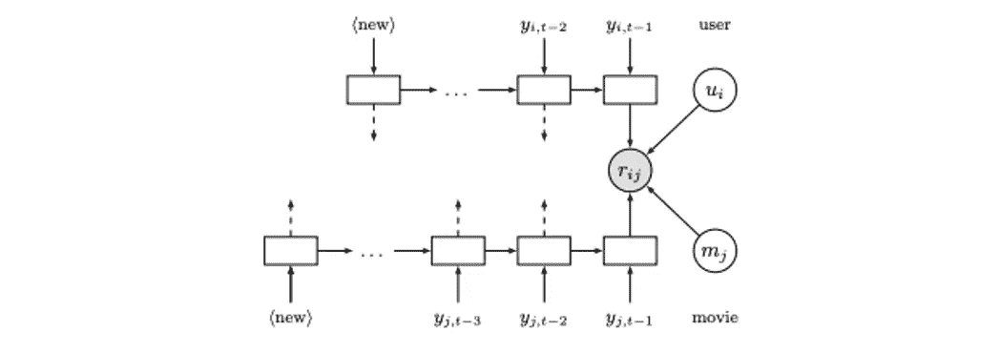
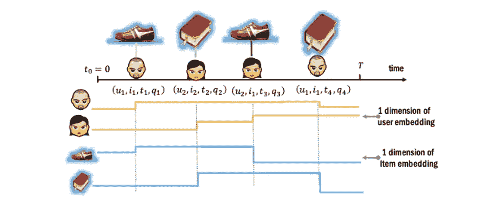
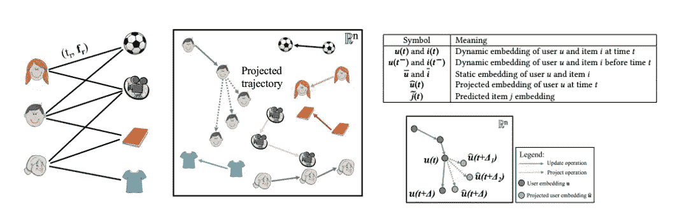
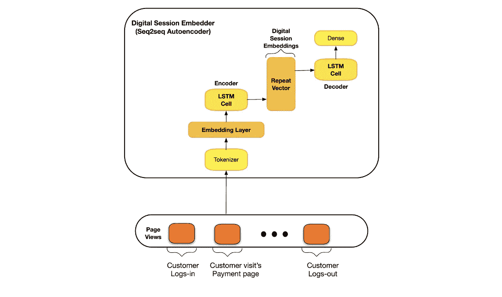
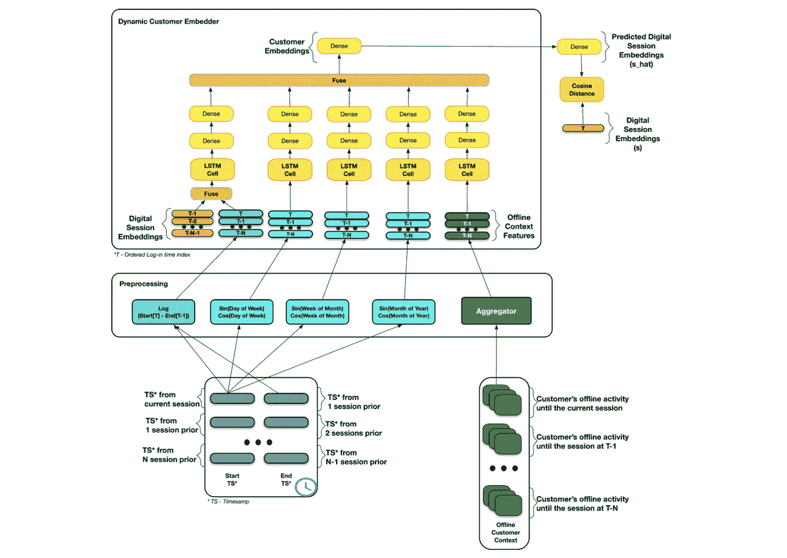

# 动态客户嵌入&理解客户意图

> 原文：<https://medium.com/capital-one-tech/dynamic-customer-embeddings-understanding-customer-intent-f1772f84dede?source=collection_archive---------1----------------------->

## 如何利用顺序推荐和表示学习来模拟客户行为

*高级软件工程师 Sam Sharpe 和数据科学高级经理 kart hik Rajasethupathy*

随着信用卡、奖励、贷款、银行、投资和预算等在线服务的激增，数字化已经进入了金融服务业。这一领域的创新大致反映了电子商务的类似趋势，电子商务公司已经掌握了个性化、营销和效率。从提供自动化客户服务到提醒客户注意潜在的欺诈交易，我们提供的所有必要服务只有通过深入了解我们的客户才能得到改善。

网络和移动应用程序上的在线活动打开了一个全新的视角，通过它可以获得这种理解。不仅数字活动总是在变化，而且与交易类似，这些活动是高度多维的，需要针对特定任务的特征工程。在我们最近提交给 ICML 2021 金融和电子商务应用表征学习研讨会的论文[金融服务应用的动态客户嵌入](https://arxiv.org/abs/2106.11880)中，我们探索了学习用户在线活动动态表征的方法，以简化和改善下游应用中数字活动数据的利用。

# 顺序推荐和表征学习

*Recurrent Recommender Network (*[*Wu et al 2017*](https://cseweb.ucsd.edu/classes/fa17/cse291-b/reading/rrn_wsdm2017.pdf)*)*

*Toy example of interactions and dynamic user embeddings in DeepCoevolve (*[*Dai et. al 2016*](https://arxiv.org/pdf/1609.03675.pdf)[*)*](https://arxiv.org/pdf/1609.03675.pdf))

自从引入协同过滤和著名的[网飞推荐挑战赛](https://www.netflixprize.com/assets/GrandPrize2009_BPC_BellKor.pdf)以来，在顺序推荐方面已经取得了大量的进展，该挑战赛采用固定的函数形式来模拟时间对推荐的影响。递归神经网络(RNN) 加速了对适应用户行为演变的方法的研究。

利用 RNNs 的第一种方法是[deep co evolve](https://arxiv.org/pdf/1609.03675.pdf)——一种由 RNN 参数化的点过程模型，用于捕捉用户和项目之间随着时间推移的相互影响——以及[递归推荐网络](https://cseweb.ucsd.edu/classes/fa17/cse291-b/reading/rrn_wsdm2017.pdf)——更新用于预测评级的用户/电影表示的 RNNs。

在过去几年中，其他方法调整了推荐系统如何结合其他上下文(例如，应用设备、用户特征等)。最近， [Kumar 等人](https://cs.stanford.edu/~srijan/pubs/jodie-kdd2019.pdf)在他们的框架 JODIE 中引入了一些重要而独特的概念。他们是第一个提出使用共享 RNN 对项目和用户进行相互递归更新的人。更重要的是，他们将这个问题重新定义为交互网络的表征学习，其主要目标是创建用户嵌入，可以预测用户接下来会与之交互的项目的嵌入。

*Illustration of the JODIE recommendation framework (*[*Kumar et al 2019*](https://cs.stanford.edu/~srijan/pubs/jodie-kdd2019.pdf)*)*

# 数字客户嵌入的自我监督 RNN 框架

受朱迪和 Spotify 的[推荐框架](https://labtomarket.files.wordpress.com/2020/08/recsys2020.pdf)的启发，我们设计了一种方法来学习 Capital One 用户在线活动的动态表示。

我们将每个客户的点击流事件序列(例如，页面浏览或操作)，从登录开始到注销结束，视为单个数字会话，并通过 seq2seq 自动编码器将每个会话编码到嵌入中。

*Embedding of digital sessions via seq2seq autoencoders (*[*Chitsazan et al. 2021*](https://arxiv.org/abs/2106.11880)*)*

我们联合对嵌入的客户会话序列以及时间和财务环境进行建模，以充分表现用户的隐含意图和客户行为的时间动态。

我们可以在这个序列中的任何一点利用客户的潜在表现，更有效地预测下一次会话的意图，预测客户服务呼叫，并识别账户接管。有关我们方法的更多细节、与之前动态推荐任务的比较以及各种下游应用的结果，请查看我们的论文[面向金融服务应用的动态客户嵌入](https://arxiv.org/abs/2106.11880)！

*Dynamic Customer Embedding framework (*[*Chitsazan et al. 2021*](https://arxiv.org/abs/2106.11880)*)*

# 资本一号动态客户嵌入的应用与部署

通过动态客户嵌入，我们已经表明，客户以前的数字活动是数字意图、行为偏好和未来活动预测的代表。因此，Capital One 的第一个应用是帮助客户找到与其账户相关的服务信息和见解，并帮助 Capital One 服务代理选择最佳的数字渠道与客户沟通。

为了支持这些应用程序，我们将客户嵌入部署为每天运行多次的批量评分作业。在每个批处理运行之后，我们用最近的活动刷新现有客户的表示，并且还为新活跃的客户生成表示。一旦刷新，就会触发一个作业，将我们的嵌入发布到我们的集中式特征平台。这个特性平台通过 API 提供嵌入服务——这将使这些和其他下游应用程序能够按需消费和利用表示。

我们的数字资产(页面、事件、布局等)和/或其他外部事件(如新冠肺炎)的任何重大变化，都可能导致源数据和客户表述的漂移。为了检测这种变化，我们部署了一个监控解决方案，该解决方案根据每个客户的新旧表示之间的余弦距离分布的变化来触发警报。通过这种监控，我们可以检测、警告和响应表征中的大变化。

# 结论

我们在 Capital One 不断发展我们的建模框架，以捕捉和应对客户行为的细微变化。[表示学习](https://www.capitalone.com/tech/machine-learning/navigating-dynamics-of-financial-embeddings-over-time/)和[时序建模](https://www.capitalone.com/tech/machine-learning/machine-learning-for-temporal-data-in-finance/)仍然是为 Capital One 的团队提供有意义的功能以构建有效、个性化的系统来实现最佳客户体验的基本构件。查看我们的[论文](https://arxiv.org/abs/2106.11880)了解更多详情！

# 参考

《金融服务应用的动态客户嵌入》arXiv 预印本 arXiv:2106.11880 (2021)。

[戴，，等.【深度协同进化网络:嵌入用户和项目特征的推荐研究】arXiv 预印本 arXiv:1609.03675 (2016)。](https://arxiv.org/pdf/1609.03675.pdf)

[库马尔、斯里扬、张和朱尔莱斯科维奇。"预测时间交互网络中的动态嵌入轨迹."第 25 届 ACM SIGKDD 知识发现国际会议论文集&数据挖掘。2019.](https://cs.stanford.edu/~srijan/pubs/jodie-kdd2019.pdf)

吴，赵远，等.“递归推荐网络”第十届 ACM 网络搜索和数据挖掘国际会议论文集。2017.

*披露声明:2021 首创一号。观点是作者个人的观点。除非本帖中另有说明，否则 Capital One 不隶属于所提及的任何公司，也不被这些公司认可。使用或展示的所有商标和其他知识产权是其各自所有者的财产。*

【https://www.capitalone.com】最初发表于**。**