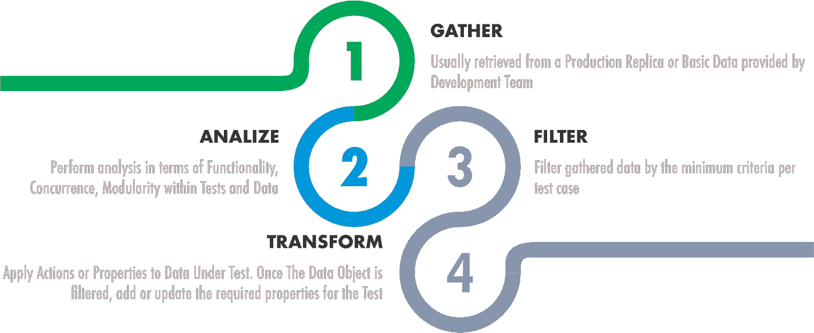

# 自动化测试的动态数据

> 原文：<https://medium.com/globant/dynamic-data-for-automated-testing-41e920c2ddb2?source=collection_archive---------1----------------------->

**简介**

用于测试目的的数据管理总是一个挑战。在测试执行的时候可能会发生很多事情。

可能你们中的许多人都有过这样的经历:在并行执行测试用例时得到不同的结果，数据在不同的测试用例中被改变并且不能被再次使用，数据库充满了随机的测试数据，等等。

所以，我们先减速再加速吧。我们需要对我们向测试用例添加测试数据的方式有信心。

**解决方案**

通常，在较低环境中处理数据的第一个策略是复制生产数据并使用它。

好吧，这是对初学者来说最好的情况。

**收集**数据。通过从生产中获取副本，或者在 SDLC 的早期阶段使用开发团队提供的数据。这是第一步。

我们该怎么处理这个？……我们应该继续**分析**我们将要自动化的不同场景，并按照模块、功能、相关数据等对它们进行分类。

这一步真的很重要，因为它将允许我们识别可以在一个测试用例或一组测试用例中使用的数据。

我举个例子:。假设我们的应用程序有某些功能阻塞了应用程序的一部分。现在，我们还拥有某些功能来解除对应用程序某一部分的阻止。那么，如果我们对同一个模块并行运行两个测试用例，会发生什么呢？对！！这很有可能会失败。因为我们将同时阻塞和解除阻塞同一个模块。

这不仅是在验证结果的时候，也是在设置测试的先决条件的时候。我们可以在一个场景中解除模块的阻塞，以便能够将它作为实际的测试用例流来解除阻塞，而在第二个场景中则相反。因此，在这种情况下，我们可能会在更早的步骤中失败。

所以这是值得考虑的。如果我们要处理可能影响相同数据的操作，让我们确保它不是关于相关的功能，否则我们应该将它们分组以顺序运行。

还会发生什么？…在我们的应用程序中，我们可能有删除用户的特定功能。也许我们有一些场景测试与所述用户相关的东西。因此，我们在这里有几个选项:我们可以重新创建用户作为先决条件，我们可以每次都创建一个新用户，我们可以有一个不同的用户，并确保它不会在其他地方使用，所以它永远不会被删除，等等。

如果我们采取最后一种方法。我们有一个用户，并确保它不被用于其他地方。这可能会发生很多次，我们需要几个用户来测试具有相同行为的案例。如果我们有成千上万的测试案例，这可能会成为一场噩梦。在这种情况下，一个好的方法是出于删除目的隔离一个帐户(该帐户可以在需要时重新创建)，当帐户遭受诸如删除、rol 权限更改等转换时，需要帐户隔离方法。对于其余的场景，我们可以在允许的情况下在相同的用户帐户下工作。

现在你看到了**减慢**的重要性，并对此进行深入分析，看看如何对我们的测试用例进行分类。

一旦我们收集了一些数据，我们需要看看我们需要什么。

让我们来看一个场景，我们需要在应用程序中为用户添加一张照片。我们需要什么样的数据来创建这个场景？

例如，根据应用程序的行为，我们可能需要一个活跃的用户。

好的，所以我们需要两件事:一个用户标识符，并确保它是活跃的。

我们已经拥有的是用户标识符。现在，无论它是否处于活动状态，我们都可以管理它。

所以这里我们有两个步骤:首先我们**过滤**数据寻找任何用户，第二步是**转换**所说的数据为我们测试所需要的。

所以我们有了实现的第一部分**过滤数据结构**，我们需要在我们的自动化项目中创建一个结构，它将负责为我们的场景提取基本数据。你可以通过 API、数据库、文件等来实现。

我们还需要一些**转换数据结构**，在那里我们可以应用这些特定于我们的测试用例的行为或属性。这里最好的方法是通过开发团队管理的过程来完成。即如果我们在应用程序中有激活用户的服务。我们应该使用该服务来完成它。在本例中，所述服务由开发团队管理，如果数据库中发生变化，他们将更改服务以处理数据库变化。如果你有专业知识和开发的支持，数据库处理可能是另一种方法。在不知道还会影响什么的情况下更改数据库中的某些内容并不是一个好主意。

最后，为了**加速**我们可能需要不止一个数据测试对象来同时运行测试用例，为了做到这一点，我们可以使用我们的过滤器来评估我们正在检索的寄存器数量，并根据测试实例所需的基本标准创建新的过滤器，并添加一个事件来根据开发团队管理的流程从头开始创建数据，就像我们对过滤后的数据应用操作或属性一样。

**结论**

从 Initial 数据馈送中过滤数据的事实允许我们使用随机数据，因为我们只为每个单独的测试输入基本标准，并且我们可以在过滤时获得任何结果。这迫使我们编写健壮的测试用例，这些测试用例不受数据的影响，而是受流的影响。

这种方法将帮助我们处理环境之间在数据方面的差异。永远不要硬编码，总是担心“仅测试流”。

请注意，我们遵循此方法的前提是假设待测数据不敏感。在这种情况下，我们应该考虑与数据混淆相关的策略，例如加密、令牌化、数据掩蔽等，即使这些环境受到控制，也适用于较低的环境。

我们可以应用几种数据管理策略，具体取决于我们正在进行的测试类型，例如剔除和嘲笑数据、进程(例如通过代理拦截)、测试环境虚拟化(我们可以在其中每次创建新数据并在测试前对其进行刷新)等。想一想最适合你的方法和快乐测试！！！