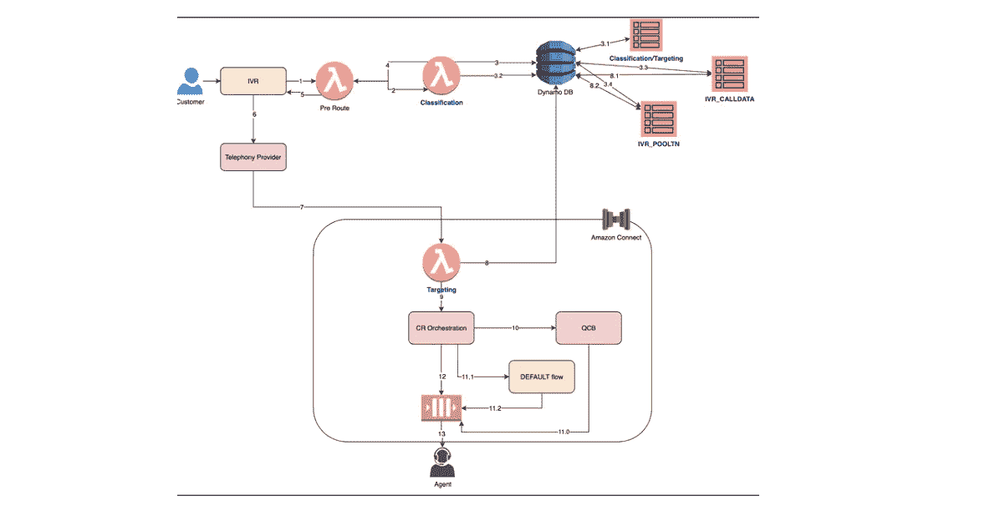

# 使用 Amazon Connect 路由客户呼叫的动态设计

> 原文：<https://medium.com/capital-one-tech/dynamic-design-for-routing-customer-calls-2bf3391d911?source=collection_archive---------4----------------------->

## Capital One 如何在我们基于云的联络中心生态系统中引入卓越工程

# 介绍

Capital One 是第一家宣布全面实施云战略的美国银行，我们的云迁移之旅已于 2020 年成功完成。这段旅程触及了 Capital One 的每一条业务线、每一种产品和每一个团队。对于我们的信用卡业务，工程团队在将我们的[联络中心迁移到云](https://aws.amazon.com/what-is-a-contact-center/)中发挥了关键作用。这些中心为 6000 万信用卡客户提供服务，超过 25000 名代理遍布世界各地，一年 24*7/ 365 天全天候工作，满足我们客户的需求。

作为 Capital One Card Tech 工程团队的技术负责人，我想分享一下我们如何通过利用 Lambda functions、DynamoDB 和 REST APIs 等云计算工具来实现属性外部化，并针对每个客户来电动态运行业务规则，从而转变了 Amazon Connect 生态系统。本文还将介绍路由领域的动态设计如何帮助缩短新功能的上市时间，以及我们如何优化运行引擎(RTE)成本和构建监控仪表板。

# 是时候采用新的联络中心解决方案了

2019 年，Capital One 信用卡代理商从传统的内部联络中心解决方案迁移到[亚马逊连接](https://docs.aws.amazon.com/connect/latest/adminguide/what-is-amazon-connect.html)，这是亚马逊的[基于云的联络中心解决方案](https://aws.amazon.com/solutions/case-studies/capital-one-amazon-connect/)。迁移到 Amazon Connect 为 Capital One 带来了一些立竿见影的效果，包括可伸缩性、成本(每秒使用量而不是每个席位)以及对动态网络变化的反应能力。

正如我们在 Amazon 案例研究中提到的，[Amazon Connect 的灵活性让我们可以在几周内添加新功能，而不是像我们的本地解决方案那样需要三到六个月。](https://aws.amazon.com/solutions/case-studies/capital-one-amazon-connect/)鉴于我们所处的高度监管的商业环境，以及网络中的大量呼叫和变化，Capital One 发现了一些额外的机会来简化迁移后的呼叫中心运营和管理。

# 持续改进的机会

Amazon Connect 主要用于在任何给定的时间点将客户呼叫路由到正确的代理。根据设定的参数对每个电话进行评估，由于向信用卡客户提供各种产品套件，Capital One 有一套复杂的分类和目标规则来路由电话。由于要管理数百个队列，并且所有属性都硬编码在联系流中，工程团队迁移后的主要工作是更新每个队列的联系流属性。

然而，我们的创新能力有限。考虑到呼叫中心每天的呼叫量，这些变化必须在非工作时间进行。此外，由于 2019 年 Connect 平台上缺乏 API，该团队仅限于手动部署，在活动和灾难恢复区域都需要数小时的手动配置。

# 卓越建筑工程

支持我们呼叫路由工作的工程团队发现了简化我们基于云的联络中心解决方案的机会。该团队决定将联系流和队列属性外部化到一个数据库中，并利用 AWS 无服务器 lambda 函数调用动态属性的能力，并在每次客户呼叫被路由到代理时实时执行业务规则。通过将来自[亚马逊的实时指标 API](https://docs.aws.amazon.com/connect/latest/adminguide/get-queue-metrics.html)的输出与在对客户呼叫进行分类和定位时利用的动态设计的输出相结合，我们能够简化我们联络中心运营的关键功能。这种动态设计利用了我们的企业 CICD 管道进行部署，这意味着任何更改都可以在美国工作时间进行部署，而不会影响呼叫中心的运营。

当 Capital One 完成对领先的企业对企业贸易信贷融资公司 [BlueTarp](https://enterprise.bluetarp.com/capital-one-to-acquire-bluetarp/) 的收购后，2020 年的一项关键活动是在 Amazon Connect 建立他们的联络中心，并让他们的 150 名代理加入进来。借助动态设计，工程团队仅用 72 小时就完成了设置和入职培训。如果团队必须对跨区域的所有非生产和生产区域中的所有属性进行硬编码，同样的工作至少需要三周时间。

Image: Dynamic design for Call routing in Amazon Connect

# 产品创新带来的持续改进

随着动态设计的推出，卡工程团队能够专注于利用 Amazon Connect 平台构建一些创新的解决方案。在 2020 年新冠肺炎疫情的高峰期，各行各业的联络中心的呼叫量飙升。在疫情高峰期的一段时间内，Capital One 联络中心的呼叫量很高，客户与代理互动的等待时间很长。

工程团队利用了亚马逊的排队回叫功能，并将其与我们的动态设计相结合。这使得顾客不必排队就能保留他们在队列中的位置；轮到他们的时候，收到一个一级代理商的回电。这种排队回电功能对客户产生了直接的积极影响，因为它消除了保持在线的需要，同时提供了从 Capital One 回电的保证。它还改进了整个网络中排队时间最长的呼叫的联系中心指标。

我们在 24 小时内推出了概念验证，并在大约四周内为整个 600 多个队列推出了解决方案。排队回电功能不仅有助于减轻我们联络中心的负担，还能帮助我们的客户避免长时间等待电话。当客户进行电话回访调查时，有明显的证据表明，客户对电话回访体验有积极的感受，Capital One 兑现了在电话回访活动中做出的承诺。从运营的角度来看，排队回拨功能有助于将客户挂断率降低 25%以上。它还有助于优化电话供应商因客户排队等候与代理通话而产生的成本。

Example feedback from customers & agents on queued call back functionality

# 优化运行引擎成本

为了进一步优化维护 Amazon Connect 平台时产生的运行引擎(RTE)成本，工程团队开发了一个运营门户，该门户与企业 SSO 和用于存储动态属性的数据库相集成。随着运营门户的推出，所有运营活动都作为自助服务功能转移到了运营团队，工程团队主要关注在平台上推出新的创新。这种动态设计的推出帮助我们减少了 87%的接触流量，这有助于优化与平台相关的 RTE 成本。

通过将联系流和队列属性外部化到外部数据库，并利用 lambda 函数和 API 调用它们，工程团队可以从云组件中以日志的形式访问大量新数据。通过访问日志，我们能够构建实时监控仪表板，并与企业警报系统集成，以便在错过基准时向我们发出警报。监控仪表板还充当所有利益相关者的“单一控制台”，这确保每个人查看相同(准确)的数据，并以相同的方式解释问题。

# 结论

Amazon Connect 使 Capital One 不仅能够以最佳成本按需扩展，还能提供关键的客户功能。实施动态设计将客户和代理的整个呼叫中心技术体验提升到了一个新的水平，并允许工程团队利用云组件、生成的日志和仪表板的强大功能来优化 RTE 成本，并缩短上市时间，从而为我们的客户提供创新的产品解决方案。

[*电脑照片*](https://www.freepik.com/photos/computer)*Diana . grytsku—*[*www.freepik.com*](http://www.freepik.com)

*披露声明:2021 资本一。观点是作者个人的观点。除非本帖中另有说明，否则 Capital One 不隶属于所提及的任何公司，也不被这些公司认可。使用或展示的所有商标和其他知识产权是其各自所有者的财产。*

*原载于*[*https://www.capitalone.com*](https://www.capitalone.com/tech/software-engineering/amazon-connect-dynamic-design-for-routing-calls/)*。*