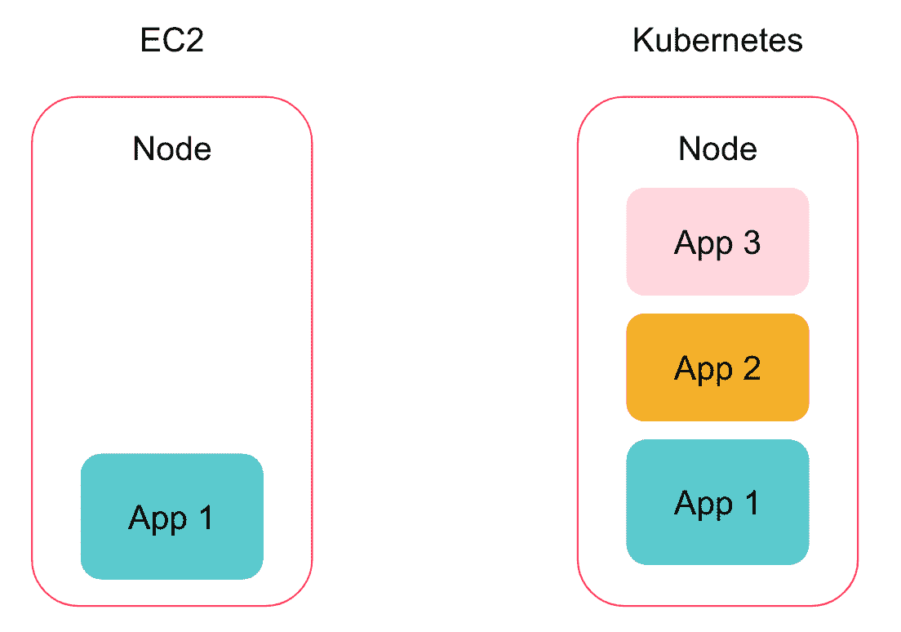
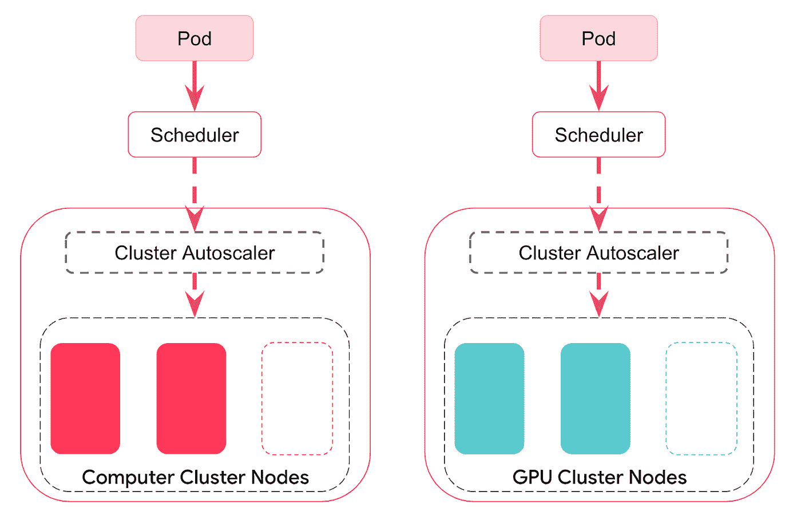
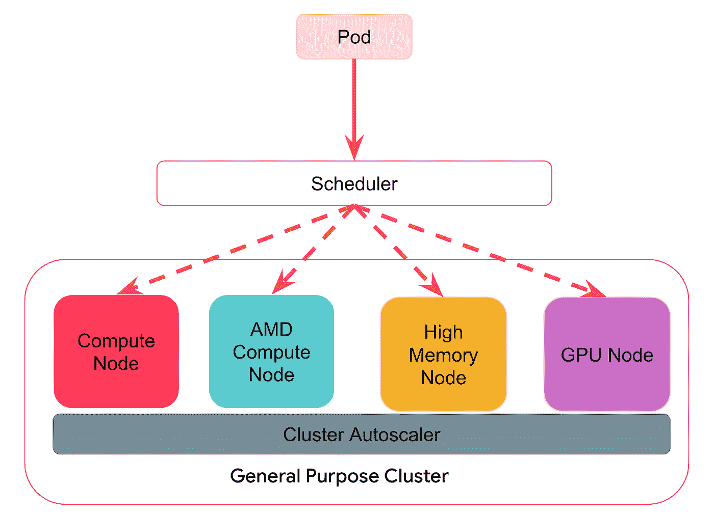
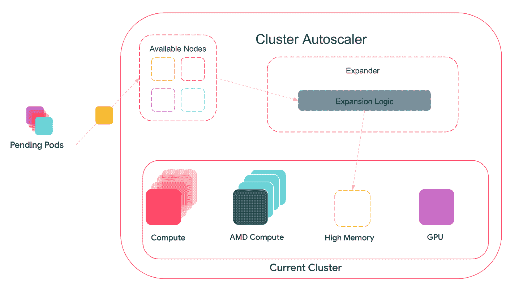
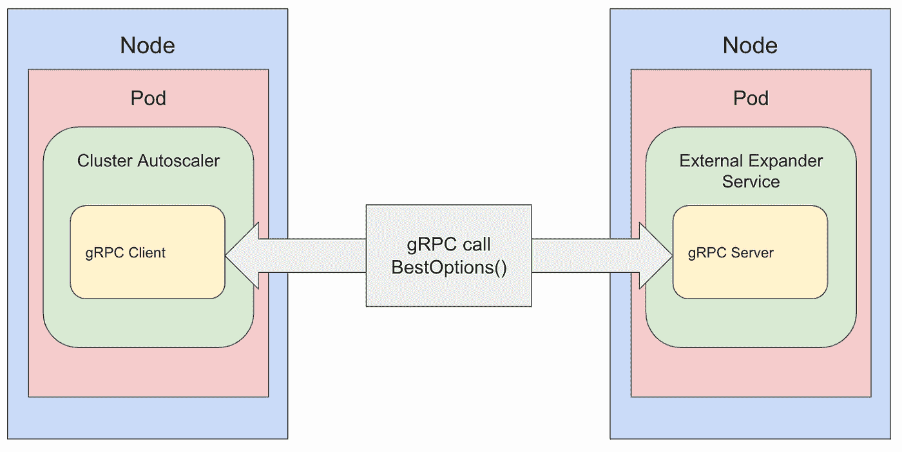

# Airbnb 上的动态 Kubernetes 集群扩展

> 原文：<https://medium.com/airbnb-engineering/dynamic-kubernetes-cluster-scaling-at-airbnb-d79ae3afa132?source=collection_archive---------0----------------------->

作者:[韩馥](https://www.linkedin.com/in/evansheng112/)，[大卫·摩利逊](https://www.linkedin.com/in/david-morrison-9419b110/)


# 介绍

运行 Airbnb 基础设施的一个重要部分是确保我们的云支出随着需求自动扩展，无论是在**还是**增长。我们的流量每天波动很大，我们的云足迹应该动态扩展以支持这一点。

为了支持这种扩展，Airbnb 利用开源容器编排系统 Kubernetes。我们还利用 OneTouch，这是一个构建在 Kubernetes 之上的服务配置接口，在之前的[文章](/airbnb-engineering/a-krispr-approach-to-kubernetes-infrastructure-a0741cff4e0c)中有更详细的描述。

在本帖中，我们将讨论如何使用 Kubernetes 集群自动缩放器动态调整我们的集群，并强调我们为 [sig-autoscaling 社区](https://github.com/kubernetes/community/tree/master/sig-autoscaling)贡献的功能。这些改进增加了可定制性和灵活性，以满足 Airbnb 独特的业务需求。

# Airbnb 上的 Kubernetes 集群

在过去的几年里，Airbnb 已经将几乎所有的在线服务从人工编排的 EC2 实例转移到 Kubernetes。如今，我们在近百个集群中运行数千个节点来应对这些工作负载。然而，这种改变不是一夜之间发生的。在此次迁移过程中，随着更多的工作负载和流量转移到我们的新技术体系，我们的底层 Kubernetes 集群设置不断发展，变得更加复杂。这一演变可以分为三个阶段。

阶段 1:同构集群，手动扩展

阶段 2:多种集群类型，独立自动扩展

阶段 3:异构集群，自动扩展

## 阶段 1:同构集群，手动扩展

在使用 Kubernetes 之前，服务的每个实例都在自己的机器上运行，并手动调整以获得适当的容量来处理流量增长。容量管理因团队而异，一旦负载下降，容量很少会被取消调配。

我们最初的 Kubernetes 集群设置相对简单。我们有几个集群，每个集群都有一个单一的底层节点类型和配置，只运行无状态的在线服务。随着其中一些服务开始转移到 Kubernetes，我们开始在多租户环境中运行容器化服务(一个节点上有许多 pod)。这种整合减少了资源浪费，并将这些服务的容量管理整合到 Kuberentes 控制平面的一个控制点。在这个阶段，我们手动扩展我们的集群，但这仍然是对以前情况的显著改进。



Figure 1: EC2 Nodes vs Kubernetes Nodes

## 阶段 2:多种集群类型，独立自动扩展

当更多不同的工作负载类型(每个都有不同的需求)试图在 Kubernetes 上运行时，我们的集群配置的第二阶段就开始了。为了满足他们的需求，我们创建了一个集群类型的抽象。“集群类型”定义了集群的底层配置，这意味着从节点类型到不同的集群组件设置，一个集群类型的所有集群都是相同的。

更多的群集类型导致更多的群集，我们最初手动管理每个群集容量的策略很快就失败了。为了解决这个问题，我们在每个集群中添加了 Kubernetes [集群自动缩放器](https://github.com/kubernetes/autoscaler)。该组件根据 pod 请求自动调整群集大小—如果群集的容量耗尽，并且可以通过添加新节点来满足挂起的 pod 请求，则 Cluster Autoscaler 会启动一个节点。同样，如果群集中存在长期未充分利用的节点，Cluster Autoscaler 会将这些节点从群集中删除。添加这个组件对我们的设置非常有用，节省了大约 5%的总云开支，以及手动扩展集群的运营开销。



Figure 2: Kubernetes Cluster Types

## 阶段 3:异构集群，自动扩展

当 Airbnb 的几乎所有在线计算都转移到 Kubernetes 时，集群类型的数量已经增长到 30 多种，集群的数量达到 100 多种。这种扩展使得 Kubernetes 集群管理变得繁琐。例如，集群升级必须在我们众多集群类型中的每一种上单独测试。

在第三阶段，我们的目标是通过创建“异构”集群来整合我们的集群类型，这些集群可以通过一个 Kubernetes 控制平面来适应许多不同的工作负载。首先，这大大减少了集群管理开销，因为具有更少、更通用的集群减少了要测试的配置数量。第二，随着 Airbnb 的大部分现在运行在我们的 Kubernetes 集群上，每个集群的效率为降低成本提供了一个很大的杠杆。通过整合集群类型，我们可以在每个集群中运行不同的工作负载。这种工作负载类型(有些大，有些小)的聚合可以带来更好的装箱和效率，从而提高利用率。有了这种额外的工作负载灵活性，我们就有更多的空间来实施复杂的扩展策略，而不局限于默认的集群自动扩展逻辑。具体来说，我们的目标是实现与 Airbnb 特定业务逻辑相关的扩展逻辑。



Figure 3: A heterogeneous Kubernetes cluster

当我们扩展和整合集群时，它们是异构的(每个集群有多个实例类型)，我们开始在扩展期间实现特定的业务逻辑，并意识到对自动扩展行为进行一些更改是必要的。下一节将描述我们对 Cluster Autoscaler 进行的一些更改，以使其更加灵活。

# 集群自动缩放改进

## 定制 gRPC 扩展器

我们对 Cluster Autoscaler 所做的最重要的改进是提供了一种新的方法来确定要扩展的节点组。在内部，Cluster Autoscaler 维护一个节点组列表，这些节点组映射到不同的扩展候选项，它通过对当前的一组挂起(不可调度)单元运行调度模拟来过滤掉不满足单元调度要求的节点组。如果有任何挂起的(不可调度的)单元，Cluster Autoscaler 会尝试扩展集群以容纳这些单元。满足所有 pod 要求的任何节点组都被传递给一个名为[扩展器](https://github.com/kubernetes/autoscaler/blob/master/cluster-autoscaler/FAQ.md#what-are-expanders)的组件。



Figure 4: Cluster Autoscaler and Expander

扩展器负责根据操作要求进一步过滤节点组。Cluster Autoscaler 有许多不同的内置扩展器选项，每个选项都有不同的逻辑。例如，缺省值是随机扩展器，它从可用选项中统一随机选择。另一个选项，也是 Airbnb 历史上一直使用的选项，是[优先级扩展器](https://github.com/kubernetes/autoscaler/tree/master/cluster-autoscaler/expander/priority)，它根据用户指定的分层优先级列表选择要扩展的节点组。

当我们转向异构集群逻辑时，我们发现默认的扩展器不够复杂，无法满足我们在成本和实例类型选择方面更复杂的业务需求。

作为一个虚构的例子，假设我们想要实现一个加权优先级扩展器。目前，priority expander 仅允许用户指定不同的节点组层，这意味着它将始终确定性地按顺序扩展层。如果一个层中有多个节点组，它将随机断开连接。在同一层中设置两个节点组，但在 80%的时间内扩展一个节点组，在 20%的时间内扩展另一个节点组，这种加权优先级策略在默认设置下是无法实现的。

除了当前支持的扩展器的限制之外，还有一些操作问题:

1.  Cluster Autoscaler 的发布渠道非常严格，更改在合并到上游之前需要时间进行审查。但是，我们的业务逻辑和期望的扩展策略在不断变化。开发一个扩展器来满足我们今天的需求可能无法满足我们未来的需求
2.  我们的商业逻辑是针对 Airbnb 的，不一定针对其他用户。我们针对我们的逻辑实现的任何更改都不会对上游做出有用的贡献

由此，我们提出了集群自动缩放中新扩展器类型的一系列要求:

1.  我们想要既可扩展又可供他人使用的东西。其他人在大规模使用默认扩展器时可能会遇到类似的限制，我们希望提供一个通用的解决方案，并向上游贡献功能
2.  我们的解决方案应该可以使用集群自动伸缩功能进行带外部署，并允许我们更快速地响应不断变化的业务需求
3.  我们的解决方案应该适合 Kubernetes 集群自动伸缩生态系统，这样我们就不必无限期地维护一个集群自动伸缩分支

根据这些要求，我们提出了一种设计，将扩展责任从集群自动缩放核心逻辑中分离出来。我们设计了一个可插拔的定制扩展器它被实现为 gRPC 客户端(类似于[定制云提供商](https://github.com/kubernetes/autoscaler/blob/68c984472acce69cba89d96d724d25b3c78fc4a0/cluster-autoscaler/proposals/plugable-provider-grpc.md))。这个自定义扩展器分为两个组件。

第一个组件是内置于 Cluster Autoscaler 中的 gRPC 客户端。该扩展器与 Cluster Autoscaler 中的其他扩展器遵循相同的接口，负责将有关有效节点组的信息从 Cluster Autoscaler 转换到已定义的 [protobuf](https://developers.google.com/protocol-buffers/docs/overview) 模式(如下所示)，并接收来自 gRPC 服务器的输出，以转换回供 Cluster Autoscaler 向上扩展的最终选项列表。

```
service Expander {
  rpc BestOptions (BestOptionsRequest) returns (BestOptionsResponse) 
}message BestOptionsRequest {
  repeated Option options;
  map<string, k8s.io.api.core.v1.Node> nodeInfoMap;
}message BestOptionsResponse {
  repeated Option options;
}message Option {
  // ID of node to uniquely identify the nodeGroup
  string nodeGroupId;
  int32 nodeCount;
  string debug;
  repeated k8s.io.api.core.v1.Pod pod;
}
```

第二个组件是 gRPC 服务器，它由用户编写。该服务器旨在作为单独的应用程序或服务运行，在选择要纵向扩展的节点组时，可以运行任意复杂的扩展逻辑，并具有从客户端传递的给定信息。目前，通过 gRPC 传递的 protobuf 消息是传递给 Cluster Autoscaler 中的扩展器的稍加转换的版本。

从我们前面提到的例子中，通过让服务器从优先级列表和 configmap 的加权百分比配置中读取，并相应地进行选择，可以相当容易地实现加权随机优先级扩展器。



Figure 5: Cluster Autoscaler and Custom gRPC Expander

我们的实施包括一个故障保护选项。建议使用该选项传入多个扩展器[作为集群自动缩放器的参数。使用此选项，如果服务器出现故障，Cluster Autoscaler 仍然能够使用回退扩展器进行扩展。](https://github.com/kubernetes/autoscaler/pull/4233)

由于它作为一个单独的应用程序运行，扩展逻辑可以使用 Cluster Autoscaler 进行带外开发，并且由于 gRPC 服务器可以由用户根据他们的需求进行定制，因此该解决方案是可扩展的，并且对于整个更广泛的社区是有用的。

在内部，Airbnb 自 2022 年初以来一直使用这一新的解决方案来扩展我们所有的集群，没有出现任何问题。它允许我们动态选择何时扩展某些节点组以满足 Airbnb 的业务需求，从而实现了我们开发可扩展的自定义扩展器的最初目标。

今年早些时候，我们的定制扩展器[被](https://github.com/kubernetes/autoscaler/pull/4452)接受到上游集群自动缩放器中，并将在下一版本(v1.24.0)中可用。

# 其他自动缩放改进

在我们迁移到异构 Kubernetes 集群的过程中，我们发现了许多其他的 bug 和可以对集群 Autoscaler 进行的改进。下文简要介绍了这些措施:

*   [没有容量的 AWS ASGs 的提前中止](https://github.com/kubernetes/autoscaler/pull/4489):通过调用 AWS EC2 端点检查 ASG 是否有容量，使集群自动缩放环路短路，以等待它试图旋转的节点，查看它们是否准备好。启用此更改后，用户可以更快、更正确地进行缩放。以前，使用优先级阶梯的用户在尝试更低优先级的 ASG 之前，必须在每次尝试 ASG 启动之间等待 15 分钟。
*   [缓存发布模板以减少 AWS API 调用](https://github.com/kubernetes/autoscaler/pull/4073):为 AWS ASG 发布模板引入缓存。这一变化使得我们可以使用大量的 ASG，这对于我们的通用集群策略至关重要。以前，对于空的 ASG(集群中没有节点)，集群自动缩放器会重复调用 AWS 端点来获取启动模板，从而导致 AWS API 的节流。

# 结论

在过去的四年里，Airbnb 在我们的 Kubernetes 集群设置方面取得了很大进展。将 Airbnb 最大部分的计算放在一个平台上提供了一个强大、统一的杠杆来提高效率，我们现在专注于推广我们的集群设置(想想[“牛，不是宠物”](http://cloudscaling.com/blog/cloud-computing/the-history-of-pets-vs-cattle/))。通过在 Cluster Autoscaler 中开发和使用更复杂的扩展器(以及修复 Autoscaler 的许多其他小问题)，我们已经能够实现围绕成本和混合实例类型开发复杂的、特定于业务的扩展策略的目标，同时还为社区贡献了一些有用的功能。

有关我们异构集群迁移的更多详细信息，请观看我们的 Kube-Con [演讲](https://www.youtube.com/watch?v=GCCSY7ERXj4&ab_channel=CNCF%5BCloudNativeComputingFoundation%5D)，我们今年也在 KubeCon EU，欢迎与我们交流！如果你对我们在这里描述的有趣问题感兴趣，我们正在招聘！查看这些开放的角色:

[基础设施工程经理](https://careers.airbnb.com/positions/3949745/)

[高级前端工程师](https://careers.airbnb.com/positions/3903900/)

[云基础设施高级工程师](https://careers.airbnb.com/positions/2623004/)

[软件工程师，可观察性](https://careers.airbnb.com/positions/4168852/)

[软件工程师，开发者基础设施](https://careers.airbnb.com/positions/3696687/)

# 承认

我们的 Kubernetes 集群设置的发展是许多不同合作者的工作。特别感谢陈志云，张健，本休斯，拉姆亚·克里希南，大卫·摩利逊，Sunil Shah，Jon Tai 和张龙，因为没有他们，这项工作是不可能的。

# ****************

*所有产品名称、标识和品牌都是其各自所有者的财产。本网站中使用的所有公司、产品和服务名称仅用于识别目的。使用这些名称、标志和品牌并不意味着认可。*