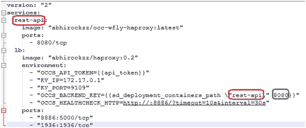
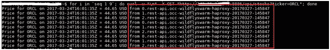

# Oracle 容器云上基于 Docker 的 Java EE 微服务的动态负载平衡

> 原文：<https://medium.com/oracledevs/dynamic-load-balancing-for-docker-based-javaee-microservices-on-oracle-container-cloud-2d04889fd2b7?source=collection_archive---------1----------------------->

在这篇博客中，我们将了解如何使用 [HAProxy](http://www.haproxy.org/) 在高可用性/负载平衡模式下运行基于 Docker 的 Java EE 微服务——所有这些都在 [Oracle 容器云](http://cloud.oracle.com/container)上进行。这里是一个快速概述

*   **使用 Wildfly Swarm 的 Java EE 微服务**:一个简单的(基于 JAX RS 的)REST 应用
*   HAProxy :我们将使用它对应用程序的多个实例进行负载平衡
*   **Docker** :我们的单个组件，即我们的微服务和负载平衡器服务，将打包为 Docker 映像
*   **Oracle 容器云**:我们将堆叠我们的服务，并在 Oracle 容器云上以可扩展+负载平衡的方式运行它们

# 应用

这个应用程序是一个非常简单的使用 JAX RS 的 REST API。它只是获取一只股票的价格

```
@GET     
public String getQuote(@QueryParam("ticker") final String ticker) {         Response response = ClientBuilder.newClient().                   target("https://www.google.com/finance/info?q=NASDAQ:" + ticker).                 request().get();         
  if (response.getStatus() != 200) {             
     return String.format("Could not find price for ticker %s", ticker);         
      }         
 String tick = response.readEntity(String.class);         
 tick = tick.replace("// [", "");         
 tick = tick.replace("]", "");         
 return StockDataParser.parse(tick)+ " from "+ System.getenv("OCCS_CONTAINER_NAME"); }
```

[Wildfly Swarm](http://wildfly-swarm.io/) 被用作(刚好够用的)Java EE 运行时。我们构建了一个简单的基于 WAR 的 Java EE 项目，并让 Swarm Maven 插件编织它的魔法——它自动地检测和配置所需的部分，并从您的 WAR 中创建一个胖罐子。

```
<build>
 <finalName>occ-haproxy</finalName>
 <plugins>
 <plugin>
 <groupId>org.wildfly.swarm</groupId>
 <artifactId>wildfly-swarm-plugin</artifactId>
 <version>1.0.0.Final</version>
 <executions>
 <execution>
 <goals>
 <goal>package</goal>
 </goals>
 </execution>
 </executions>
 </plugin>
 <plugin>
 <groupId>org.apache.maven.plugins</groupId>
 <artifactId>maven-compiler-plugin</artifactId>
 <version>3.1</version>
 <configuration>
 <source>1.7</source>
 <target>1.7</target>
 <compilerArguments>
 <endorseddirs>${endorsed.dir}</endorseddirs>
 </compilerArguments>
 </configuration>
 </plugin>
 <plugin>
 <groupId>org.apache.maven.plugins</groupId>
 <artifactId>maven-war-plugin</artifactId>
 <version>2.3</version>
 <configuration>
 <failOnMissingWebXml>false</failOnMissingWebXml>
 </configuration>
 </plugin>
 <plugin>
 <groupId>org.apache.maven.plugins</groupId>
 <artifactId>maven-dependency-plugin</artifactId>
 <version>2.6</version>
 <executions>
 <execution>
 <phase>validate</phase>
 <goals>
 <goal>copy</goal>
 </goals>
 <configuration>
 <outputDirectory>${endorsed.dir}</outputDirectory>
 <silent>true</silent>
 <artifactItems>
 <artifactItem>
 <groupId>javax</groupId>
 <artifactId>javaee-endorsed-api</artifactId>
 <version>7.0</version>
 <type>jar</type>
 </artifactItem>
 </artifactItems>
 </configuration>
 </execution>
 </executions>
 </plugin>
 </plugins>
</build>
```

**替代方案**:你也可以看看其他基于 JavaEE 的 fat JAR 风格框架，比如 [Payara Micro](http://www.payara.fish/payara_micro) 、 [KumuluzEE](https://ee.kumuluz.com/) 、 [Apache TomEE embedded](http://tomee.apache.org/advanced/tomee-embedded/index.html) 等。

让我们深入了解一下事实真相。

# 动态负载平衡

Oracle Container Cloud 的水平可伸缩性非常简单——您所需要做的就是生成应用程序的额外实例。当我们有一个负载平衡器来确保应用程序的消费者(用户或其他应用程序)不必处理单个实例的细节时，这是有效的——他们只需要知道负载平衡器的坐标(主机/端口)。问题是我们的负载平衡器不知道新产生的应用程序实例/容器。Oracle Container Cloud 有助于创建一个统一的**堆栈**，其中后端(在我们的示例中为 REST API)和(HAProxy)负载平衡器组件被配置为一个单元，可以轻松地进行管理和编排，并提供一个**动态** HAProxy 虚拟角色的方法

## 类固醇激素

我们将利用 Oracle Container Cloud Github 存储库中的[工件，在为](https://github.com/oracle/docker-images/tree/0c7f9a90e4420e313f3aeba865cd064c2d138463/ContainerCloud/images/haproxy) [confd](https://github.com/kelseyhightower/confd) 和 [runit](http://smarden.org/runit/) 定制的 Docker 映像之上构建一个专门的(Docker) HAProxy 映像。confd 是一个配置管理工具，在这种情况下，它用于动态地发现我们的应用程序实例。可以把它想象成一个迷你服务发现模块，它查询 Oracle Container Cloud service 中的本机[服务发现，以检测新的应用程序实例](http://docs.oracle.com/en/cloud/iaas/container-cloud/contu/managing-entries-service-discovery-database-enable-container-communication.html)

# 配置我们的应用程序在 Oracle Container Cloud 上运行

## 构建 Docker 图像

我们将首先构建所需的 Docker 映像。在演示中，我将使用 Docker Hub 上的公共注册中心(abhirockzz)。您可以选择使用自己的公共或私有注册表

请确保 Docker 引擎已启动并正在运行

## 构建应用程序 Docker 映像

下面是文档

```
FROM anapsix/alpine-java:latest 
RUN mkdir app WORKDIR "/app" 
COPY target/occ-haproxy-swarm.jar . 
EXPOSE 8080 
CMD ["java", "-jar", "occ-haproxy-swarm.jar"]
```

运行以下命令

```
docker build –t <registry>/occ-wfly-haproxy:<tag> . 
e.g. docker build –t abhirockzz/occ-wfly-haproxy:latest .
```

## 为 runit、confd、haproxy 构建 Docker 映像

我们将按顺序构建图像，因为它们是相互依赖的。首先，

*   克隆 [docker-images](https://github.com/oracle/docker-images) Github 存储库，并
*   编辑 ContainerCloud/images/build 目录中的 [vars.mk](https://github.com/oracle/docker-images/blob/0c7f9a90e4420e313f3aeba865cd064c2d138463/ContainerCloud/images/build/vars.mk) (Makefile)以输入您的 Docker Hub 用户名


现在执行下面的命令

```
cd ContainerCloud/images cd runit make image cd ../confd make image cd ../nginx-lb make image
```

## 检查您本地的 Docker 存储库

您的本地 Docker 存储库现在应该已经有了所有需要的图像


## 推送 Docker 图像

现在，我们将把 Docker 映像推送到一个注册中心(在本例中是我的公共 Docker Hub 注册中心)，以便在部署我们的应用程序堆栈期间可以从 Oracle Container Cloud 中提取它们。执行以下命令

根据您的设置调整名称(注册表和存储库)

```
docker login 
docker push abhirockzz/occ-wfly-haproxy 
docker push abhirockzz/haproxy 
docker logout
```

## 创建堆栈

我们将利用 YAML 配置文件来创建堆栈。它与 **docker-compose** 非常相似。在这个具体的例子中，注意服务名( **rest-api** )是如何在 **lb** (HAProxy)服务中被引用的



这进而向 HAProxy 服务提供关于 Oracle Container Cloud service registry 中的**键**的信息，该键实际上被 confd 服务(如前所述)用于自动发现新的应用程序实例。 **8080** 除了暴露的端口之外什么都没有，而且它是硬编码的，因为它也是服务注册中心的密钥的一部分。

从**堆栈**菜单中选择**新堆栈**开始该过程


点击**高级编辑器**，进入 YAML 内容


现在，您应该可以看到各个服务。输入**堆栈名称**并点击**保存**


## 开始部署

回到**堆栈**菜单，寻找新创建的堆栈，点击**部署**


为了测试负载平衡能力，我们将部署 *3 个实例*我们的 **rest-api** (后端)服务，并坚持使用 **lb** (HAProxy)服务的*一个实例*


几秒钟后，您应该看到所有容器都处于**运行**状态——在本例中，三个容器用于我们的服务，一个用于 ha 代理负载平衡器实例


检查 Service Discovery 菜单，验证每个实例在此处都有条目。如前所述，这由 **confd** 服务进行自省，以自动检测我们应用程序的新实例(它会自动添加到这个注册表中)


# 试验

我们可以通过 HAProxy 访问我们的应用程序。我们需要知道的只是运行 HAProxy 容器的主机的公共 IP。我们已经映射了用于访问下游应用程序的端口 8886(参见下面的快照)


使用下面的 curl 命令进行测试

```
for i in `seq 1 9`; do curl -w "\n" -X GET "http://<haproxy-container-public-IP>:8886/api/stocks?ticker=ORCL"; done
```

我们所做的就是调用 9 次，只是为了查看负载平衡的运行情况(在三个实例中)。这里有一个结果。请注意，突出显示的文本指向提供响应的实例——它在三个实例中均衡负载



# 放大…并再次检查

您可以简单地扩大堆栈并重复同样的操作。导航到您的部署并单击**更改缩放比例**


一段时间后，您将看到应用程序的其他实例(在我们的例子中是五个)。再次执行该命令，验证负载平衡是否按预期运行


这篇博文到此为止。

干杯！

> 本文表达的观点是我个人的观点，不一定代表甲骨文的观点。