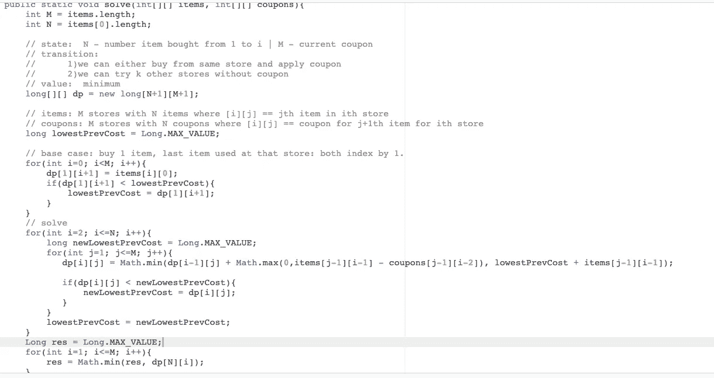

# 动态编程 1—边做边学

> 原文：<https://medium.com/quick-code/dynamic-programming-learning-by-doing-bba46701cb0b?source=collection_archive---------0----------------------->

# 1.网上购物(中型)—厨师

# 问题:

她从网上商店购买商品。两家商店里同样的商品价格不同。她总共需要购买 **N** 件物品。她可以在任何一家商店购买每一件商品。所有的商店都提供一定的折扣。如果她在一家商店购买了第 *i* 件商品，她将获得同一家商店第 *i+1* 件商品的优惠券。但是如果她从另一家商店购买第 i+1 件商品，她就不能使用折扣券。

告诉她获得所有物品的最少花费。

# 方案一:蛮力 O(M * M^N)

我们可以尝试各种商店组合来购买。我们知道有 M^N 可能的组合，要迭代和计算花费 O(M)时间。我们通过从购买 0 件商品、1 件商品、2 件商品……一直到 N 件商品的迭代来做到这一点。当我们购买 N 件商品时，我们必须更新我们的最低成本。

请注意，我们在这里重新计算了许多子问题，因此，如果我们计算去一些商店的最小成本，我们希望能够节省该值。这是正在使用的 DP 的指标。

# 解决方案 2:动态规划 O(M N)

如上所述，我们需要存储某种状态，以便我们不会再次重新计算。这种状态能是什么？这是寻找动态规划解决方案最棘手的部分之一，可能需要一些批判性的分析才能想到。

我们状态的一个自然参数可能是我们购买的物品数量。注意在我们的**强力**解决方案中，我们已经迭代了我们购买的商品数量。我们将使用相同的状态参数:**我们购买的商品数量。**

**当前状态参数:
1。我们购买的物品数量**

好了，我们有了第一个参数，但是这足以记录信息来解决这个问题吗？不完全是。请注意，为了进入我们购买的下一个项目，我们必须相应地计算成本。如果我们去同一家商店，那么我们的成本计算是不同的，因为我们使用优惠券。很自然，这让我们想到了另一个参数:**我们购买的最后一个商品商店。**

**完成我们的状态:
状态:
I—#我们购买的物品
j —商店#我们从**购买了最新的物品

这样够了吗？是的，似乎是这样，我们的直觉说是的，所以让我们继续我们的过渡和基本情况。

**基本情况:所有 j 个商店的 state(1，j)** 让我们为我们的状态参数想一个简单的数字。我们可以只买第一个项目，所以 state(1，j)。我们如何计算从商店 j 购买第一件商品的最小成本？嗯，我们可以从 j 商店买那件商品。

**过渡:**

好，我们有所有 j 的所有状态(1，j)。现在，用这个我们如何计算所有 j 的状态(2，j)？我们知道，对于 state(2，j)，即从商店 j 购买前两件商品和第二件商品的最小成本，我们可以迭代购买第一件商品的所有成本，然后将其更新为这些选项中的最小值。更正式地说，

state(2，j) =对于从 1，…，M 开始的所有商店 k，我们将做:
如果(k == j)那么我们可以使用我们的优惠券 so = state(1，j) + item_cost-discount
否则:那么我们不能使用我们的优惠券 so = state(1，k) + item_cost

我们希望取所有这些计算值的最小值，并为其设置 state(2，j)= 1。

我们可以对此进行概括，说:
state(i，j) = min of all state(i-1，k) + item_cost-(如果适用的话折扣)。

**解题**

最后，我们计算所有 j 的最小状态(N，j)并返回。这很直观，因为我们希望找到购买 N 件商品的最小值，其中最后一件商品是所有可能的商品。

**运行时复杂度** 有 O(MN)个状态，对于每个状态，我们通过迭代它之前的每 M 个状态来计算它的最小代价。因此，O(M N)

# 解 3(最优解):动态规划 O(MN)

让我们将时间复杂度降低 O(M)。注意，对于每个状态，我们迭代 M 个先前的状态来计算它的最小成本。我们能减少吗？

是的，对于每个第 I 项(即对于状态(I，…))，我们可以计算购买前 I 项的最小成本，并保存该值。我们可以如下使用这个保存的值:

在我们的基本情况下，当我们计算所有 j 的 state(1，j)时，我们保存所有 state(1，j)的最小成本，并保存该值。

然后，当我们计算 state(2，j)时，不是遍历每个 state(1，j)并计算最小成本，我们可以自己想，对于 state(2，j)，我们可以从同一个供应商处购买并获得优惠券，即，我们可以从不同的供应商处购买 state(2，j) = state(1，j) + item_cost-coupon
或
，即，我们保存的所有 j 的 state(1，j)的最小成本。

所以形式上:state(2，j) = min( state(1，j)+ item_cost-coupon)，saved_value + item_cost)。

Tada，我们用 O(MN)就解决了

