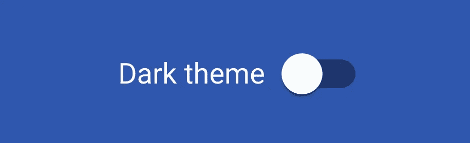
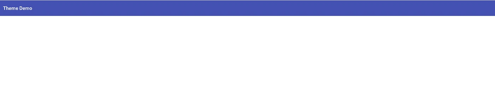
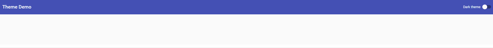
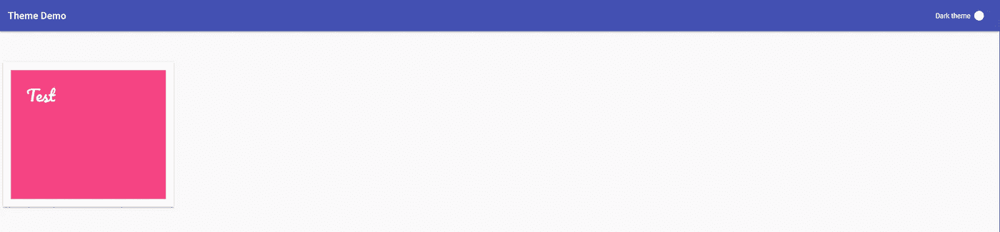
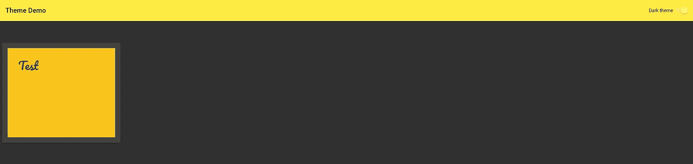

# 棱角材料的动态主题

> 原文：<https://medium.com/compendium/dynamic-themes-in-angular-material-b6dc0c88dfd7?source=collection_archive---------0----------------------->

*我们通过本文创建的动态主题的工作演示可以在* [*这里*](https://tallang-theme-demo.firebaseapp.com/) *找到，而源代码位于* [*这里*](https://github.com/eTallang/theme-demo) *。*



# 设置场景

如果你使用过[角度素材](http://material.angular.io/)，你可能在某个时候配置了自己的主题。你可能已经注意到，你可以使用浅色主题或深色主题来定义你的主题，如下所示:

```
@import '~@angular/material/theming';

@include mat-core();
$primary: mat-palette($mat-indigo);
$accent: mat-palette($mat-pink, A200, A100, A400);
$warn: mat-palette($mat-red);
$theme: mat-light-theme($primary, $accent, $warn); // Or mat-dark-theme

@include angular-material-theme($theme);
```

这将根据你的选择，在你的有棱角的材质组件上给你一个亮或暗的主题。不幸的是，几乎没有关于如何在不刷新页面的情况下动态改变主题的信息。我做了一点研究，找到了创建动态主题的解决方案，这对许多人来说似乎是显而易见的，而其他人可能会觉得它很有用。通过这篇文章，我们将逐步创建一个最小的 [Angular](https://angular.io/) 应用程序，使用 [Angular CLI](https://cli.angular.io/) 创建一个具有动态主题的 web 应用程序。我将不描述带有[角度材料](https://material.angular.io/guide/getting-started)的角度应用的基本[设置，因为这在它们各自的文档中有详细描述。](https://github.com/angular/angular-cli#generating-and-serving-an-angular-project-via-a-development-server)

注意:确保在创建应用程序时选择 SCSS 作为默认的样式扩展。这可以通过 Angular CLI 中的参数来实现:

```
ng new theme-demo --style scss
```

# 基本的东西

在使用 [Angular CLI](https://cli.angular.io/) 初始化 Angular app，并添加 [Angular Material](https://material.angular.io/) 和 [Angular CDK](https://material.angular.io/cdk/categories) 作为依赖之后，我们将为我们的材质主题创建一个 SCSS 文件。我们把它放在一个 styles-folder 中，只是为了便于结构，因为我们以后会添加更多的主题样式文件。

```
touch src/styles/material-theme.scss
```

在 material-theme.scss 中配置您的主题:

```
@import '~@angular/material/theming';

@include mat-core();

$primary: mat-palette($mat-indigo);
$accent: mat-palette($mat-pink, A200, A100, A400);
$warn: mat-palette($mat-red);
$theme: mat-light-theme($primary, $accent, $warn);

@include angular-material-theme($theme);
```

通过在 styles.scss 中导入我们的材质样式来完成主题配置:

```
@import './styles/material-theme';
```

我们现在应该完成了基本的设置。我们可以通过在页面中添加工具栏来测试这一点。

# 创建我们的第一个组件

使用 Angular CLI 创建具有相应组件的模块:

```
ng g module toolbar
ng g component toolbar
```

在我们的新模块中导入 MatToolbarModule，以便使用 Angular Material 提供的工具栏:

```
import { NgModule } from '@angular/core';
import { CommonModule } from '@angular/common';
import { MatToolbarModule } from '@angular/material/toolbar';

import { ToolbarComponent } from './toolbar.component';

@NgModule({
  imports: [
    CommonModule,
    MatToolbarModule
  ],
  declarations: [ ToolbarComponent ],
  exports: [ ToolbarComponent ]
})
export class ToolbarModule { }
```

使用我们工具栏组件模板中的“角度材质”工具栏:

```
<mat-toolbar color="primary">
  <mat-toolbar-row>
    <h1>Theme Demo</h1>
  </mat-toolbar-row>
</mat-toolbar>
```

为了使用该工具栏，我们需要在应用模块中导入工具栏模块:

```
import { NgModule } from '@angular/core';
import { BrowserAnimationsModule } from '@angular/platform-browser/animations';
import { CommonModule } from '@angular/common';

import { ToolbarModule } from './toolbar/toolbar.module';
import { AppComponent } from './app.component';

@NgModule({
  declarations: [ AppComponent ],
  imports: [
    CommonModule,
    BrowserAnimationsModule,
    ToolbarModule
  ],
  bootstrap: [ AppComponent ]
})
export class AppModule { }
```

然后通过引用工具栏组件的选择器在 app.component.html 中呈现工具栏组件:

```
<app-toolbar></app-toolbar>
```

你现在应该有类似下图的东西。不错！



Our toolbar is now visible on the top of our page

# 差不多了(关于设置)

作为设置基本应用程序的最后一步，我们需要用 CSS 类“mat-app-background”包装整个页面。根据 [Angular Material 文档](https://material.angular.io/guide/theming#using-a-pre-built-theme)，这个 CSS 类会为你的应用提供一个默认的背景颜色，也会根据你的主题而改变。我们可以在应用程序中增加这个 CSS 类，方法是在 app.component.html 中的内容周围添加一个 div 元素:

```
<div class="mat-app-background">
  <app-toolbar></app-toolbar>
</div>
```

# 好东西

在这一点上，我们有一个由 Angular Material 管理的带有工具栏和背景色的网页。我们的下一步是添加第二个主题，黑暗主题。

# 添加我们的黑暗主题

通过在 HTML 中引用 CSS 类，可以在 CSS 类中配置新主题，并在应用程序中使用。在我们的材料中添加一个新主题-theme.scss:

```
@import '~@angular/material/theming';

@include mat-core();

$primary: mat-palette($mat-indigo);
$accent: mat-palette($mat-pink, A200, A100, A400);
$warn: mat-palette($mat-red);
$theme: mat-light-theme($primary, $accent, $warn);

@include angular-material-theme($theme);

// Our dark theme
.dark-theme {
  color: $light-primary-text;
  $dark-primary: mat-palette($mat-yellow);
  $dark-accent: mat-palette($mat-amber, A400, A100, A700);
  $dark-warn: mat-palette($mat-red);
  $dark-theme: mat-dark-theme($dark-primary, $dark-accent, $dark-warn);

  @include angular-material-theme($dark-theme);
}
```

对$light-primary-text 的引用是一个 SCSS 变量，可以在有角度的材质主题中找到。你当然可以选择你喜欢的深色主题的字体颜色。我们现在可以在 app.component.html 中使用您的新主题:

```
<div class="dark-theme">
  <div class="mat-app-background">
    <app-toolbar></app-toolbar>
  </div>
</div>
```

如果您签出您的更改，您现在应该看到您的黑暗主题应用到您的应用程序。不断进步！

# 使其切换

如果没有任何控件来切换的话，我们的动态主题是没有用的！因此，让我们添加一个幻灯片切换到我们的工具栏。

```
<mat-toolbar color="primary">
  <mat-toolbar-row>
    <h1>Theme Demo</h1>
    <mat-slide-toggle>Dark theme</mat-slide-toggle>
  </mat-toolbar-row>
</mat-toolbar>
```

现在在你的工具栏中应该可以看到一个滑动开关。在本文顶部的工作演示中，我冒昧地将滑动开关移到了工具栏的右侧。这只是一个样式首选项，可以通过使用 mat-toolbar-row 上的 flexbox 来完成。参见源代码中的示例。

# 核心部分

Angular 中远程组件之间通信的一种常见模式是使用共享服务。该模式(以及其他通信模式)在[角度文档](https://angular.io/guide/component-interaction#parent-and-children-communicate-via-a-service)中有详细描述。关于[核心模块模式](https://angular.io/guide/styleguide#core-feature-module)，我们可以在我们的应用程序中创建一个核心模块，并创建一个服务来管理黑暗主题的状态:

```
ng g module core
ng g service core/services/theme
```

为了让我们的主题服务发布对所有监听组件的更改，我们使用 rxjs:

```
import { Injectable } from '@angular/core';
import { Subject } from 'rxjs/Subject';

@Injectable()
export class ThemeService {
  private _darkTheme = new Subject<boolean>();
  isDarkTheme = this._darkTheme.asObservable();

  setDarkTheme(isDarkTheme: boolean): void {
    this._darkTheme.next(isDarkTheme);
  }
}
```

这就是事情的全部。该服务将提供一个可观察的 isDarkTheme，组件可以订阅它以了解黑暗主题是否被启用。希望改变黑暗主题状态的控制器可以通过调用 setDarkTheme 函数来改变它，并提供一个新的状态。记住将我们的主题服务添加到核心模块中的 providers-array，最后在 App 模块中导入核心模块。

# 使用我们的主题服务

我们启用黑暗主题的切换滑块还没有多大用处。这种情况即将改变。在工具栏组件中注入主题服务，并在每次幻灯片切换改变时调用 setdark theme-函数:

```
import { Component, OnInit } from '@angular/core';
import { ThemeService } from '../core/services/theme.service';
import { Observable } from 'rxjs/Observable';

@Component({
  selector:'app-toolbar',
  templateUrl:'./toolbar.component.html',
  styleUrls: ['./toolbar.component.scss']
})
export class ToolbarComponent implements OnInit {
  isDarkTheme: Observable<boolean>;

  constructor(private themeService: ThemeService) { }

  ngOnInit() {
    this.isDarkTheme = this.themeService.isDarkTheme;
  }

  toggleDarkTheme(checked: boolean) {
    this.themeService.setDarkTheme(checked);
  }
}<mat-toolbar color="primary">
  <mat-toolbar-row>
    <h1>Theme Demo</h1>
    <mat-slide-toggle [checked]="isDarkTheme | async" (change)="toggleDarkTheme($event.checked)">Dark theme</mat-slide-toggle>
  </mat-toolbar-row>
</mat-toolbar>
```

这应该可以了！切换 slide toggle 现在会以新的状态调用 ThemeService 中的 setDarkTheme。我们还擅自订阅了 isDarkTheme-observable，并将 slide toggle 上的 checked 属性设置为 isDarkTheme 值。这里还要注意异步管道的使用，因为它对于展开布尔可观察对象非常有用，并且通过在组件被销毁时取消订阅来帮助我们管理潜在的内存泄漏和意外行为。

# 点睛之笔

唯一剩下的就是把这些碎片拼在一起。在我们的 app.component.html 中已经有了深色主题的 CSS 类，并且我们有了每次改变都会发出新的深色主题状态的 ThemeService。让我们在 app.component.ts 中注入 ThemeService:

```
import { Component, OnInit } from '@angular/core';
import { Observable } from 'rxjs/Observable';

import { ThemeService } from './core/services/theme.service';

@Component({
  selector:'app-root',
  templateUrl:'./app.component.html',
  styleUrls: ['./app.component.scss']
})
export class AppComponent implements OnInit {
  isDarkTheme: Observable<boolean>;

  constructor(private themeService: ThemeService) { }

  ngOnInit() {
    this.isDarkTheme = this.themeService.isDarkTheme;
  }
}
```

通过动态添加。当 isDarkTheme 属性为 true 时的暗主题 CSS-class:

```
<div [ngClass]="{'dark-theme': isDarkTheme | async}">
  <div class="mat-app-background">
    <app-toolbar></app-toolbar>
    <div class="content">
    </div>
  </div>
</div>
```

我还冒昧地用 CSS-class .content 添加了一个 div。这只是一个页面内容的包装器，在它周围添加了填充。



# 下一关

在我们的应用程序中添加有角度的材质组件现在会自动适应所选的主题；太简单了，一点都不好玩。这就是为什么我们将通过创建一个适应主题的自定义组件来更进一步。

# 创建图块

让我们为我们的应用程序创建一个简单的 tile 组件。这只是为了说明这个概念，您可以自然地创建您喜欢的任何类型的组件。

```
ng g component src/app/tile
```

将图块模板更改为以下内容:

```
<div class="tile">
  <p><ng-content></ng-content></p>
</div>
```

ng-content 元素允许我们在使用 tile 组件时插入定制内容。在 app.component.html 中添加单幅图块:

```
<div [ngClass]="{'dark-theme': isDarkTheme | async}">
  <div class="mat-app-background">
    <app-toolbar></app-toolbar>
    <div class="content">
      <app-tile>Test</app-tile>
    </div>
  </div>
</div>
```

为了使磁贴适应主题，它需要在每次改变时提供主题。我们可以通过在我们的 tile.component.scss 中创建 SCSS 混合来实现这一点:

```
@import '~@angular/material/theming';

@mixin tile-theme($theme) {
  $accent: map-get($theme, accent);
  $background: map-get($theme, background);
  $background-color: mat-color($background, card);

  .tile {
    @includemat-elevation(2);
    background-color: mat-color($accent);
    border: 1rem solid $background-color;
    padding: 2rem;
    min-height: 200px;
    min-width: 200px;

    p {
      color: $background-color;
      line-height: 2.4rem;
      font-size: 2rem;
    }
  }
}
```

每次主题改变时都需要调用这个 mixin。这实际上与我们在 material-theme.scss 中调用 angular-material-theme 时发生的事情相同。每次主题改变时，都会通过 mixin 向 Angular Material 组件提供新的主题，mixin 会更新所有 Angular Material 组件上的颜色。我们可以在自己的应用程序中采用这种模式，在 styles 文件夹中创建一个新的 SCSS 文件:

```
touch src/styles/component-themes.scss
```

将以下内容添加到我们的新 SCSS 文件中:

```
@import '../app/tile/tile.component';

@mixin component-themes($theme) {
  @include tile-theme($theme);
}
```

这有点大材小用，因为我们只有一个适应主题的组件。然而，在较大的应用程序中，这是一个很好的实践，因为需要主题的组件越来越多。

回到我们的 material-theme.scss，我们现在可以调用我们的 mixin 并提供主题:

```
@import '~@angular/material/theming';
@import './component-themes';

@include mat-core();

$primary: mat-palette($mat-indigo);
$accent: mat-palette($mat-pink, A200, A100, A400);
$warn: mat-palette($mat-red);
$theme: mat-light-theme($primary, $accent, $warn);

@include angular-material-theme($theme);
@include component-themes($theme);

// Our dark theme
.dark-theme {
  color: $light-primary-text;
  $dark-primary: mat-palette($mat-yellow);
  $dark-accent: mat-palette($mat-amber, A400, A100, A700);
  $dark-warn: mat-palette($mat-red);
  $dark-theme: mat-dark-theme($dark-primary, $dark-accent, $dark-warn);

  @include angular-material-theme($dark-theme);
  @include component-themes($dark-theme);
}
```



Light theme



Dark theme

# 最后的话

在本文的核心，主题服务是使动态主题化成为可能的秘密成分。我们只触及了这种模式功能的表面，因为我们不仅可以想象主题的真/假状态，还可以想象提供多个主题的枚举或其他种类。或者可以控制不同组件主题的多个可观察对象如何。我还在工作演示中提供了第二个幻灯片切换，以说明多个控件如何改变主题，并通过订阅 isDarkTheme observable 来保持正确的状态。这里的可能性是无限的，只是受到我们想象力的限制。