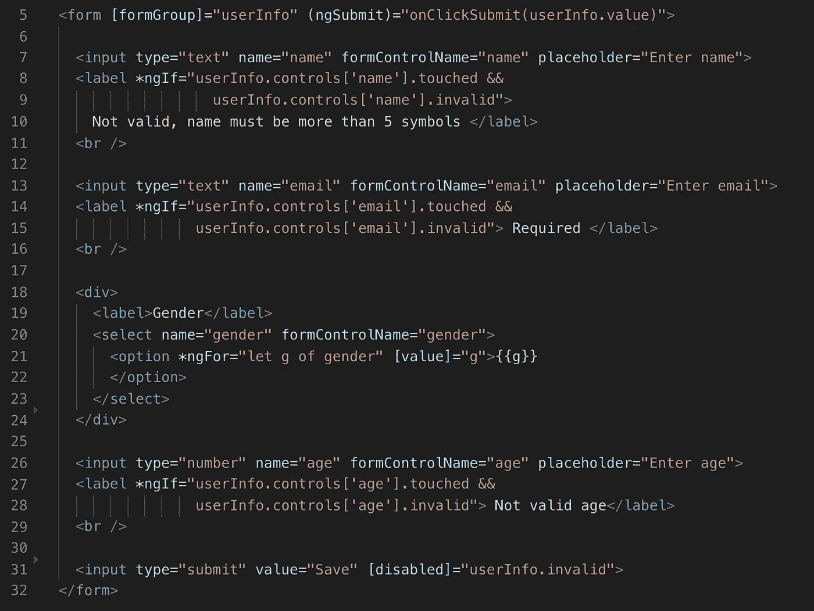
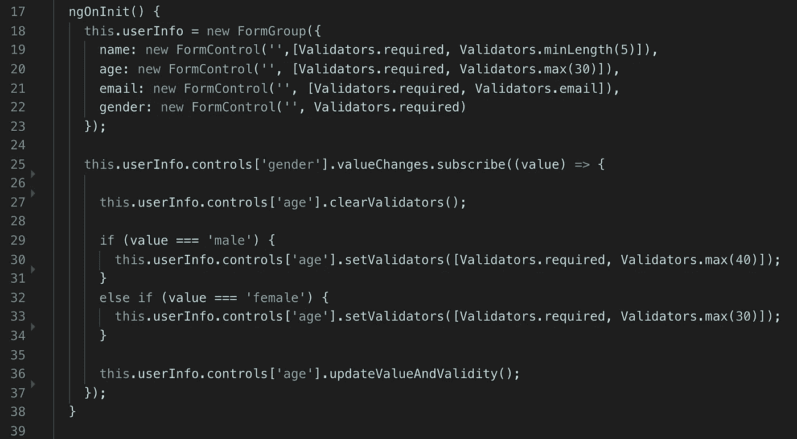
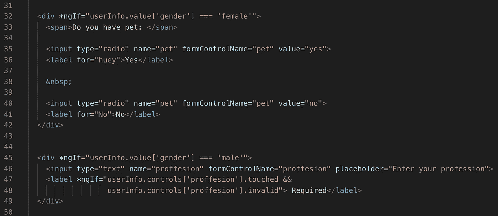
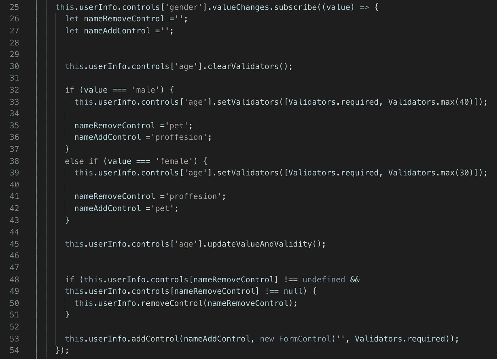
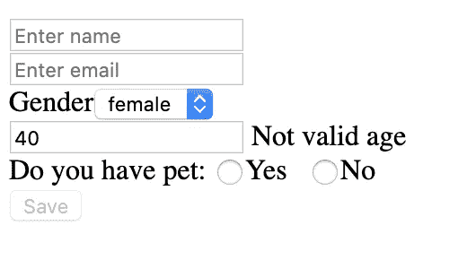
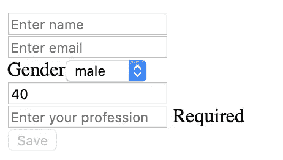

# 动态角度形式

> 原文：<https://medium.com/quick-code/dynamical-angular-forms-b36769859cb?source=collection_archive---------0----------------------->

## 角度指南

## 动态创建表单

角形控制和角形群给了我们许多机会。主要的一个是动态地改变问题和验证。

有时取决于用户必须回答几个附加问题的答案。

我们有一个简单的表格。

Form

根据用户的性别，我们需要限制最大年龄，这意味着我们需要动态更改验证。

首先，我们需要知道“性别”控制的价值何时会改变。这就是为什么我们订阅“valueChanges”事件，在方法内部，我们首先清除所有现有的验证器，然后根据性别添加新的验证器，我们需要手动运行新的验证。

Validators

另外，让我们为每个性别创建一个额外的问题。男性会问“你的职业是什么？”对女性来说，这将是“你有宠物吗？”。

我们需要在 html 代码中添加这两个问题，并编写两个 ngIf 来检查用户的性别。

New questions

接下来，我们需要在 FormGroup 中添加新的 FormControl，并需要验证器。根据用户的“性别”,我们需要删除不必要的 FormControl 并添加新的。

Dynamically change FormGroup

现在我们有了带有动态验证的动态表单。

如果你需要仔细查看项目[，这里有](https://github.com/8Tesla8/tree-view-angular)[链接](https://github.com/8Tesla8/tree-view-angular)。

*原载于 2019 年 6 月 29 日*[*http://tomorrowmeannever.wordpress.com*](https://tomorrowmeannever.wordpress.com/2019/06/29/dynamical-angular-forms/)*。*