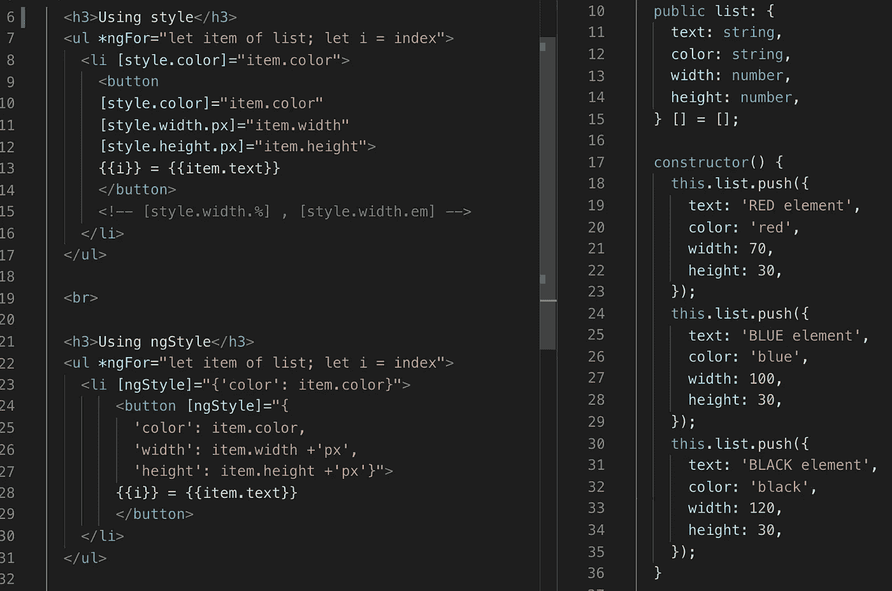
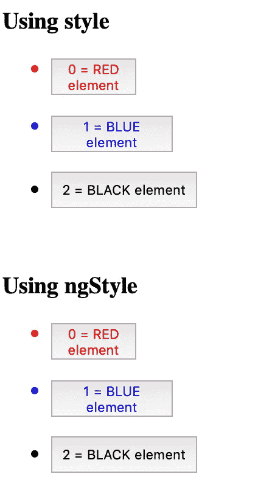
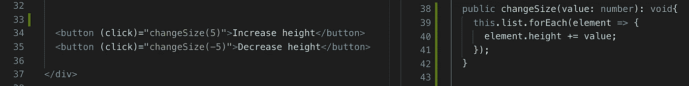
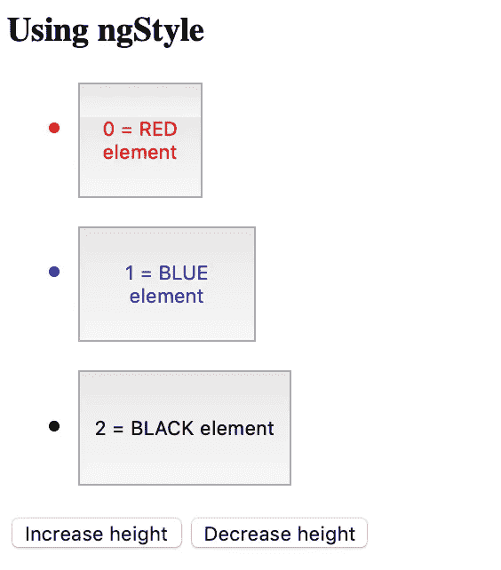
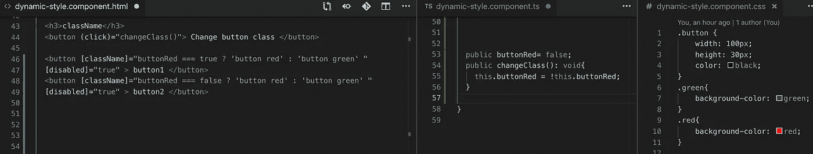
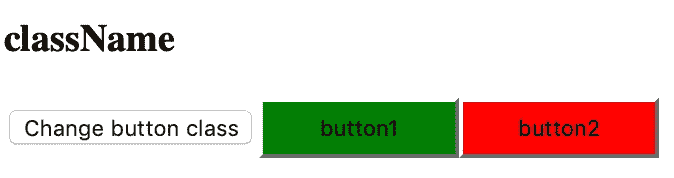
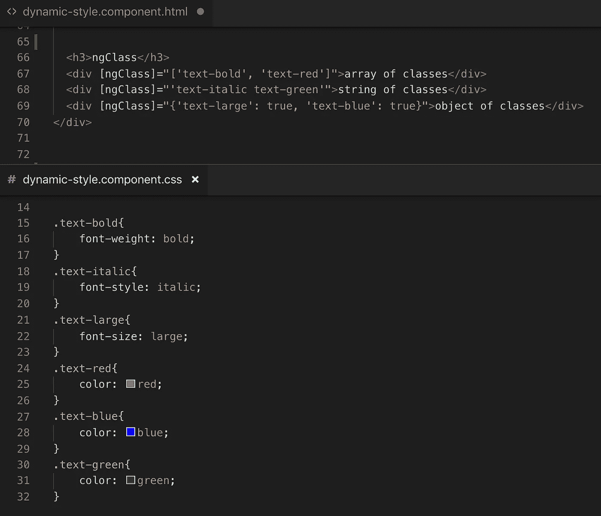
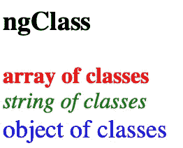

# 棱角分明的动感风格

> 原文：<https://medium.com/quick-code/dynamical-style-in-angular-a9748dea5f72?source=collection_archive---------1----------------------->

## 角度指南

## 想换风格就换

Angular 给了我们动态创建内容强大能力。每个人都知道“if”、“switch”或“for”，它们是我们在每个 Angular 项目中最好的朋友，但是 Angular 有很多更有用的开发工具。

Angular ngStyle 有助于打造动感风格。让我们仔细看看。

我们需要创建一对特定颜色和宽度的对象。所有这些我们需要动态创建的东西。我们可以使用“如果”语句，但是如果你有一对夫妇的财产，我们需要检查很多东西，我们会写很多“如果”语句。有角有更好的解决办法。

Angular style and ngStyle

在右边你可以看到我们需要动态生成的属性。在左侧，你可以看到角代码。我们有几个选项来设置这些属性，但是结果是一样的。

Result style and ngStyle

我们也可以动态地改变其中一个属性，html 代码会重新构建它。

Change buttons size

这个按钮可以改变我们的元素的高度。这让我们的用户能够改变一些东西，并立即看到结果。

User can change height

我们也可以对样式类做同样的事情，我们可以使用条件来决定我们必须使用什么样式，我们可以动态地改变所有这些东西。

className

Result className

Angular 给了我们另一个选择，如何使用类。

ngClass

Result ngClass

Angular 给了我们很多动态创建代码和样式机会。在这个简短的例子中，我们讨论了如何创建动态风格的不同选择。

*原载于 2019 年 3 月 21 日*[*【tomorrowmeannever.wordpress.com】*](https://tomorrowmeannever.wordpress.com/2019/03/21/dynamical-style-in-angular/)*。*