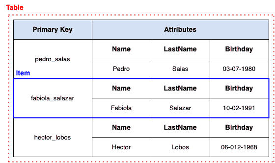
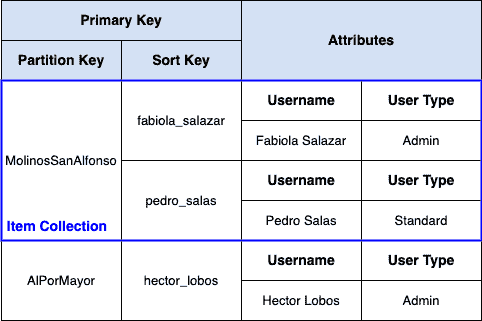
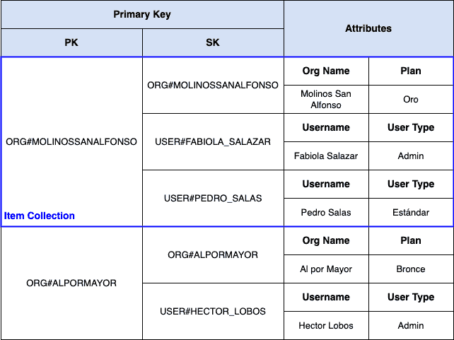

# DynamoDB

> 原文：<https://medium.com/globant/dynamodb-daaeeb4c0a76?source=collection_archive---------6----------------------->

## **第一眼**

Photo by [Tobias Fischer](https://unsplash.com/@tofi?utm_source=medium&utm_medium=referral) on [Unsplash](https://unsplash.com?utm_source=medium&utm_medium=referral)

# NoSQL 数据引擎 DynamoDB

AWS 将 DynamoDB 定义为一个完全托管的 NoSQL 数据库服务，具有出色的性能和可伸缩性。听起来很酷，但是对于一个第一次面对使用 NoSQL 引擎的开发团队来说，这一切到底意味着什么呢？在这篇文章中，我想向您解释它的含义，以及您应该记住什么来以一种好的方式接近 DynamoDB，正确地使用它并利用它。为此，我们将重点了解 DynamoDB 的优势，以及为什么为了利用 DynamoDB 服务而进行适当的设计是重要的。

***免责声明:*** 这是一篇短文，除了概述在 DynamoDB 中进行设计的最重要的方面以及如何深入研究之外，并不打算做更多的工作。请不要认为阅读 10 分钟的文章就足以成为 DynamoDB 专家！

# 让我们从头开始

首先要理解的是，在一般的 NoSQL 世界中(尤其是在 DynamoDB 中), SQL 不被用作查询语言(我们可能会从名字中怀疑这一点，对吗？)，数据也不会像在关系引擎中那样保存。在 NoSQL 发动机中，DynamoDB 被归类为混合*键值/宽列*。简化很多，这意味着你可以把 DynamoDB 想象成一个大的哈希表，只有表中的每一个条目，如果需要的话，都有一个 B 树，所以你可以非常快速的查找“相似”的记录(我们后面会看到这是什么意思)。

但是如果关系引擎已经为我们服务了 50 多年，我们为什么还要费心学习一个新的范例呢？有几个优点(也有几个问题)，但是如果我必须只用一个词的话，那就是**可扩展性**。

[1]:更确切的说是从 1970 年开始！可以在这里阅读一些历史:[https://twobithistory . org/2017/12/29/codd-relational-model . html](https://twobithistory.org/2017/12/29/codd-relational-model.html)

在 NoSQL(和 DynamoDB！)您的设计目标是尽可能快速有效地执行最常见的查询。如果您做得好，基础设施将保持一致的性能，响应时间不到 10 毫秒，不管您的数据库中有多少数据！

为什么我要说设计？你一定听说过 NoSQL 是无月经的，对吗？因此你可以把你能想到的任何东西放在每条记录里，对吗？那是一个小(也有点脏)秘密；尽管实际上没有针对每个表的模式，但现实是您确实需要仔细考虑和设计。

最后，“完全托管服务”是什么意思？这意味着，一旦你设计了你的表，并做了一些初步的定义，基本上你就不需要执行管理任务:你不需要照顾服务器，根据需求扩展(或缩减)你的基础设施，担心磁盘被填满，完成备份，应用更新，以及许多平凡但必要的管理任务。所有这些都是服务的一部分，因此您可以致力于为您的客户创造真正的价值。

# 基本概念

在考虑 DynamoDB 数据库的设计时，有两个基本概念应该始终牢记在心:

1.  理解数据将如何被查询是必不可少的(例如，获取数据访问模式)。因此，第一步是理解我们的引擎将要解决的业务问题和用例。
2.  应该维护尽可能少的表(事实上，一些顶尖的 DynamoDB 专家提倡单表设计，即所有数据都驻留在同一个表中！).这与数据库建模时的一个基本原则有很大关系，那就是保持相关数据“紧密结合”[2]。

[2]:正如我们在 DynamoDB 中大多数时候会看到的“紧靠在一起”是指在同一个表中！

为了理解如何将这些概念付诸实践，我们需要回顾一下 DynamoDB 中的数据组织方式:

*   **表:**只是一组在概念上放在一起的记录，对我们领域的一个或多个实体进行**建模。与我们在关系引擎中所习惯的相反，不同的实体可以在同一个表中，如果这样做对加速公共搜索有意义的话。**
*   **项:**是表格中的单个记录。
*   **属性:**是一个项目中的个别特征。例如，在用户表中，属性可以是他们的用户名、电子邮件等。有标量属性(*字符串*，数字，二进制，*布尔*，和*空*)，复杂属性(列表和映射)，以及*集合* ( *字符串集合*，*数字集合*和*二进制集合*)。
*   **主键:**DynamoDB 虽然是无模式的，但是有结构。每个表都必须声明它的主键，这是 DynamoDB 中最重要的设计决策。
*   **二级索引:**如果存在主键不能单独满足的访问模式，一个表可以有二级索引。至少在大多数情况下，二级索引是原始表的副本(部分或全部),其中二级索引成为该副本的主键。

一个非常简单的表格如下所示:

有几点需要注意:

*   正如我前面提到的，大多数情况下，二级索引是原始表的副本。一个常见的观察是，在云中，存储是廉价的，而计算是昂贵的，因此存储冗余信息比每次都计算它更有利可图。
*   这也允许我们提出*加入*的问题:在 DynamoDB 中没有*加入*！[3].根据引擎设计者的说法，*加入*是关系型引擎无法同时拥有规模和性能的主要原因之一，这也是它们不存在于 DynamoDB 中的原因。那又怎样？既然存储便宜，为什么不保存预先加入的数据？但是数据规范化呢？嗯，DynamoDB 让我们忘记了神圣范式(有一些例外)。

[3]:至少从服务的角度来看，你总是可以在客户端级别模拟一个 join，但这绝对不是你可以要求 DynamoDB 去做的操作。

# 主键

DynamoDB 中有两种类型的主键:

*   **简单主键:**由称为*分区键*(以前称为哈希键)的单个元素组成。上面显示的 users 表有一个简单的主键，对应于用户名。
*   **复合主键:**由两个元素组成，称为分区键和排序键(以前称为范围键)。

通过选择一个分区键，我们将表中的所有项划分成组，这一思想是 DynamoDB 可伸缩性的核心。这里再次值得将 DynamoDB 看作一个大哈希表，我们的分区键作为 DynamoDB 使用的哈希函数的输入。

同样，复合主键(即分区键**和排序键**的组合)允许我们在单个数据库查询中满足“获得许多相关记录”的访问模式。使用分区键，我们可以得到一个具有相同值的项目集合，使用排序键上的条件，我们可以指定整个集合中需要的特定项目的范围。顺便提一下，在 DynamoDB 中，分区键中具有相同值的所有项目的集合称为项目集合。

我们来看一个具体的例子。为此，我们将进行一些迭代设计:在第一次迭代中，我们将使用一个更简单的设计，稍后我们将扩展它，因为我们将改变我们想要回答的查询的类型。

为此，假设我们正在开发一个 SaaS 应用程序；这项服务的客户是组织，每个组织都有注册用户。假设我们想要查询属于某个组织的用户，为此我们可以有一个如下所示的表:

在这种情况下，要获取属于某个组织的所有用户，我们只需获取与该特定组织相关联的项目集合。例如，如果我们使用 DynamoDB API *查询*，表明分区键是 *"MolinosSanAlfonso"* ，这个调用返回所有相应的项(在本例中，我们的用户是 Fabiola Salazar 和 Pedro Salas)。

**注意:**我们还没有提到的一件事是，在实践中，所有能够过滤和搜索的条件都必须包含在主键或二级索引上。虽然我们可以通过普通属性进行过滤，但是这些过滤器在信息从存储器中提取出来之后，在发送到客户端之前，作用于服务端**，所以它们不是我们真正想要使用的机制(如果我们想要至少在时间和金钱上高效的话！).因此，所有与高效搜索相关的工作都是在主键和二级索引级别完成的。**

这是我们的第一个设计，但是，让我们扩展一下这个例子(并相应地改变设计)，看看我们如何在没有连接的情况下工作。

因此，让我们假设我们现在知道我们的应用程序最频繁的查询是关于组织信息，它必须包括所有用户的列表。一种方法是将组织表添加到我们已经为用户准备的表中。但是，记住我们没有 joins ，这需要我们分别获取组织及其用户的信息，也就是在我们的应用程序中通过逻辑链接的两个独立的搜索。为了改善这一点，我们可以引入另一种策略，在 DynamoDB 中很常见，称为键和索引重载。如果我们将几个不同的实体放在同一个表中(并因此对库进行单个查询)，这意味着公共属性(即那些构成我们的键和索引的属性)将有不同的含义，这取决于实体(这就是为什么我们谈论重载)。

让我们看看这在实践中意味着什么，为此我们将使用以下设计(其中 PK 和 SK 是主键和排序键的通用名称，顺便说一下，这是一个常用的约定):

哇！我们有一些变化，让我们更详细地回顾一下:

*   首先，我们看到该表有几个实体，因为它不仅包含用户，还存储了关于组织本身的信息。每种类型的实体都有自己的属性，公共属性( *PK* 和 *SK* 在我们的例子中)对每种类型的实体有不同的含义。
*   蓝色标记的是对应于值*“ORG # MOLINOSSANALFONSO”*的*项集合*，或者换句话说，分区键具有相同值的所有项。然而，在这种情况下，我们看到，我们现在已经成功地关联了不同的实体:一方面，我们拥有组织自己的信息(它被称为什么，它已经签订了什么计划)，另一方面，我们拥有属于该组织的所有用户。

这样，当我们谈论“预先绑定”相关的值时，我们终于可以明白我们的意思了。在关系引擎中，这将被建模为两个单独的表，一个 SQL 查询使用一个连接操作根据公共属性(在本例中是组织名称或标识符)合并这两个表。

有理由问，利润是什么？我们不得不重新设计这个表，最终我们得到了一个看起来很“奇怪”的表，让一个关系引擎来处理所有事情不是更容易吗？嗯，一如既往，这完全取决于我们在寻找什么。通过这样做，我们获得的是可伸缩性和持续的良好性能，而不管我们的基数有多大。此外，我向你保证，当你做出更多类似的设计时，这些桌子就不会显得“怪异”了。

这种设计允许我们解决几个问题，例如:

*   如果我们想要获取一个特定的组织，通过它的完整主键(例如，*PK*=*SK*=*" ORG # MOLINOSSANALFONSO "*)获取一个物品就足够了。为此，我们使用名为 *GetItem* 的 DynamoDB API 和适当的参数(当我们需要一个特定的项目时，我们使用 *GetItem* ，当我们需要一组相关项目的分区键时，我们使用 *Query* )。
*   对于我们说的使用最多的查询(即组织的完整信息，包括其所有用户)，使用带有*PK = " ORG # MOLINOSSANALFONSO "*条件的*查询* DynamoDB API 就足够了。
*   如果我们想要一个特定的用户，例如来自 *"Molinos San Alfonso"* 的 *"Pedro Salas"* ，我们应该使用带有条件*PK**=**" ORG # MOLINOSSANALFONSO "和 SK = "USER#PEDRO_SALAS"* 的 *GetItem* 。

# 次要索引

如果我们还记得的话，我们使用二级索引来访问那些仅仅通过主键无法满足的模式；实际上，根据索引的类型，二级索引是原始表的副本，只包含所需的数据。进行查询。

DynamoDB 中有两种类型的二级索引:

*   **本地二级索引:**相同的*分区键*，但不同的*排序键*。在这种情况下，没有表的副本，但是需要注意某些 DynamoDB 限制(这里没有更多细节，因为我们还没有看到一些具体的 DynamoDB 实现概念，这些概念对于解释为什么存在这些限制是必要的)。
*   **全局二级索引:**完全不同的属性被用于*分区键*和*排序键*，导致表的副本(部分或全部)。这是潜在的“存储是廉价的”哲学的另一个例子，由于增加了灵活性，它们比本地索引使用得更多。

为二级索引提出的想法和策略与我们为主键建模时的想法相同，但是我们需要一个新的构造来解析额外的访问模式(在那些通过使用主键解析的模式之上)。

一种重复出现的策略是使用二级索引来模拟 N-N 关系，将 N-N 关系视为两个 1-N 关系，其中我们使用一个 1-N 关系的主键，并使用一个全局二级索引来模拟另一个 1-N 关系。

这种 N-N 关系的一个例子是电影和演员之间的存在，其中一个演员可以出现在许多电影中，一部电影可以出现在许多演员中。例如，如果我们必须回答的查询是“给我所有参与电影的演员”和“给我一个演员参与的所有电影”，那么我们可以有一个由“ <id_pelicula>+ < id_actor>”(返回所有参与电影的演员)组成的主键，并有一个全局辅助索引“ <id_actor>+ <id_pelicula>”(返回演员参与的所有电影)。</id_pelicula></id_actor></id_pelicula>

# DynamoDB API

我们已经看到了一些可以用来访问 DynamoDB 数据库的 API 示例，现在我们将列出所有可用的操作:

*   **与特定项相关的动作:** DynamoDB 是作为键值数据存储而诞生的，这可以在 API 中看到。所有这些动作都在单个项目上配置典型的 CRUD 动作，并且需要完整的主键作为参数:
    - **GetItem:** 获取一个特定的项目。
    - **PutItem:** 创建或覆盖一个特定的项目。
    - **UpdateItem:** 创建或更新一个特定的项目。
    - **删除项目:**删除一个特定的项目。
*   **对多个项目的操作:
    -查询:**获取一个项目集合，即一组具有相同分区键值的项目(可选择通过使用排序键上的条件进行过滤)。
    -**:Scan:**这个动作基本上遍历整个表，将满足某个表达式的所有条目都带出来，这个表达式涉及到不包含在键或索引中的属性。它应该只作为最后的手段或者在某些特殊的情况下使用(例如，在为非常不频繁的查询创建特殊索引没有意义的小表上)。

像所有 AWS APIs 一样，HTTPS 被用作传输协议，这是与具有专用通信协议的关系引擎的另一个区别。当然，最常见的语言都有自己的库，所以没有必要直接使用 API，根据语言的不同，会提供不同的构造和抽象来方便开发人员的工作。

# 平台

到目前为止，我们还没有谈到服务的技术方面，以及这种实现如何提供可伸缩性和性能。

正如其他 NoSQL 引擎(甚至像 Apache Kafka 这样的服务，它们不是数据引擎，但它们提供了一个持久层)，神奇的词是横向扩展。水平增长与分区的概念相关联，我们认为分区是 DynamoDB 的核心。几乎所有操作都必须选择和使用分区键，这使得 DynamoDB 能够为不同的数据子集分配专用的基础设施(不仅仅是存储，还有计算和通信)。

同样，将 DynamoDB 表想象成一个大哈希表也很有帮助。有了分区键，我们可以立即找到相应的物品所在的位置，而不管底座有多大。

因此，我们终于知道在 DynamoDB 背后有服务器集群，每个服务器都有计算、存储和通信资源，专用于服务我们数据的特定分区。如果数据增长，DynamoDB 会向集群添加更多的节点，允许线性扩展(请记住，由于使用了我们的分区键，访问特定分区的操作不依赖于数据库的大小)。

DynamoDB 的最后一个优点是，所有这些对用户都是透明的，一切都由服务来处理。

# 何时使用 DynamoDB

一个很重要的问题是什么时候使用 DynamoDB。我并不是说 DynamoDB 对每个问题都是一个好的选择，尽管经过精心设计，它可以用于大多数问题。相反，我将尝试提供一些标准，让我们能够决定它是否是符合我们需求的好的*匹配*:

1.  这是一个事务性应用程序。DynamoDB 不太适合分析项目。
2.  所有数据访问模式都可以从一开始就确定。如果我们如何查询数据存在很多不确定性，那么这可能不是 DynamoDB 的一个好用例。
3.  人们倾向于使用无服务器服务，或者至少这是一个可以接受的选择。
4.  对于使用 DynamoDB 的第一个项目来说，需要支持强劲增长、保持一致的响应时间并具有简单数据访问模式的应用程序是理想的应用程序。当然，随着经验的增加，几乎任何问题都可以用 DynamoDB 解决。

# 完成

哇，我们到达终点了！虽然我们仅仅触及了 DynamoDB 的皮毛，但我希望我已经实现了我的初衷，并与您分享了成功理解和使用 DynamoDB 所必需的基础知识。

作为总结，我将把我想传达给你们的最重要的想法留下来:

*   DynamoDB 是一个非关系数据库服务，如果我们的设计尊重某些规则，它可以很好地扩展并呈现一致的性能。
*   要在 DynamoDB 中实现正确的设计，你必须做的是:
    a .理解**所有**我们的应用程序需要的数据访问模式。
    b .决定我们将使用哪些表，以及允许我们回答我们提出的访问模式的主键(和辅助索引，如果必要的话)。
*   **推论:**不要期望如果你在设计时考虑了关系引擎，你会得到在 DynamoDB 中运行良好的东西！

我们还没有回顾很多主题:数据一致性、备份、监控、优化、*流*、迁移、更高级的设计模式等等。然而，我希望我已经告诉了你足够的信息来激起你的好奇心，并想继续调查。为此，我推荐以下资源:

*   Alex DeBrie 是 DynamoDB 的大师之一，他有几个很棒的资源:
    -一个致力于不同 DynamoDB 主题的网站:[https://www.dynamodbguide.com/](https://www.dynamodbguide.com/)
    -一本致力于 DynamoDB 的完整书籍，非常强调设计:[https://www.dynamodbook.com/](https://www.dynamodbook.com/)。我在本文中展示的例子是受这本书的启发。
*   YouTube 上有几个关于 DynamoDB 的教程和潜水课，我将放几个我觉得特别好的:
    ——Alex DeBrie 在 reInvent 2019 的 DynamoDB 建模课上:[https://www.youtube.com/watch?v= yvbr 71 d0 naq&t = 295s](https://www.youtube.com/watch?v=yvBR71D0nAQ&t=295s)。
    -另一个高级设计环节:【https://www.youtube.com/watch?v=HaEPXoXVf2k 。这个环节真的会让你大吃一惊(字面意思！).
    -更技术性的会议，DynamoDB 开发团队的一名成员解释了其内部工作的各个方面:[https://www.youtube.com/watch?v=yvBR71D0nAQ&t = 295s](https://www.youtube.com/watch?v=yvBR71D0nAQ&t=295s)。
*   显然我得把 DynamoDB 的 AWS 官方指南包括进来:[https://docs . AWS . Amazon . com/Amazon DynamoDB/latest/developer guide/introduction . html](https://docs.aws.amazon.com/amazondynamodb/latest/developerguide/Introduction.html)。