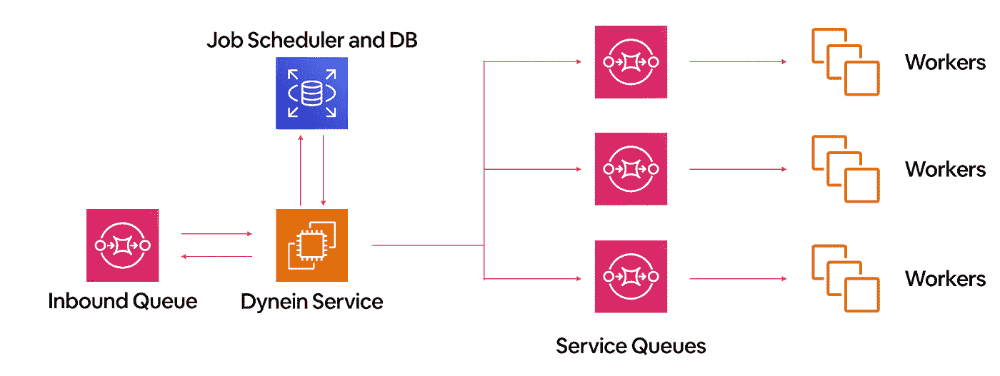
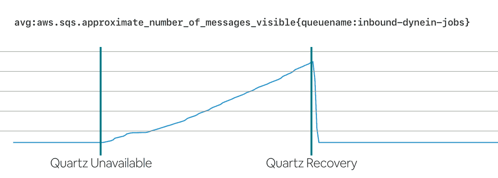
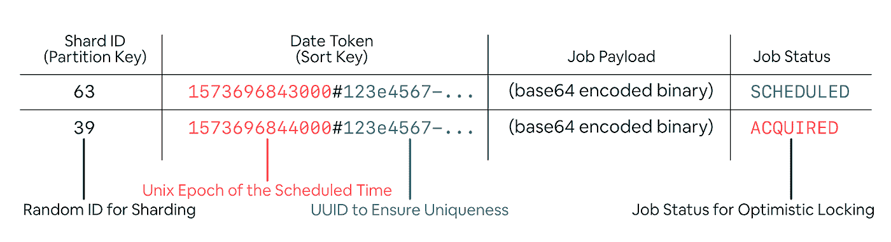
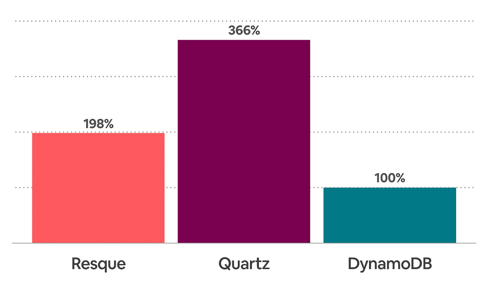

# Dynein:构建一个开源的分布式延迟作业排队系统

> 原文：<https://medium.com/airbnb-engineering/dynein-building-a-distributed-delayed-job-queueing-system-93ab10f05f99?source=collection_archive---------0----------------------->

了解 Airbnb 分布式调度和排队系统的背景、挑战和未来。

An Airbnb Plus listing in Argyll, Scotland

# 介绍

通过将耗时、资源密集型任务转移到后台，异步后台作业通常可以显著提高 web 应用程序的可伸缩性。这些任务通常容易失败，重试机制通常会使运行此类任务的应用程序更加昂贵。拥有后台队列有助于 web 服务器迅速处理传入的 web 请求，并减少请求积压时出现性能问题的可能性。

在 Airbnb，我们为非常关键的用例建立了一个名为 [Dynein](https://github.com/airbnb/dynein) 的作业调度系统。自推出以来，该系统已经成为我们架构的一个非常重要的组成部分，为从[提供应用内消息](/airbnb-engineering/discovering-and-classifying-in-app-message-intent-at-airbnb-6a55f5400a0c)到[动态定价](/airbnb-engineering/learning-market-dynamics-for-optimal-pricing-97cffbcc53e3)的用例提供支持，所有这些用例都具有非常高的每秒交易量。在本文中，我们将回顾 Airbnb 作业排队系统的历史，解释我们为什么构建 Dynein，描述我们如何能够实现其高可伸缩性，最后，开源我们为 Dynein 构建的高可伸缩调度程序。

# Airbnb 的工作排队

Airbnb 的许多系统都利用了作业队列。例如，当 Airbnb 的慷慨东道主社区加入我们的[开放家园](https://www.airbnb.com/openhomes)计划时，Airbnb 会为他们匹配非营利组织或有需要的被疏散者。匹配过程非常复杂，需要大量的计算资源，因此我们将匹配的作业放在作业队列中，以确保 Airbnb 的可靠性和对有需要的人的响应。在另一个例子中，在预订的预定登记时间之前，我们向客人发送提醒，提醒他们该为旅行做准备了。这些工作通常可以安排在未来几个月甚至几年，它们必须可靠地交付，以确保 Airbnb 社区的良好体验。

在这种情况下，一个可靠且易于使用的作业调度系统将是非常有用且必要的。在与 Airbnb 的团队交谈后，我们决定日程安排系统必须提供以下功能:

*   *可靠性*。如果系统出现故障或重新启动，系统不应丢失数据。它应该保证每个作业至少交付一次。
*   *可扩展性*。Airbnb 相信长期投资，我们的排队系统应该能够扩展并支持我们未来的需求，而无需进行重大的扩展工作。调度系统应该是水平可扩展的，以允许随着 Airbnb 社区的增长进行容量规划。
*   *隔离*。系统应该能够为每个应用程序隔离作业。单个应用程序的队列过载不应该影响其他服务中的作业处理。
*   *计时精度*。在我们的许多用例中，应用程序要求作业在预定时间的几秒钟内运行。调度程序的 p95 调度偏差应低于 10 秒。
*   *高效排队*。除了可靠地调度作业，系统还应该提供有效的排队接口。例如，作业队列应该支持单个消息成功/失败确认(未能处理单个消息不应该影响其他消息)、死信队列(多次处理失败的消息应该移动到单独的队列中)，以及每个单独使用者的单独工作池(每个服务应该运行自己的工作池，而不是共享的工作池)。
*   *可用性*。使用特定的作业调度程序调度作业并在消息队列中传输，这一事实对开发人员来说应该是透明的。客户端库应该被设计成促进最佳实践，例如指数补偿和速率限制处理，而不是公开调度服务的内部。
*   *解壳*。基于排队系统发布的唯一标识符，作业应该能够在任何时候被取消调度。

## 大规模运行 Resque

历史上，Airbnb 在 Resque Scheduler 上运行一个集中的 Resque 工作人员集群，以及一个针对更长延迟的定制调度程序。虽然易于使用，但多年前构建的用于支持我们的[单片应用](https://www.slideshare.net/AmazonWebServices/a-chronicle-of-airbnb-architecture-evolution-arc407-aws-reinvent-2018/8)的 Resque 集群已经不足以支持我们向 SOA(面向服务的架构)的转变。我们在大规模运营 Resque 时发现了以下问题:

*   Resque 是一个最多一次的系统，这意味着消息不能保证被传递。
*   Resque 有很大的扩展瓶颈。Resque 依赖于单个 Redis 实例，并且[无法将 Redis 集群模式与 Resque](https://github.com/resque/resque/issues/1301) 一起使用。然后，我们受到单个 Redis 实例的内存大小和网络容量的限制。
*   我们在我们的[单片应用](https://www.slideshare.net/AmazonWebServices/a-chronicle-of-airbnb-architecture-evolution-arc407-aws-reinvent-2018/8)的工人集群中运行我们的大部分作业。虽然 Resque 提供了在单个应用程序中使用不同队列的能力，但是这些队列仍然共享相同的代码库和 Redis 实例。一个坏的作业经常会导致大部分作业处理人员停止工作。
*   Resque Scheduler 是 Resque 之上的一个扩展，提供有限的调度能力。Resque 调度程序在简单性上类似于 Resque，但是它的调度能力是有限的。例如，Resque Scheduler 将它将要运行的每个作业存储在 Redis 中，这意味着队列的大小固有地受到托管 Redis 的机器的 RAM 大小的限制。在 Resque Scheduler 中也很难将作业出队。虽然 Resque Scheduler 提供了这样的 API，但在内部，[需要搜索整个积压的作业](https://github.com/resque/resque-scheduler/blob/6c36c945a1510392a129f9d28ee0e5ee11c527df/lib/resque/scheduler/delaying_extensions.rb#L274-L288)。由于这些限制，我们对使用 Resque Scheduler 的作业的数据大小和延迟时间设置了严格的限制，并限制了出列 API 的使用。
*   为了解决 Resque Scheduler 的限制，我们构建了一个基于 MySQL 的内部系统，该系统提供了长时间的延迟以及更强的交付保证和可审计性。然而，这个系统是为了高度一致而构建的，而不是高度可伸缩的。

# 构建正确的排队和调度服务

考虑到历史背景和挑战，我们构建了 Dynein，一个分布式延迟作业排队服务。以下是我们如何编排 Dynein 服务中不同组件的高级概述，以及我们如何将其集成到 Airbnb 的不同服务中。我们将介绍为什么以及如何设计每个组件，并解释它们如何协同工作。

*Dynein Overview*

## 服务队列

对于 Dynein 的排队系统，我们决定使用 AWS 简单排队系统(SQS)。SQS 是排队系统领域中一个有趣的产品，我们发现它的一系列权衡对于作业队列来说是一个极好的选择。SQS 名副其实:这是一个在生产中推理和操作的简单系统。SQS 没有强大的订购保证，也不打算被用作像[阿帕奇卡夫卡](https://kafka.apache.org/)那样的存储系统。然而，随着这些限制的消除，SQS 提供了许多属性，使其成为大多数作业队列用例的理想选择:

*   SQS 很容易扩大规模。在 SQS，供应新队列的成本和时间可以忽略不计，而在 Airbnb，这一步只是对我们的 [terraform](https://www.terraform.io/) 仓库的简单公关。这个属性使 SQS 成为 SOA 世界的理想选择，因为每个服务都可以轻松地建立自己的队列，以避免与其他服务发生干扰。从历史上看，Airbnb 的所有工作队列都是在一个集中的集群中完成的，这带来了很大的扩展和运营负担。
*   SQS 具有高吞吐量和足够低的延迟。在 AWS 的文档网站上，它记录了 SQS 提供每秒无限的事务。在实践中，我们从未观察到 SQS 的速率限制，它为 Airbnb 的作业排队系统提供了足够低的延迟。
*   SQS 提供至少一次送货服务。因为 Dynein 被设计为至少一次，SQS 保证这个属性意味着我们不需要采取额外的步骤来确保消息传递。
*   SQS 免费提供了许多附加功能，比如死信队列、单个消息确认、访问控制和静态加密。

## 动态服务

我们可以将动态作业分为两类:即时作业和延迟作业。

**眼前的工作**

对于即时作业，或计划在 15 分钟内运行的作业，Dynein 只是作为 SQS API 的包装器工作——提交给 Dynein 的作业将被立即中继到 SQS 队列，然后该作业将由 SQS 出列 API 的使用者使用。我们选择包装 SQS API，而不是让服务直接排队进入 SQS，因为这种方法为我们提供了扩展的指标覆盖范围，以及与 Airbnb 内部限速和背压系统的紧密集成。此外，我们的用户可以使用与延迟作业相同的 API。

**推迟就业**

Dynein 对延迟工作采取了一种更加精细的方法。对于 Dynein 来说，延迟的作业意味着在正确的时间将正确的消息传递给正确的服务队列。当一个延迟的作业被提交给 Dynein 时，它会被立即放入一个 SQS 队列——我们称之为入站队列。这个队列充当调度程序的写缓冲区，这样我们就可以承受提交的作业的小高峰。入站队列不仅可以保护我们的系统免受写入高峰的影响，还可以为我们提供明确的指标来表明此类问题正在发生。SQS 给了我们足够的时间来找出问题所在，修复它，然后处理积压的工作。

*Dynein’s behavior in a real production incident. In this incident, the Dynein service briefly lost its connection with the job scheduler (Quartz). We see a backlog of jobs in the inbound queue as soon as the incident starts, and then the backlog being processed quickly when the incident is resolved. During the process, no user intervention was required, and no jobs were lost.*

然后，Dynein 服务以一致的接收速率从入站队列中选取作业，并将作业的触发器存储到调度器中。在预定的时间，Dynein 服务从调度器中选择作业，然后将作业排入 SQS。Dynein 服务是完全无状态的，作为一个简单的部署在我们内部的 Kubernetes 平台上运行。

## 延迟作业调度程序

如上所述，作业队列只是 Dynein 故事的一部分。市场上有大量的作业队列，但几乎没有一个提供可靠的调度故事。因此，我们决定将调度器构建为 Dynein 的一个独立组件。

**石英**

带着这个目标，我们研究了石英。Quartz 是一个流行的用于 Java 应用程序的开源作业调度库，几年来我们一直使用 Quartz 来调度生产中的关键作业。总的来说，Quartz 在按计划运行作业方面做得很好，但很明显还有改进的空间:

*   *可伸缩性* : Quartz 没有一个很好的方法在多个调度器和数据库之间分配负载。在内部，我们使用 Quartz，禁用其大部分锁定机制，并在单个调度表上运行许多调度器实例。然而，Quartz 的复杂性引入了不必要的性能开销(稍后将详细介绍)。
*   *可用性* : Quartz 有一个很大的 API 面，有很多选项可以调整。虽然不同的服务有不同的需求，但许多配置是重复的。最佳实践很难在多个服务中实施，工程师们必须了解 Quartz 的架构，才能推断出他们的作业处理系统。
*   排队:调度只是异步作业处理的一部分，另一个重要部分是排队。引用[官方 Quartz 手册](http://www.quartz-scheduler.org/documentation/2.4.0-SNAPSHOT/faq.html),“*Quartz 不是一个作业队列——尽管它经常被用作一个作业队列，并且可以在小范围内做这样的合理工作。*“排队系统的设计通常与调度程序的设计有不同的权衡，将两者结合在一起有很大的缺点，例如，对于长时间运行的作业。如果我们直接使用 quartz workers，我们还面临两个糟糕的组织选择:要么排队团队必须维护 quartz 集群，为每个服务运行应用程序逻辑(类似于 monolithic Resque 集群)，要么每个服务必须运行自己的 Quartz 集群。

在 Dynein 的第一次迭代中，我们使用 Quartz 作为任务调度器，取得了巨大的成功。开箱即用，Quartz 提供了我们需要的大部分功能，并有很好的交付保证。然而，随着采用 Dynein 的服务数量的增长，我们意识到我们需要一个可以根据我们的需求进行扩展的系统。

**构建基于 DynamoDB 的调度程序**

尽管我们做出了巨大的努力，但每个 r4.8xlarge RDS 实例只能完成 1000 个 QPS 任务(500 个任务出列，500 个任务出列，不包括直接任务)。为了绕过这个限制，我们运行了多个实例，但是为一个调度服务运行多个 MySQL 实例在操作和财务上都很昂贵。我们对 Quartz 进行了广泛深入的研究，发现查询放大是瓶颈:在 Quartz 中，单个排队被转换为 4 个 SELECT 和 3 个 INSERT 查询。虽然每个查询都有一个基本的目的，但是我们并没有利用它们的特性。重复时间表之类的功能根本不用，因为我们只关心在给定的时间向 SQS 发送特定的有效载荷。

从那时起，我们决定调整 Quartz 以适合我们的特定用例将会花费大量的时间，因为我们的权衡是完全不同的。然后，我们决定构建我们自己的调度程序，它将只支持有限的功能集，但将是高度可伸缩的。我们将调度程序的工作总结为以下步骤:

*   在每个调度程序的勾号处，查询数据库看是否有过期的作业；
*   对于每个过期的作业，将它们分派到特定的 SQS 队列中。

这个查询模型非常简单，在任何数据库中，都可以通过对计划时间列的单个索引来有效地实现。此外，它可以被简单地分割——我们可以简单地给每个作业分配一个随机的 ID，然后使用这个随机的 ID 作为分割密钥。

如果以上听起来很熟悉，那是因为这正是 DynamoDB 的最佳场景！DynamoDB 支持[分区键和](https://docs.aws.amazon.com/amazondynamodb/latest/developerguide/HowItWorks.CoreComponents.html)排序键，这两个键精确地映射到每个作业的随机 ID 和计划时间。DynamoDB 在内部使用 B- trees 实现[，因此对排序关键字的范围查询非常高效。因为我们使用随机 ID 作为分区密钥，所以我们的读/写负载均匀地分布在所有分区中，并且我们可以避免 DynamoDB 的一个常见陷阱:](https://www.slideshare.net/AmazonWebServices/amazon-dynamodb-under-the-hood-how-we-built-a-hyperscale-database-dat321-aws-reinvent-2018)[热分区](https://docs.aws.amazon.com/amazondynamodb/latest/developerguide/bp-partition-key-design.html)。每个分区都有完全相同的负载，因此使得 RCU 和 WCU 在动态数据库上的花费有效。

*Dynein’s simple data model.*

每次添加作业时，我们只是将它作为一行存储在 DynamoDB 表中。分区键被设置为随机 ID，排序键被设置为作业的调度时间，并与 UUID 连接在一起以确保唯一性。除了分区键、排序键和作业负载之外，我们还将该作业的状态设置为“已调度”。这些步骤是面向服务的 Dynein 实例将处理的唯一特性，实际的调度程序运行在不同的 Kubernetes Pods 上。这些调度程序单元将被分配一个分区列表。在每个调度器时钟周期，它们将查询 DynamoDB 以获得过期的作业列表。为了防止重复交付，在将它们分派到最终目的地之前，我们首先使用 DynamoDB 中的条件更新将作业的状态列更新为“已获取”,并且只有在比较和设置成功的情况下才继续分派。实际上，我们正在使用乐观锁定。从那里，scheduler pods 将简单地将作业分派到它的目的地 SQS，并从表中删除该作业。

Dynein 被设计为一等公民的容量规划。调度器的工作负载经常随着流量的变化而波动，我们需要动态调整调度器实例的数量来进行容量规划。Quartz 被设计为在一组静态定义的调度程序中工作:当您启动 Quartz 时，您必须在其属性中存储调度程序列表。因此，在 Quartz 中添加或删除调度器实例是一项复杂的操作，并且容量规划变得困难。随着 Airbnb 将其服务转移到 Kubernetes，这一限制变得更加具有挑战性，因为与 EC2 主机相比，pod 的轮换更加频繁。其中一个解决方案是在 Kubernetes 的 [StatefulSet](https://kubernetes.io/docs/concepts/workloads/controllers/statefulset/) 中运行调度程序集。然而，运行 StatefulSets 是[困难的](https://elastisys.com/2018/09/18/sad-state-stateful-pods-kubernetes/)，它仍然不允许我们动态地改变集群大小。Dynein 被设计为与诸如 Kubernetes 这样的编排器本地工作，并且可以与标准的 Kubernetes 部署( [ReplicaSet](https://kubernetes.io/docs/concepts/workloads/controllers/replicaset/) )一起使用，或者甚至与[自动缩放器](https://kubernetes.io/docs/tasks/run-application/horizontal-pod-autoscale/)一起使用。每个 scheduler pod 都在其所属的副本集上维护一个监视器。给定 pod 列表及其名称，每个 pod 能够确定性地计算它应该工作的分区列表。当我们从副本集中添加或删除 pod 时，pod 将简单地选择更改，并在新的分区集上工作。在 Quartz 中，我们不再需要静态地为每个 worker 定义分区列表，而是能够根据负载动态地调整调度器实例的数量。

*Total monthly cost of infrastructure per 1,000 QPS in each scheduling system. Lower is better. While Quartz achieved our goals for scalability and reliability, it also massively increased our costs. Switching to the DynamoDB-based scheduler yielded significant cost savings, while providing an even better scalability, reliability, and operational story. The hypothetical numbers in this chart do not in any way reflect Airbnb’s production usage of these systems.*

上述过程虽然简单，但证明非常有效。每个入队只是对表的一个 PUT 操作(消耗 1 个 WCU)，出队只是一个 GET、SET 和 DELETE 操作(消耗 2 个 wcu 和 1 个 RCU)。与运行一个 r 4.8 x 大型 RDS 实例的价格相比，使用 AWS 公开发布的成本数据[我们能够以低于⅓的成本实现 1000 个 qp。同时，我们提供了几乎无限的线性可伸缩性，无需手动将数据分割到不同的表或数据库实例中。由于 DynamoDB 的动态伸缩特性，我们可以根据系统上的季节性负载动态调整所提供的吞吐量，而不是为峰值负载提交大型实例类型。虽然可以切换 RDS 集群的实例类型，但是我们发现对于我们想要动态调整的东西来说，操作太复杂并且容易出错。](https://calculator.s3.amazonaws.com/index.html)

Dynein 的架构允许我们自由地交换其组件，因为它们是充分解耦的。在迁移到基于 DynamoDB 的调度程序时，我们能够保持用户界面不变，同时在幕后提供可伸缩性改进。我们的内部客户能够自动获得优势，同时享受与 Quartz 相同的交付保证。此外，调度器本身并不局限于 DynamoDB。任何提供前缀扫描的 KV 商店，比如 Rocks DB 甚至 MySQL，只需很少的工作就可以集成。

# 结论和致谢

我们建立 Dynein 是为了可靠有效地安排和处理 Airbnb 中最关键的任务。自发布以来，它受到了许多产品团队的广泛欢迎。我们对调度程序的性能和易用性非常满意，欢迎您到 https://github.com/airbnb/dynein[参观我们的工作。如果你喜欢阅读这个帖子，并且对分布式系统的工作感兴趣，帮助世界各地的旅行者属于任何地方，](https://github.com/airbnb/dynein) [Airbnb 正在招聘](https://careers.airbnb.com/)！

Dynein 的主要贡献者之一是 2019 年夏天与我们一起工作的实习生 [Krishna Patel](https://www.linkedin.com/in/krishnakpatel/) 。感谢奎师那，感谢你在这个夏天带来的惊人影响！也非常感谢[徐章](https://www.linkedin.com/in/zhangxu325/)、[余人](https://www.linkedin.com/in/ren-yu-77385b8b/)、[米歇尔·韦克斯勒](https://www.linkedin.com/in/michelweksler/)、[克劳迪奥·威尔森](https://www.linkedin.com/in/claudio-wilson-7a983630/)、[迪夫亚汉斯·古普塔](https://www.linkedin.com/in/divyahansg/)、[爱丽丝·梁](https://www.linkedin.com/in/alice-l-594a7128/)、[阿姆雷·沙基莫夫](https://www.linkedin.com/in/amreshakim/)、[布鲁斯·金](https://www.linkedin.com/in/brucexingjin/)以及 Airbnb 工程部的其他人对这个项目的帮助。