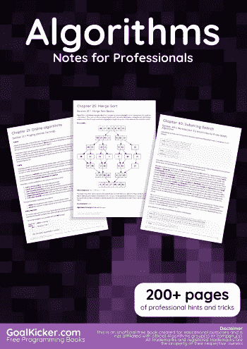
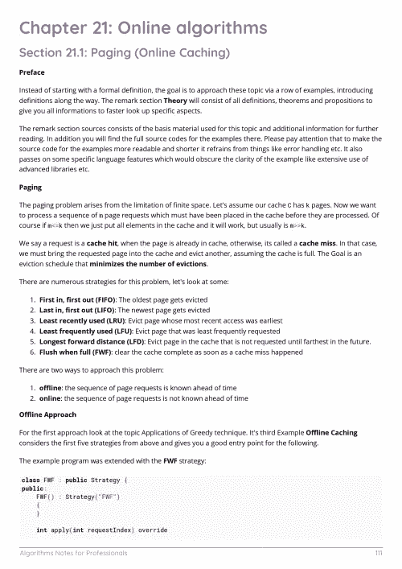
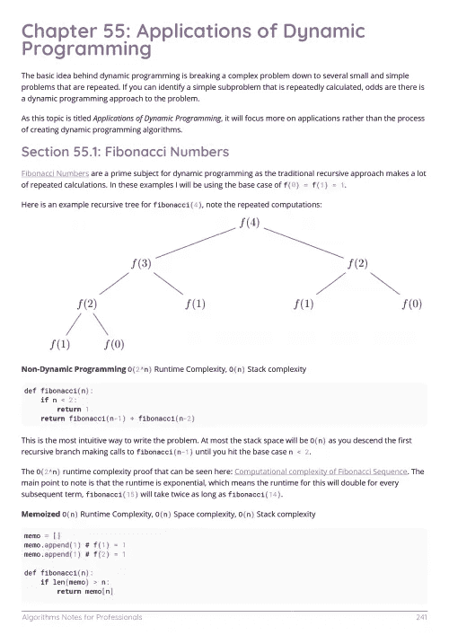

# 电子书:专业人士算法笔记

> 原文：<https://medium.easyread.co/e-book-algorithms-notes-for-professionals-book-e0b327ca9721?source=collection_archive---------5----------------------->

## GoalKicker.com 免费下载算法电子书

**下载这里:**[**【http://goalkicker.com/AlgorithmsBook/】**](http://goalkicker.com/AlgorithmsBook/)

*《专业人士算法笔记》一书由* [*栈溢出文档*](https://archive.org/details/documentation-dump.7z) *汇编而成，内容由栈溢出美工撰写。文本内容由-SA 在知识共享协议下发布。见本书末尾的致谢，感谢对各章节做出贡献的人。除非另有说明，图像可能是其各自所有者的版权*

*为教育目的而创作的书籍，不隶属于算法组、公司或 Stack Overflow。所有商标属于其各自的公司所有者*

*252 页，2018 年 1 月出版*

# 章

1.  算法入门
2.  算法复杂性
3.  图表
4.  图形遍历
5.  Dijkstra 算法
6.  寻路
7.  A*寻路算法
8.  动态规划
9.  克鲁斯卡尔算法
10.  贪婪算法
11.  贪婪技术的应用
12.  普里姆算法
13.  贝尔曼-福特算法
14.  直线算法
15.  弗洛伊德-沃肖尔算法
16.  加泰罗尼亚数字算法
17.  最小顶点覆盖的多项式时间有界算法
18.  多线程算法
19.  KMP 算法
20.  编辑距离动态算法
21.  在线算法
22.  大 O 符号
23.  整理
24.  冒泡排序
25.  合并排序
26.  插入排序
27.  桶排序
28.  快速排序
29.  计数排序
30.  堆排序
31.  循环排序
32.  奇偶排序
33.  选择排序
34.  树
35.  二分搜索法树
36.  检查树是否是 BST
37.  二叉树遍历
38.  二叉树的最低共同祖先
39.  搜索
40.  子串搜索
41.  广度优先搜索
42.  深度优先搜索
43.  哈希函数
44.  旅行推销员
45.  背包问题
46.  矩阵幂运算
47.  方程求解
48.  最长公共子序列
49.  最长增长子序列
50.  动态时间扭曲
51.  帕斯卡三角形
52.  快速傅里叶变换
53.  算法:-以正方形方式打印一个 m*n 矩阵
54.  检查两个字符串是否是字谜
55.  动态规划的应用
56.  伪代码