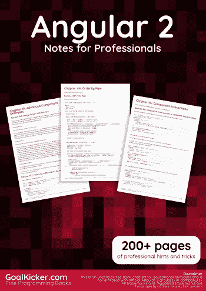
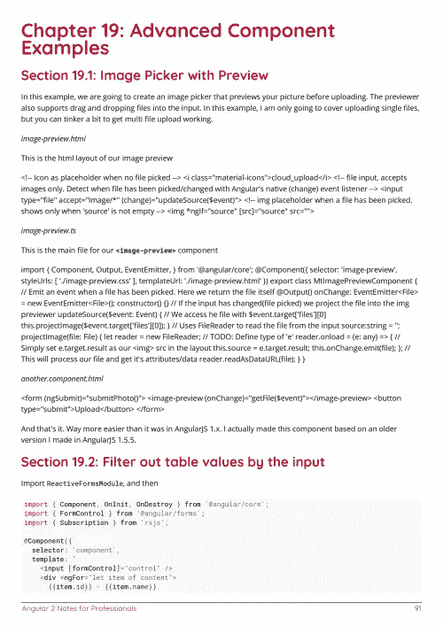
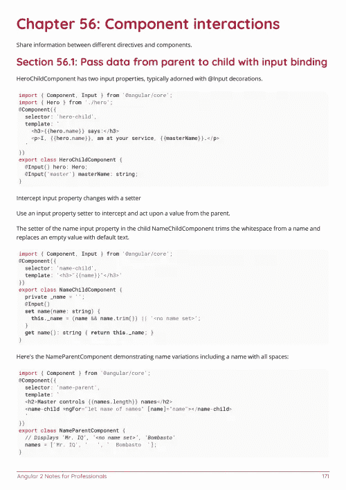

# 电子书:专业人士的角度 2 笔记书

> 原文：<https://medium.easyread.co/e-book-angular-2-notes-for-professionals-book-8b2eacf30c4f?source=collection_archive---------2----------------------->

## GoalKicker.com 免费下载 Angular 2 的电子书

**下载这里:**[**【http://goalkicker.com/Angular2Book】**](http://goalkicker.com/Angular2Book)

*《棱角 2 笔记》专业人士用书由* [*栈溢出文档*](https://archive.org/details/documentation-dump.7z) *汇编而成，内容由栈溢出的漂亮人士撰写。文本内容由-SA 在知识共享协议下发布。见本书末尾的致谢，感谢对各章节做出贡献的人。除非另有说明，图像可能是其各自所有者的版权*

*本书为教育目的而创作，不属于 Angular 2 集团、公司或 Stack Overflow。所有商标属于其各自的公司所有者*

*230 页，2018 年 1 月出版*

# 章

1.  Angular 2 入门
2.  使用 viewcontainerref . create component 动态添加组件
3.  管道
4.  路由(3.0.0+)
5.  Http 拦截器
6.  指令
7.  使用 angular-CLI @ 1 . 0 . 0-beta 10 安装第三方插件
8.  测试 Angular 2 应用程序
9.  按指定路线发送
10.  使用 ChangeDetectionStrategy 优化渲染
11.  生命周期挂钩
12.  指令和组件:@输入@输出
13.  API 请求的角度 RXJS 主题和可观察项
14.  区域. js
15.  服务和依赖注入
16.  角度 2 形式更新
17.  检测调整大小事件
18.  角度 2 中的引导空模块
19.  高级组件示例
20.  绕过可信值的消毒
21.  Angular2 自定义验证
22.  角度 2 数据驱动表单
23.  有角度的—对于 Loop
24.  功能模块
25.  内存 Web API 中的 Angular2
26.  带 Angular 2 的超前(AOT)编译
27.  使用 Visual Studio 代码调试 Angular2 typescript 应用程序
28.  Angular2 中的 CRUD 与 Restful API
29.  组件交互
30.  在 Angular 2 中使用本机 webcomponents
31.  延迟加载模块
32.  更新打字
33.  嘲讽@ngrx/Store
34.  如何使用 ngfor
35.  ngrx
36.  动画
37.  常见的内置指令和服务
38.  如何使用 ngif
39.  测试 ngModel
40.  创建一个有角度的 2+ NPM 包
41.  Angular2 可以激活
42.  角度 2 —量角器
43.  静态 URL 的路由示例，如/route/subroute
44.  Angular2 输入()输出()
45.  页面标题
46.  单元测试
47.  角度气候
48.  按管道排序
49.  Angular2 动画
50.  角度 2 变化检测和手动触发
51.  Angular2 数据绑定
52.  暴力升级
53.  事件发射器服务
54.  Angular2 在引导之前向 App 提供外部数据
55.  在 Angular 2 中使用像 jQuery 这样的第三方库
56.  组件交互
57.  属性指令来影响主机节点上的属性值。
58.  模板
59.  配置 ASP.net 核心应用程序以使用 Angular 2 和 TypeScript
60.  Angular2 使用 webpack
61.  棱角分明的材料设计
62.  角度 2 中的下降区
63.  自定义 ngx-引导日期选择器+输入
64.  角度冗余
65.  创建角度 npm 库
66.  桶
67.  angular-cli 测试覆盖率
68.  服务行业人员
69.  成分
70.  模块