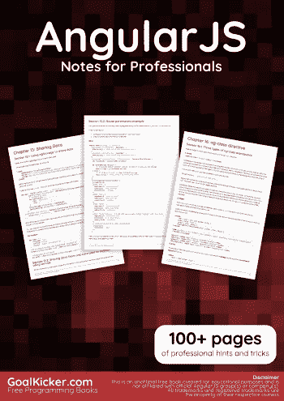
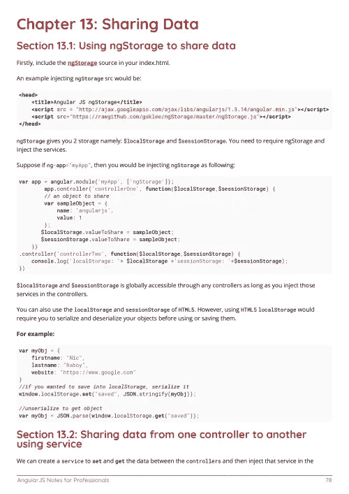
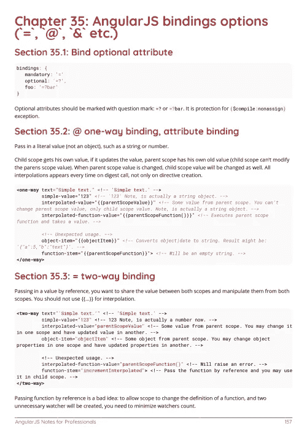

# 电子书:专业人士的角度笔记

> 原文：<https://medium.easyread.co/e-book-angularjs-notes-for-professionals-book-14244747dab6?source=collection_archive---------6----------------------->

## GoalKicker.com 免费下载安古拉杰的电子书

**下载这里:**[**【http://goalkicker.com/AngularJSBook/】**](http://goalkicker.com/AngularJSBook/)

*《专业人士须知》一书由* [*栈溢出文档*](https://archive.org/details/documentation-dump.7z) *整理而成，内容由栈溢出美工撰写。文本内容由-SA 在知识共享协议下发布。见本书末尾的致谢，感谢对各章节做出贡献的人。除非另有说明，图像可能是其各自所有者的版权*

*为教育目的而创作的书籍，不属于 AngularJS 集团、公司或 Stack Overflow。所有商标属于其各自的公司所有者*

*200 页，2018 年 1 月出版*

# 章

1.  AngularJS 入门
2.  控制器
3.  内置指令
4.  模块
5.  成分
6.  自定义指令
7.  过滤
8.  服务
9.  依赖注入
10.  单元测试
11.  分析和性能
12.  事件
13.  共享数据
14.  数据绑定如何工作
15.  使用 ngRoute 路由
16.  ng 级指令
17.  使用 ngModelController 的指令
18.  ui 路由器
19.  自定义过滤器
20.  内置助手函数
21.  摘要循环演练
22.  角度范围
23.  AngularJS 陷阱和陷阱
24.  将 AngularJS 与 TypeScript 一起使用
25.  $http 请求
26.  常数
27.  表单验证
28.  角承诺与$q 服务
29.  准备生产—咕哝
30.  排除故障
31.  提供者
32.  装修工
33.  繁重的任务
34.  角度项目—目录结构
35.  AngularJS 绑定选项(` = `、`@ `、` & `等。)
36.  惰性装载
37.  HTTP 拦截器
38.  打印
39.  性能分析
40.  区分服务与工厂
41.  内置指令的使用
42.  ng-重复
43.  会话存储
44.  角度 MVC
45.  ng 风格
46.  ng 视图
47.  控制器中的自我或此变量
48.  带 ES6 的控制器
49.  带 ES6 的自定义过滤器
50.  迁移到角度 2+
51.  有角信号器
52.  具有数据过滤、分页等功能