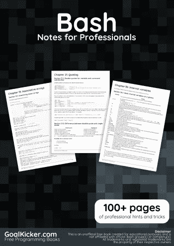
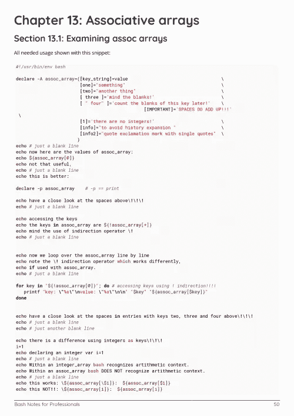
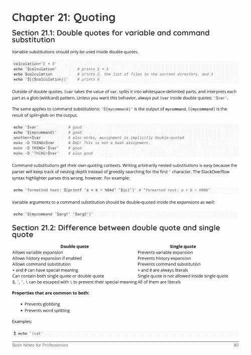

# 电子书:Bash 专业人士笔记

> 原文：<https://medium.easyread.co/e-book-bash-notes-for-professionals-book-4e5708030332?source=collection_archive---------13----------------------->

## GoalKicker.com 免费下载巴什的电子书

**下载这里:**[**【http://goalkicker.com/BashBook/】**](http://goalkicker.com/BashBook/)

*《专业人士的痛击笔记》一书由* [*栈溢出文档*](https://archive.org/details/documentation-dump.7z) *编译而成，内容由栈溢出的美文人士撰写。文本内容由-SA 在知识共享协议下发布。见本书末尾的致谢，感谢对各章节做出贡献的人。除非另有说明，图像可能是其各自所有者的版权*

*本书以教育为目的，不隶属于 Bash 集团、公司或 Stack Overflow。所有商标属于其各自的公司所有者*

*202 页，2018 年 1 月出版*

# 章

1.  Bash 入门
2.  脚本设计
3.  导航目录
4.  列出文件
5.  使用卡特彼勒
6.  可做文件内的字符串查找
7.  错认假频伪信号
8.  作业和流程
9.  重寄
10.  控制结构
11.  真、假和:命令
12.  数组
13.  关联数组
14.  功能
15.  Bash 参数扩展
16.  复印(cp)
17.  发现
18.  使用排序
19.  采购
20.  这里是文档，这里是字符串
21.  引用
22.  条件表达式
23.  使用参数编写脚本
24.  Bash 历史替换
25.  数学
26.  Bash 算法
27.  辖域
28.  过程替代
29.  可编程完成
30.  定制 PS1
31.  支撑膨胀
32.  getopts:智能位置参数解析
33.  排除故障
34.  模式匹配和正则表达式
35.  更换外壳
36.  内部变量
37.  作业控制
38.  选择语句
39.  逐行(和/或逐字段)读取文件(数据流、变量)？
40.  文件执行序列
41.  分割文件
42.  使用 scp 进行文件传输
43.  管道
44.  管理路径环境变量
45.  单词拆分
46.  使用 printf 避免日期
47.  使用“陷阱”对信号和系统事件做出反应
48.  指挥和操作链
49.  贝壳的类型
50.  彩色脚本输出(跨平台)
51.  协同流程
52.  键入变量
53.  特定时间的工作
54.  处理系统提示
55.  剪切命令
56.  Windows 10 上的狂欢
57.  剪切命令
58.  全局和局部变量
59.  CGI 脚本
60.  选择关键字
61.  何时使用评估
62.  与 Bash 联网
63.  平行的
64.  解码 URL
65.  设计模式
66.  陷阱
67.  快捷键