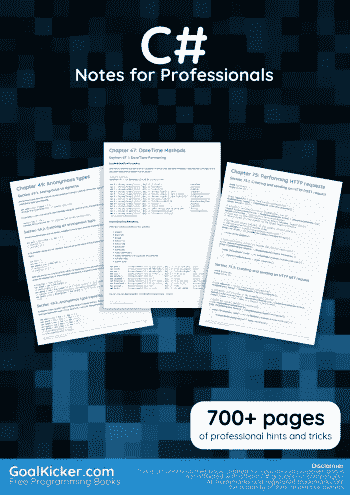
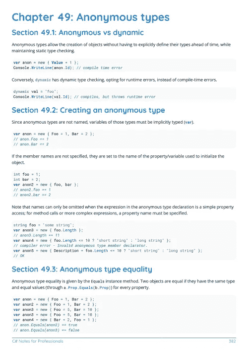
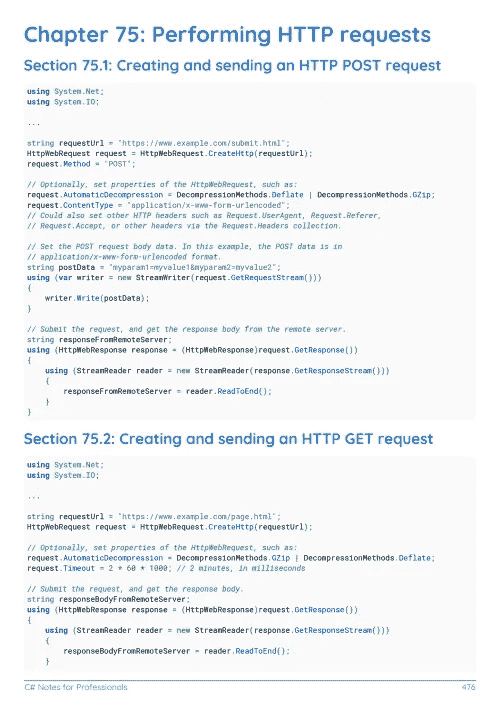

# 电子书:C#专业人员笔记

> 原文：<https://medium.easyread.co/e-book-c-notes-for-professionals-book-199334e14a59?source=collection_archive---------0----------------------->

## GoalKicker.com 免费下载 C#的电子书

**下载这里:**[**【http://goalkicker.com/CSharpBook/】**](http://goalkicker.com/CSharpBook/)

*c#专业人士笔记一书由* [*栈溢出文档*](https://archive.org/details/documentation-dump.7z) *编译而成，内容由栈溢出达人撰写。文本内容由-SA 在知识共享协议下发布。见本书末尾的致谢，感谢对各章节做出贡献的人。除非另有说明，图像可能是其各自所有者的版权*

*为教育目的而创建的图书，不隶属于 C#组、公司或 Stack Overflow。所有商标属于其各自的公司所有者*

*807 页，2018 年 1 月出版*

# 章

1.  C#语言入门
2.  逐字字符串
3.  经营者
4.  扩展方法
5.  集合初始值设定项
6.  字符串插值
7.  C#集合概述
8.  构造函数和终结器
9.  静态类
10.  关键词
11.  C#中的面向对象编程
12.  遗产
13.  无商标消费品
14.  Using 语句
15.  使用指令
16.  反射
17.  零合并算子
18.  入门:使用 C#的 Json
19.  LINQ 询问
20.  C# 7.0 的功能
21.  C# 6.0 的特性
22.  C# 5.0 的功能
23.  C# 4.0 的功能
24.  C# 3.0 的特性
25.  字符串转义序列
26.  异常处理
27.  空条件运算符
28.  内置类型
29.  λ表达式
30.  异步等待
31.  性能
32.  穿线
33.  方法
34.  Yield 关键字
35.  事件
36.  常见字符串操作
37.  表达式树
38.  过载分辨率
39.  字符串。格式
40.  操作员姓名
41.  中的不安全代码。网
42.  初始化属性
43.  绑定列表
44.  离子发生器
45.  对象初始化器
46.  XML 文档注释
47.  预处理器指令
48.  动态类型
49.  匿名类型
50.  结构
51.  元组
52.  列举型别
53.  访问修饰符
54.  任务并行库
55.  属性
56.  全局唯一标识符
57.  单例实现
58.  代表
59.  可空类型
60.  垃圾收集器进来了。网
61.  建立工作关系网
62.  数组
63.  等式运算符
64.  锁定语句
65.  动作过滤器
66.  XmlDocument 和系统。Xml 命名空间
67.  日期时间方法
68.  背景工作者
69.  多态性
70.  分度器
71.  IDisposable 接口
72.  内置类型的别名
73.  不变
74.  XDocument 和系统。Xml.Linq 命名空间
75.  执行 HTTP 请求
76.  在 C#中生成随机数
77.  环
78.  命名参数
79.  诊断学
80.  接口
81.  IEnumerable
82.  命名规格
83.  已检查和未检查
84.  递归
85.  函数式编程
86.  文字
87.  铸造
88.  NullReferenceException
89.  Func 代表
90.  LINQ 到 XML
91.  哈希函数
92.  将字符串转换为其他类型时处理 FormatException
93.  密码学(系统。安全性。密码术)
94.  INotifyPropertyChanged 接口
95.  值类型与引用类型
96.  可查询接口
97.  任务并行库(TPL)数据流结构
98.  溪流
99.  运行时编译
100.  条件语句
101.  互用性
102.  泛滥
103.  Equals 和 GetHashCode
104.  类型变换
105.  平行 LINQ (PLINQ)
106.  字处理
107.  字符串连接
108.  分部类和方法
109.  秒表
110.  正则表达式解析
111.  C#脚本
112.  Async/await、Backgroundworker、任务和线程示例
113.  定时器
114.  具有多个返回值的函数
115.  二进制序列化
116.  使变量线程安全
117.  I 可比
118.  代码合同
119.  迭代器
120.  AssemblyInfo.cs 示例
121.  文件和流 I/O
122.  代码契约和断言
123.  贮藏
124.  实现 Flyweight 设计模式
125.  StringBuilder
126.  实现装饰设计模式
127.  访问数据库
128.  T4 码生成
129.  微软。Exchange 服务
130.  。NET 编译器平台(罗斯林)
131.  数据注释
132.  在 C#中使用 SQLite
133.  系统。管理。自动化
134.  文件系统观察器
135.  系统。目录服务.协议. LDAP 连接
136.  命名参数和可选参数
137.  注释和区域
138.  C#身份验证处理程序
139.  指针和不安全代码
140.  两颗北极指极星
141.  如何使用 C#结构创建联合类型(类似于 C #联合)
142.  大整数
143.  依赖注入
144.  反应式延伸(Rx)
145.  创造性的设计模式
146.  使用纯文本编辑器和 C#编译器(csc.exe)创建控制台应用程序
147.  阅读和写作。zip 文件
148.  λ表达式
149.  通用 Lambda 查询生成器
150.  导入 Google 联系人
151.  CLSCompliantAttribute
152.  可观察集合
153.  异步等待中的同步上下文
154.  可克隆的
155.  阅读并理解堆栈跟踪
156.  Linq 到对象
157.  ASP。网络身份
158.  使用用户名和密码访问网络共享文件夹
159.  异步套接字
160.  结构设计模式
161.  阵列循环旋转的 O(n)算法
162.  在 Windows 窗体应用程序中创建自己的 MessageBox
163.  包括字体资源
164.  使用 json.net
165.  Windows 通信基础