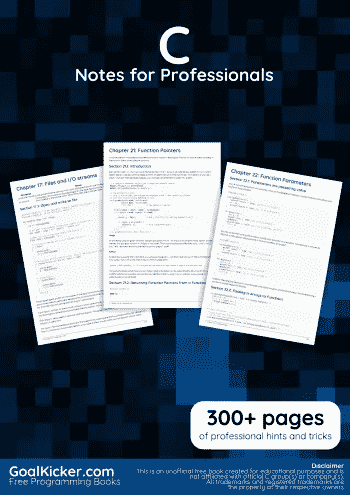
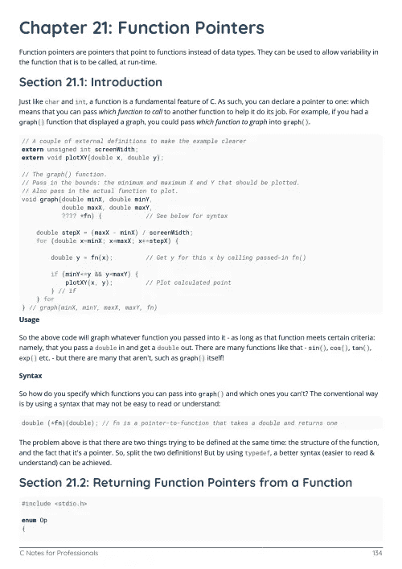
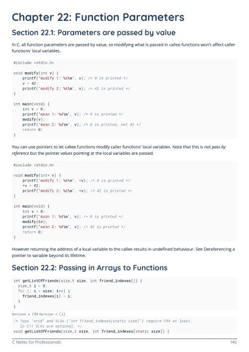

# 电子书:专业人员用 C 语言笔记

> 原文：<https://medium.easyread.co/e-book-c-notes-for-professionals-book-1e1509b20d74?source=collection_archive---------10----------------------->

## GoalKicker.com 免费下载 C 的电子书

**下载这里:**[**【http://goalkicker.com/CBook/】**](http://goalkicker.com/CBook/)

*《专业人士 C 语言笔记》一书由* [*栈溢出文档*](https://archive.org/details/documentation-dump.7z) *编译而成，内容由栈溢出达人撰写。文本内容由-SA 在知识共享协议下发布。见本书末尾的致谢，感谢对各章节做出贡献的人。除非另有说明，图像可能是其各自所有者的版权*

*为教育目的创建的图书，不隶属于 C 集团、公司或 Stack Overflow。所有商标属于其各自的公司所有者*

*340 页，2018 年 1 月出版*

# 章

1.  C 语言入门
2.  评论
3.  数据类型
4.  经营者
5.  布尔代数学体系的
6.  用线串
7.  数字、字符和字符串的文字
8.  复合文字
9.  位字段
10.  数组
11.  链接列表
12.  列举
13.  结构
14.  标准数学
15.  迭代语句/循环:for，while，do-while
16.  命令行参数
17.  文件和 I/O 流
18.  格式化输入/输出
19.  两颗北极指极星
20.  序列点
21.  函数指针
22.  功能参数
23.  将 2D 数组传递给函数
24.  错误处理
25.  未定义的行为
26.  随机数生成
27.  预处理器和宏
28.  信号处理
29.  可变参数
30.  主张
31.  通用选择
32.  x 宏
33.  别名和有效类型
34.  汇编
35.  标识符范围
36.  隐式和显式转换
37.  类型限定符
38.  瓦尔格兰
39.  Typedef
40.  选择语句
41.  声明与定义
42.  存储类别
43.  声明
44.  内嵌汇编
45.  初始化
46.  结构填充和包装
47.  内存管理
48.  实现定义的行为
49.  原子学
50.  跳转语句
51.  创建并包含头文件
52.  测试框架
53.  <ctype.h>—字符分类和转换</ctype.h>
54.  副作用
55.  多字符字符序列
56.  限制
57.  内嵌
58.  联合
59.  线程(本机)
60.  多线程操作
61.  进程间通信
62.  常见的 C 编程习惯用法和开发人员实践
63.  常见陷阱