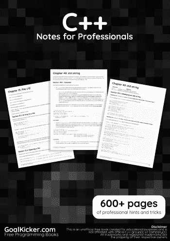
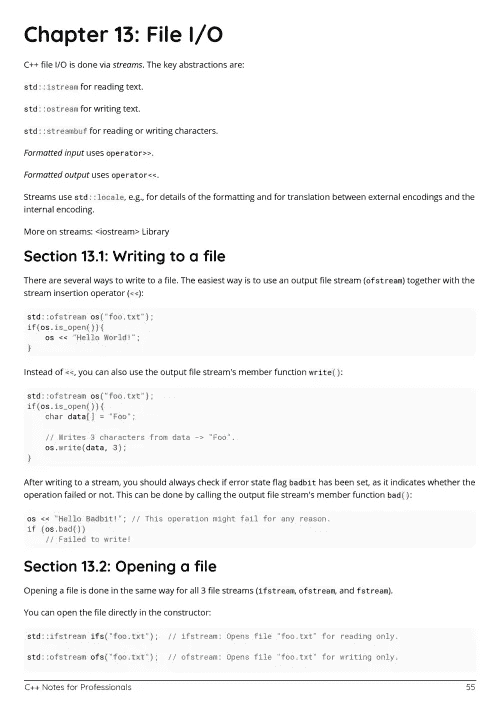
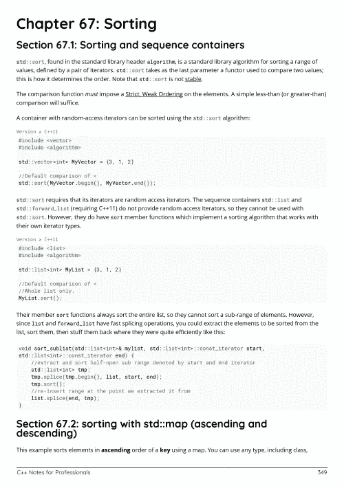

# 电子书:C++专业人员笔记

> 原文：<https://medium.easyread.co/e-book-c-notes-for-professionals-book-6e659c5fee8e?source=collection_archive---------4----------------------->

## GoalKicker.com 免费下载 C++的电子书

**下载自[**[**Google Drive**](https://drive.google.com/open?id=1-g_2WXRM4E0zvDFxZBMqEKDzJBm6nSVI)

***《c++专业人士笔记》一书由* [*栈溢出文档*](https://archive.org/details/documentation-dump.7z) *编译而成，内容由栈溢出达人撰写。文本内容由-SA 在知识共享协议下发布。见本书末尾的致谢，感谢对各章节做出贡献的人。除非另有说明，否则图像可能是其各自所有者的版权***

***本书为教育目的而创作，不隶属于 C++集团、公司或 Stack Overflow。所有商标属于其各自的公司所有者***

***704 页，2018 年 1 月出版***

********

# **章**

1.  **C++入门**
2.  **文字**
3.  **内嵌变量**
4.  **运算符优先级**
5.  **浮点运算**
6.  **比特运算符**
7.  **位操作**
8.  **位字段**
9.  **数组**
10.  **迭代器**
11.  **c++中的基本输入/输出**
12.  **环**
13.  **文件输入输出**
14.  **C++流**
15.  **流操纵器**
16.  **流控制**
17.  **元编程**
18.  **const 关键字**
19.  **可变关键字**
20.  **朋友关键字**
21.  **键入关键字**
22.  **基本类型关键字**
23.  **变量声明关键字**
24.  **关键词**
25.  **从函数中返回几个值**
26.  **多态性**
27.  **参考**
28.  **价值和指称语义学**
29.  **C++函数“通过值调用”与“通过引用调用”**
30.  **复制与分配**
31.  **两颗北极指极星**
32.  **指向成员的指针**
33.  **This 指针**
34.  **智能指针**
35.  **类别/结构**
36.  **函数重载**
37.  **运算符重载**
38.  **函数模板重载**
39.  **虚拟成员函数**
40.  **内嵌函数**
41.  **特殊成员功能**
42.  **非静态成员函数**
43.  **常量类成员函数**
44.  **C++容器**
45.  **名称空间**
46.  **头文件**
47.  **使用声明**
48.  **标准::字符串**
49.  **std::数组**
50.  **标准::矢量**
51.  **标准::地图**
52.  **标准::可选**
53.  **函数:包装任何可调用的元素**
54.  **std::forward_list**
55.  **标准::配对**
56.  **标准::原子学**
57.  **标准::变量**
58.  **std::iomanip**
59.  **标准::任何**
60.  **std::set 和 std::multiset**
61.  **标准::整数 _ 序列**
62.  **使用 std::unordered_map**
63.  **标准库算法**
64.  **ISO C++标准**
65.  **随机数生成**
66.  **使用<chrono>标题的日期和时间</chrono>**
67.  **整理**
68.  **列举**
69.  **循环**
70.  **正则表达式**
71.  **实现定义的行为**
72.  **例外**
73.  **兰姆达斯**
74.  **价值类别**
75.  **预处理程序**
76.  **C++中的数据结构**
77.  **模板**
78.  **表达式模板**
79.  **奇怪地重复出现的模板模式(CRTP)**
80.  **穿线**
81.  **线程同步结构**
82.  **三、五、零的规则**
83.  **RAII:资源获取是初始化**
84.  **RTTI:运行时类型信息**
85.  **互斥体**
86.  **递归互斥体**
87.  **旗语**
88.  **未来和承诺**
89.  **原子类型**
90.  **类型擦除**
91.  **显式类型转换**
92.  **未命名类型**
93.  **类型特征**
94.  **返回类型协方差**
95.  **对象类型的布局**
96.  **类型推理**
97.  **Typedef 和类型别名**
98.  **类型演绎**
99.  **尾随返回类型**
100.  **对齐**
101.  **完美转发**
102.  **decltype**
103.  **SFINAE(替换失败不是错误)**
104.  **未定义的行为**
105.  **过载分辨率**
106.  **移动语义**
107.  **皮尔·习语**
108.  **汽车**
109.  **复制省略**
110.  **折叠表达式**
111.  **联合**
112.  **C++中设计模式的实现**
113.  **单一设计模式**
114.  **用户定义的文字**
115.  **内存管理**
116.  **C++11 内存模型**
117.  **领域**
118.  **静态断言**
119.  **constexpr**
120.  **一个定义规则(ODR)**
121.  **未指明的行为**
122.  **参数相关名称查找**
123.  **属性**
124.  **C++中的递归**
125.  **算术元编程**
126.  **可调用对象**
127.  **客户端服务器示例**
128.  **常数正确性**
129.  **参数包**
130.  **构建系统**
131.  **OpenMP 的并发性**
132.  **资源管理**
133.  **存储类说明符**
134.  **链接规格**
135.  **数字分隔符**
136.  **c 不兼容**
137.  **通过 C++与 C++11、C++14 和 C++17 解决的经典 C++示例的并排比较**
138.  **编译和构建**
139.  **常见编译/链接错误(GCC)**
140.  **C++中更多未定义的行为**
141.  **C++中的单元测试**
142.  **C++调试和调试预防工具与技术**
143.  **C++中的优化**
144.  **最佳化**
145.  **压型**
146.  **重构技术**