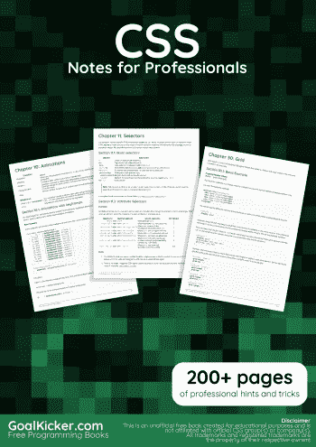
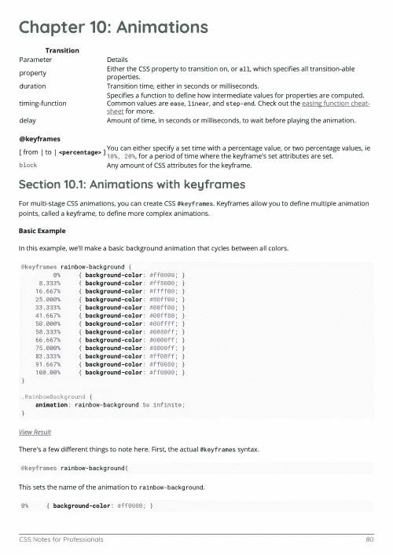
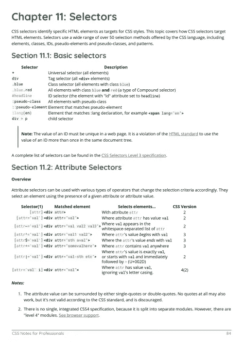

# 电子书:CSS 专业笔记

> 原文：<https://medium.easyread.co/e-book-css-notes-for-professionals-book-6b4fac744ae8?source=collection_archive---------9----------------------->

## GoalKicker.com 免费下载 CSS 的电子书

**下载这里:**[**【http://goalkicker.com/CSSBook/】**](http://goalkicker.com/CSSBook/)

*专业人士 CSS 笔记一书由* [*栈溢出文档*](https://archive.org/details/documentation-dump.7z) *编译而成，内容由栈溢出的美人写。文本内容由-SA 在知识共享协议下发布。见本书末尾的致谢，感谢对各章节做出贡献的人。除非另有说明，图像可能是其各自所有者的版权*

*为教育目的创建的图书，不隶属于 CSS 集团、公司或 Stack Overflow。所有商标属于其各自的公司所有者*

*241 页，2018 年 1 月出版*

# 章

1.  CSS 入门
2.  背景
3.  定中心
4.  利润
5.  媒体查询
6.  漂浮物
7.  排印
8.  柔性盒布局(Flexbox)
9.  级联和特异性
10.  动画片
11.  选择器
12.  颜色；色彩；色调
13.  盒子模型
14.  过渡
15.  长度单位
16.  伪元素
17.  配置
18.  2D 变换
19.  桌子
20.  浏览器支持和前缀
21.  规范化浏览器样式
22.  填料
23.  布局控制
24.  过滤属性
25.  评论
26.  光标样式
27.  箱形阴影
28.  自定义属性(变量)
29.  彩车的形状
30.  格子
31.  边境
32.  功能
33.  3D 转换
34.  计数器
35.  单一元素形状
36.  不透明
37.  表演
38.  列
39.  内嵌块布局
40.  遗产
41.  CSS 图像精灵
42.  剪裁和遮罩
43.  列表样式
44.  概述
45.  CSS 规则的结构和格式
46.  分裂
47.  泛滥
48.  CSS 对象模型
49.  功能查询
50.  堆叠上下文
51.  Internet Explorer 黑客
52.  阻止格式化上下文
53.  垂直居中
54.  对象适配和放置
55.  多列
56.  CSS 设计模式