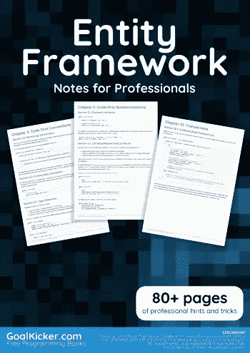
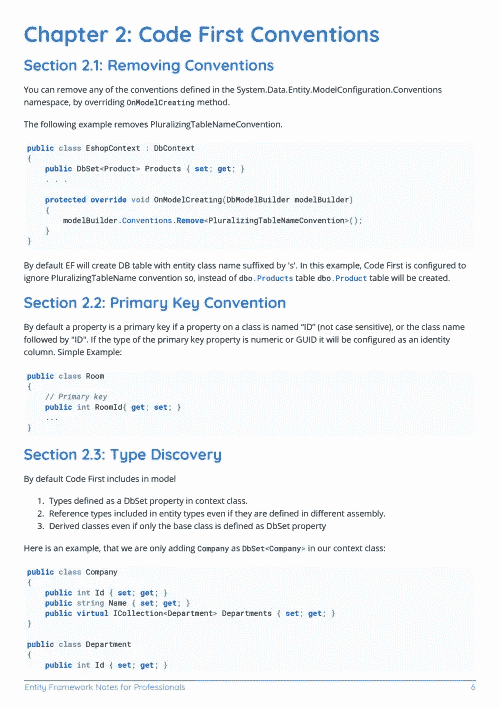
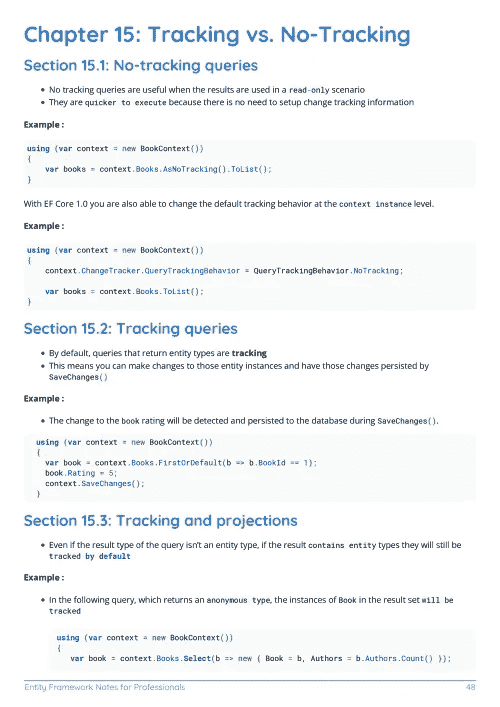

# 电子书:专业人士用实体框架笔记

> 原文：<https://medium.easyread.co/e-book-entity-framework-notes-for-professionals-book-78ed9e682a35?source=collection_archive---------6----------------------->

## GoalKicker.com 免费下载实体框架的电子书

**下载这里:**[**【http://goalkicker.com/EntityFrameworkBook/】**](http://goalkicker.com/EntityFrameworkBook/)

*实体框架专业人士须知本书由* [*栈溢出文档*](https://archive.org/details/documentation-dump.7z) *编译而成，内容由栈溢出的美人写。文本内容由-SA 在知识共享协议下发布。见本书末尾的致谢，感谢对各章节做出贡献的人。除非另有说明，图像可能是其各自所有者的版权*

*为教育目的创建的图书，不隶属于实体框架组、公司或 Stack Overflow。所有商标属于其各自的公司所有者*

*94 页，2018 年 1 月出版*

# 章

1.  实体框架入门
2.  代码优先约定
3.  EF 中的优化技术
4.  实体框架中的. t4 模板
5.  代码优先数据注释
6.  数据库首次模型生成
7.  模型约束
8.  代码优先—流畅的 API
9.  加载相关实体
10.  处理
11.  管理实体状态
12.  实体框架代码优先
13.  数据库初始化器
14.  复杂类型
15.  跟踪与不跟踪
16.  实体框架代码优先迁移
17.  使用 Postgresql 的实体框架
18.  用 EntityFramework 继承(代码优先)
19.  实体框架的最佳实践(简单和专业)
20.  使用 SQLite 的实体框架
21.  高级映射场景:实体分割、表格分割
22.  首先是与实体框架代码的映射关系:一对一和变化
23.  先与实体框架代码映射关系:一对多和多对多