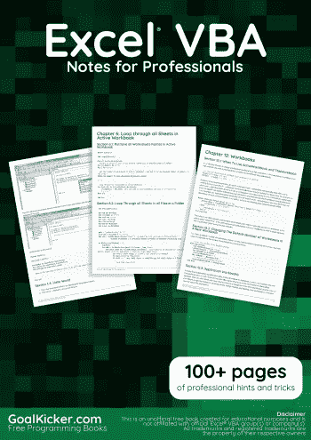
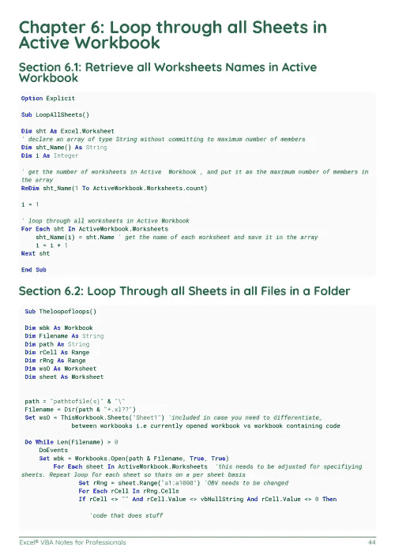
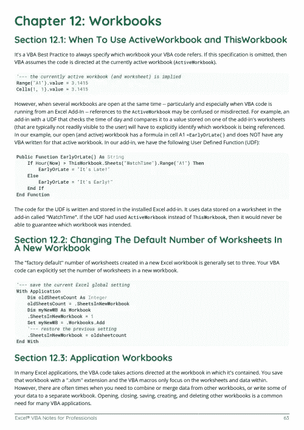

# 电子书:Excel VBA 笔记专业书籍

> 原文：<https://medium.easyread.co/e-book-excel-vba-notes-for-professionals-book-2e0bed204da5?source=collection_archive---------5----------------------->

## GoalKicker.com 免费下载 Excel VBA 的电子书

**下载这里:**[**【http://goalkicker.com/ExcelVBABook/】**](http://goalkicker.com/ExcelVBABook/)

*《Excel VBA 笔记》专业人士用书是由* [*栈溢出文档*](https://archive.org/details/documentation-dump.7z) *汇编而成，内容是由漂亮的栈溢出人士编写的。文本内容由-SA 在知识共享协议下发布。见本书末尾的致谢，感谢对各章节做出贡献的人。除非另有说明，图像可能是其各自所有者的版权*

*本书为教育目的而创作，不隶属于 Excel VBA 集团、公司或 Stack Overflow。所有商标属于其各自的公司所有者*

*127 页，2018 年 1 月出版*

# 章

1.  excel-vba 入门
2.  调试和故障排除
3.  查找工作表中最后使用的行或列的方法
4.  用户定义函数(UDF)
5.  VBA 最佳实践
6.  遍历活动工作簿中的所有工作表
7.  范围和单元格
8.  常见错误
9.  数组
10.  Excel VBA 提示和技巧
11.  通过 VBA 集成 PowerPoint
12.  工作簿
13.  数据透视表
14.  有约束力的
15.  图表和制图
16.  应用对象
17.  合并的单元格/区域
18.  VBA 安全
19.  如何录制宏
20.  在一个范围内查找重复值
21.  命名范围
22.  自动筛选；用途和最佳实践
23.  在活动工作表中创建带有组合框的下拉菜单
24.  条件语句
25.  在 VBA 使用 Excel 表格
26.  Excel-VBA 优化
27.  使用 VBA 的条件格式
28.  文件系统对象
29.  Excel VBA 版中的 SQL 最佳实践
30.  使用工作表对象而不是工作表对象
31.  实践中的自定义文档属性