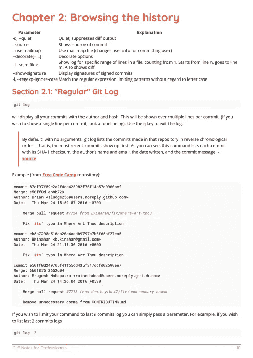

# 电子书 Git 笔记专业书籍

> 原文：<https://medium.easyread.co/e-book-git-notes-for-professionals-book-9ab2f247242a?source=collection_archive---------11----------------------->

## GoalKicker.com 免费下载 Git 的电子书

**下载这里:**[**【http://goalkicker.com/GitBook/】**](http://goalkicker.com/GitBook/)

*Git Notes for Professionals 本书由* [*栈溢出文档*](https://archive.org/details/documentation-dump.7z) *编译而成，内容由栈溢出的美文人士撰写。文本内容由-SA 在知识共享协议下发布。见本书末尾的致谢，感谢对各章节做出贡献的人。除非另有说明，图像可能是其各自所有者的版权*

*为教育目的创建的图书，不隶属于 Git 集团、公司或 Stack Overflow。所有商标属于其各自的公司所有者*

*193 页，2018 年 1 月出版*

# 章

1.  Git 入门
2.  浏览历史记录
3.  使用遥控器
4.  脚手架
5.  忽略文件和文件夹
6.  Git 差异
7.  取消
8.  合并
9.  子模块
10.  犯罪
11.  别名
12.  重置基础
13.  配置
14.  分支
15.  修订列表
16.  挤压
17.  樱桃采摘
18.  恢复
19.  干净利落
20.  使用. gitattributes 文件
21.  。邮件映射文件:关联参与者和电子邮件别名
22.  分析工作流的类型
23.  拉
24.  钩住
25.  克隆存储库
26.  隐藏
27.  子树
28.  重新命名
29.  推
30.  内部构件
31.  git-tfs
32.  Git 中的空目录
33.  git-svn
34.  档案馆
35.  用过滤分支重写历史
36.  迁移到 Git
37.  显示
38.  解决合并冲突
39.  束
40.  用 Gitk 图形化显示提交历史
41.  平分/查找错误提交
42.  谴责
43.  Git 修订语法
44.  工作树
45.  Git 遥控器
46.  Git 大文件存储(LFS)
47.  Git 补丁
48.  Git 统计
49.  git 发送电子邮件
50.  Git GUI 客户端
51.  Reflog —恢复 git 日志中未显示的提交
52.  TortoiseGit
53.  外部合并和 difftools
54.  更新引用中的对象名
55.  Bash Ubuntu 上的 Git 分支名称
56.  Git 客户端挂钩
57.  Git rerere
58.  更改 git 存储库名称
59.  Git 标签
60.  整理您的本地和远程存储库
61.  差异树