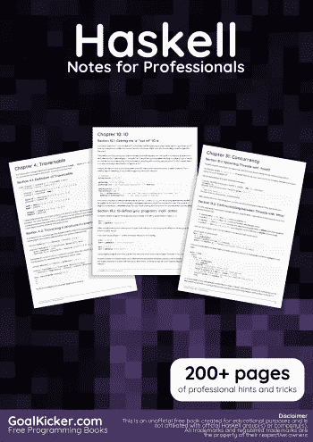
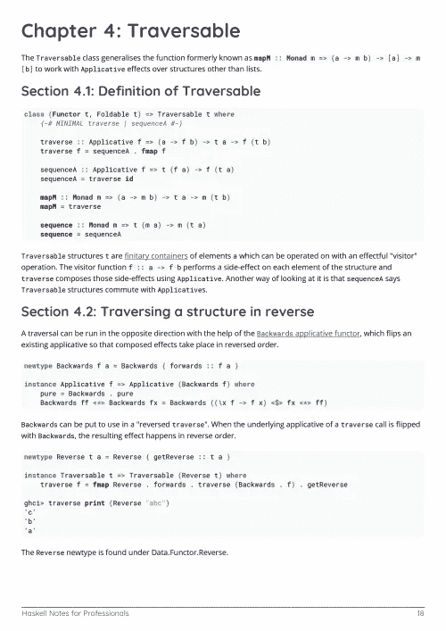
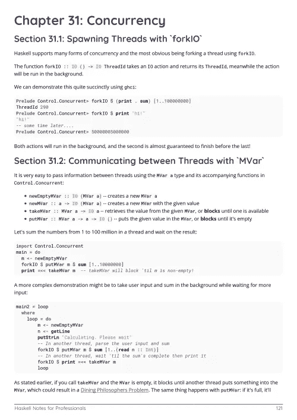

# 电子书:Haskell 专业人士笔记

> 原文：<https://medium.easyread.co/e-book-haskell-notes-for-professionals-book-c2e5962b0b25?source=collection_archive---------13----------------------->

## GoalKicker.com 免费下载哈斯克尔的电子书

**下载这里:**[**【http://goalkicker.com/HaskellBook/】**](http://goalkicker.com/HaskellBook/)

*《Haskell Notes for Professionals》一书由* [*栈溢出文档*](https://archive.org/details/documentation-dump.7z) *汇编而成，内容由栈溢出的美人写。文本内容由-SA 在知识共享协议下发布。见本书末尾的致谢，感谢对各章节做出贡献的人。除非另有说明，图像可能是其各自所有者的版权*

*本书为教育目的而创作，不隶属于 Haskell 集团、公司或 Stack Overflow。所有商标属于其各自的公司所有者*

*228 页，2018 年 1 月出版*

# 章

1.  Haskell 语言入门
2.  重载文字
3.  可合拢的
4.  可否定的
5.  镜头
6.  快速检查
7.  通用 GHC 语言扩展
8.  自由单子
9.  类型类别
10.  超正析象管(Image Orthicon)
11.  记录语法
12.  部分应用
13.  幺半群
14.  范畴论
15.  列表
16.  排序算法
17.  类型系列
18.  单子
19.  堆
20.  广义代数数据类型
21.  递归方案
22.  数据。文本
23.  使用 GHCi
24.  严格
25.  函数中的语法
26.  函子
27.  用 Tasty 测试
28.  创建自定义数据类型
29.  活性香蕉
30.  最佳化
31.  并发
32.  功能组成
33.  数据库
34.  数据。Haskell 中的 Aeson — JSON
35.  高阶函数
36.  容器—数据。地图
37.  固定性声明
38.  Web 开发
39.  向量
40.  阴谋
41.  类型代数
42.  箭头
43.  打字孔
44.  重写规则(GHC)
45.  日期和时间
46.  列出理解
47.  流式 IO
48.  谷歌协议缓冲区
49.  模板 Haskell & QuasiQuotes
50.  幻影类型
51.  模块
52.  元组(成对，三元组，…)
53.  带光泽的图形
54.  状态单子
55.  管道
56.  中缀运算符
57.  平行
58.  用 taggy-lens 和 lens 解析 HTML
59.  外部功能接口
60.  Gtk3
61.  单子变压器
62.  双功能
63.  委托书
64.  应用函子
65.  普通单子作为自由单子
66.  作为余自由余函子基的公共函子
67.  算术
68.  作用
69.  具有秩类型的任意秩多态性
70.  GHCJS
71.  可扩展标记语言
72.  读者/读者
73.  函数调用语法
74.  记录
75.  阿托帕塞克
76.  zipWithM
77.  浪荡子
78.  类型应用