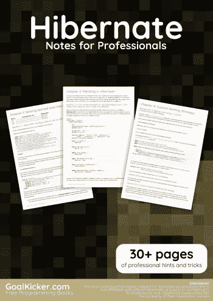
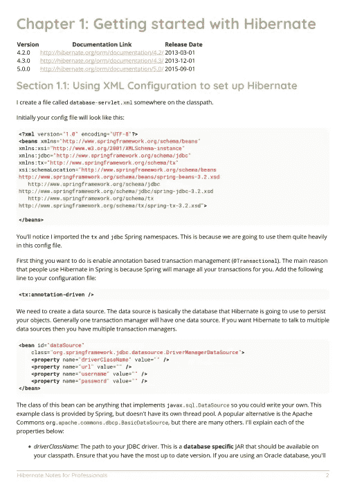
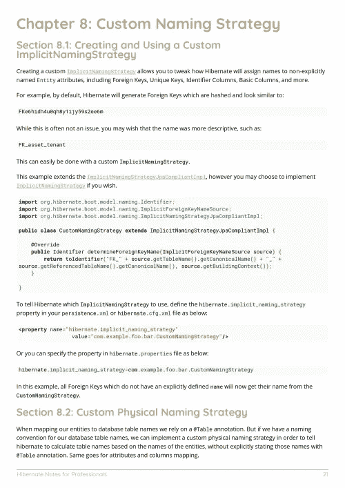

# 电子书:Hibernate 专业人员笔记

> 原文：<https://medium.easyread.co/e-book-hibernate-notes-for-professionals-book-e3d0c93c225f?source=collection_archive---------5----------------------->

## GoalKicker.com 免费下载 Hibernate 的电子书

**下载这里:**[**【http://books.goalkicker.com/HibernateBook/】**](http://books.goalkicker.com/HibernateBook/)

*Hibernate Notes for Professionals 这本书是由 Stack Overflow 文档汇编而成，内容是 Stack Overflow 的漂亮人写的。文本内容由-SA 在知识共享协议下发布。见本书末尾的致谢，感谢对各章节做出贡献的人。除非另有说明，图像可能是其各自所有者的版权*

*本书以教育为目的，不隶属于 Hibernate 集团、公司或 Stack Overflow。所有商标属于其各自的公司所有者*

*39 页，2018 年 1 月出版*

# 章

1.  Hibernate 入门
2.  在休眠模式下获取
3.  使用注释休眠实体关系
4.  HQL
5.  原生 SQL 查询
6.  映射关联
7.  标准和预测
8.  自定义命名策略
9.  贮藏
10.  实体之间的关联映射
11.  延迟加载与急切加载
12.  启用/禁用 SQL 日志
13.  Hibernate 和 JPA
14.  性能调整