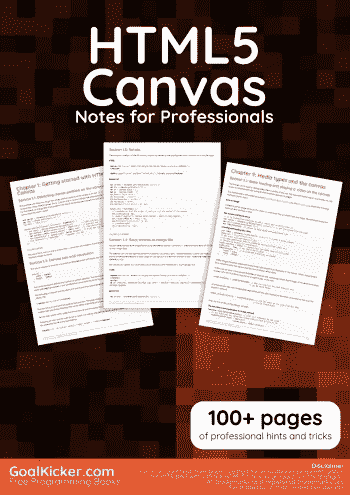
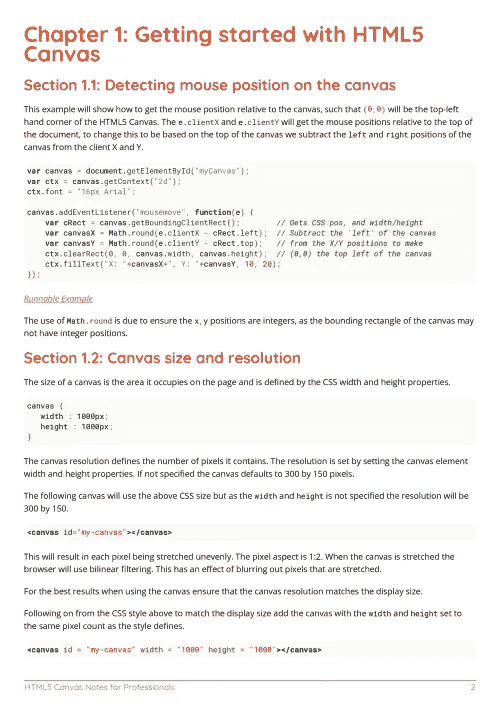
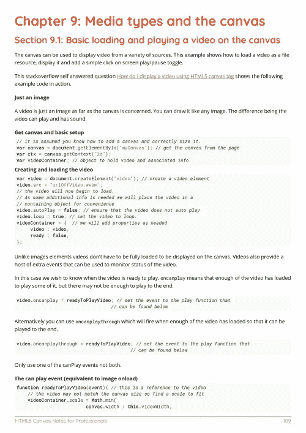

# 电子书:HTML5 画布笔记专业书籍

> 原文：<https://medium.easyread.co/e-book-html5-canvas-notes-for-professionals-book-2d6372a27a39?source=collection_archive---------3----------------------->

## GoalKicker.com 免费下载 HTML 5 Canvas 的电子书

**下载这里:**[**【http://goalkicker.com/HTML5CanvasBook/】**](http://goalkicker.com/HTML5CanvasBook/)

*html 5 Canvas Notes for Professionals 本书由* [*Stack Overflow 文档*](https://archive.org/details/documentation-dump.7z) *编译而成，内容由 Stack Overflow 的美工撰写。文本内容由-SA 在知识共享协议下发布。见本书末尾的致谢，感谢对各章节做出贡献的人。除非另有说明，图像可能是其各自所有者的版权*

*为教育目的创建的图书，不隶属于 HTML5 Canvas group、公司或 Stack Overflow。所有商标属于其各自的公司所有者*

*180 页，2018 年 1 月出版*

如果你觉得这本 HTML5 画布书有用，
那么请分享给❤

# 章

1.  HTML5 画布入门
2.  文本
3.  多边形
4.  形象
5.  路径(仅语法)
6.  小路
7.  沿着路径导航
8.  在画布上拖动路径形状和图像
9.  媒体类型和画布
10.  动画
11.  碰撞和相交
12.  清除屏幕
13.  响应式设计
14.  阴影
15.  图表和图解
16.  转换
17.  混合
18.  使用“getImageData”和“putImageData”进行像素操作