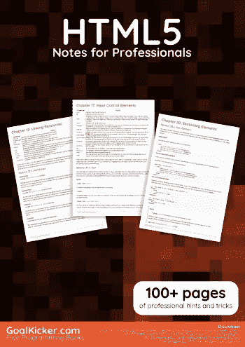

# 电子书:HTML5 专业人士笔记

> 原文：<https://medium.easyread.co/e-book-html5-notes-for-professionals-book-392f0dd42f6f?source=collection_archive---------7----------------------->

## GoalKicker.com 免费下载 HTML 5 的电子书

**下载这里:**[**【http://goalkicker.com/HTML5Book/】**](http://goalkicker.com/HTML5Book/)

*《html 5 专业人士须知》一书由* [*栈溢出文档*](https://archive.org/details/documentation-dump.7z) *编译而成，内容由栈溢出达人撰写。文本内容由-SA 在知识共享协议下发布。见本书末尾的致谢，感谢对各章节做出贡献的人。除非另有说明，图像可能是其各自所有者的版权*

*为教育目的创建的图书，不隶属于 HTML5 集团、公司或 Stack Overflow。所有商标属于其各自的公司所有者*

*122 页，2018 年 1 月出版*

# 章

1.  HTML 入门
2.  文档类型
3.  标题
4.  段落
5.  文本格式
6.  锚点和超链接
7.  列表
8.  桌子
9.  评论
10.  类别和 id
11.  数据属性
12.  链接资源
13.  在 HTML 中包含 JavaScript 代码
14.  在 CSS 中使用 HTML
15.  形象
16.  图像地图
17.  输入控制元件
18.  形式
19.  Div 元素
20.  切片元素
21.  导航栏
22.  标签元素
23.  输出元件
24.  空元素
25.  媒体元素
26.  进度元素
27.  选择菜单控件
28.  把…嵌入
29.  IFrames
30.  内容语言
31.  挽救（saving 的简写）
32.  帆布
33.  元信息
34.  标记计算机代码
35.  加价报价
36.  塔宾德克斯
37.  全局属性
38.  HTML 5 缓存
39.  HTML 事件属性
40.  字符实体
41.  咏叹调